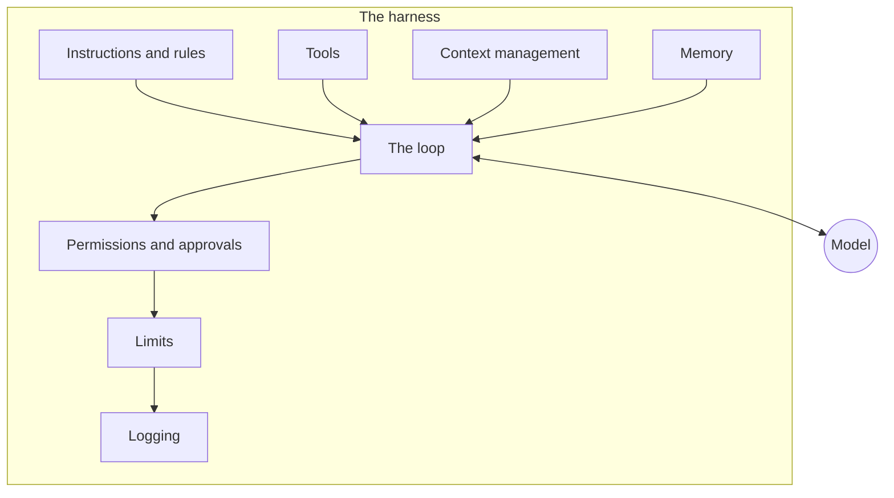

The [agent loop](/agents/the-agent-loop/) is only a short piece of software, and the model does not run it. If the model is an engine on a workbench, the harness is everything that turns it into a car: the loop that drives it, the controls, the rules, the brakes and the dashboard.

**In one line:** the harness is all the software and settings around a model (the loop, tools, instructions, memory, permissions, limits and logs) that turns a model that writes text into an agent that gets work done.

## The jargon: concepts covered on this page

- **Agentic harness:** the software and settings around a model that make it an agent
- **Harness engineering:** designing and tuning the parts of a harness to improve reliability
- **Agent framework:** a code toolkit for building your own agent harness
- **Guardrail:** a rule enforced by the harness, such as a limit or an approval step

## Why it matters

A model on its own cannot do anything except read text and write text. To get an agent, someone has to build the machinery around it: something that runs the steps, offers tools, holds the instructions, keeps track of what has happened and stops it when needed.

That machinery is the harness. It explains a puzzle that confuses many newcomers: the same model can behave brilliantly in one product and badly in another. The model is the same. The harness is different.

It also tells you where your effort should go. Picking a model is a small, reversible decision. Designing the harness decides what the agent can touch, how it is checked and whether you can trust it.

<mark>Model plus harness equals agent: when an agent misbehaves, look at the harness before blaming the model.</mark>

## How it works

Think of a talented new hire. The person is the model. The harness is everything the employer gives them: a job description, a laptop with the right logins, a rulebook, a notebook, a manager who signs off big decisions, and a timesheet. Put the same person in a different setup and they will perform very differently.

A harness has several layers. Each one is a design choice:

- **The loop.** The cycle of decide, act and observe that keeps the agent working (see [the agent loop](/agents/the-agent-loop/)).
- **Tools.** The actions the agent may request, and how they are described (see [tool use](/agents/tool-use/)).
- **Instructions.** The [system prompt](/using-ai/system-prompts/) and any rule files that set the agent's role and standards.
- **Context management.** Deciding what the model sees each round, and what gets trimmed or summarised when the record grows (see [context engineering](/data/context-engineering/), in Part 5).
- **Memory.** What is kept between runs (see [memory](/agents/memory/)).
- **Permissions.** Which tools and data the agent can reach, and which actions need a person to approve (see [human in the loop](/agents/human-in-the-loop/)).
- **Limits.** Caps on rounds, time and spending, so a stuck agent stops.
- **Logging.** A record of every step, so you can check what happened (see [observability](/running/observability/), in Part 6).

The model sits at the centre and only ever reads and writes text. Everything else in the picture is the harness. Notice that the checks (permissions, limits, logging) are in the harness, not in the model. That is deliberate: you can rely on software to enforce a rule, but a model only follows a rule most of the time.

**Harness engineering** is the practice of designing and tuning these layers. It is mostly unglamorous work: sharpening tool descriptions, trimming what goes into the context, adding a limit after a run goes wrong, adding a log line so a failure can be explained. Small changes here often improve results more than switching to a bigger model.

## In practice

Harnesses come from four places:

- **Coding assistants.** Tools built for software work, such as assistants that run in a terminal (the text window for typing commands, covered in Part 4) or a code editor, are full harnesses. People often use them for non-coding work too, because the loop, file access and permissions are general.
- **Agent frameworks.** Code libraries that give a developer the building blocks (loop, tool wiring, memory) to assemble their own.
- **Products.** Chat assistants and agent platforms with a harness already built in. You configure it rather than build it.
- **Built in-house.** A team writes its own, usually on top of a framework, to fit its systems and rules.

For a small business or a single person, the sensible default is to start with a product or an existing assistant and configure it well. Building your own is worth it only when you need control that no product offers: a particular approval flow, unusual systems, or strict logging. Even then, build on a framework rather than from scratch.

Whichever route you take, you still make the harness decisions. A bought harness comes with defaults, and the defaults were chosen for the average customer, not for your risks.

## Worked example

Sample Ventures, the fictional fund, wants an introductions agent. When a partner says "introduce Acme Payments to two relevant angels", the agent should draft the introduction emails. Here is how the operations lead designs the harness, layer by layer.

1. **Tools.** The agent gets a CRM search tool (read), a tool to read notes on a person (read), and a tool to create an email draft (write, but only a draft). There is no send tool.
2. **Instructions.** The system prompt says what an introduction should look like, who counts as a relevant contact, and that the agent must say when it is unsure. A short rule file holds the fund's tone of voice.
3. **Context.** The agent sees only the records it fetched for this request, not the whole CRM. Long notes are trimmed to the latest few interactions.
4. **Permissions.** Read access to the CRM, nothing else. Drafts land in a folder where an associate reviews them. Nothing leaves the building without a person pressing send.
5. **Limits.** At most 15 rounds per request and a small spending cap per run. If either is hit, the agent stops and reports what it found.
6. **Logging.** Every tool call and every draft is recorded with a time and the request that caused it.

The first week, the logs show the agent suggesting an angel who already invested in a competitor. The fix is in the harness: a line in the instructions and a CRM field added to the search tool's output. The model did not change.

## Costs and limits

- **Harness work is mostly thinking, not money.** Building one costs people's time. Running one costs more as it adds rounds, tools and logging, but these are usually modest next to the cost of a bad action.
- **More layers are not always better.** Every tool, rule and memory adds length to what the model reads each round, which costs more and can confuse it.
- **A harness can hide problems.** If the harness quietly retries or trims context, you may not see why an answer is poor. Logging is what makes this visible.
- **Defaults are not decisions.** The most common mistake is accepting a product's default permissions and limits without asking what they allow.
- **A harness is never finished.** It needs tuning as tasks, tools and models change.

## Often confused with

**Harness vs framework.** A framework is a toolkit a developer uses to build a harness. The harness is the finished assembly that actually runs the agent.

**Harness vs model.** The model is the part trained on text. The harness is ordinary software and settings around it. You can swap one without changing the other.

## Related

- [The agent loop](/agents/the-agent-loop/): the core cycle the harness runs
- [Tool use](/agents/tool-use/): how the harness lets the model act, and what it allows
- [Human in the loop](/agents/human-in-the-loop/): where the harness asks a person to approve
- [Observability](/running/observability/): the logging layer that lets you see what the agent did
- [Agent frameworks](/map/agent-frameworks/): code libraries for building the harness

## Next up

A harness can only hand its agent tools that reach real systems: a calendar, a file store, a customer database. Connecting to any of them starts with how software asks for data and proves who it is, which is the subject of [APIs, OAuth and API keys](/agents/apis-oauth-and-api-keys/).
