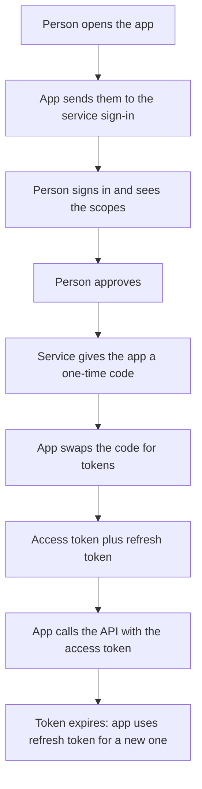

[Skills](/agents/skills-in-claude/) teach an assistant how you like a job done, so you stop retyping yourself. The next step is to stop pasting things in: letting it reach your systems directly. Those systems keep their data behind a login, so connecting to them starts with two questions: how does software ask another system for data, and how does it prove who it is and what it may do?

**In one line:** an API is a defined way for one program to ask another system for things, and API keys and OAuth are the two main ways the program proves who it is and what it is allowed to do.

## The jargon: concepts covered on this page

- **Access token:** a short-lived credential an app uses to call an API
- **API:** a defined way for software to request data or actions from a system
- **API key:** a secret string that identifies the calling program
- **Authentication:** proving who a person or program is
- **Authorisation:** deciding what an identified person or program may do
- **Delegated access:** acting with a user's own permissions
- **JSON:** a plain text format for structured data
- **OAuth:** a standard for letting an app act for a user without their password
- **Rate limit:** a cap on how many requests are allowed in a given time
- **Refresh token:** a longer-lived credential used to get new access tokens
- **Scope:** a specific permission an app asks for, such as read files

## Why it matters

An agent that works with company data has to reach that data somehow. The CRM, the shared file store and the database all hold information behind a login. The agent cannot click through a screen the way a person does.

APIs are the door that software uses instead. Signing in is the lock on that door. Getting this wrong has two costs: the agent cannot connect, or, worse, it connects with far more access than it should and a leaked secret exposes everything.

<mark>An API key or token is a password for software: anyone who holds it can act as the program, so it must never end up somewhere public.</mark>

## How it works

**An API** (application programming interface) is a published list of the requests a system will accept and the answers it will give. A program sends a **request**, such as "give me the company called Acme Payments", and receives a **response** with the result. The data usually comes back as **JSON**, a plain text format made of labelled fields that both people and programs can read.

A restaurant is a fair picture. The menu is the API: it lists what you can order. The kitchen stays hidden. You do not walk in and cook.

Requests also say what kind of action is wanted. Reading data and changing data are separate requests, which is why systems can allow one and block the other.

The system needs to know who is asking. There are two common ways.

**API keys.** A key is a long secret string issued to a program. The program sends it with every request, and the system recognises it. It is simple, and works like a password for software. The key says who the caller is, but usually not much about which person is behind it.

Keeping keys safe:

- Never put them in a public code repository (a shared online copy of a project's files), a public website or a chat.
- Store them as secrets in a proper place that the program reads at run time (see [environment variables and secrets](/building/environment-variables-and-secrets/), in Part 4).
- Rotate them: replace them regularly, and straight away if one might have leaked.
- Limit their scope: a key that can only read is better than one that can do everything.

**OAuth.** OAuth is a standard that lets an app act for a person in another service without ever seeing that person's password. You will have used it when pressing "Sign in with Google" or approving an app's access to your calendar.

The pieces:

- **Consent.** The person is sent to the service's own sign-in page and sees what the app is asking for. They approve it there.
- **Scopes.** These are the specific permissions requested, such as "read files" or "read and write contacts". The person can see them, and the app gets no more.
- **Access token.** A short-lived key the app receives after approval. It expires within an hour or so, which limits the damage if it leaks.
- **Refresh token.** A longer-lived secret the app uses to get a new access token without asking the person again.

The person's password never reaches the app. They type it only into the service's own page.

There is one more distinction that matters for agents. An app can act **as itself**, with its own identity and permissions (often called app-only or service access). Or it can act **as the user**, with a token that carries that person's permissions (called delegated access). The first is usually broader. The second is limited to what the person could do anyway. This is picked up again in [permissions and access control](/data/permissions-and-access-control/), in Part 5.

## In practice

Most business tools offer an API, and many offer both methods. Smaller or older tools often use API keys. Large platforms, including Microsoft 365 and Google Workspace, use OAuth, and let an administrator choose between delegated and app-only access. Always check the provider's current documentation for what it supports, because the details change.

You will rarely handle this by hand. Platforms that connect agents to tools usually run the sign-in flow for you and store the tokens. A [model](/start/what-an-llm-is/) never needs to see the secret. The application around it attaches the secret when it runs a [tool](/agents/tool-use/).

Other limits sit on top of this. APIs also enforce **rate limits**, a cap on how many requests are allowed in a given time (see [rate limits, retries and failures](/running/rate-limits-retries-and-failures/) in Part 6). A working sign-in also matters for [keeping data fresh](/data/keeping-data-fresh/) (Part 5), because a live read needs one.

## Worked example

Sample Ventures, the fictional fund, wants an agent that can read the shared data room files in SharePoint and look up companies in the CRM.

**The CRM, with an API key.**

1. The operations lead opens the CRM's settings and creates a key, choosing read-only access.
2. They put it into the agent platform's secrets store, not into any file or message.
3. The agent platform attaches the key to every CRM request. The CRM sees "the Sample Ventures agent, read-only".
4. Every request is made as that one identity. The CRM cannot tell which associate asked the question.

**SharePoint, with OAuth.**

1. An associate clicks "Connect" in the agent platform.
2. They are sent to the Microsoft sign-in page, where they log in and see the requested scope: read files they can access.
3. They approve, and the platform receives an access token and a refresh token.
4. When the associate asks about a data room document, the agent calls the API with that token. It only sees files the associate could open themselves.
5. An hour later the access token expires. The platform quietly uses the refresh token for a new one.

If an administrator removes the associate's access, the tokens stop working. A key is different: it keeps working until someone revokes it.

## Costs and limits

- **Setup takes effort.** OAuth in particular needs registering an app, choosing scopes and often an administrator's approval. This is a real task and not a quick click.
- **Tokens expire.** A connection that worked last week can break when a refresh token is revoked, a password changes or an administrator changes policy.
- **Keys leak easily.** They get pasted into chats, committed to repositories and copied into screenshots. A leaked key works for anyone who finds it until it is revoked.
- **Broad access is the default risk.** Both methods can give an agent more access than it needs. Ask for the narrowest scope that does the job.
- **Rate limits.** Services cap how fast an agent can call them, and a busy agent can be slowed or blocked.

The most common mistake is pasting a key into a place that is shared, such as a document, a chat or a public repository. Treat it like a password and rotate it if you are unsure.

## Often confused with

**API vs MCP.** An API is how one system talks to another in general. [MCP](/agents/mcp/) is a standard way of presenting tools to an agent, and it often sits on top of an API.

**Authentication vs authorisation.** Authentication is proving who you are. Authorisation is what you are allowed to do once known. API keys and OAuth cover both in different ways.

## Related

- [Tool use](/agents/tool-use/): tools usually call APIs on the model's behalf
- [MCP](/agents/mcp/): a standard way to expose tools, often built on APIs
- [Permissions and access control](/data/permissions-and-access-control/): what an identity may see and do once connected
- [Keeping data fresh](/data/keeping-data-fresh/): live reads rely on a working connection
- [Auth and secrets](/map/auth-and-secrets/): where identity and keys fit in the wider stack
- [Agent identity and payments](/running/agent-identity-and-payments/): giving an agent its own identity, and letting it pay safely

## Next up

Every system has its own API and its own way of signing in, so connecting an assistant to many of them used to mean custom wiring for each one. [MCP](/agents/mcp/) is the standard socket that lets one connector work with many assistants.
