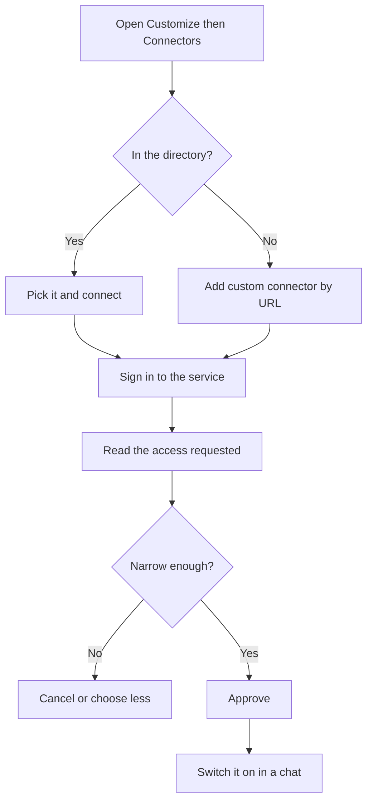

MCP is the standard socket that lets an assistant plug into other systems. In the Claude apps, the thing you actually plug in is called a connector, and this page shows how to add one, how to choose what it may touch, and how to switch it off.

**In one line:** a connector is a ready-made link between Claude and another service, such as your calendar or file store, built on MCP, that you add once in settings and then switch on or off in each chat.

## The jargon: concepts covered on this page

- **Connector:** a link between Claude and an outside service, built on MCP
- **Connectors directory:** Anthropic's catalogue of ready-made connectors
- **Custom connector:** a connector you add yourself by the URL of a remote MCP server
- **Desktop extension:** a local connector that runs on your computer in the desktop app
- **Scope:** one slice of access listed on a sign-in consent screen
- **Consent screen:** the page where a service shows what an app wants to do and asks you to approve
- **Tool permission:** the setting that decides whether a tool runs freely, needs approval or is blocked
- **Owner:** the administrator of a Team or Enterprise account

## Why it matters

On its own, Claude only knows what you type or upload. Ask "what is on my calendar tomorrow?" and it can only guess. A connector lets it look, so answers come from your real data instead of your memory of it.

That is useful and also a responsibility. A connector can read your information and, depending on the service, change it: send, edit, create or delete. Setting one up takes a minute, which makes it easy to grant more than you meant to.

<mark>A connector is only as safe as the access you approve when you add it, so start with the narrowest access that does the job.</mark>

## Where it lives

**Snapshot, as of October 2026.** Menu names change. Check Anthropic's current help pages before relying on any exact label below.

In claude.ai on the web and in the desktop app, connectors live on a page called **Customize**, under **Connectors**. The same page also holds your skills and plugins (bundles that package connectors and skills together). In the desktop app, **Customize** is in the sidebar.

There are two ways to add one:

- **From the directory.** Anthropic keeps a directory of ready-made connectors, reached through **Discover** on the Connectors page. Listings carry a **Verified** or **Community** label. Verified ones have been checked by Anthropic; community ones come from other developers.
- **By URL, as a custom connector.** If a service runs a remote MCP server (one reached over the internet) but is not in the directory, you can add it by pasting its web address. Anthropic warns that custom connectors link Claude to unverified services.

Once connected, a connector works across the Claude apps: the web, the desktop app and the mobile apps. The desktop app can also run local connectors, called desktop extensions, which run on your own computer. Connectors you add in claude.ai are also available in Claude Code (Anthropic's coding tool, covered in the building part) when you sign in with the same account.

**Plans, as of October 2026.** Anthropic's help pages list custom connectors on every plan, from free to Enterprise, with the free plan limited to one custom connector. Paid plans can add more. What a given plan includes changes, so check the current help page for yours. Some services also need their own account or paid plan on their side.

**Team and Enterprise plans.** On these business plans, an Owner (the account administrator) adds a connector for the whole organisation under **Organization settings > Connectors**. Members then connect with their own account, so each person only sees what they can already see in that service. If a connector has not been added yet, members see an option to request it. Owners can also set tool permissions for the organisation.

## Setting it up

**Adding one from the directory:**

1. Go to **Customize**, then **Connectors**, then **Discover**.
2. Search for the service or browse the categories, and open its page. Read the description and note whether it is Verified or Community.
3. Select **Connect to Claude**. Some connectors first ask for details such as the region your account is in.
4. You are sent to the service's own sign-in page. In the desktop app this opens in your web browser.
5. Sign in, read the access Claude is asking for, and approve it only if it fits the job.
6. Back in Claude, the connector appears under **Your connectors** as **Connected**.

**Adding a custom connector by URL:** on the Connectors page, choose to add a custom connector, give it a name and paste the server's web address (it starts with https). Advanced settings cover sign-in options, which you can usually leave alone unless the service's own instructions say otherwise. Only do this for a server from an organisation you trust.

**Reading the permission screen.** The sign-in step uses OAuth, the "log in with your account" pattern from [APIs, OAuth and API keys](/agents/apis-oauth-and-api-keys/). The service shows a consent screen listing what Claude will be allowed to do, such as "view your calendars" or "view and edit all your files". Each line is a scope: a slice of access. If you have a choice, pick read-only, or one folder rather than the whole drive. If the screen asks for far more than the job needs, cancel.

**Switching it on per chat.** A connected connector is not automatically in use everywhere. In any chat, select **+** in the message box, then **Connectors**, and use the toggle next to each one. Turning a toggle off stops Claude using it in that chat, but you stay signed in.

**Tool permissions.** A connector offers several tools (individual actions, such as "list events" or "create event"). The first time Claude wants one, it can ask you: **Allow once** or **Always allow**. Later, on the connector's own page under **Customize > Connectors**, you can set each tool or group of tools to **Always allow**, **Needs approval** or **Blocked**.

**Removing access.** On the connector's page, **Disconnect** signs Claude out of the service. **Remove** (in the three-dot menu) takes it off your account. You can also revoke the access from the service's own security settings.

## Using it well

**A good first connection** is something read-heavy and low-risk: your calendar or a file store. Questions like "what does my week look like?" or "find the latest version of the price list" show the value straight away, and reading cannot break anything.

Good habits:

- **Connect what the job needs, nothing more.** Every connector adds tool descriptions to each chat, which uses up the context window (the model's working space) and makes wrong tool choices likelier.
- **Turn connectors off in chats that do not need them.** Fewer open doors means fewer surprises.
- **Keep writing tools on Needs approval.** Allow reading freely if you like, but make sending, editing and deleting ask first. Only use **Always allow** for services you trust.
- **Block tools you will never use.** If you only read files, block the delete tool.
- **Check the answer against the source.** The first few times, open the calendar or folder and confirm Claude read it correctly.
- **Review your connectors now and then.** Disconnect ones you stopped using.

## Worked example

Sam runs Bramley's, a two-person bakery with a shop and online orders. Sam spends Monday mornings working out the week: which wholesale deliveries are booked, which staff shifts are covered, and which supplier price list is current. All of that lives in an online calendar and a shared file store.

1. **Pick the first connector.** Sam starts with the calendar, because it is read-heavy and the risk is low.
2. **Add it from the directory.** In **Customize > Connectors**, Sam finds the calendar provider's connector, checks it is marked Verified, and selects **Connect to Claude**.
3. **Read the consent screen.** The provider asks for permission to view and edit events. Sam notes this, approves, then on the connector's page sets every tool that creates or changes events to **Needs approval**.
4. **Try it.** In a new chat, Sam turns the connector on and asks: "List every delivery booked this week and flag any that clash with a shift where only one of us is in."
5. **Check.** Claude lists the deliveries and spots a Thursday clash. Sam opens the calendar to confirm, then asks Claude to draft a message to the customer about moving the slot. Sam sends it personally.
6. **Add the second one later.** After a fortnight, Sam adds the file store connector with access to one folder, "Suppliers", rather than the whole drive.

Claude never held Sam's password, and nothing changed in the calendar without Sam saying yes.

## Costs and limits

- **No extra charge from the connector itself,** but connected chats use more of your plan's usage, because tool descriptions and results all go into the conversation.
- **Access is only as narrow as the service allows.** Some services offer only broad access ("view and edit all files"). Then the per-tool settings in Claude are your main control.
- **Prompt injection.** Anything a connector reads, such as an email or a shared document, is text Claude sees. Hidden instructions inside it can try to steer Claude into doing something you did not ask. This is covered with other everyday risks in [safety basics](/agents/safety-basics/), a few pages on, which explains how to keep connected tools from being turned against you.
- **Community and custom connectors are someone else's code.** They can see what Claude sends them and return anything. Use them only from people or companies you trust.
- **Your data goes to the service.** Each connected service handles data under its own terms, which may differ from Anthropic's.
- **Approval fatigue.** If every action asks, people stop reading the prompts. Put approvals on the actions that matter.
- **Features move.** Labels, plan limits and options change often. If a step here does not match what you see, the help page wins.

## Often confused with

**Connector vs MCP server.** An [MCP](/agents/mcp/) server is the technical piece a service runs. A connector is how the Claude apps package that server for you: the listing, the sign-in and the on and off switches.

**Connector vs skill.** A connector gives Claude access to a service. A [skill](/agents/skills-and-instruction-files/) gives it know-how about a job. A plugin can bundle both.

**Disconnect vs turning off in a chat.** The chat toggle pauses a connector for that conversation only. Disconnecting signs Claude out of the service everywhere.

## Related

- [MCP](/agents/mcp/): the open standard every connector is built on
- [APIs, OAuth and API keys](/agents/apis-oauth-and-api-keys/): what happens during the sign-in step
- [Tool use](/agents/tool-use/): how Claude decides to call a connector's tools
- [Human in the loop](/agents/human-in-the-loop/): why approval settings matter for writing actions
- [Least privilege](/running/least-privilege/): the habit of granting only the access a job needs
- [Browser and computer-use agents](/agents/browser-and-computer-use-agents/): the fallback for apps with no connector

## Next up

Connectors only reach services that offer one. For everything else, [browser and computer-use agents](/agents/browser-and-computer-use-agents/) let an agent use a website or app the way a person does, by looking at the screen and clicking.
