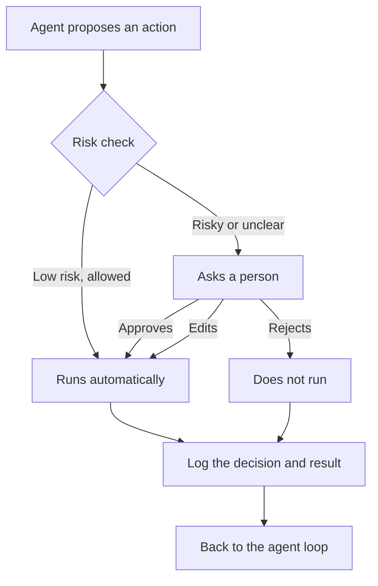

The simplest [safety habit](/agents/safety-basics/) with connected AI is to keep risky actions behind a person's approval. An agent with tools and memory can act largely on its own, which is the point, and also the reason some of its actions should wait for a yes.

**In one line:** human-in-the-loop means a person is built into an agent's process at chosen points, to approve an action, review a result or step in when the agent is unsure.

## The jargon: concepts covered on this page

- **Approval gate:** a point where the agent must wait for a person's yes
- **Audit log:** a record of what was proposed, who decided and what happened
- **Human-in-the-loop:** a person is built into the agent's process at chosen points
- **Review afterwards:** letting the agent act, then checking a log or sample later
- **Rubber-stamping:** approving without reading, usually because there are too many requests

## Why it matters

An agent makes its own decisions about what to do next, and it will sometimes get them wrong. It might misread a request, pick the wrong record or act on a bad instruction hidden in a document. Most of the time that is a minor irritation. For some actions it is a real problem.

You cannot un-send an email to a customer. You cannot easily undo a message to a supplier, a payment or a deleted record. The point of a checkpoint is to put a person in front of those actions, at the moment they can still be stopped.

It is also how you can trust an agent with more over time. Starting with approvals and relaxing them as you see how it behaves is far safer than starting with none.

<mark>Let the agent do the reading and drafting freely, and put a person in front of anything that cannot be undone.</mark>

## How it works

Think of a junior colleague who can research and prepare anything, but who needs a signature before a letter goes out. They are not slowed down on the preparation. The signature only applies where it counts.

Setting this up means answering two questions: where do the checkpoints go, and how much oversight at each one?

**Where to put checkpoints.** The usual candidates are:

- **Irreversible actions.** Deleting, overwriting, anything with no undo.
- **Anything leaving the building.** Emails, messages to customers or partners, posts, shared documents.
- **Spending money.** Payments, purchases, paid services.
- **Writing to important records.** Changes to a customer database (often called a CRM) or other systems of record that others rely on.

These line up with the difference between read and write [tools](/agents/tool-use/). Reading is low risk, so it can usually run freely. Writing changes something, so it is where checkpoints belong.

**How much oversight.** There is a scale:

- **Approve every step.** Nothing runs without a person saying yes. Safest, slowest, and tiring.
- **Approve risky steps only.** Low-risk actions run on their own; risky ones stop and ask. This is the usual middle ground.
- **Review afterwards.** The agent acts, and a person checks a log or sample later. Only suitable where mistakes are cheap and reversible.

A related option is letting the agent ask for help when it is unsure, for example when it finds two records that might both be the right company.

The risk check is a set of rules written in advance, for example "any tool that sends a message needs approval". It is better for the rule to sit in the surrounding software than in the model's instructions, because a model can be talked out of an instruction but not out of a rule it cannot see.

## In practice

Most agent products and frameworks let you mark certain tools as "ask first". The agent's [loop](/agents/the-agent-loop/) pauses at that point, shows the proposed action, and carries on once the person responds. Approvals can come through a chat window, an email, or a message in a team chat tool.

Good approvals share some features:

- **Show exactly what will happen.** Not "send email?" but the recipients, subject and full text, exactly as they will be sent.
- **Make approving easy, but not automatic.** One click is fine. A default that approves after a few seconds, or a wall of text that nobody reads, is not.
- **Allow editing.** The person should be able to fix a sentence, not just accept or reject.
- **Log every decision.** Record what was proposed, who decided, when and what happened. See [observability](/running/observability/), in Part 6.

Checkpoints work alongside [permissions and access control](/data/permissions-and-access-control/) (Part 5). Permissions limit what the agent can touch at all. Approvals add a person's judgement for what it is allowed to touch. You want both.

## Worked example

Sam, who runs Bramley's bakery with one colleague, uses an agent to draft the monthly email to online customers. The agent has four tools: read the online order system, read the shared files, create a draft in the mail system, and send an email.

- **Reading is free.** The agent pulls last month's best sellers from the order system and this month's specials from a spreadsheet in the shared files, including a note that the price of a sourdough loaf goes up next month.
- **Drafting is free.** It writes the email and saves it as a draft. A draft reaches no one.
- **Sending is gated.** The send tool is marked "ask first". The agent stops and sends Sam a message: the full email text, the recipient list (all 400 customers on the mailing list), and the attachments.
- **The person reads.** Sam notices the draft says the new sourdough price starts this week, when it starts next month. Sam edits one sentence and approves.
- **It sends and logs.** The email goes out. The log records the original draft, the edit, who approved and the time.

If the agent had misread the price list, the checkpoint would have caught it before 400 people saw it.

Notice the permission side as well. The agent can only send from the bakery's newsletter address, and it cannot change orders at all.

## Costs and limits

- **Approvals slow things down.** Each checkpoint adds waiting time, and the agent is stuck until someone answers.
- **Rubber-stamping.** If a person is asked to approve dozens of things a day, they stop reading and click yes. At that point the checkpoint gives false comfort. Fewer, better-placed approvals beat many.
- **Poor previews.** If the person cannot see what will actually happen, they are approving blind.
- **Approving the wrong level.** Approving a plan ("send the update") is not the same as approving the content ("this exact email"). Make sure the person sees the real thing.
- **The agent can still be wrong before the checkpoint.** A person can only catch what they notice, and subtle errors in a long draft slip through.

Common mistakes are putting checkpoints on everything, so people tune out, and on nothing, because it seemed fine in testing. Start with approval on every write action, watch how the agent behaves, and relax only where mistakes are cheap and undoable.

## Often confused with

**Human-in-the-loop vs a workflow with a manual step.** In a workflow, a person's step is fixed in advance: "after step three, someone reviews". With human-in-the-loop, the agent works out what it wants to do, and the checkpoint applies to whatever it proposes, so it can differ every time.

## Related

- [Tool use](/agents/tool-use/): read tools versus write tools, and why write tools need checkpoints
- [Permissions and access control](/data/permissions-and-access-control/): limits what the agent can reach, before any approval is needed
- [The agent loop](/agents/the-agent-loop/): where the pause happens, and how the loop carries on afterwards
- [Prompt injection](/running/prompt-injection/): why approvals on risky actions matter
- [Audit trails](/running/audit-trails/): the lasting record of approvals given and refused
- [Agent identity and payments](/running/agent-identity-and-payments/): approval before an agent pays for something

## Next up

Approvals keep one agent in check. Large jobs often split across several agents, each working in its own clean space, and [subagents and multi-agent systems](/agents/subagents-and-multi-agent-systems/) shows how that works.
