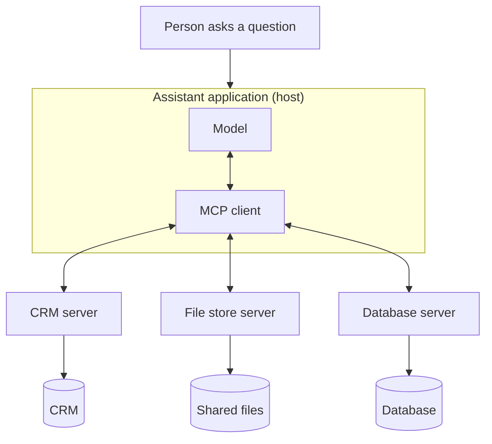

Every system has its own API and its own sign-in, so connecting an assistant to each one used to need custom wiring. MCP is a standard socket: any accessory built for it plugs into any assistant that supports it.

**In one line:** MCP (Model Context Protocol) is an open standard for connecting AI assistants to tools and data, so a connector is built once and works with many assistants.

## The jargon: concepts covered on this page

- **MCP (Model Context Protocol):** an open standard for connecting AI assistants to tools and data
- **MCP server:** a connector that exposes a system's tools, data and prompts through MCP
- **MCP client:** the part of an assistant that talks to MCP servers
- **Host:** the assistant application that contains the model and the MCP client
- **Resource:** read-only content a server offers to the assistant as context
- **Local server:** an MCP server that runs on your own computer
- **Remote server:** an MCP server reached over the internet
- **Prompt injection:** hidden instructions in text that try to steer a model's behaviour

## Why it matters

An assistant is only useful for business work if it can reach your systems: the CRM, the shared files, the database. Before a common standard, every assistant needed its own custom connector for every system. Ten assistants and ten systems meant up to a hundred separate pieces of glue.

MCP fixes this the way a universal plug fixes travel. The system builds one MCP connector (called a server). Any assistant that speaks MCP can then use it. Build once, plug in anywhere.

It matters because it is the most common way to give an agent controlled access to your data and actions, without writing a new integration each time.

<mark>MCP does not make an assistant safer or smarter: it makes connecting it easier, so the choices about access and trust matter more, not less.</mark>

## How it works

MCP has two sides that talk in a fixed, agreed format:

- **The MCP server** sits in front of a system (a CRM, a file store, a database) and describes what it offers.
- **The MCP client** lives inside the assistant application (the **host**) and talks to servers on the assistant's behalf.

A server can offer three kinds of things:

- **Tools.** Actions the model can request, such as "search companies" or "create a note". This is [tool use](/agents/tool-use/), packaged in a standard way.
- **Resources.** Content that can be read, such as a document or a database record, offered as context.
- **Prompts.** Ready-made instruction templates, such as "summarise this company's history", that a user can pick.

When the assistant starts, the client asks each connected server what it offers. This is called **discovery**. The server replies with its list of tools and their descriptions, and the assistant can use them straight away. The model never talks to the system directly: it asks, the client passes the request to the server, and the server does the work.

**Local and remote servers.** A local server runs on your own computer, started by the assistant, and talks to it directly on the machine. A remote server runs on the internet, run by the vendor or by you, and the assistant reaches it over the web. Local suits personal tools and experiments. Remote suits shared, team-wide connections.

**Signing in.** A remote server needs to know who is asking and what they may do. MCP uses OAuth, the same sign-in pattern as "log in with your Microsoft account": the person approves access in a browser, and the assistant receives a limited-purpose token rather than a password (see [APIs, OAuth and API keys](/agents/apis-oauth-and-api-keys/)). A local server usually gets its credentials from the machine it runs on, such as an environment setting.

## In practice

Many vendors now publish their own MCP servers, including CRMs, file-storage and productivity suites, and developer tools. Communities and individuals publish many more. Assistants such as chat apps, coding assistants and agent frameworks include MCP clients, so you add a server by pointing the assistant at it and signing in.

The data stays where it is. The server fetches it when asked, so answers reflect the current state of the system. What the agent can do is limited by what the server exposes and by the permissions of the account it signs in with (see [permissions and access control](/data/permissions-and-access-control/), in Part 5).

**Snapshot, as of October 2026.** This paragraph describes things that change. Anthropic created MCP and released it as open source in late 2024. In December 2025 it was donated to the Agentic AI Foundation, a fund hosted by the Linux Foundation and co-founded by Anthropic, Block and OpenAI. Day-to-day technical decisions stay with the project's maintainers. Major assistants and many developer tools support it, and thousands of servers exist. The specification is versioned and revised regularly. For remote servers it uses OAuth 2.1 style sign-in, and newer features and extensions keep arriving. Check the official documentation at modelcontextprotocol.io for the current state before relying on any detail.

## Worked example

Sample Ventures, the fictional fund, wants its assistant to answer questions using the CRM and the shared file store holding data room documents. The operations lead sets it up in stages.

1. **Choose the servers.** She picks the CRM vendor's own MCP server and the file-storage vendor's server, rather than an unknown third-party one.
2. **Create a limited account.** She makes a dedicated account for the assistant with read-only access, and only to the folders it needs. Sign-in happens through the vendors' normal approval screens.
3. **Connect and check.** She adds both servers to the assistant and looks at the tool list each one offers. She turns off any tool that creates or deletes things.
4. **Test.** An associate asks: "What did Acme Payments send us in their data room, and when did we last speak?" The assistant calls a file-search tool and a CRM-search tool, then combines the results.
5. **Review.** The next week she reads the logs of what the assistant asked for, and checks nothing surprising was touched.
6. **Widen, carefully.** Only after a month does she consider adding one write tool, with an approval step.

The assistant never held a password and never had more access than the account allowed.

## Costs and limits

- **Cheap to start, easy to over-grant.** Connecting is quick, so the danger is giving access that is too wide. Start read-only.
- **Third-party servers are code you are trusting.** A server can see what the assistant sends it and can return anything. Use servers from vendors you already trust, and read what unknown ones do before connecting.
- **Prompt injection arrives through results.** Anything a server returns, such as an email body or a document, is text the model reads. Hidden instructions inside it can try to steer the agent. This is a main risk with connected tools.
- **Too many tools bloat the context.** Every tool description is sent to the model each round. A long list of tools costs more, slows things down and makes wrong choices likelier (see [tokens and context windows](/start/tokens-and-context-windows/)). Connect only what the job needs.
- **Quality varies.** A server is only as good as its author. Poor tool descriptions or sloppy permissions lead to poor results.
- **Approval fatigue.** If every action asks for confirmation, people click through. Put approvals on the risky actions only (see [human in the loop](/agents/human-in-the-loop/)).

## Often confused with

**MCP vs API.** An API is a service's own interface for software to talk to it: each service has its own, with its own rules. MCP is a standard wrapper that lets AI assistants discover and use capabilities in one consistent way. Many MCP servers call a service's API underneath, so MCP does not replace APIs, it sits on top of them.

**MCP vs tool use.** Tool use is the general mechanism by which a model requests actions. MCP is one standard way of packaging and sharing tools, so many assistants can use the same ones.

**MCP vs skills.** MCP gives an agent new things it can reach and do. A [skill](/agents/skills-and-instruction-files/) gives it know-how about how to do a job well.

## Related

- [Tool use](/agents/tool-use/): the mechanism MCP standardises and packages
- [Agentic harness](/agents/agentic-harness/): the host application that contains the MCP client
- [Skills and instruction files](/agents/skills-and-instruction-files/): know-how that pairs with the access MCP provides
- [APIs, OAuth and API keys](/agents/apis-oauth-and-api-keys/): what sits underneath many servers, and how sign-in works
- [Prompt injection](/running/prompt-injection/): the main risk when connected tools return untrusted text
- [Least privilege](/running/least-privilege/): how to decide what a connected server may do

## Next up

MCP is the standard. In the Claude apps it shows up as connectors you add in settings, and [Connectors in Claude](/agents/connectors-in-claude/) shows how to add one, keep its access narrow and switch it off.
