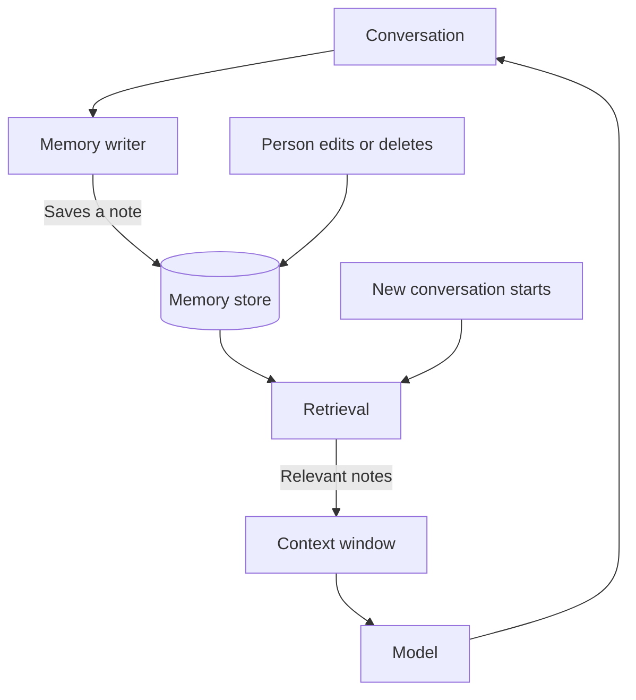

[Browser and computer-use agents](/agents/browser-and-computer-use-agents/) can act in almost any app, but each conversation still starts from nothing. Memory is the logbook an assistant keeps as it goes, alongside the [skills and instruction files](/agents/skills-and-instruction-files/) a person writes on purpose. A model forgets everything when a conversation ends, so anything it seems to remember has been written down and handed back to it.

**In one line:** memory is information saved outside the model and brought back into its context window later, which is the only way an assistant can seem to remember anything from an earlier conversation.

## The jargon: concepts covered on this page

- **Long-term memory:** notes saved outside the model that persist between conversations
- **Memory store:** the place where saved notes are kept
- **Memory poisoning:** planting a false or harmful note so it affects later conversations
- **Persistence:** saving information outside the context window so it survives the conversation
- **Short-term memory:** what is in the context window during the current conversation

## Why it matters

A model starts every conversation blank. It does not recall yesterday's chat, your preferences or the decision you made last week. Anything it appears to remember has been put in front of it again.

Without memory, you repeat yourself: the format you like, the way your team names things, the background on a project. With memory, the assistant starts closer to where you left off.

Memory also brings new risks. Saved information can be wrong, out of date, private or planted by someone else, and it quietly shapes later answers.

<mark>The model never remembers anything itself: "memory" is saved text that gets put back into the context window.</mark>

## How it works

Think of a colleague who has total amnesia every morning, but keeps a notebook on their desk. They read it before starting work. That is all memory is: a notebook the assistant reads at the start, and sometimes writes in at the end.

It helps to separate three things people often call memory:

- **The context window.** Everything the model can see right now: this conversation, tool results and instructions. It is short-term, and it is gone when the conversation ends. (See [tokens and context windows](/start/tokens-and-context-windows/).)
- **Saved notes.** Short facts or preferences stored outside the model, such as "prefers briefings as five bullet points". This is long-term memory, and it is what the word usually means.
- **Looked-up knowledge.** Documents the assistant searches when it needs them, such as files and CRM records. This is not memory of you. It is a library the assistant consults, using retrieval (searching documents for the passages relevant to a question, covered in Part 5 under [RAG and chunking](/data/rag-and-chunking/)).

Saved notes have a life cycle:

1. **Write.** Something decides a fact is worth keeping and saves it.
2. **Store.** The note sits in a memory store, which can be a file, a database or a feature inside a product.
3. **Retrieve.** At the start of a later conversation, or when relevant, the right notes are found.
4. **Inject.** Those notes are placed in the context window, and the model reads them like anything else.

Who writes the notes matters, because it decides who is in control:

- **The person.** You write or edit the notes directly, for example a file of standing instructions. This is the most predictable.
- **The agent.** During a conversation, the model decides "this is worth saving" and calls a tool to save it. Convenient, but it will sometimes save the wrong thing.
- **A background process.** After conversations end, a separate step reads them and files what seems durable. You do not see it happen, so it is the hardest to keep track of.

## In practice

Memory shows up in several forms:

- **Built into assistants.** Many chat products can save facts about you and use them in later chats, usually with a page where you can read and delete them. [Projects and memory](/using-ai/projects-and-memory/) shows how this looks in the Claude apps.
- **Instruction files.** A plain text file the assistant reads at the start of every session, which you write and maintain yourself. See [skills and instruction files](/agents/skills-and-instruction-files/).
- **Custom memory.** A developer gives an agent a tool to save and search notes in a file or database.

This is one half of [context engineering](/data/context-engineering/) (choosing what goes into the model's context window, covered in Part 5), the move called persist: save useful facts outside the window and bring them back only when needed. The other half is deciding what to retrieve, so the window is not stuffed with every note ever saved.

Where the notes live matters. A memory held by a vendor sits in their system, under their rules. A file in your own storage sits under your permissions. Check which one you are using.

## Worked example

Sample Ventures, the fictional fund, uses an assistant to draft a short briefing before each founder call. The first few briefings are too long and the associate keeps correcting them.

1. **First briefing.** The assistant writes two pages. The associate replies: "Too long. Five bullets, the open questions first, and put the last interaction date at the top."
2. **The write.** The assistant saves a note: "Briefings: five bullets, open questions first, last interaction date at the top." It also saves the context: this applies to founder call briefings.
3. **Two weeks later.** A different associate starts a new conversation about a call with Acme Payments, a seed-stage payments startup. The context window starts empty.
4. **Retrieve and inject.** Before the model answers, the saved briefing note is found and added to the window, next to the question.
5. **The result.** The first draft comes back in the right format.

Now the housekeeping. The operations lead opens the memory list one month later and sees an old note: "Acme Payments is raising a seed round." It is out of date, because the round has closed. She deletes it. Without a way to see and edit notes, the assistant would keep repeating it.

Also notice what was not saved: the content of the Acme Payments notes, or the founder's personal details. The format preference lasts. The company facts live in the CRM, where they stay current.

## Costs and limits

- **Notes take up room.** Everything injected counts against the context window and costs tokens on every request. A large pile of notes makes answers slower, more expensive and less focused.
- **Wrong memories persist.** A misunderstanding saved once can quietly affect many later answers.
- **Outdated memories mislead.** Facts change: people move jobs, deals close, preferences shift. A note has no way to know it has expired.
- **Private information can leak.** If a memory holds sensitive details, they can resurface in a later answer, a shared document or a conversation with someone else.
- **Bad instructions can be planted.** If an agent saves something it read in an email or on a web page, a hidden instruction can end up in memory and keep working on every future conversation. This is a lasting form of prompt injection (hidden instructions in text the model reads), covered in [safety basics](/agents/safety-basics/).
- **People forget what is stored.** Background memory especially: users are often unaware what has been saved about them.

Good habits are simple:

- Make memory visible, editable and deletable, and look at it now and then.
- Save durable facts (a preferred format, a naming rule), not passing details (this week's deadline).
- Keep facts that change in their source system and look them up, rather than copying them into memory.
- Never put confidential business data into a memory you do not control.
- Treat anything an agent saves after reading outside content with suspicion.

The most common mistake is assuming memory is a record of everything. It is a small set of notes, picked by a process that makes mistakes.

## Often confused with

**Memory vs the context window.** The context window is what the model can see right now and disappears when the conversation ends. Memory is what gets saved and carried into a later window.

**Memory vs RAG.** RAG (covered in Part 5) looks up passages from documents to answer a question. Memory holds short notes about you or the work, kept so the assistant behaves consistently.

## Related

- [Tokens and context windows](/start/tokens-and-context-windows/): the short-term space that memory is loaded into
- [Context engineering](/data/context-engineering/): memory is the "persist" move, paired with careful retrieval
- [RAG and chunking](/data/rag-and-chunking/): the other way to bring saved knowledge back into the window
- [Skills and instruction files](/agents/skills-and-instruction-files/): memory you write and control yourself
- [GDPR, data retention and DPAs](/running/gdpr-data-retention-and-dpas/): memories about people are personal data
- [Memory layers](/data/memory-layers/): running memory as infrastructure for your own agents or a team

## Next up

Memory, connectors and skills together let an assistant read your accounts and act in them. [Safety basics for connected AI](/agents/safety-basics/) covers what changes when you switch that on, and the simple habits that keep it safe.
