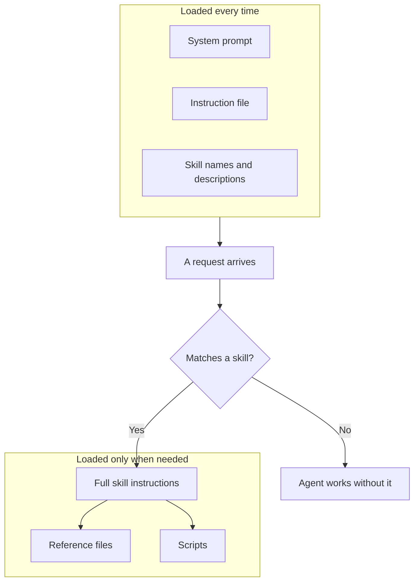

Connectors give an assistant new places to reach. Instruction files and skills give it something different: guidance a person writes on purpose, so the agent knows the rules of the road and the steps of a job before it starts.

**In one line:** instruction files and skills are saved written guidance that an agent reads, so you teach it how you work once instead of explaining it in every conversation.

## The jargon: concepts covered on this page

- **Instruction file:** a text file the agent reads at the start of work
- **Skill:** a packaged, named set of instructions loaded when relevant
- **SKILL.md:** the main file of a skill, holding its description and steps
- **AGENTS.md:** an open-format instruction file read by many coding assistants
- **Progressive disclosure:** loading detail only when a task needs it
- **Load on demand:** reading a skill's full content only when a request matches it

## Why it matters

Agents do not remember you. Start a new session and the agent knows nothing about your conventions, your preferred format or the steps of a job you have explained ten times. Without a fix, you retype the same instructions again and again, and each version comes out slightly different.

The fix is to write the know-how down once, in a file the agent can read. There are two common forms, and they differ in when the agent reads them.

<mark>An instruction file is read every time; a skill is read only when the job needs it, which keeps the agent's working space free.</mark>

## How it works

**Instruction files** are plain text or markdown files that sit in a project or folder. The agent reads them at the start of its work. They hold things that are always true: project rules, writing style, naming conventions, what never to do. The proper term for the idea is persistent instructions, because they apply to every session.

Coding assistants popularised this. Examples are a file called AGENTS.md, which many tools read, and tool-specific ones such as CLAUDE.md. Each is a README written for the agent instead of for a human.

**Skills** are packaged, named instructions for a specific job. A skill is a folder with a main file (usually called SKILL.md) holding a short name, a description of when to use it, and the step-by-step instructions. It can also include extra reference files or small scripts.

The key idea is **load on demand**. The agent does not read every skill in full at the start. It reads only each skill's name and description, a line or two. When a request matches a description, it opens the full instructions. If the skill points to a long reference file, that is only opened if needed.

Why bother? The agent's working space, its [context window](/start/tokens-and-context-windows/), is limited, and everything in it costs money and attention. Twenty skills loaded in full would crowd out the actual task. Loading on demand lets an agent carry many skills while paying for only the ones in use. The proper term is **progressive disclosure**.

**How they differ from neighbours:**

- **System prompt.** The [system prompt](/using-ai/system-prompts/) is set by whoever builds the application and is always sent. An instruction file is similar but lives with your project and is easy to edit.
- **Tools.** [Tools](/agents/tool-use/) let an agent do something it could not do before. A skill tells it how to do a job well using the tools it already has.
- **Memory.** [Memory](/agents/memory/) is what the agent learns or stores over time. Instruction files and skills are written deliberately by people.

## In practice

Instruction files have become a shared habit across coding assistants, and AGENTS.md is an open format kept by the Agentic AI Foundation. Some assistants also read their own named files.

Skills started at Anthropic and were published as an open format, now supported by many assistants and coding tools. A skill is just a folder, so it is easy to copy, share and keep in version control (a system that keeps every past version of a file, such as Git).

**Snapshot, as of October 2026.** The Agent Skills format is described at agentskills.io. A skill needs a SKILL.md file with a name (lowercase letters, numbers and hyphens) and a description saying what it does and when to use it, followed by instructions. Optional folders can hold scripts, references and assets. Support is wide but not universal, and details such as which extra fields work can differ between products. Check the documentation of the assistant you use.

Good habits:

- **One job per skill.** "Log a custom cake order" is a skill. "Do all our admin" is not.
- **Write the description for the agent.** It decides whether the skill is used, so say what the skill does and when to reach for it.
- **Keep them in version control.** Then changes are tracked and can be undone.
- **Review changes.** Treat an edit to a skill like an edit to a procedure: someone checks it.
- **Keep secrets out.** Never put passwords, keys or private data in these files. Anyone who can read the file can read the secret.
- **Keep them short.** Link to reference files for detail.

## Worked example

Sam runs Bramley's, a two-person bakery with a shop and online orders. Customers email in for custom cakes, and Sam wants each one logged in the order spreadsheet the same way. Whoever was on shift used to do it by hand and kept missing fields.

1. **Draft the job.** Sam writes down the steps: find the customer in the spreadsheet, add a row with the date needed, the cake, the quantity, any allergy notes and whether it is collection or delivery, then tag it "custom".
2. **Write the skill.** Sam creates a folder called `log-cake-order` with a SKILL.md. The description reads: "Logs a custom cake order in the order spreadsheet. Use when the user pastes or forwards a cake order email." The body holds the steps and the column names to fill.
3. **Add a reference file.** A short file lists the cakes on offer and the allergens in each, so the main instructions stay small.
4. **Set the limits.** The skill says to add the order row but to ask before adding a new customer, because duplicate customers are a nuisance to clean up.
5. **Try it.** Sam pastes an email asking for a nut-free birthday cake for Saturday collection. The agent sees the match, opens the skill, finds the customer and logs the order with the allergy note.
6. **Review.** Sam's colleague checks the row and spots that nothing records whether a deposit was paid. Sam adds that step to the file, and every later order includes it.

Nothing changes for requests that have nothing to do with cake orders: the skill stays closed.

## Costs and limits

- **Cheap to write, easy to neglect.** A skill is just a document. The cost is keeping it correct.
- **Stale instructions.** A rule written last year may no longer be true. The agent will follow it faithfully anyway. Review on a schedule.
- **Conflicts.** If the instruction file says "be brief" and a skill says "write full detail", the agent has to guess. Keep one source for each rule.
- **Not a lock.** These are guidance the model usually follows, not enforcement. Anything that must hold belongs in permissions and limits in the [harness](/agents/agentic-harness/).
- **Skills may not trigger.** A vague description means the agent may not notice the skill applies. Test with real requests.
- **Untrusted skills are risky.** A skill from outside can steer the agent with hidden instructions, and one with scripts can run code on your machine. Read a skill fully before installing it, and prefer ones from sources you trust.
- **Size.** An instruction file that grows to pages is read every time, which costs attention. Move rarely used detail into a skill.

## Often confused with

**Skill vs tool.** A tool is an action the agent can take, such as searching the CRM. A skill is know-how about when and how to take actions. A skill often tells the agent how to use several tools well.

**Skill vs MCP.** [MCP](/agents/mcp/) connects the agent to systems. A skill teaches it a procedure. You often need both: MCP to reach the order spreadsheet, a skill to log orders the way the business likes.

## Related

- [System prompts](/using-ai/system-prompts/): the always-on instructions that skills and instruction files sit beside
- [Tool use](/agents/tool-use/): the actions skills teach the agent to use well
- [Memory](/agents/memory/): what an agent keeps over time, compared with what you write deliberately
- [MCP](/agents/mcp/): the connection layer that skills often rely on

## Next up

That is the idea in general, and it works the same across many assistants. [Skills in Claude](/agents/skills-in-claude/) shows where skills live in the Claude apps, how to switch the built-in ones on and how to write your own.
