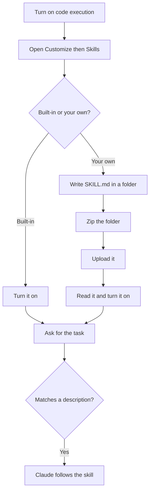

A skill is a packaged set of instructions that an agent opens only when a job needs it. This page is the practical side: where skills live in the Claude apps, how to switch on the built-in ones, how to add your own, and what to check before installing one from someone else.

**In one line:** in Claude, a skill is a folder with a SKILL.md file of instructions (and sometimes scripts) that you turn on once, and Claude then uses by itself whenever a request matches the skill's description.

## Why it matters

If you keep correcting Claude the same way, such as "use this format", "always include these sections", "follow these steps", you are doing the same work twice. A skill writes that correction down once. From then on, the right instructions arrive whenever the matching job does.

Skills also give Claude abilities it would otherwise do less well. Anthropic's built-in skills help it create proper spreadsheets, Word documents, slide decks and PDFs, rather than plain text you have to paste into the right program yourself.

<mark>Claude decides whether to use a skill by reading only its name and description, so the description is the most important line you will write.</mark>

## Where it lives

**Snapshot, as of October 2026.** Menu names and plan details change. Check Anthropic's current help pages before relying on any exact label below.

In claude.ai on the web and in the desktop app, skills live under **Customize**, then **Skills**. The **Your skills** tab lists what you have, grouped by where it came from: ones you made, ones from your organisation, ones shared with you, and ones from Anthropic and its partners. The **Discover** tab lists skills you can add.

Skills run inside Claude's code sandbox (a walled-off computer in the cloud where Claude can run code and make files). So a setting called **Code execution and file creation** has to be on. On the free and individual paid plans it is under **Settings > Capabilities**. On Team and Enterprise plans, an Owner (the account administrator) controls it for the organisation.

**Plans, as of October 2026.** Anthropic's skills documentation lists skills on the Pro, Max, Team and Enterprise plans. One help-centre page also lists the free plan. The pages disagree, so check the current help page for your plan.

**Team and Enterprise plans.** Owners decide whether skills are allowed at all, can push a skill to everyone in the organisation, and can let members share skills with colleagues or publish them to an organisation library, with an optional review step first.

**Skills in Claude Code.** Claude Code, Anthropic's coding tool that works in a folder on your computer, uses the same skill format but reads skills from folders rather than from an upload page:

- **Personal skills** sit in a `.claude/skills` folder in your home folder and work in every project.
- **Project skills** sit in a `.claude/skills` folder inside a project, so anyone who works on that project gets them.
- You can call a skill by typing a slash and its name, such as `/weekly-summary`, or let Claude pick it up from its description.

On Windows: Claude Code's documentation says to use forward slashes in these paths, which Git Bash handles automatically.

Skills follow an open format, the Agent Skills specification, so a well-made skill also works in other tools that support it.

## Setting it up



**Turning on the built-in skills.** With **Code execution and file creation** on, open **Customize > Skills** and switch on the ones you want. Anthropic's own skills for spreadsheets, Word documents, slide decks and PDFs activate by themselves when a request needs them. You do not have to name them.

**Writing your first skill.** A skill is a folder named after the skill, containing a file called SKILL.md. The file starts with two required lines between rows of three hyphens (a header called frontmatter), then the instructions in plain text:

```markdown
---
name: lecture-notes
description: Turns rough lecture notes or a transcript into a one-page study sheet with key terms, three likely exam questions and open questions. Use when the user pastes lecture notes or asks for a study sheet.
---

1. Start with a five-line summary of the lecture.
2. List key terms with a one-line definition each.
3. Write three likely exam questions.
4. End with anything the notes left unclear.
Keep the whole sheet to one page.
```

The rules, as of October 2026:

- **name:** lowercase letters, numbers and hyphens, up to 64 characters, matching the folder name.
- **description:** what the skill does and when to use it, up to 1,024 characters. Include the words people would actually use when asking for that job.
- **Instructions:** keep SKILL.md under about 500 lines. Put long background in separate files in the folder and say in SKILL.md when to open them.
- **Scripts** are optional. Start with instructions only, and add code only if a step needs it.

**Installing it.** Compress the folder itself into a zip file, so the zip contains `lecture-notes/SKILL.md` and not a loose SKILL.md. In **Customize > Skills**, use the add button and choose to upload a skill, then pick the zip. Turn it on.

If you would rather not write it by hand, Anthropic offers a skill called skill-creator, listed among Anthropic's skills, that drafts and tests a skill with you.

**How Claude decides.** Claude does not read every skill in full. It sees each skill's name and one-line description, opens the full SKILL.md only when your request matches, and opens any extra files only when the instructions point to them. You can also pick a skill yourself by typing a slash in the message box.

## Using it well

- **One job per skill.** Several small skills combine better than one large one.
- **Test with real requests.** Ask for the job in the words you would really use. If Claude does not pick the skill up, rewrite the description, not the instructions.
- **Show an example.** A short sample of good output helps Claude match it.
- **No secrets inside.** Never put passwords or API keys in a skill. Anyone you share it with gets every file.
- **Pair with a connector when you need live data.** A skill cannot reach another service by itself. If the job needs your calendar or files, add a [connector](/agents/connectors-in-claude/) and let the skill say how to use it.
- **Use the right home for the rule.** Instructions you want in every chat belong in your personal preferences or a project's instructions, not in a skill, which loads only when a task matches.

**Installing skills from others.** A skill can contain instructions that steer Claude and scripts that run as part of your conversation. Skills someone shares with you, or that you upload, are not reviewed by Anthropic. Anthropic's own warning names two risks: prompt injection (hidden instructions that make Claude do something you did not ask) and data being sent somewhere it should not go by malicious code. Before turning one on, open it and read the SKILL.md and every file. If you cannot tell what a script does, do not install it. [Safety basics](/agents/safety-basics/), later in this part, covers these risks in more depth.

## Worked example

Jo is a freelance researcher who also takes a part-time evening course. After each lecture Jo pastes rough notes into Claude and asks for a study sheet, and every week has to repeat the same instructions about format.

1. **Spot the repeat.** Jo notices the instructions are always the same: summary, key terms, likely exam questions, open questions, one page.
2. **Write it down.** Jo creates a folder called `lecture-notes` with the SKILL.md shown above. The description says what it does and names the trigger: pasted lecture notes or a request for a study sheet.
3. **Package and upload.** Jo zips the folder, uploads it under **Customize > Skills**, reads it once more and turns it on.
4. **Test.** Jo pastes Tuesday's notes with just "tidy these up". Claude does not use the skill, because "tidy up" is not in the description. Jo adds "or asks to tidy up notes" to the description and uploads it again. The next test works.
5. **Use it.** Each week Jo pastes notes, and the study sheet comes back in the same shape. When Jo also asks for a spreadsheet of key terms, Anthropic's built-in spreadsheet skill handles that part.
6. **Say no to a stranger's skill.** A classmate shares a "super study" skill with a script inside. Jo opens it, finds a script that uploads files to a web address nobody recognises, and does not install it.

Jo wrote the instructions once, and they now arrive only when the job does.

## Costs and limits

- **Skills use your plan's usage like anything else.** A loaded skill adds its instructions to the conversation. Short skills cost little; long ones crowd the [context window](/start/tokens-and-context-windows/).
- **Skills need code execution.** If that setting is off, or your organisation has turned it off, skills will not run.
- **Not guaranteed to trigger.** A vague description means Claude may miss it. You can always call it by name.
- **Guidance, not a lock.** Claude usually follows a skill, but a skill cannot enforce anything. Hard limits belong in permissions.
- **Stale skills mislead.** Claude follows old instructions faithfully. Review your skills when the job changes.
- **Third-party skills carry real risk.** They can include instructions and code. Read before you install.

## Often confused with

**Skill vs connector.** A connector gives Claude access to a service. A skill gives it a method. A plugin can bundle both.

**Skill vs project instructions.** Project instructions are always loaded in that project's chats. A skill loads only when a request matches its description.

**Skill vs custom command in Claude Code.** Older Claude Code setups used command files for slash commands. Skills now do the same job and more, such as carrying extra files and being picked up automatically.

## Related

- [Skills and instruction files](/agents/skills-and-instruction-files/): the idea behind skills and why they load on demand
- [Connectors in Claude](/agents/connectors-in-claude/): the access that skills often rely on
- [System prompts and custom instructions](/using-ai/system-prompts/): instructions that apply to every chat
- [Claude Code and the API](/building/claude-code-and-the-api/): where folder-based skills come into their own
- [Prompt injection](/running/prompt-injection/): the main risk in skills from untrusted sources

## The proper terms

- **Skill:** a folder of instructions, and optionally files and scripts, that Claude loads when a task matches
- **SKILL.md:** the required main file of a skill
- **Frontmatter:** the header at the top of SKILL.md holding the name and description
- **Description:** the line Claude reads to decide whether to use a skill
- **Code execution:** Claude's ability to run code in a sandbox, which skills need
- **Personal skill:** a Claude Code skill that works in all your projects
- **Project skill:** a Claude Code skill stored with one project and shared with everyone on it
- **Agent Skills specification:** the open format skills follow, so they work across tools

## Next up

Skills are know-how you write on purpose. [Memory](/agents/memory/) is the other half: what an assistant keeps from one conversation to the next, and how it brings it back.
