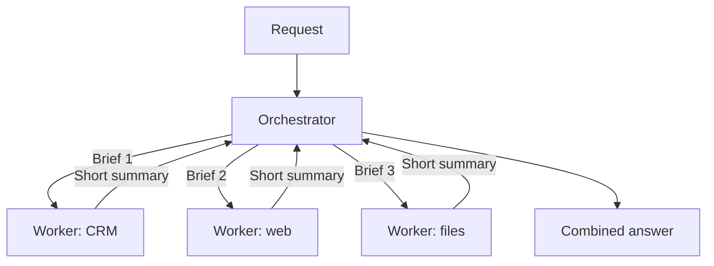

With tools, connections, memory and approvals in place, a single agent can take on large jobs, and its running record grows with every step. Subagents keep that record manageable by handing pieces of the work to helper agents that each start clean.

**In one line:** a subagent is a helper agent that one agent sends off to do part of a job, with its own clean context window, instructions and tools, and a multi-agent system is a setup where several agents work together this way.

## The jargon: concepts covered on this page

- **Multi-agent system:** a setup where several agents work together on one job
- **Orchestrator:** the agent that splits a task, delegates and combines results
- **Parallel execution:** running several workers at the same time
- **Subagent:** a helper agent with its own context window, instructions and tools
- **Worker:** a subagent that does one piece of a task and reports back

## Why it matters

A single agent keeps everything in one running record. After many [rounds](/agents/the-agent-loop/), that record fills with search results, notes and half-finished thoughts. The model has more to wade through, answers get less focused, and the cost of every round goes up.

Subagents split the work up. Each helper gets a small, specific job and only the material it needs. When it finishes, it sends back a short summary and its working is thrown away.

The benefits are practical:

- **Smaller windows.** Each helper's [context window](/start/tokens-and-context-windows/) stays focused on one job.
- **Parallel work.** Helpers can run at the same time, so a job with three independent parts takes about as long as one.
- **Specialisation.** Each helper can have its own instructions, written for its task.
- **Limited permissions.** A helper that only needs to read the CRM can be given only that.

<mark>A subagent's value is mostly what it keeps out of the main window: it does the messy work and returns only a short summary.</mark>

## How it works

Think of a manager asking three people to prepare for a meeting. One checks the CRM, one reads the news, one looks through the shared files. They each come back with a short note, and the manager combines them. The manager never sees the hours of searching, only the results.

The common pattern has two roles:

- **The orchestrator** (also called the lead or parent agent). It takes the request, splits it into pieces, hands them out and combines the answers.
- **The workers** (the subagents). Each one gets a task, its own instructions and its own tools. It works in its own [agent loop](/agents/the-agent-loop/), then reports back.

The steps:

1. The orchestrator reads the request and decides how to split it.
2. It starts each worker with a clear brief: the task, what to return and what to ignore.
3. Each worker runs its own loop, using its own tools, in its own clean window.
4. Each worker returns a short summary, not its full working.
5. The orchestrator combines the summaries into the final answer.

This is the "isolate" move from [context engineering](/data/context-engineering/) (choosing what goes into a model's context window, covered in Part 5): give a separate task its own clean window instead of crowding one shared window.

The orchestrator's brief is the most important part. A worker starts blank. It knows nothing about the conversation unless the brief says so, and it cannot ask the orchestrator for clarification mid-task in most setups.

There are other arrangements, such as workers that talk to each other or agents that check each other's work. Most useful setups in practice are the simple one: one orchestrator, a few workers.

## In practice

Agent products and frameworks offer this in different ways. Some let you define subagents ahead of time, each with a name, instructions and a list of allowed tools. Others let the orchestrator create helpers as it goes. The idea is the same.

Two choices are worth making deliberately:

- **What each worker can do.** Give read-only tools to workers that only need to look things up. If a worker will [use tools](/agents/tool-use/) that change things, keep that on a short leash.
- **What comes back.** Ask for a fixed shape, for example "five bullets, with the source of each". A predictable summary is easier to combine and check.

The data stays in your systems. Each worker fetches what it needs at that moment, so the results are as current as the source.

You will want to see what each worker did. A wrong final answer might come from a bad brief, a bad summary or a bad combination, and you cannot tell which without a record of each step. See [observability](/running/observability/), in Part 6.

## Worked example

An associate at Sample Ventures, the fictional fund, asks a briefing agent: "Prepare me for Thursday's call with the founder of Acme Payments, a seed-stage payments startup."

1. **Split.** The orchestrator plans three independent jobs and writes a brief for each.
2. **CRM worker.** Read-only access to the CRM. Brief: "Find every interaction and note on Acme Payments. Return the last contact date, the main topics and any open questions, in five bullets."
3. **Web worker.** Web search only. Brief: "Find news from the last three months about Acme Payments and its competitors. Return up to five items with links. Say if you find nothing."
4. **Files worker.** Read-only access to the shared files. Brief: "Look for any memo, deck or data room document about Acme Payments. Return the file names and one line on each."
5. **In parallel.** The three run at the same time. The CRM worker reads a dozen notes, the web worker opens several pages, and the files worker searches folders. None of that clutter reaches the orchestrator.
6. **Return.** Each sends back its short summary. The files worker reports that it found a pitch deck but no memo.
7. **Combine.** The orchestrator merges the three into a one-page briefing and flags the gap: no investment memo exists.

The associate sees one briefing. The orchestrator's window holds three short summaries instead of thirty pages of raw material.

## Costs and limits

- **More tokens in total.** Each worker has its own window and its own loop. Several agents working together can use many times the tokens of one agent doing the same job.
- **More moving parts.** More briefs, more tools, more places for something to go wrong.
- **Harder to debug.** When the answer is wrong, you have to work out which agent made the mistake.
- **Misunderstandings between agents.** A worker may read its brief differently than intended. Its summary may drop a detail that mattered, and the orchestrator will never know.
- **Errors can spread.** If one worker returns a confident but wrong claim, the orchestrator may treat it as fact.
- **Not everything splits.** Jobs where each step depends on the one before gain little from parallel workers.

A single agent is often enough. Start with one agent and one loop. Add subagents when you can point to a real problem: a window that fills up, a job that is clearly in separate parts, or a helper that should have narrower permissions.

The most common mistake is building a team of agents for a task that one agent could do, and paying for the extra complexity.

## Often confused with

**Subagents vs a workflow with several steps.** In a workflow, a fixed sequence of steps is decided in advance. With subagents, an agent decides at run time what to hand out and to whom, and each helper makes its own decisions.

## Related

- [The agent loop](/agents/the-agent-loop/): every worker runs its own loop
- [Context engineering](/data/context-engineering/): subagents are the "isolate" move
- [Observability](/running/observability/): the way to see what each agent did when something goes wrong

## Next up

Tools, connectors, skills, memory, approvals and subagents are easier to picture once you see them put together. The [example gallery](/agents/example-gallery/) shows six everyday setups and which pieces each one uses.
