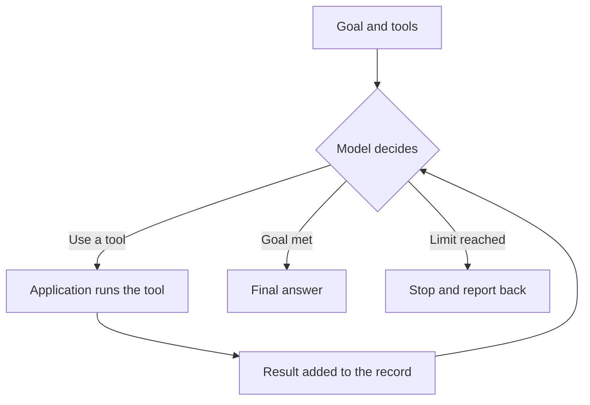

A single [tool call](/agents/tool-use/) is one move of the controls. The agent loop is driving: look at the road, decide, act, then look again, until the destination is reached.

**In one line:** the agent loop is the cycle of decide, act and look at the result that an agent repeats until the goal is met or something stops it.

## Why it matters

A single tool call answers a single question. Most real jobs take several steps, and you can't know in advance which ones, because what you find at step two decides what you do at step three. The loop is what lets a model handle that.

It also explains most of what you will notice about agents. It is why a run takes longer than a chat reply, why the cost varies, and why an agent sometimes wanders, repeats itself or stops early. Each of those comes from how the loop works.

<mark>An agent is a loop, not a single answer: act, look at what happened, then decide again.</mark>

## How it works

Think of someone working through a task with a notepad. They look at the goal and at what the notes say they have done so far. They choose the next move, make it, and write down what happened. Then they look again.

An agent works the same way:

1. **Start.** The model is given a goal, a list of [tools](/agents/tool-use/) and any instructions.
2. **Decide.** It reads everything so far and chooses: use a tool, or finish.
3. **Act.** If it chose a tool, the application around the model runs it.
4. **Observe.** The result is added to a running record of the conversation.
5. **Repeat** from step 2, with a longer record.

The loop ends in one of three ways:

- **The goal is met.** The model decides it has what it needs and writes its final answer.
- **A limit is reached.** The application stops the loop after a set number of rounds, a time limit or a spending cap.
- **Something needs a person.** An error, a missing permission, or a question the model can't answer by itself.

The model has no memory between rounds except the running record. Each round, it rereads the whole record from the top. That one fact explains the cost and the length limits further down.

Researchers named this pattern **ReAct**, short for "reason and act": the model works out what to do, does it, and observes the result.

## In practice

The loop is run by the application around the model, not by the model itself. Coding assistants, agent products and agent frameworks (code libraries for building agents) all contain one. The loop itself is short. Most of the work in a good agent goes into the tools, the instructions and the limits.

The data stays in your systems. Each round, a tool fetches what it needs at that moment, so the agent works from current records and not from a stale copy.

Limits you can usually set include a maximum number of rounds, a time limit, a spending cap, which tools are allowed, and which actions need a person's approval (this is called [human-in-the-loop](/agents/human-in-the-loop/)).

Good agent tools also let you see every round afterwards, so you can check what the agent did and why. This is called [observability](/running/observability/), covered in Part 6.

## Worked example

Jo, a freelance researcher, asks an agent: "Put together a one-page summary of what has been published this year on four-day working weeks in small shops, for Monday's client call." The agent has four read-only tools: search Jo's notes folder, read a note, search the web, and search Jo's library of saved papers.

- **Round 1.** The model decides it needs background. It searches the notes folder and finds three notes from a project Jo did last spring.
- **Round 2.** It reads the notes. They cover two earlier trials, and one question was left open: whether either trial included shops.
- **Round 3.** It searches the web for recent work and finds a new report on a trial that did include shops.
- **Round 4.** It searches Jo's library for an earlier version of that report and finds nothing.
- **Round 5.** It decides it has enough, writes the summary, and says clearly that the earlier version was not in the library.

Suppose the notes search in round 1 had found nothing. The agent might try another phrase, such as "shorter working week". If it kept failing, a limit of, say, 20 rounds would stop it and it would report back instead of looping forever.

A fixed workflow would have made the same four lookups in the same order. It would not have noticed that one of them came back empty.

## Costs and limits

- **Cost grows with every round.** The model rereads the whole record each time, so each round costs a little more than the last. A 20-round run costs more than twice as much as a 10-round one.
- **It can go in circles.** An agent may repeat the same failing search. A cap on rounds is the safety net.
- **Mistakes build on each other.** If round 2 draws a wrong conclusion, rounds 3 to 5 are built on it.
- **The record can get too long.** After many rounds, it may outgrow the model's [context window](/start/tokens-and-context-windows/), so the application has to shorten or drop older parts.
- **You can't know the length in advance.** Two similar requests can take 4 rounds or 15.

The most common mistakes are running an agent with no limits, and giving it tools that change things without a person checking first.

## Often confused with

**Agent loop vs a loop in a workflow.** A workflow can repeat too, for example "for each email in the inbox, run these steps". The difference is who decides whether to go round again. In a workflow, a rule written in advance decides. In the agent loop, the model does.

## Related

- [Chat vs agent vs workflow vs automation](/start/chat-agent-workflow-automation/): the agent is the one where the model chooses the route
- [Tool use](/agents/tool-use/): how a single tool call works
- [Context engineering](/data/context-engineering/): keeping the record useful as it grows (Part 5)
- [Agentic harness](/agents/agentic-harness/): the software that runs the loop and sets its limits
- [Estimating cost per task](/running/estimating-cost-per-task/): why a growing record makes loops cost more
- [Rate limits, retries and failures](/running/rate-limits-retries-and-failures/): what to do when a step fails

## The proper terms

- **Agent loop:** the repeating cycle of deciding, acting and observing
- **Observation:** the result of an action, added to the record
- **ReAct:** short for "reason and act", the name of the pattern
- **Round:** one trip through the loop
- **Step limit:** a cap on the number of rounds before the loop is stopped

## Next up

The loop itself is short, and the model does not run it. [Agentic harness](/agents/agentic-harness/) covers the software that does: the loop, the tools, the limits and everything else around the model.
