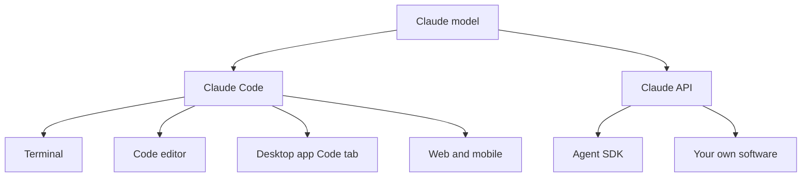

The [example gallery](/agents/example-gallery/) showed what finished agents can do. This part of the guide is about building your own, and it starts with the two Claude tools for that job: Claude Code, which builds things in a folder for you, and the Claude API, which your own software calls.

**In one line:** Claude Code is an agent that reads, edits and runs files in a folder on your behalf, and the API (with the Agent SDK on top) is how your own programs put Claude to work.

*Snapshot, as of October 2026. Anthropic reshapes these products often, so check its documentation for current details.*

## The jargon: concepts covered on this page

- **Claude Code:** Anthropic's agent that works in a folder of files on your behalf
- **Plan mode:** a Claude Code mode that proposes changes without making them
- **Claude API:** the interface programs use to send requests to Claude
- **Developer console:** the web account where API keys and billing are managed
- **Agent SDK:** a library that packages Claude Code's agent for your own software
- **CLAUDE.md:** the rulebook file Claude Code reads at the start of each session

## Why it matters

The [Claude apps](/using-ai/claude-apps/) are built for people chatting and delegating. Building something that lasts, such as a website, a script or an agent that runs every morning, needs files you can see, change and keep, and sometimes software that calls the model with nobody watching.

Picking the wrong tool is a common early mistake. People try to build a repeatable workflow inside a chat when they need an agent working on files. Or they reach for the API when Claude Code could have done the job in ten minutes.

<mark>Claude Code builds things with you in a folder; the API lets things you have built call Claude on their own.</mark>

## How it works

If the apps are the family car, this part of the guide is the garage. Claude Code is a workshop vehicle built for one job, changing files in a folder. The API is the bare engine you fit into your own machine.

### Claude Code

Claude Code is a coding agent that works in a folder on your computer. It reads files, edits them and runs commands, asking permission along the way. Anthropic lists several places to use it: the terminal, extensions for code editors such as VS Code and JetBrains, the Code tab of the desktop app, and the web at claude.ai/code, which also works from the mobile app.

Despite the name, it is not only for programmers. Anyone who works with a folder of text files, such as a website, a set of notes or a pile of documents, can use it. Anthropic's own documentation says it works in any folder, including notes and documentation. This whole guide is built that way.

It keeps its rules in files: a `CLAUDE.md` rulebook it reads at the start of every session, and skills for repeatable jobs. Files are easier to inspect and fix than hidden memory. The full tour is in [Claude Code in depth](/building/claude-code-in-depth/).

### Plan mode

Plan mode is a Claude Code setting where it researches and proposes a plan without changing anything. Per Anthropic's documentation, it reads files and proposes a plan, and makes no edits until you approve.

Start it with `claude --permission-mode plan`, or press Shift+Tab during a session until the status bar shows plan mode is on. It is the cheapest safety habit available: read the plan before anything changes.

### The Claude API

The **Claude API** is how programs talk to Claude directly. You create an account on Anthropic's developer console, generate an API key (a secret password your software sends with each request, see [APIs, OAuth and API keys](/agents/apis-oauth-and-api-keys/)) and send requests. Anthropic provides official client libraries for several programming languages.

With the API you write the code, so you decide what [tools](/agents/tool-use/) the model gets and how the [agent loop](/agents/the-agent-loop/) runs. It is billed per token, separately from any subscription.

### The Agent SDK

The **Claude Agent SDK** sits one level up. Anthropic describes it as giving you the same tools, agent loop and context management that power Claude Code, as a library for Python and TypeScript, so you can put that agent inside your own application. It uses API key billing; Anthropic does not allow third-party products built on it to use claude.ai logins. See [agent frameworks](/map/agent-frameworks/) for how it compares with other ways to build.

## In practice

| If you want to... | Use |
| --- | --- |
| Edit a folder of files, build a website, keep a repeatable setup | Claude Code |
| See a proposed plan before anything changes | Claude Code in plan mode |
| Add Claude to your own software or a scheduled job | The Claude API |
| Build your own agent with Claude Code's tools | The Agent SDK |
| Ask a question or draft a document | The [Claude apps](/using-ai/claude-apps/) instead |

| | Claude Code | Claude API |
| --- | --- | --- |
| What it is | An agent working in a folder with you | A way for programs to call Claude |
| Who runs the work | You, on your computer or in a web session | Your own code |
| Rules live in | CLAUDE.md files and skills | Whatever you build |
| Billed through | Subscription or API key | Pay per token |
| Best for | Building and maintaining things | Products and automations |

**Know your billing path.** Anthropic says Claude Code on a Pro or Max plan draws from the same allowance as the Claude apps, and that the free plan does not include it. If an `ANTHROPIC_API_KEY` environment variable is set on your computer, Claude Code uses that key and bills the API instead. See [free, subscription or API](/start/free-vs-subscription-vs-api/).

**Other vendors.** OpenAI, Google and others offer the same pattern: a coding agent that works in a folder (OpenAI's Codex and Cursor's agent are examples) and an API. See [interfaces](/map/interfaces/) for the wider picture.

### Planning and building are different jobs

This guide is planned in a chat inside a Claude Project, where the plan, decisions and instructions live. It is built with Claude Code in a folder, where the rulebook and publishing steps live. The chat is good for thinking, explaining and drafting. Claude Code is good for changing files and checking the result.

Keeping the roles apart stops either one from doing the other's job badly.

## Worked example

Sample Ventures, the fictional fund, wants a simple internal web page listing its portfolio companies, starting with Acme Payments. The operations lead opens Claude Code in an empty folder, switches to plan mode and asks for a plan. Claude proposes the files it will create; the lead tweaks the plan and approves.

A month later the team wants a short summary of every new company added to the list, written automatically each night. Nobody is there to chat at midnight, so this is a job for the API: a small script sends each new entry to Claude and saves the reply. Claude Code helps write that script, and the script itself calls the API.

## Costs and limits

- **Subscriptions have usage limits.** Claude Code work uses the allowance much faster than light chat.
- **API costs scale with use.** Longer inputs, bigger files and more tool calls all cost more. See [how API pricing works](/running/how-api-pricing-works/).
- **Claude Code can change real files.** Use plan mode or manual approval for anything hard to undo, and keep work in version control (covered in [Git and GitHub](/building/git-and-github/)).
- **Not on the free plan.** Anthropic says Claude Code needs a paid plan or a developer console account.
- **Your data is held differently in each.** See [data terms at a glance](/models/data-terms-at-a-glance/) before putting anything sensitive in.

## Often confused with

**Claude Code vs the Agent SDK.** Claude Code is the finished tool you use yourself. The Agent SDK is the same agent as a building block inside software you write and run.

## Related

- [The Claude apps](/using-ai/claude-apps/): chat, Projects, Cowork and the browser extension
- [Claude Code in depth](/building/claude-code-in-depth/): permissions, CLAUDE.md, skills and settings
- [Agent frameworks](/map/agent-frameworks/): ways to build your own agents
- [Anthropic](/models/anthropic/): the company and its model families

## Next up

Claude Code is happiest in a terminal, the text window where you type commands to your computer. [Terminal basics](/building/terminal-basics/) covers just enough to feel at home there.
