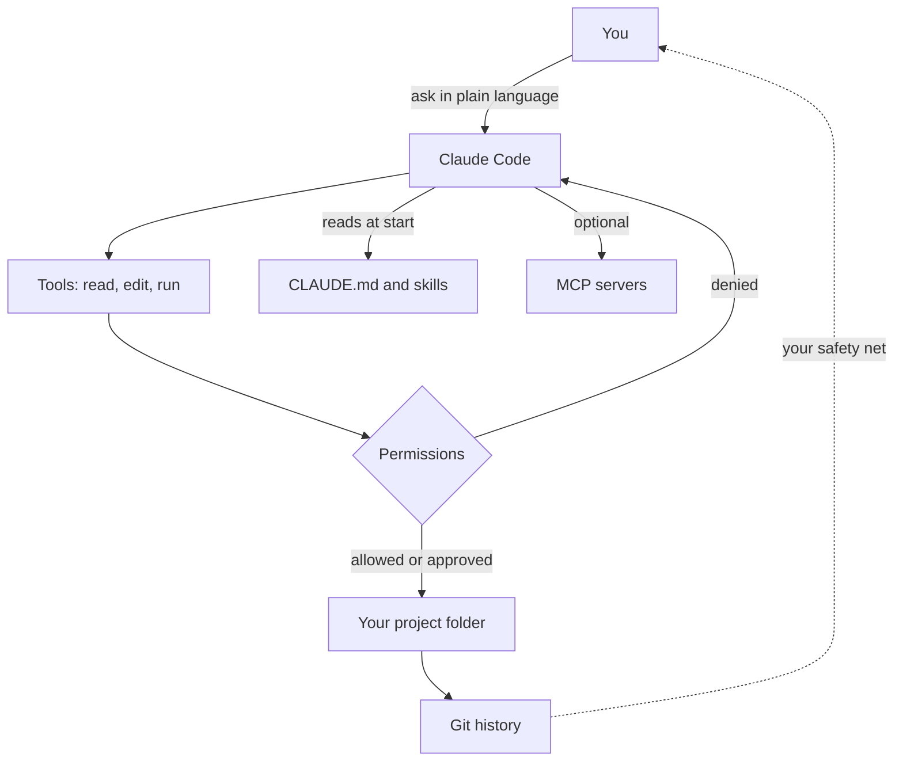
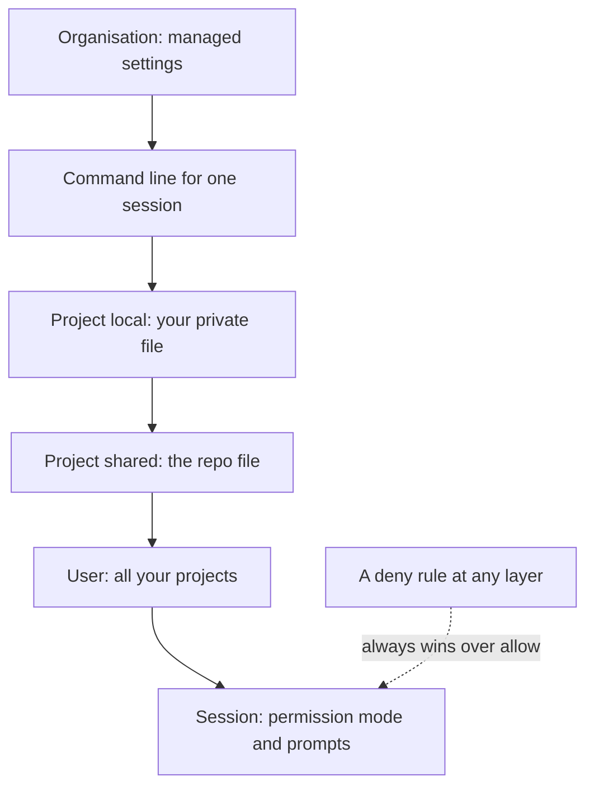

With your files tracked in [Git](/building/git-and-github/), you can let an agent change them and still go back. Claude Code is that agent, and this page covers the controls that decide what it may do, what it remembers between sessions and how it can be extended.

**In one line:** Claude Code is an agent that works inside one folder on your computer, reading and changing files and running commands, with you deciding how much it may do without asking.

*Snapshot, as of October 2026. Claude Code changes quickly. Commands and menu names here come from Anthropic's documentation at code.claude.com, so check there if something looks different on your machine.*

## The jargon: concepts covered on this page

- **Permission mode:** a setting for how much Claude Code does without asking
- **Allow, ask and deny rules:** standing permissions for specific tools or commands
- **CLAUDE.md:** a file of standing instructions Claude Code reads each session
- **Auto memory:** notes Claude Code writes itself between sessions
- **Hook:** a command that runs automatically at a set moment
- **Deny rule:** a settings entry that blocks a tool or path outright
- **Managed settings:** organisation-wide settings that individuals cannot override
- **Sandbox:** an operating-system boundary limiting which files and sites commands can reach
- **Checkpoint:** a snapshot of your files taken before each prompt
- **Compaction:** summarising a long conversation to free up context space
- **Diff:** a view of exactly which lines changed

## Why it matters

A chat window can only talk. Claude Code can act: it can open your files, edit them, run a script and check the result. That is what makes it useful for building a website, tidying a folder of notes or maintaining a set of instructions, and also what makes it worth handling carefully.

It works like a very fast junior colleague who forgets everything between sessions. <mark>The skill is in setting it up so each session starts well-informed and cannot do much damage.</mark> This page covers the controls that do that. For how it differs from the chat apps and the API, see [Claude Code and the API](/building/claude-code-and-the-api/).

## How it works

Claude Code is an [agentic harness](/agents/agentic-harness/): a program that wraps a model, gives it [tools](/agents/tool-use/) and runs the [agent loop](/agents/the-agent-loop/). The tools are things like reading a file, editing a file and running a shell command. Between the model and your computer sits a permission layer that decides what needs your approval.



### Install and start

Anthropic's setup page lists macOS 13 or later (plus recent Windows and Linux versions) and an internet connection. A paid Claude plan or a Console account is required, and the free plan is not enough. The recommended install on a Mac, from a terminal (see [terminal basics](/building/terminal-basics/)), is:

```bash
curl -fsSL https://claude.ai/install.sh | bash
```

Open a new terminal window and run `claude --version`. If it prints a version number, it worked. Then go to the folder you want to work in and start it:

```bash
cd your-project
claude
```

The first run asks you to log in through your browser. Homebrew is an alternative (`brew install --cask claude-code`), but Anthropic notes it does not update itself. `claude doctor` checks your installation and settings if something seems off. If you prefer no terminal at all, the Claude desktop app has a Code tab that includes it.

**On Windows:** Anthropic's setup page gives separate one-line install commands for PowerShell and for Command Prompt, and says you do not need to run them as administrator. It recommends also installing Git for Windows, so Claude Code can use Git Bash to run commands; without it, Claude Code uses PowerShell instead. You can also run Claude Code inside WSL using the Mac and Linux command above; Anthropic's setup page lists sandboxing (an extra safety boundary, described below) as supported under WSL 2 but not on native Windows.

### The permission model

Claude Code asks before it does most things that change something. Anthropic's documentation says reading files in your working folder needs no approval, while running shell commands, editing files, fetching web pages and searching the web do. When it asks, you can allow once, allow and stop asking, or say no.

You can set standing rules. **Allow** rules let a tool run without asking, **ask** rules always ask, and **deny** rules forbid it. Rules look like `Bash(npm run build)` or `Read(./.env)`. Deny rules are checked first, so an allow rule cannot override a deny. Type `/permissions` to see and edit them.

These rules are enforced by Claude Code itself. Anthropic stresses that instructions in a prompt or CLAUDE.md shape what Claude tries to do but do not change what it is allowed to do. If something must never happen, use a deny rule.

**Permission modes** set the baseline. Press Shift+Tab to cycle through them in the terminal:

- **Manual** (called `default` in settings): asks before most actions. The safest.
- **Accept edits** (`acceptEdits`): file edits and common file commands such as creating, moving and copying run without asking.
- **Plan** (`plan`): Claude researches and proposes a plan but does not edit your files until you approve it. Start it with `/plan` or `claude --permission-mode plan`.
- **Auto** (`auto`): a second model acts as a safety checker on actions instead of you. Availability depends on your plan, version and organisation.
- **Bypass permissions** (`bypassPermissions`): skips prompts. Anthropic's warning is to use it only in isolated environments such as a container or virtual machine. Do not use it on your own laptop.

### CLAUDE.md: the rulebook

Each session starts with a blank memory. A **CLAUDE.md** file is a markdown file Claude reads at the start of every session, holding the rules and facts you would otherwise repeat. This is the "instruction file" idea from [skills and instruction files](/agents/skills-and-instruction-files/).

Anthropic lists several locations: a project file (`./CLAUDE.md` or `./.claude/CLAUDE.md`, shared through git), a personal one for all projects (`~/.claude/CLAUDE.md`), and a personal per-project one (`./CLAUDE.local.md`, which you should keep out of git). Files in the folder you start in and the folders above it load at launch. Files in subfolders load when Claude reads files there.

What belongs in it: build and check commands, conventions, project layout and "always do X" rules. Anthropic suggests keeping each file under about 200 lines, since longer files use more [context](/start/tokens-and-context-windows/) and are followed less reliably. Run `/init` to have Claude draft a first one, and `/memory` to edit your memory files. Claude Code also keeps its own "auto memory" notes, which `/memory` lets you view or switch off.

### Skills

A skill is a folder containing a `SKILL.md` file with a name, a description of when to use it and the steps to follow. Anthropic's documentation says they live in `.claude/skills/<name>/` for one project or `~/.claude/skills/<name>/` for all your projects. You can run one by typing `/` and its name, and Claude can also pick one up on its own when your request matches the description. Use a skill for a multi-step procedure and CLAUDE.md for rules that are always true.

### Slash commands

Typing `/` shows the commands available. Type `/` and a few letters to filter. Ones documented by Anthropic include:

- `/help`: show help and available commands
- `/init`: draft a CLAUDE.md for the project
- `/memory`: edit memory files
- `/permissions`: manage allow, ask and deny rules
- `/plan`: enter plan mode
- `/rewind`: go back to an earlier point (aliases `/undo` and `/checkpoint`)
- `/compact`: summarise the conversation to free up space
- `/clear`: start a fresh conversation
- `/context`: show what is filling the context window
- `/resume`: return to an earlier conversation
- `/mcp`, `/hooks`, `/agents`, `/config`, `/usage`, `/doctor`: manage servers, hooks, subagents, settings, usage and installation health

### Hooks

A **hook** is a command that runs automatically at a set moment in Claude Code's work, for example after every file edit or when Claude is waiting for you. Unlike CLAUDE.md, which Claude may or may not follow, a hook always runs. Anthropic's guide uses a notification hook as the first example: it pops up a desktop notice whenever Claude needs your input, so you can look away while it works. Hooks are set in a settings file, and `/hooks` lists what is configured. Because hooks run commands on your computer, read any hook you did not write before adding it.

### Subagents

A **subagent** is a helper Claude hands a side task to, working in its own separate context window and returning just a summary. That keeps long searches from cluttering your main conversation. Built-in ones include Explore (read-only search) and Plan. You can define your own as markdown files in `.claude/agents/` or `~/.claude/agents/`. See [subagents and multi-agent systems](/agents/subagents-and-multi-agent-systems/).

### MCP servers

[MCP](/agents/mcp/) servers give Claude Code new tools, such as reading a database or a project tracker. Anthropic documents adding one from the terminal:

```bash
claude mcp add --transport http server-name https://example.com/mcp
```

Use `claude mcp list` to see what is installed and `/mcp` inside a session to check status and sign in. Scope matters: by default a server is local to you and the current project, `--scope project` writes a `.mcp.json` file meant to be shared through git, and `--scope user` makes it available in all your projects. Anthropic warns to trust each server first, since servers that fetch outside content carry [prompt injection](/running/prompt-injection/) risk (hidden instructions planted in content the agent reads, covered in Part 6). A worked example is in [Supabase](/building/supabase/), a database service covered later in this part.

### Settings files

Settings are JSON files at different scopes. Per Anthropic's documentation: `~/.claude/settings.json` applies to you in every project, `.claude/settings.json` is shared with everyone on the project, and `.claude/settings.local.json` is yours for one project. Organisations can add managed settings that override the rest. Settings set higher up win. `/config` opens a settings screen without editing the files by hand. On Windows, `~` here means your user folder, such as `C:\Users\yourname`.

### Checkpoints and undo

Claude Code takes a snapshot of your files before each prompt. Run `/rewind`, or press Esc twice with an empty prompt, to restore the code, the conversation or both. There are limits. Anthropic says changes made by shell commands (such as deleting or moving files) are not tracked, nor are edits from outside the session. It calls checkpoints session-level recovery, not a replacement for git.

### Managing context

A long session fills the [context window](/start/tokens-and-context-windows/), and quality and cost both suffer. `/context` shows what is using space. `/compact` summarises the conversation to make room, and you can add a note on what to keep. Claude Code also compacts automatically when it gets full. `/clear` starts clean. This is the practical side of [context engineering](/data/context-engineering/) (choosing what goes into the model's view, covered in Part 5): put lasting rules in files, and keep each conversation focused on one job.

### A worked example

Jo, a freelance researcher who is also on a part-time course, keeps her research notes in one folder tracked with git. Its CLAUDE.md says what the notes are for, that client names must never appear in anything shared, which referencing style to use, and to check every quotation against its source file. A skill called `weekly-summary` lists the steps for her Friday round-up: find the notes changed this week, pull out the key findings, check each one has a source, and draft the summary in a new file.

Because the rules sit in files, every session behaves the same way, whether it is Monday's or next month's. Jo never has to repeat "no client names" at the start of a session. Changes to the rules are visible in git and can be undone.

## Setting it up

Claude Code is its own setup, so the steps are short:

1. Install it and check `claude --version`, as above.
2. Make a folder for the work and put it under git. See [Git and GitHub](/building/git-and-github/).
3. Start `claude` in that folder, log in, and run `/init` to draft a CLAUDE.md.
4. Read the CLAUDE.md and trim anything that is not true or not needed.
5. Run `/permissions` and add deny rules for files that must stay private, such as `.env`.
6. Try a small task in plan mode, read the plan, then approve it.

## Good habits

- **Work in small tasks.** One change at a time is easier to check and undo.
- **Plan before big changes.** Use plan mode when a task touches many files.
- **Commit before risky work.** Git is the safety net that checkpoints are not. See [Git and GitHub](/building/git-and-github/).
- **Review the changes.** Read the diff, meaning the list of lines added and removed, before you commit.
- **Read what it plans to run.** Check commands before approving, especially ones that delete, download or send.
- **Never give it secrets.** Do not paste keys into prompts or CLAUDE.md. Keep them in [environment variables](/building/environment-variables-and-secrets/) and deny reading `.env`.
- **Treat what it reads as untrusted.** Files and web pages can contain hidden instructions. See [prompt injection](/running/prompt-injection/).
- **Stay in the loop.** Anything that sends, deletes or publishes deserves your eyes. See [human in the loop](/agents/human-in-the-loop/).

## When things go wrong

- **`claude` is not found after installing.** Open a new terminal window. If it persists, the install folder is not on your PATH, and Anthropic's installation troubleshooting page explains the fix.
- **It keeps asking permission.** That is by design. Allow specific safe commands with "don't ask again" or a rule in `/permissions`, rather than switching permissions off.
- **It ignores a rule in CLAUDE.md.** CLAUDE.md is guidance and not enforcement. Make the rule shorter and more concrete, remove conflicts, or use a deny rule or hook for what must hold.
- **It broke something.** Use `/rewind` for edits it made itself. For anything else, such as deleted files, use git.
- **The session feels slow or confused.** The context is probably full. Run `/context`, then `/compact` or `/clear`.
- **Wrong billing.** If an `ANTHROPIC_API_KEY` is set, Claude Code may use API billing rather than your plan.

## Costs and limits

- **Long sessions cost more.** Everything in the context is re-read each turn, so tight sessions are cheaper. See [not burning tokens](/using-ai/not-burning-tokens/).
- **Subagents use their own usage.** They keep your main conversation tidy but are not free.
- **Plan allowance is shared.** On a subscription, Claude Code and the Claude apps draw from the same limits.
- **It makes mistakes.** It can edit the wrong file or misread an instruction. Review is your job.
- **Settings change often.** Rely on `/help` and Anthropic's documentation for the latest.

## Recommended settings for Claude Code

Claude Code can read, change and run things on your computer, so a few settings matter more here than in the chat apps. The checklist for the apps themselves (privacy, memory, connectors, account sign-in) is in [recommended settings](/using-ai/recommended-settings/). Details below are as of October 2026, from Anthropic's documentation at code.claude.com.

### How the settings layers fit together

Settings come in layers. A higher layer can restrict a lower one, and a block set anywhere wins over an allow set elsewhere.



The files are plain JSON (a tidy way of writing settings as labelled values), from strongest to weakest:

- **Managed settings:** deployed by an administrator for everyone in an organisation. Nothing you set overrides them, apart from a few security-sensitive exceptions.
- **Command line:** options you type when starting one session.
- **Project local:** `.claude/settings.local.json`, yours alone, for one project.
- **Project shared:** `.claude/settings.json`, shared with everyone who uses the repository.
- **User:** `~/.claude/settings.json`, applying to all your projects.

Claude Code checks deny rules first, then ask rules, then allow rules. A deny set at user level beats an allow set at project level, and the other way round.

### The checklist

1. **Start in a mode that asks first.** As of October 2026, newer versions can start in auto mode by default, so check the status bar under the prompt to see which mode you are in. For work involving real business or client data, choose Manual. Press `Shift+Tab` to cycle modes, or set `permissions.defaultMode` in your user settings file.

2. **Never use bypass mode on your own machine.** `bypassPermissions` skips permission prompts, including for protected folders such as `.git` and `.claude`. You can lock it off by setting `permissions.disableBypassPermissionsMode` to `"disable"`.

3. **Start big jobs in plan mode.** Start a session with `claude --permission-mode plan`, or cycle to it with `Shift+Tab`. It is the cheapest way to catch a wrong direction.

4. **Block secret files with deny rules.** Add rules like these to the `permissions.deny` list in your user or project settings file:

   ```json
   {
     "permissions": {
       "defaultMode": "default",
       "deny": ["Read(./.env)", "Read(./secrets/**)"]
     }
   }
   ```

   A `Read` deny rule also stops Edit and Write on the same path. A `.claudeignore` file has no effect, so do not rely on one. In your user file, a path that starts with a single `/` is relative to the settings folder, so use a `~/` path there for rules that should apply in every project.

5. **Know what deny rules do not cover.** Claude Code applies `Read` deny rules on a best-effort basis to its file tools and to common file commands. They do not stop a script that opens files itself, or a command that searches a whole folder without naming the file. For a hard, operating-system level wall, turn on the sandbox with `/sandbox`. It is off by default and covers shell commands only; check the documentation for which systems support it.

6. **Keep an eye on what you approve.** "Yes, and don't ask again" saves a rule. Review saved rules now and then with `/permissions`.

7. **Keep `.env` files out of git.** Secrets belong in [environment variables](/building/environment-variables-and-secrets/), and the file that holds them locally must be listed in `.gitignore` so it is never committed. The deny rule from item 4 is a second line of defence. Never paste a key into a prompt.

8. **Trim MCP servers.** Run `/mcp` to see servers and switch one off for the current project. If you sign in with a Claude subscription, connectors you added in the Claude apps also appear here. You can switch them all off with `disableClaudeAiConnectors` set to `true` in settings, or hide a single one in `/mcp`.

9. **Approve project servers on purpose.** Servers listed in a repository's `.mcp.json` file ask for your approval before use. Read what you are approving, and treat any server that fetches outside content as a route for prompt injection.

10. **Decide on auto memory.** Claude Code's auto memory (notes it writes itself between sessions) is separate from memory in the apps. `/memory` shows a toggle, and `autoMemoryEnabled` can be set to `false` per project.

11. **Check what stays on your computer.** Claude Code keeps session transcripts locally as plain text for 30 days by default. The `cleanupPeriodDays` setting changes that. Treat the folder like any place where client information sits.

12. **Protect the accounts around it.** Switch on two-factor sign-in for the services you build with. GitHub supports authenticator apps, passkeys, security keys, GitHub Mobile and text messages, under Settings, then Password and authentication, and recommends an authenticator app over text messages. Vercel (a hosting service, covered later in this part) supports an authenticator app and passkeys in its account settings. For the Claude Console, check its current security settings for two-factor options.

13. **Cap hosting spend too.** On Vercel, Spend Management sends alerts at set thresholds, but it only stops production deployments if you also switch on "Pause Production Deployments". Checks run every few minutes, not instantly, so pick a limit below the most you would accept.

When something seems off: run `/status` to see which settings sources apply, and `claude doctor` to find skipped or invalid settings. A rule that names the wrong tool or a bad path may be skipped with a startup warning. To test a deny rule, ask Claude to read the blocked file; you should see a refusal that names the rule. If a secret was committed, revoke the key at the provider and create a new one, because git keeps history.

## Keeping Claude Code sessions lean

Claude Code sends your full conversation with every request, and again each time it uses a tool, according to its documentation. A one-line question at the end of a day-long session still carries everything before it, so habits matter even more here than in chat. The general habits for the apps are in [not burning tokens](/using-ai/not-burning-tokens/). These are the Claude Code ones, as of October 2026.

1. **Clear between tasks.** Use `/clear` when you switch to unrelated work. If you may want the old session back, run `/rename` first and `/resume` later. Clearing also resets the session's cost figure.

2. **Name what to read.** "Improve this folder" makes the agent scan widely. "Add a title to each page in the setup folder" lets it read only what it needs.

3. **Plan first on anything large.** Plan mode lets Claude explore and propose before changing anything, which avoids expensive rework.

4. **Switch models and effort.** Use `/model` to switch mid-session. Anthropic's guidance is that its mid-sized model handles most coding tasks well and costs less than the largest, which is best kept for hard reasoning. Thinking is billed as output, so lower the effort level with `/effort` for simple tasks.

5. **See what is taking space.** Run `/context`. Claude Code defers connector tool definitions by default, so only their names enter context until used, but unused servers are still clutter and risk: disable them in `/mcp`. Where a plain command-line tool exists, it adds less to context than an MCP server.

6. **Keep CLAUDE.md short.** It loads at the start of every session. The documentation suggests aiming for under 200 lines, and moving specialised instructions into skills, which load only when used.

7. **Let subagents do the bulky reading.** A subagent works in its own context window and returns only a summary, so logs and search results do not flood your main conversation. Their work still counts toward your usage. See [subagents and multi-agent systems](/agents/subagents-and-multi-agent-systems/).

8. **Compact before a session balloons.** `/compact` summarises older history, and you can steer it, for example `/compact Focus on the decisions and open questions`. Compacting a large context is itself a big request, so prefer `/clear` when you do not need continuity.

9. **Stop runaway loops early.** Press `Escape` to stop, and `/rewind` to return to a checkpoint. Scheduled or looping tasks fire on their interval even while a session is idle, each time sending your full context.

10. **Give it a way to check itself.** Include the expected result or a test in your request, so it fixes issues before you have to ask.

Check usage with `/usage` (`/cost` is an alias). On subscription plans it shows plan usage bars; API users see token counts and an estimated cost, which is not the invoice. The first message after a long break costs more, because cached context expires after a while. If an API key is set in your environment, Claude Code uses it instead of your subscription, so remove it if you meant to use the plan.

## Related

- [Claude Code and the API](/building/claude-code-and-the-api/): how this tool differs from the apps and the API
- [Skills and instruction files](/agents/skills-and-instruction-files/): the idea behind CLAUDE.md and skills
- [Git and GitHub](/building/git-and-github/): the safety net under every session
- [Human in the loop](/agents/human-in-the-loop/): why approval steps matter
- [Prompt injection](/running/prompt-injection/): the main risk when an agent reads outside content
- [Sandboxes and code execution](/building/sandboxes-and-code-execution/): sealed-off spaces for running code an agent writes

## Next up

Claude Code is how you build with Claude. Once the things you build call Claude through the API, they need answers in a fixed shape a program can read, not friendly prose. [Structured outputs](/building/structured-outputs/) shows how to get them.
