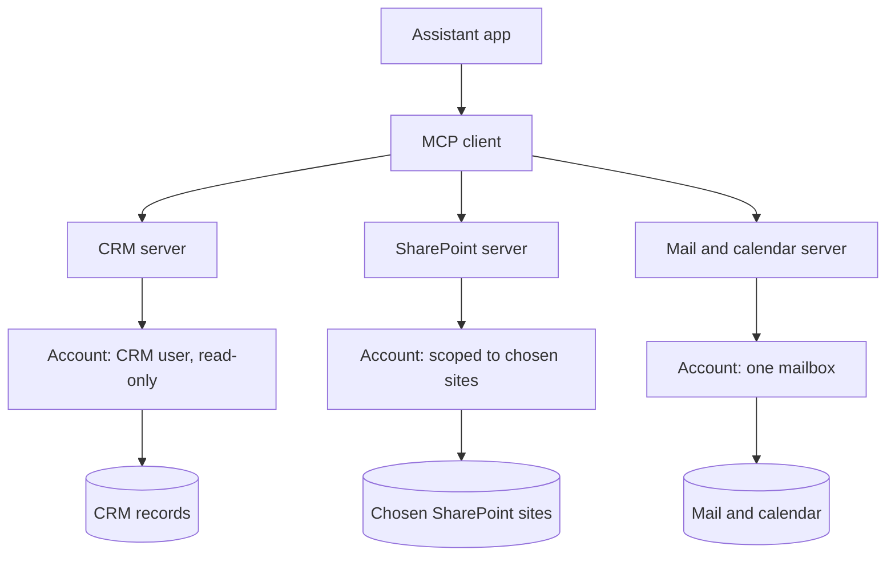

A workflow tool such as [n8n](/building/n8n/), Claude Code and the Claude apps all become far more useful once they can reach real business records. This page covers plugging a CRM, Microsoft 365 and email into them through MCP, without handing over the keys to everything.

**In one line:** connecting an assistant to your CRM, files and email is quick to do and easy to do badly, so start with read-only access on narrow scopes and widen only as you gain trust.

## The jargon: concepts covered on this page

- **Sites.Selected:** a Microsoft permission limiting an app to specifically granted SharePoint sites
- **Conditional Access:** Microsoft rules such as multi-factor sign-in that apply before access is allowed
- **Tool permissions:** per-tool settings in Claude: always allow, needs approval, or blocked
- **Custom connector:** a remote MCP server you add to Claude yourself
- **Work IQ MCP servers:** Microsoft's preview MCP servers for Microsoft 365 data
- **OAuth scope:** one named permission, such as read or write, requested at sign-in

## Why it matters

An assistant that can see the CRM, the SharePoint folders and the inbox is far more useful than one that cannot. It can answer "where are we with Acme Payments?" from your real records. It is also the moment where an AI tool stops being a chat window and becomes something that can read, and sometimes change, your organisation's data.

[MCP](/agents/mcp/) makes the connection easy, and that is the reason to slow down. Email and documents carry text written by other people, which is the prompt injection risk described in [safety basics](/agents/safety-basics/). With business records on the other end, a fooled assistant can do more harm.

<mark>Connect one system at a time, read-only, with the narrowest account that works, and treat every email and document the assistant reads as untrusted text.</mark>

This page uses Sample Ventures, an imaginary fund, as the example. It reflects vendor documentation as of October 2026. Menus, plans and previews change, so check the linked vendors' own pages when you set up.

## How it works

The assistant application contains an MCP client. Each system you connect has an MCP server in front of it, signed in as some account. What the assistant can do is limited by three things: the tools the server offers, the permissions of the account, and any approval settings you add.



**CRM (Affinity as the example).** Affinity's help centre describes a hosted MCP server. Admins manage it under Settings, then Affinity MCP. According to the help centre it is switched on by default for Claude, ChatGPT and Notion, and an admin can turn a client off, which also disconnects everyone who connected through OAuth. API and MCP access depend on the plan, so check yours. Other CRMs exist and many now describe their own MCP support, so look for the equivalent page in whichever you use.

Affinity says MCP calls run with the same permissions as the Affinity user who connected, and that its server stores no CRM data, prompts or AI responses. Its sign-in screen asks for read and write permission by default, and Affinity's developer pages say you can choose read-only by unchecking the first scope before approving. Its pages also say delete and merge actions need explicit confirmation, and that Enterprise admins can restrict who may use MCP agents by role.

**Microsoft 365 and SharePoint in Claude.** Anthropic's support pages describe a Microsoft 365 connector that reaches SharePoint, OneDrive, Outlook mail and calendar, and Teams. It needs a Microsoft Entra tenant on a business plan, so personal accounts cannot connect. On team and enterprise plans an organisation owner enables it, then a Microsoft Entra Global Administrator gives admin consent. It mirrors each person's existing Microsoft permissions, so nobody sees through Claude what they could not see directly. Write abilities (sending email, changing calendars, creating files, posting to Teams) are off by default and need separate admin enablement. Anthropic also says Conditional Access policies such as multi-factor authentication work with it, and that connector activity appears in Microsoft audit logs.

**Microsoft's own offerings.** Microsoft documents what it calls Work IQ MCP servers, part of Microsoft Agent 365, with servers for Mail, Calendar, Teams, SharePoint, OneDrive, Word and more. Microsoft's page marks them as a preview, not meant for production use, and says they need a Microsoft 365 Copilot licence. Admins govern them in the Microsoft 365 admin center under "Agents and Tools", where they can allow or block each server. Names and status are likely to change, so confirm on Microsoft Learn.

**Narrowing the scope.** Claude's connector acts as the signed-in person. If you instead build or run your own server that signs in as an app, Microsoft offers narrower grants. For SharePoint, the `Sites.Selected` permission limits an app to the specific sites it is granted. Microsoft's documentation says three things must all be true for access: consent in Entra, a grant on the specific site, and a token carrying that permission. For mailboxes, Microsoft documents "Role Based Access Control for Applications in Exchange Online", which pairs an app's permission with a scope that names which mailboxes it may reach. Both are admin tasks. Ask your Microsoft 365 admin to do them, and do not attempt them without one.

**Adding a server of your own choosing.** In the Claude apps, adding a custom connector by its web address works as described in [connectors in Claude](/agents/connectors-in-claude/), and the server must be reachable over the public internet. In Claude Code, the documented command for a remote server is below, followed by running `/mcp` inside Claude Code to sign in.

```bash
claude mcp add --transport http <name> <server-url>
```

Claude Code's documentation says servers can be stored for one project, shared with a team through a `.mcp.json` file, or kept for all your own projects, and that you should verify you trust each server before connecting it. Use `claude mcp list` to see what is connected and `claude mcp remove <name>` to take one away.

## Setting it up

Do these in order, one system at a time.

1. Ask permission first. Check your organisation's policy, and with the person responsible for compliance, before connecting anything that holds customer, client or other personal data.
2. Choose the official connector from the system's own vendor, not an unknown third-party one.
3. Create or choose a dedicated account for the assistant, with the narrowest role that works. See [least privilege](/running/least-privilege/) (the Part 6 page on giving each account only what it needs) and [auth and secrets](/map/auth-and-secrets/).
4. For Microsoft 365, ask the admin to approve only what is needed, and to limit access to the specific sites or mailboxes involved.
5. Connect with read-only access first. On Affinity, uncheck the write scope at the sign-in screen. On Claude team plans, leave Microsoft write tools off.
6. Open the list of tools the server offers and switch off anything that writes or deletes. On Claude team and enterprise plans, tool permissions can be set to always allow, needs approval, or blocked. Anthropic's pages also say you can disable tools you do not want in a conversation.
7. Test on non-sensitive records first, such as the invented company Acme Payments in a test folder.
8. Read the logs after a few days. Look at what was asked for, not just whether answers looked right.
9. Widen slowly. Add one tool or one site at a time, with approval on for anything that changes data.

When it works, the assistant answers from your records, cites what it found, and the tool list shows only what you chose.

## Good habits

- **One identity per purpose.** A shared login makes the logs useless and the access too wide.
- **Approvals on risky actions only.** Approving everything trains people to click through. See [human in the loop](/agents/human-in-the-loop/).
- **Fewer tools is better.** Every connected tool costs context and raises the chance of a wrong choice.
- **Keep keys out of files you share.** Use OAuth sign-in where it exists. If a tool needs an API key, store it as a secret and never paste it into a chat, a shared file or a repository.
- **Review quarterly.** People leave, folders move and old connections stay. Remove what you no longer use.

## When things go wrong

- **The assistant is told to do something by an email or document.** This is prompt injection, introduced in [safety basics](/agents/safety-basics/) and covered in depth in [Part 6](/running/prompt-injection/). Keep write tools off or behind approval, and do not let an assistant that reads inbound mail also send mail unchecked.
- **Data leaves through a tool.** An assistant that can read private files and also send messages or make web requests can pass data out. This is the lethal trifecta from [safety basics](/agents/safety-basics/); [data exfiltration through tools](/running/data-exfiltration-through-tools/) in Part 6 goes further. Keep reading and sending in separate setups.
- **The admin consent step is blocked.** Only an administrator with the right Microsoft role can approve it. Send them the vendor's setup page and ask which scope they will grant.
- **The assistant cannot see a file.** It mirrors your permissions. If you cannot open the file in SharePoint, neither can it.
- **A client has stopped working after an admin change.** In Affinity, turning a client off disconnects everyone who connected through OAuth. Reconnect once it is turned back on.
- **A custom server will not connect.** Custom connectors in Claude must be reachable from the public internet, so a server on a private network will not work.

## Costs and limits

- **Cheap to connect, costly to get wrong.** The effort is in the access decisions, not the clicks.
- **Plan and licence requirements.** The CRM and Microsoft previews each have their own plan or licence conditions. Check them before you promise anything.
- **Previews change.** Microsoft's Work IQ servers are labelled as preview. Do not build a routine you depend on around one.
- **More tools, more cost.** Each tool description is sent to the model each time. Connect only what the job needs.
- **Compliance.** Your organisation, and any regulator it answers to, sets its own rules on third-party AI tools and data. This page is not legal advice. For a regulated firm (for example one supervised by a financial regulator), follow its own policies and speak to whoever owns compliance. Check the assistant vendor's data terms too (see [data terms at a glance](/models/data-terms-at-a-glance/) and [GDPR, data retention and DPAs](/running/gdpr-data-retention-and-dpas/)).

## Related

- [MCP](/agents/mcp/): the standard behind these connections
- [Connectors in Claude](/agents/connectors-in-claude/): adding, scoping and switching off connectors in the Claude apps
- [Safety basics for connected AI](/agents/safety-basics/): the main risk once an assistant can read your accounts
- [Least privilege](/running/least-privilege/): how narrow an account should be
- [Auth and secrets](/map/auth-and-secrets/): where sign-ins and keys are decided and stored
- [Prompt injection](/running/prompt-injection/): why email and documents are risky inputs
- [n8n](/building/n8n/): an alternative route for scheduled or event-driven jobs

## Next up

With one system connected narrowly and safely, every piece of a small agent is in place. [Your first agent](/building/your-first-agent/) puts them together into one step-by-step build.
