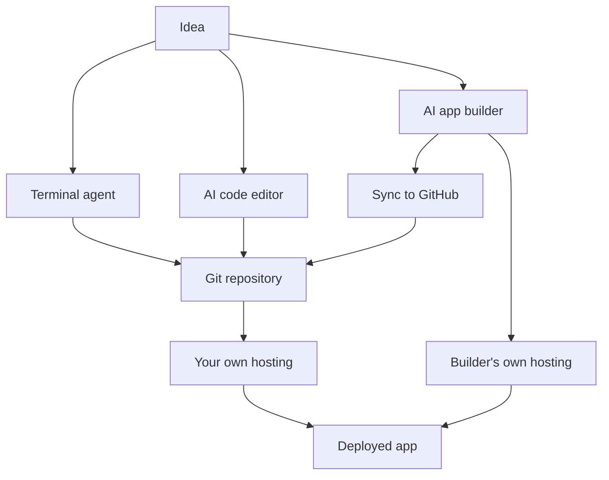

Claude Code and [structured outputs](/building/structured-outputs/) assume you are happy working close to the code, in a terminal. That suits some people and not others. AI code editors and app builders offer other routes to the same place, with different trade-offs in what you can see and undo.

**In one line:** an AI code editor is a normal coding workspace with an assistant built in, an AI app builder turns a description into a running web app, and both are alternatives to working in the terminal with [Claude Code](/building/claude-code-in-depth/).

## The jargon: concepts covered on this page

- **IDE:** a code editor with extra tools for writing and running software
- **AI code editor:** a code editor with an AI assistant built in
- **Cursor rules:** standing instructions stored in a project's `.cursor/rules` folder
- **AI app builder:** a website that generates and hosts a web app from a description
- **Row-level security:** database rules deciding which user may see which record
- **Lock-in:** being unable to leave a vendor without rebuilding your work

## Why it matters

You will meet these tools quickly. Colleagues mention Cursor, a friend shows you an app made in an afternoon with Lovable, and a developer friend says "just use Copilot". They are all ways to get software built with AI help, but they suit different people and carry different risks.

For most people, the useful question is not "which is best". It is "how much of what gets made can I see, check and undo?". Terminal agents, code editors and app builders give very different answers.

<mark>Whatever tool makes the code, keep it in git, keep secrets out of it, and never let an AI-built app touch real data until you understand who can read that data.</mark>

This page describes the tools as of October 2026. They change fast, so treat names and menus as a starting point and check each vendor's own documentation.

## How it works

There are three paths from an idea to a deployed app. The first you already know from [Claude Code and the API](/building/claude-code-and-the-api/). The other two are covered here.

**Terminal agent.** You work in a text window and the agent edits files in your project folder. You see every change as a file diff. Claude Code is the example.

**AI code editor.** A code editor (the program developers use to write code, often called an IDE, short for integrated development environment) with an assistant inside it. You see the files on one side and the chat on the other. Cursor is built as a fork (a modified copy) of the VS Code editor, according to its documentation. GitHub Copilot is an assistant that works inside several editors, and also on GitHub.com and in the command line.

**AI app builder.** A website where you describe an app in plain language and it builds and hosts it. Examples are v0, Lovable and Bolt. You can often ignore the code entirely, which is the appeal and the danger.

**How editors read your project.** An editor assistant works from the files in the folder you opened. Cursor describes its agent as able to trace how a repo fits together. GitHub Copilot's documentation lists chat, an agent that can plan changes and open pull requests, and use from the command line.

**Instruction files.** Like Claude Code's `CLAUDE.md`, editors read a plain text file of standing instructions (see [skills and instruction files](/agents/skills-and-instruction-files/)). Cursor calls them rules. Its project rules live in a `.cursor/rules` folder in the repository, and can be set to apply always, to certain file types, when the AI judges them relevant, or only when you mention them by name. Copilot reads `.github/copilot-instructions.md` and, according to GitHub's documentation, also `AGENTS.md`, `CLAUDE.md` and `GEMINI.md`.

`AGENTS.md` is an open, tool-neutral format for this job: a README written for AI agents, placed at the root of the repository. The `agents.md` website lists support across many tools, including Cursor and Copilot. If you use more than one tool, one shared file saves repeating yourself.

**What app builders produce.** Each describes a real web app, not a mock-up. v0's documentation says it works with Next.js, Tailwind CSS and shadcn/ui, and deploys through Vercel. Lovable says it generates a front end, back end, database and sign-in, and publishes to a live URL. Bolt says it offers a built-in database, hosting and custom domains.

**GitHub connections.** All three describe a GitHub link, but they differ. Lovable syncs both ways with one branch and creates a new private repository when you connect, and its documentation says it cannot import existing repositories. v0 works on a separate working branch and opens a pull request when you publish. Bolt commits automatically as you work, checks GitHub for outside changes every 30 seconds, and can import a repository. Read the current page for your tool before relying on any of this.

## Setting it up

Each vendor keeps a quick-start that is more reliable than anything written here. Cursor, GitHub Copilot, v0, Lovable and Bolt all publish their own documentation, and Bolt's help centre recommends planning in a "Plan mode" before generating code. What follows is the part that is the same for all of them.

1. Create an account with your work email, and check the vendor's data terms before pasting anything about your work or your customers (see [data terms at a glance](/models/data-terms-at-a-glance/)).
2. Start a new, empty project for something low-stakes, such as a public-facing page, not anything holding real records.
3. Connect GitHub from the tool's settings, and approve access to one repository only, not your whole account.
4. Write a short instructions file: what the project is, what it must never do, and where secrets live (nowhere in the code).
5. Ask for something small, then open the code or the diff and see what changed. If you cannot follow it, ask the tool to explain it in plain language.
6. Commit the result with [git](/building/git-and-github/) before you ask for the next change, so you can go back.
7. Test the app as a stranger would, by opening it in a private browser window with no sign-in.

When it works you should see the generated files in your GitHub repository, with a commit history that matches what you asked for.

## Good habits

- **Put everything in git.** Builders can break an app with one request. A commit before each change is your undo button, and it is also your protection if the vendor changes or closes.
- **Never paste secrets into a chat.** Lovable's documentation says it detects keys pasted into chat and points you to its Secrets feature. Use the tool's secret storage, and see [environment variables and secrets](/building/environment-variables-and-secrets/).
- **Give the app the least access that works.** A throwaway database, a read-only key, a test account. See [least privilege](/running/least-privilege/), covered in Part 6.
- **Use fake data first.** Sam, who runs Bramley's bakery, would test a new order page with invented customers and addresses, not real ones.
- **Read the scan results.** Lovable runs security scans at publish and says they cannot guarantee safety. Treat any such scan as a first pass, not a verdict.
- **Know where it is hosted.** If the builder hosts your app, someone else runs your server. Decide whether that is acceptable for what the app holds.

## When things go wrong

- **The app works but you cannot explain how.** Ask the tool for a plain-language tour of the files, then keep the app small. An app you cannot read is one you cannot check.
- **Data is visible to the wrong people.** The usual cause is a database with no row-level rules: the setting that decides which signed-in person may see which record. Lovable's documentation calls misconfigured rules a common cause of leaks. Test by signing in as a second, ordinary user.
- **A key appears in the code or the chat.** Treat it as leaked. Revoke it at the provider, create a new one, and store it in the tool's secrets feature.
- **The tool and GitHub disagree.** Two-way sync can clash if you edit in both places at once. Work in one place at a time, and pull before you push.
- **The change you wanted broke something else.** Roll back to your last commit and ask again with a narrower request.
- **You are stuck in one vendor's setup.** Check early that you can export the code and run it elsewhere. Lovable's documentation notes it exports to GitHub but cannot import repositories.

## Costs and limits

- **Usage-based.** Most of these tools charge by use in some form (Bolt's help centre talks about managing tokens), so a long back-and-forth costs more than a short one. See [not burning tokens](/using-ai/not-burning-tokens/).
- **Quick to start, harder to finish.** A builder gets you a working first version fast. The later parts (sign-in, data rules, error handling) are where non-developers tend to get stuck.
- **Fit for a non-developer.** App builders suit a throwaway prototype or a simple internal page. Editors suit someone willing to read code. Terminal agents suit someone who wants to stay close to the files and the history.
- **Not a security review.** No tool here can promise the result is safe for sensitive data. Lovable's own documentation suggests a professional review for apps handling sensitive data.
- **Lock-in.** The more you build inside a vendor's database and hosting, the harder it is to leave.

## Related

- [Claude Code in depth](/building/claude-code-in-depth/): the terminal agent these tools sit beside
- [Claude Code and the API](/building/claude-code-and-the-api/): the two Claude tools for building, and when to use each
- [Git and GitHub](/building/git-and-github/): the safety net under all generated work
- [Skills and instruction files](/agents/skills-and-instruction-files/): how rules files and `AGENTS.md` fit in
- [Least privilege](/running/least-privilege/): how to decide what a generated app may touch

## Next up

All of these tools build software that then needs somewhere to run. For small jobs that only happen now and then, that place is often a [serverless function](/building/serverless-functions/).
