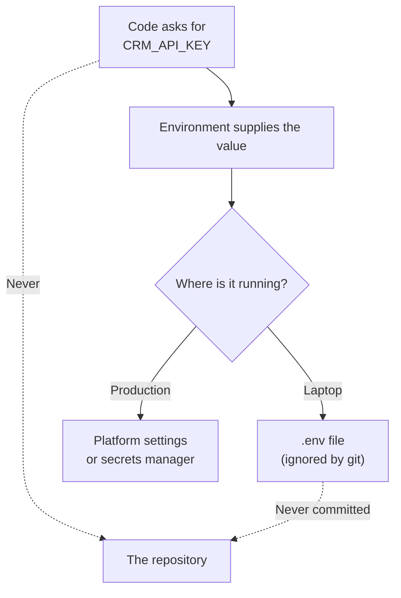

Code running in a [sandbox](/building/sandboxes-and-code-execution/) or a serverless function often needs a key to reach a CRM, a file store or a model. This page covers where those keys belong, so they never end up written into the code itself.

**In one line:** an environment variable is a named setting a program reads from its surroundings instead of from its code, and a secret is the sensitive kind, such as an API key or a password, that must never be written into code or shared.

## The jargon: concepts covered on this page

- **Environment variable:** a named value a program reads from where it runs
- **Secret:** a sensitive value, such as a key or password, that must stay private
- **.env file:** a local file holding environment variables for development
- **.gitignore:** a file telling git which files never to track or commit
- **Secrets manager:** a service that stores, controls and rotates secrets
- **Rotation:** replacing a key with a new one and retiring the old
- **Revoke:** switching a key off so it no longer works
- **Secret scanning:** automatic detection of credentials committed to a repository
- **Push protection:** blocking a push that contains a recognised secret

## Why it matters

Almost every useful agent or automation needs a key to something: the CRM, the file store, the model provider. The tempting shortcut is to paste the key straight into the code. It works at once, and it is how most leaks begin.

Code gets copied, shared, committed to repositories and pasted into chats. A key written into it travels everywhere the code does. If the code lands in a public place, the key is public too, and automated scanners find exposed keys within minutes.

Environment variables fix this by splitting two things that should never be mixed: the code, which is shared widely, and the secrets, which stay in a few safe places.

<mark>The code should know the name of a secret, never its value.</mark>

## How it works

An **environment variable** is a named value that the running program reads from the place it runs in. The code says "give me the value called CRM_API_KEY". The environment supplies it. The same code can then run on a laptop, in testing and in production, each with different values.

A **secret** is any such value that would cause harm if someone else saw it: API keys, tokens, passwords, signing secrets. Not every setting is secret. A region name or a "debug on" flag is just configuration. The same mechanism carries both.

Where the values live depends on where the code runs:

- **On your own computer.** A file called `.env` holds the values, and tools load it when the program starts. A line in it looks like `CRM_API_KEY=YOUR_API_KEY_HERE`.
- **In production.** The hosting platform has a settings area for environment variables or secrets, and passes them to the program when it starts.
- **At a higher level of care.** A **secrets manager** is a dedicated service that stores secrets encrypted, controls who can read them, records access and can rotate them automatically. Cloud providers offer these, and there are independent products too.

You can also set a variable by hand in a terminal, which is handy for ordinary settings. On a Mac or Linux, `export APP_MODE=test` sets one for that terminal window. Avoid doing this with real keys, because the terminal can keep a history of what you type.

**On Windows:** in PowerShell, `$Env:APP_MODE = "test"` sets a variable for the current session only, and `$Env:APP_MODE` reads it back. For one that lasts, Microsoft's documentation describes the Environment Variables screen (System, then Advanced system settings) and a PowerShell command, `[Environment]::SetEnvironmentVariable()`. A `.env` file works the same way on Windows as anywhere else.

The rules that matter most:

1. **Never write secrets into code.**
2. **Never commit them to a repository.** A repository keeps history, and if the repository is ever public, a secret in it is visible to the world.
3. **Keep `.env` files out of version control.** Add a line for `.env` to the repository's `.gitignore` file, which tells git to skip those files. Commit a sample file with placeholders instead.
4. **Use separate values for testing and live use.** A test key cannot damage real data.
5. **Give each key the minimum access it needs.** A key that can only read companies is far less dangerous than one that can delete them (see [APIs, OAuth and API keys](/agents/apis-oauth-and-api-keys/) and [least privilege](/running/least-privilege/), the rule of giving every account only the access it needs, covered in Part 6).
6. **Rotate regularly.** Rotating means replacing a key with a new one and retiring the old. Old keys that nobody remembers are the ones that leak.
7. **Never hand secrets to a model in text.** Anything in a prompt or a conversation can be repeated by the model, and [prompt injection](/running/prompt-injection/) (instructions hidden in text the agent reads, covered in Part 6) can trick an agent into revealing it. Give the secret to the tool that needs it, so the model asks for an action and never sees the key.

## In practice

Most hosting platforms, [serverless functions](/building/serverless-functions/) and automation tools have a place for environment variables or secrets. Secrets managers sit one step up and suit teams with many keys. Cloud providers offer them, such as AWS Secrets Manager, whose documentation describes central storage, access control and automatic rotation.

Major code hosts also help catch mistakes. GitHub, for example, offers secret scanning, which detects credentials in a repository, and push protection, which blocks a push containing a recognised secret before it lands. Its documentation says secret scanning is available for public repositories at no cost and that some leaked credentials are reported to the provider that issued them. Treat these as a safety net, not a plan: they only catch patterns they recognise.

## Worked example

Sample Ventures, the fictional fund, wants an agent that can search its CRM. The operations lead handles the key.

1. **Create it.** In the CRM's admin area she makes a new key for the agent, with read-only access to companies and notes, and names it clearly. She copies the value once.
2. **Store it.** She pastes it into the hosting platform's secrets settings as `CRM_API_KEY`. For local testing, a developer uses a different, test-only key in a `.env` file that is listed in `.gitignore`.
3. **Use it.** The code reads `CRM_API_KEY` from its environment and attaches it to each request. The agent's tool holds the key. The model never sees it.
4. **Rotate it.** Every quarter she creates a new key, updates the platform setting, checks the agent still works and revokes the old key.

Then a mistake: a developer commits a file containing `CRM_API_KEY=YOUR_API_KEY_HERE` with the real value in it, and pushes it.

1. **Revoke first.** The operations lead goes to the CRM and disables the key straight away. This is the step that actually protects the data.
2. **Replace.** She creates a new key and updates the platform setting.
3. **Check.** She looks at the CRM's access logs for use of the old key between the push and the revoke.
4. **Clean up second.** The developer removes the file and the history if they want to, but the old key is already dead.
5. **Prevent.** They add `.env` to `.gitignore` and turn on secret scanning and push protection.

## Costs and limits

- **Cheap, but only if you do it from the start.** Adding the habit later means finding every place a key was pasted.
- **Removing a secret from history does not make it safe.** Once a secret has been public, assume someone has copied it. The documentation for GitHub says the first step is to revoke or rotate the secret, and that rewriting history may not then be needed.
- **Environment variables are not magic encryption.** Anyone who can read the platform's settings, or the machine, can read them. Control who has that access.
- **Logs can leak them.** Printing a variable while debugging can put a secret in a log file many people can read.
- **Scanners miss things.** An unusual key format or a password in plain text may slip through.
- **More keys means more to manage.** Past a handful, a secrets manager pays for itself.

The most common mistake is treating a private repository as a safe place for secrets. Repositories get shared, forked and made public later.

## Related

- [APIs, OAuth and API keys](/agents/apis-oauth-and-api-keys/): what the keys are and how to limit what they can do
- [Least privilege](/running/least-privilege/): why each key should get the minimum access
- [Prompt injection](/running/prompt-injection/): why secrets must never be placed where a model can repeat them
- [Serverless functions](/building/serverless-functions/): a typical place where secrets are supplied as settings

## Next up

With your code in git and its keys kept out of it, the next step is putting it online. [Vercel](/building/vercel/) is a hosting service that turns a GitHub repository into a live site and supplies these environment variables to it.
