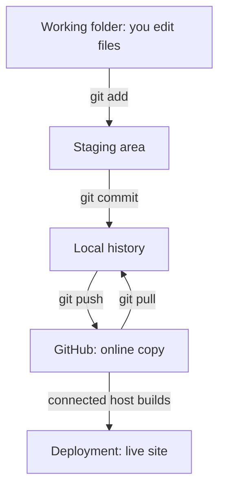

The [terminal](/building/terminal-basics/) lets you change files with a single line, and it never keeps a copy of what was there before. Git adds that missing history, and GitHub keeps a copy of it online.

**In one line:** Git keeps a history of every change to a folder of files so you can go back, and GitHub is a website that stores a copy of that history online and can trigger a website to publish.

## The jargon: concepts covered on this page

- **Version control:** recording every change to files so earlier versions can be restored
- **Git:** the tool on your computer that records and manages that history
- **GitHub:** a website that hosts copies of Git repositories
- **Repository:** a project folder together with its full change history
- **Commit:** a saved snapshot of the project, with a message
- **Staging area:** where chosen changes wait before being committed
- **Branch:** a separate line of work within a repository
- **main:** the usual name of the primary branch
- **Remote:** a copy of the repository stored somewhere else
- **origin:** the default name Git gives the main remote
- **Push:** sending local commits to the remote
- **Pull:** fetching remote commits and merging them into your work
- **Clone:** making a first local copy of a remote repository
- **Diff:** a line-by-line view of what changed
- **Revert:** making a new commit that reverses an earlier one
- **Merge conflict:** two changes to the same lines that Git cannot combine alone

## Why it matters

When you build with AI tools, files change fast. An assistant may edit twenty files in a minute, and not every edit is a good one. Without a history, "undo" means hoping you remember what the folder looked like yesterday.

**Version control** is the habit and the tooling that records every change, who made it and why. It gives you a safety net, a backup and a clear picture of what the AI changed. If a website is connected to it, it can do something extra: pushing a change to GitHub can make the live site update.

<mark>Once something is pushed to a public repository, treat it as published to the world forever, so never commit a key, password or private detail.</mark>

## How it works

**Git** is the tool on your computer. It does the recording. **GitHub** is a website that stores a copy of your Git history and shares it. They are different things: Git works fine with no internet and no GitHub.

Git's own documentation describes the core idea: every time you commit, Git takes a snapshot of what all your files look like at that moment. Files can be in three states: modified (changed but not saved to history), staged (marked to go into the next snapshot) and committed (safely stored in your local history).

The words you will meet:

- **Repository (repo):** a project folder plus its full history, kept in a hidden folder called `.git`.
- **Commit:** one saved snapshot, with a short message saying why.
- **Staging area:** the waiting room where you choose which changes go into the next commit.
- **Branch:** a separate line of work. The main line is usually called `main`.
- **Remote:** a copy of the repo somewhere else, usually on GitHub. By default it is called `origin`.
- **Push:** send your new commits up to the remote. **Pull:** bring new commits down. **Clone:** make a first copy of a remote repo on your computer.
- **Diff:** a view of exactly which lines changed.
- **`.gitignore`:** a file listing things Git must never track, such as `.env` files that hold keys (see [environment variables and secrets](/building/environment-variables-and-secrets/)).



Everything before GitHub in that diagram happens on your computer. Nothing leaves it until you push.

### A simple everyday routine

- **Small, safe changes:** work directly on `main`. Commit when a piece of work is done and the site still builds.
- **Risky or big changes:** make a branch, work there, and merge it into `main` only when it works. If it goes badly, you throw the branch away and `main` is untouched.
- **Commit often, with plain messages** such as "Add page: setup overview" or "Fix broken link". Future you will search these.
- **Push at the end of a session.** It is your backup, and on a connected host it is also the publish button.

Pushing to a connected host can publish a site automatically. Many sites are set up so that a push to `main` goes live, for example on [Vercel](/building/vercel/) (a hosting service, covered later in this part). That makes the push the moment of no return, so check first.

## Setting it up

As of October 2026. Do these in a terminal (see [Terminal basics](/building/terminal-basics/)).

1. **Create a GitHub account** at github.com, if you do not have one.
2. **Install Git.** The official Git site lists these routes on a Mac: Homebrew with `brew install git`, or Apple's Xcode Command Line Tools with `xcode-select --install`. Either is fine.
   **On Windows:** install Git for Windows from the official Git site, or run `winget install --id Git.Git -e --source winget`. It includes Git Bash, a terminal where the commands on this page work as written; they usually also work in PowerShell once Git is installed.
3. **Tell Git who you are.** The name and email go onto every commit. Use your own details:

```bash
git config --global user.name "Your Name"
git config --global user.email "you@example.com"
```

4. **Make `main` the default branch name** for new repos:

```bash
git config --global init.defaultBranch main
```

5. **Sign in to GitHub.** GitHub's setup guide offers the GitHub CLI or GitHub Desktop (a free app with buttons instead of commands). For the CLI, install it with `brew install gh` (on Windows, use the installer or winget command listed on GitHub's CLI site), then run:

```bash
gh auth login
```

   It asks a few questions and, by default, signs you in through your web browser. The CLI documentation says it stores the resulting token in your system's credential store. You never need to paste a password or token into the terminal for this route.

6. **Create the repo.** In a project folder that is already a Git repo (Claude Code or GitHub Desktop can set that up for you), this command creates a **private** repo on GitHub and pushes your commits to it:

```bash
gh repo create your-project-name --private --source=. --push
```

   The `--private` flag makes it private, `--source=.` says "use this folder", and `--push` uploads what you have. In GitHub Desktop, the equivalent is File, then New Repository, then Publish.
7. **Check it worked.** Open github.com, find your repo, and confirm your files are there. Run `git remote -v` in the folder to see the remote address Git is using.

**Public or private?** A public repo can be read by anyone; a private one only by people you invite. If you choose public, nothing secret may ever be committed to it. GitHub warns that switching a private repo to public makes the code (and its history) visible to everyone, and that existing forks do not change visibility when you do.

## Good habits

- **Look before you commit.** Run these every time:

```bash
git status
git diff
```

  `git status` lists changed files, new files Git is not tracking yet, and what is staged. `git diff` shows the exact changed lines. Look for anything that should not be public: a key, an email address, a client name.
- **Stage and commit deliberately:**

```bash
git add file-name
git commit -m "Short plain message"
```

- **Never commit secrets.** Put them in an `.env` file, list that file in `.gitignore`, and commit a sample file with placeholders. Git's documentation notes that `.gitignore` only affects files Git is not already tracking. If a file is already tracked, `git rm --cached file-name` stops tracking it, and then `.gitignore` can keep it out.
- **Keep GitHub's safety net on, but do not rely on it.** GitHub says push protection (which blocks pushes containing recognised secrets) is on by default for individual users pushing to public repos. It only catches patterns it recognises.
- **See what happened.** `git log --oneline` shows your history, one line per commit.
- **Pull before you start** if you also work from another computer, so you do not build on old files.

### What to do if you committed a secret

GitHub's guidance is clear on the order.

1. **Revoke or rotate the secret first.** Switch the key off at the service that issued it and make a new one. GitHub says that once it is revoked, it can no longer be used for access, and that may be enough.
2. **Only then think about clean-up.** Rewriting history is risky. GitHub warns that the secret can come back if someone with an older copy pushes again, that copies in forks stay reachable, and that cached views of the old commit can persist.

Removing it from history does not make it safe again. Assume anyone could have copied it.

### Undoing things safely

Git's documentation describes these tools. Start with the gentlest.

- **Throw away unsaved changes to one file:** `git restore file-name`. Careful: this discards your edits to that file, and they cannot be brought back, because Git never saved them.
- **Unstage a file** (keep your edits, just take it out of the next commit): `git restore --staged file-name`.
- **Undo a commit you have already made:** find its short ID with `git log --oneline`, then run `git revert COMMIT_ID`. Git's documentation says this records a new commit that reverses the effect of the old one. History is kept, so it is safe even after you have pushed.
- **Avoid `git reset --hard` unless you are sure.** The documentation describes it as overwriting files so the folder matches a chosen commit, which throws away uncommitted work. Its examples warn not to use it on commits you have already shared with others.

If an AI tool suggests a command you do not recognise, especially one with `--hard`, `--force` or `-f`, ask it to explain before you run it.

### How AI coding tools fit

Tools such as Claude Code (see [Claude Code in depth](/building/claude-code-in-depth/)) can run Git commands for you: stage files, write commit messages, push. That saves time, and it does not move the responsibility. You are still the person who decided what went to a public repo.

A sensible rule: let the tool commit, but you read the status and diff, and you approve the push.

## When things go wrong

- **"Author identity unknown" or a commit refuses to run.** Git does not know your name and email yet. Repeat step 3.
- **A push is rejected.** The remote has commits you do not have. Run `git pull`, check the result, then push again.
- **A file you meant to ignore keeps appearing.** It was committed earlier. Use `git rm --cached file-name`, then add it to `.gitignore`.
- **Push protection blocks your push.** GitHub found something that looks like a secret. Remove it from the commit, revoke it if it was real, and try again. Do not bypass the warning unless you are certain it is a false alarm.
- **You committed to the wrong branch.** Do not panic and do not use `reset --hard`. Ask Claude for a safe plan, and share the output of `git status` and `git log --oneline`.
- **Merge conflict.** Two versions changed the same lines. Git marks both versions in the file. When you work alone this is rare. If it happens, ask Claude to walk you through it.

## Costs and limits

Git is free, and GitHub offers a free tier alongside paid plans. Which features each plan includes changes over time, so check GitHub's current plans page before you rely on one (for example, for private repos or extra security features).

The limits are human. Git keeps text history well but handles large binary files (videos, big data exports) badly. Do not store customer data, exports from your CRM or documents from a client in a repo.

Remember too that a private repo is not a vault. People get invited, repos get forked and made public later, and tokens leak.

## Related

- [Terminal basics](/building/terminal-basics/): the window these commands run in
- [Vercel](/building/vercel/): how a push to GitHub becomes a live site
- [Claude Code in depth](/building/claude-code-in-depth/): letting an AI tool run Git for you, with you checking
- [Environment variables and secrets](/building/environment-variables-and-secrets/): where keys live instead of your repo
- [Audit trails](/running/audit-trails/): the same idea of a protected record, applied to agent actions

## Next up

With a history to fall back on, you can safely let an AI tool make bigger changes to your files. [Claude Code in depth](/building/claude-code-in-depth/) shows how to set it up, steer it and keep it on track.
