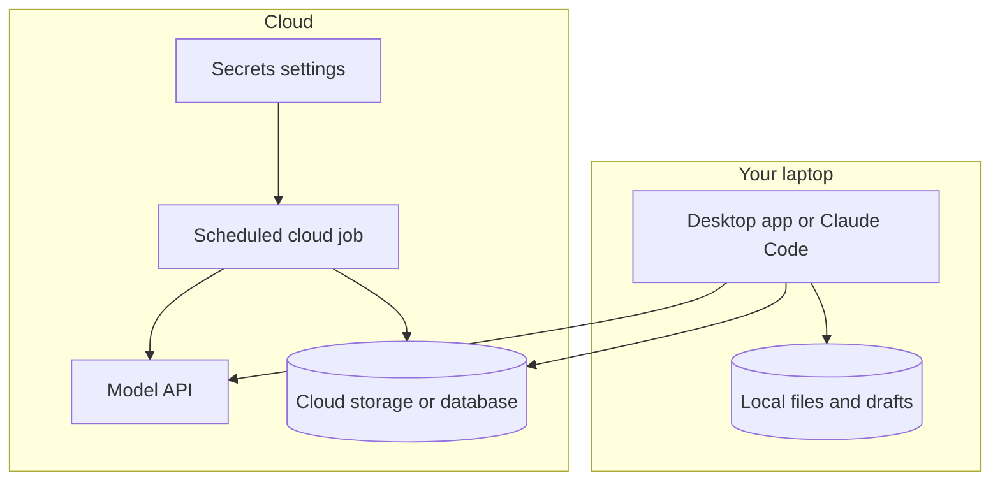

With Claude Code, [AI code editors and app builders](/building/cursor-and-app-builders/) you can now build things that work. The next question is where they will actually run: on your own computer, or on someone else's servers that stay on when you switch off.

**In one line:** local means a piece of your AI setup runs on your own computer, cloud means it runs on a company's servers over the internet, and most real setups mix the two.

## The jargon: concepts covered on this page

- **Always-on:** running even when your own computer is closed or off
- **Cloud:** computers run by a company that you use over the internet
- **Hosting:** keeping an app, file or job on someone else's servers so it is reachable
- **Hybrid setup:** some pieces run locally and others in the cloud
- **Local:** running on your own computer, using its memory and power
- **Local model:** an AI model downloaded and run on your own machine
- **Local runtime:** an app that loads and runs a model on your own computer

## Why it matters

Something that works on your laptop can stop the moment you close the lid. A scheduled job will not fire if the computer is asleep, and an agent cannot answer a message if the machine it lives on is off. Many people only find this out when they go on holiday.

Where a piece runs also decides where your data goes, who pays for the machine, how fast it feels and who has to fix it when it breaks. These trade-offs are easy to get right when you plan for them, and annoying to untangle later.

<mark>An app installed on your computer is not the same as a private or always-on setup: what matters is where each piece runs, where it sends your data, and what stops when you close the lid.</mark>

## How it works

An AI setup is made of several pieces, and each one can live in a different place. In car terms, local is keeping the car in your own garage: you control it, but it only goes when you do. The cloud is a car kept and serviced by a company, ready wherever you are, on their terms.

Going piece by piece:

**The model.** This is the engine. Usually it runs in the cloud: your app sends text to the model maker's servers through an API (a way for software to talk to other software) and gets an answer back. You can also run a model locally with a **local runtime**, an app that loads a model file onto your computer and runs it there. That only works for models whose files are published, known as open-weight models (see [open vs closed weights](/under-the-hood/open-vs-closed-weights/), covered in Part 7). The largest closed models, including Claude, only run in the cloud.

**The app or agent you use.** A web app runs in your browser and the cloud. A desktop app is installed on your computer but usually calls a cloud model. Claude Code in a terminal runs on your machine, reads your local files and sends what it needs to a cloud model. An agent running in the cloud lives entirely on a company's servers and carries on when your laptop is closed.

**Your files and data.** Files in a folder on your laptop are local. Files in cloud storage, a hosted database or a GitHub repository are in the cloud. An agent can only work on files it can reach from wherever it runs.

**Memory and context.** Chat history, Projects and saved memories in the Claude apps sit in your cloud account (see [projects and memory in practice](/using-ai/projects-and-memory/)). An instruction file such as `CLAUDE.md` or an agent's notes folder is local unless you push it somewhere. See [memory](/agents/memory/) for how agents keep notes at all.

**Scheduled jobs.** A job that runs "every morning at 8" needs a machine that is awake at 8. Local schedules depend on your computer; cloud schedules do not (see [triggers and scheduling](/building/triggers-and-scheduling/), covered later in this part).

**Secrets.** Keys and passwords live in a local file on your computer, or in a secrets setting on a cloud platform. Wherever the job runs, the secret has to be there too (see [environment variables and secrets](/building/environment-variables-and-secrets/), covered later in this part).

| Piece | Local version | Cloud version | If your laptop is closed |
| --- | --- | --- | --- |
| Model | Open-weight model in a local runtime | Model maker's API | Local model stops; cloud model is unaffected |
| App or agent | Desktop app, Claude Code in your terminal | Web app, cloud agent session | Local agent stops; cloud agent keeps going |
| Files and data | Folders on your disk | Cloud storage, hosted database, GitHub | Local files unreachable to cloud jobs |
| Memory and context | Notes and instruction files in a folder | Chat history, Projects, a database | Local notes unreachable until you are back |
| Scheduled jobs | Timer on your computer | Scheduler on a platform | Local runs are skipped |
| Secrets | A `.env` file on your machine | Platform secret settings | Cloud jobs cannot read your local file |

Many tools are hybrid. The Claude desktop app runs on your computer while the model runs in Anthropic's cloud. Claude Code runs on your machine and calls a cloud model. A typical setup ends up looking like this:

## In practice

**Local runtimes.** Ollama and LM Studio are examples of apps that download and run open-weight models on your own computer, on macOS, Windows and Linux, as of October 2026. Ollama's documentation says that when you run a model locally it does not see your prompts or data, and LM Studio says it can run fully offline once model files are downloaded. Ollama also offers cloud models, so check which kind a given chat is using. How large a model you can run depends on your computer's memory, which is why local models are often shrunk first (see [quantisation](/under-the-hood/quantisation/), covered in Part 7).

**Cloud hosting.** For your own code and data, hosting platforms keep things running for you. [Vercel](/building/vercel/) (a hosting platform for websites and small functions) and [Supabase](/building/supabase/) (a hosted database with sign-in and file storage) are examples, both covered later in this part. Wider overviews are in [app hosting](/map/app-hosting/) and [compute and cloud](/map/compute-and-cloud/).

**Claude's own tools, as of October 2026.** Anthropic's documentation describes several places Claude Code can run:

- **Local sessions** in your terminal or the desktop app run on your machine and stop when it does.
- **Cloud sessions** run in an isolated virtual machine Anthropic manages, and keep running after you close your laptop. They work from a copy of a GitHub repository, not from your local folder.
- **Desktop scheduled tasks** run on your machine with access to local files, but only while the app is open and the computer is awake. If the computer sleeps through a scheduled time, that run is skipped.
- **Routines** are scheduled or triggered jobs that run as cloud sessions, so they keep working when your laptop is closed. They start from a fresh copy of the repository each time, with no access to your local files.

Anthropic's help page for Cowork, the agent mode in the desktop app, says its scheduled tasks run remotely, even when the computer is asleep or the app is closed. These details change often, so check the current help page before relying on one.

**Comparing the two on the things that matter:**

| Question | Local | Cloud |
| --- | --- | --- |
| Laptop closed or on holiday | Stops | Keeps running |
| Privacy | Data stays on your machine, unless the app sends it to a cloud model | Data goes to the provider, under their terms |
| Cost | Your own hardware and electricity | Usage fees or a plan |
| Speed | Depends on your computer; big models may be slow | Fast hardware, plus a short network delay |
| Who maintains it | You: updates, backups, disk space | The provider looks after the machines; you look after your setup |

## Worked example

Jo is a freelance researcher who also takes a part-time course. She built a small research agent with Claude Code on her laptop. Every weekday at 7am a desktop scheduled task searched for new papers on her topic, wrote short summaries into a notes folder and flagged anything worth reading in full.

It worked well for a month. Then Jo went away for ten days and left her laptop closed at home. Nothing ran. When she opened it again, she got a single catch-up run covering only the most recent missed morning, so most of the ten days were simply missing from her notes.

Jo listed where each piece lived and moved only what needed to be always-on:

1. **The schedule** moved from a desktop task to a cloud scheduled job, so it no longer depended on her laptop.
2. **The notes folder** moved into a private GitHub repository, because the cloud job can only see what it can reach. Her laptop pulls the latest notes when she is back.
3. **The search key** for a paid paper database moved from a `.env` file on her laptop into the cloud job's secret settings.
4. **The model** did not move: it was already in the cloud.
5. **Her course drafts and interview transcripts** stayed local. The agent did not need them, and keeping private material off cloud services was simpler than checking every provider's terms.

The next time she travelled, the summaries were waiting when she got home. The setup was now hybrid on purpose: the routine work in the cloud, the private work on her own machine.

## Costs and limits

- **Local is not free.** You pay in hardware, electricity, battery and your own time on updates. A model big enough to be useful may need more memory than an everyday laptop has.
- **Cloud is not automatically private.** Your data travels to and is processed on the provider's servers. Check their data terms (see [data terms at a glance](/models/data-terms-at-a-glance/) and [GDPR, data retention and DPAs](/running/gdpr-data-retention-and-dpas/), covered in Part 6).
- **Local is not automatically private either.** A desktop app or terminal agent still sends what it reads to a cloud model. Only a local model keeps the text on your machine.
- **Cloud jobs cannot see your laptop.** Anything a cloud job needs (files, notes or keys) has to live somewhere it can reach.
- **Moving pieces adds places for secrets to leak.** Every new cloud home needs its own keys. Give each one the least access that works.
- **Hybrid setups get confusing.** Write down where each piece lives. A short list saves a lot of guessing when something stops.

## Often confused with

**A desktop app vs a local model.** A desktop app is installed on your computer, but it usually sends your messages to a model in the cloud. A local model runs on your computer itself, which is a separate and less common setup.

## Related

- [Open vs closed weights](/under-the-hood/open-vs-closed-weights/): which models can run locally at all
- [Serverless functions](/building/serverless-functions/): the simplest way to run your own code in the cloud
- [Triggers and scheduling](/building/triggers-and-scheduling/): what starts a job, and why it needs a machine that is awake
- [Environment variables and secrets](/building/environment-variables-and-secrets/): where keys live once a job moves to the cloud
- [Open-model hosting](/map/open-model-hosting/): renting a cloud machine to run an open model for you

## Next up

Once you know which pieces need to run without your laptop, the simplest way to put a small piece of your own code in the cloud is a [serverless function](/building/serverless-functions/).
