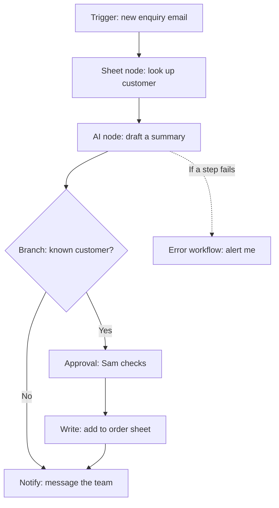

[Orchestration tools](/building/orchestration-tools/) range from visual platforms to plain code. n8n is one of the visual ones, and a close look at it shows how the whole category works in practice.

**In one line:** n8n is a workflow automation tool where you drag steps onto a canvas to connect your apps, with built-in steps for AI models and agents.

## The jargon: concepts covered on this page

- **Trigger node:** the step that starts a workflow when something happens
- **Credentials:** stored sign-in details that let a node use an app
- **Execution:** one run of a workflow, manual or automatic
- **Error workflow:** a separate workflow that starts when another one fails
- **AI Agent node:** an n8n step that lets a model choose and call tools
- **Data redaction:** hiding the input and output of runs while keeping their metadata
- **Sustainable Use License:** n8n's licence allowing internal business use but not resale or hosting for others

## Why it matters

Many useful jobs at a small business are the same few steps repeated. An enquiry arrives, someone looks up the customer, drafts a reply, and tells the rest of the team. Doing that by hand wastes time, and wiring it up in code is more than most people want to take on.

An orchestration tool lets you draw those steps instead. n8n is one example, alongside Zapier, Make and Power Automate. What sets it apart is that you can host it yourself, and that it has AI steps built into the same canvas.

It also sits in a useful middle position between a chat assistant and a fully autonomous agent. Most of the flow is a fixed list of steps you can inspect, with an AI step only where judgement is needed. That is easier to trust than an agent free to roam.

<mark>Use the AI step only for the part that needs judgement, keep the rest as plain steps you can read, and put a person between the AI and anything that writes or sends.</mark>

This page describes n8n as of October 2026. Its menus and plans change, so check the official documentation at docs.n8n.io when you set up.

## How it works

n8n's own documentation defines its core ideas like this.

- **Workflow.** A collection of nodes that automates a process.
- **Node.** One component of a workflow. A node can fetch data, change it, make a decision or call another service.
- **Trigger node.** The node that starts a workflow when something happens, such as a schedule, a form, or an incoming web request. Every production workflow needs at least one.
- **Credentials.** Stored sign-in details (passwords, API keys, OAuth secrets) that let a node talk to an app. You create them once and nodes reuse them.
- **Execution.** A single run of a workflow. Test runs started by clicking a button are manual executions. Runs started by a trigger are production executions.
- **Webhook.** A web address that starts a workflow when another system sends it a message. n8n's Webhook node gives you a test address and a production address, and the production one only registers when the workflow is published.
- **Error workflow.** A separate workflow that starts when another one fails. It begins with an Error Trigger node, which receives details of the failure, and you choose it in the failing workflow's settings.

A first workflow for Bramley's, the fictional two-person bakery, could handle wholesale enquiries from local cafes. Drawn as steps, it looks like this.

**AI Agent node.** n8n's documentation describes this node as an autonomous system that receives data, makes decisions and acts. It needs a chat model and at least one connected tool. Inside it runs the [agent loop](/agents/the-agent-loop/): think, call a tool, look at the result, repeat.

**MCP in n8n.** n8n has nodes for both sides of [MCP](/agents/mcp/). The MCP Client Tool node lets an AI agent in your workflow use tools from an outside MCP server, fetching the tool list from that server. Its authentication options include bearer tokens, header values and OAuth2. The MCP Server Trigger node does the reverse: it makes n8n tools and workflows available to outside assistants, with none, bearer or header authentication. Never leave an exposed server on "none".

**Where things run.** You can use n8n Cloud, where n8n runs the servers and handles version updates. Or you can self-host, where you run it yourself on your own machine or a cloud provider. See [app hosting](/map/app-hosting/) for what that involves.

## Setting it up

Start with the Cloud trial unless you have a reason not to. It lets you learn n8n without running servers. The official routes below come from n8n's documentation.

**Option 1: n8n Cloud.** Sign up for the free trial on the n8n website. n8n manages the infrastructure, including version updates. Plans and limits change, so read the current plan page rather than relying on this one.

**Option 2: self-host.** n8n documents a one-line setup, Docker Compose, and guides for several cloud providers. Its documentation says plainly that self-hosting needs technical expertise and that you provide and manage the infrastructure. Without a licence key a self-hosted copy runs as the free Community edition.

**On Windows:** n8n's Docker guide points Windows users to Docker Desktop, which includes Docker Engine and Docker Compose. Its example commands are written for Mac and Linux terminals and split long commands with a backslash at the end of each line; in PowerShell, put the command on one line or use a backtick instead. n8n also documents an npm route (`npx n8n` to try it, `npm install n8n -g` to install), which needs a Node.js version between 20.19 and 24.x. Its npm page says npm installs are deprecated from n8n 3.0, so prefer Docker for anything you plan to keep.

Then build a first workflow. n8n's own tutorial walks through one, and the steps are the same for a CRM flow.

1. Create a new workflow ("Start from Scratch" or "Create Workflow", depending on the screen).
2. Click "Add first step" and choose a trigger node, such as a Schedule Trigger or a Webhook, for something harmless.
3. Add a node for the next step and set up its credentials, using the narrowest access the service allows.
4. Add an If node if you need the flow to split into two paths.
5. Click "Execute Workflow" to run it by hand, then look at the data each node produced.
6. Use sample or fake data throughout: an invented cafe, not a real customer.
7. Publish the workflow so its trigger runs on its own. Older guides call this "activate", and n8n's current tutorial says "Publish".

When it works, each node shows the data it produced during a test run, and later automatic runs appear in the Executions tab.

**Before real use.** A tool that runs unattended needs looking after. Plan for backups of the data and the encryption key, a routine for updating, and monitoring that tells you when things stop. On Cloud, n8n handles updates. Self-hosting hands all of this to you.

## Good habits

- **Keep credentials narrow.** Create one set per purpose, with read-only access where you can. See [least privilege](/running/least-privilege/). n8n's HTTP Request node has an "Allowed HTTP Request Domains" field that stops a credential being sent to the wrong address. Use it.
- **Treat webhook addresses like passwords.** Anyone with the address can start the workflow. Add authentication (basic, header or JWT) and consider an IP allowlist, both offered by the Webhook node.
- **Add an approval step before writes.** n8n can pause an AI agent and ask a person to approve or deny a tool call, through channels including n8n Chat, Slack, Microsoft Teams, Gmail and Outlook. See [human in the loop](/agents/human-in-the-loop/).
- **Tell the agent about the approvals.** n8n's guidance is to mention the review steps in the agent's system prompt so it handles a denial sensibly.
- **Mind the data flowing through the AI step.** Anything the agent reads, such as an email body, can carry hidden instructions. See [data exfiltration through tools](/running/data-exfiltration-through-tools/), the Part 6 page on how a misled agent can leak data.
- **Know who can edit.** On a self-hosted Community edition, n8n's documentation lists workflow and credential sharing, projects and Git-based version control as features that need a registered or paid licence. Check current availability before planning shared work.
- **Set up an error workflow early.** A failed run should reach you, not sit unnoticed.

## When things go wrong

- **The trigger never fires.** The workflow is probably not published. A test address only works while you are listening in the editor, and the production address only works once published.
- **A workflow fails quietly overnight.** Without an error workflow nothing tells you. Create one that starts with an Error Trigger node and sends you a message. It cannot be tested with a manual run, because it only starts when an automatic run fails.
- **A call is refused as too many requests.** The service you call has limits. Slow the workflow down or add retries. See [rate limits, retries and failures](/running/rate-limits-retries-and-failures/).
- **Execution history holds sensitive text.** Each execution can record the data that passed through. n8n offers data redaction, which hides input and output data and keeps status, timing and node names. Check what your instance keeps and for how long.
- **The AI node does something odd.** Tighten the instructions, narrow its tools, and test with the approval step on. Never fix it by granting wider access.
- **The self-hosted copy stops after an update.** Take a backup before every update and read the release notes first.

## Costs and limits

- **Cloud usage is metered.** n8n's documentation says plans differ in what they include, and that scheduled triggers count each firing, while webhooks count each request that reaches a workflow. Read the current plan page. This page gives no prices.
- **Self-hosting looks free and is not.** The software can cost nothing, but your time, the server, the backups and the monitoring do not.
- **AI steps add model costs.** Each model call costs, and an agent can make several calls per run. See [estimating cost per task](/running/estimating-cost-per-task/).
- **Licence.** n8n is "fair-code" under its Sustainable Use License. In plain words, the licence text allows use for your own internal business purposes or non-commercial use, and does not allow selling n8n or hosting it as a service for others. Using it to run your own organisation's automations fits. For anything else, read the licence itself, which is published in n8n's GitHub repository. This is not legal advice.
- **Personal data.** If workflows carry customer, client or contact details, execution history is personal data you hold. See [GDPR, data retention and DPAs](/running/gdpr-data-retention-and-dpas/).

## Related

- [Orchestration tools](/building/orchestration-tools/): where n8n sits among automation platforms
- [Triggers and scheduling](/building/triggers-and-scheduling/): what starts a workflow and when
- [Rate limits, retries and failures](/running/rate-limits-retries-and-failures/): why runs fail and how to recover
- [Human in the loop](/agents/human-in-the-loop/): where a person should approve before the workflow acts
- [Connecting business tools through MCP](/building/connecting-business-tools-through-mcp/): how to reach the CRM and files safely

## Next up

Every workflow here depends on reaching your business systems, and that access is where most of the risk sits. [Connecting business tools through MCP](/building/connecting-business-tools-through-mcp/) covers plugging in a CRM, files and email carefully.
