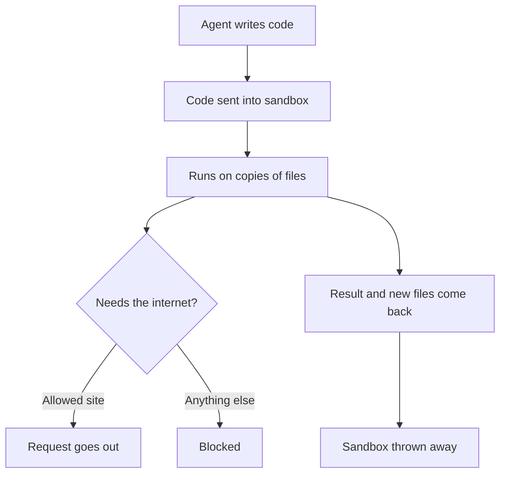

[Serverless functions](/building/serverless-functions/) run code you wrote and checked, on demand, somewhere else. Agents now often write code themselves and run it straight away, to crunch a spreadsheet, draw a chart or test a fix, and that code needs a safer home: a sandbox.

**In one line:** a sandbox is a sealed-off space where code runs without being able to touch your real files, accounts or network, except for whatever you deliberately let through.

## The jargon: concepts covered on this page

- **Allowlist:** a list of the only places or things that are permitted
- **Code execution:** an AI writing a small program and running it to get an answer
- **Container:** a packaged, walled-off space that shares the host computer's core
- **Ephemeral:** created for one job and thrown away afterwards
- **Isolation:** keeping a program's actions from reaching anything outside its space
- **Micro virtual machine (microVM):** a small, fast-starting computer simulated inside a real one
- **Network egress:** traffic going out from a machine to the internet
- **Sandbox:** a sealed-off space for running code safely

## Why it matters

Language models are bad at exact arithmetic and good at writing code. So the reliable way for an agent to total a column of 4,000 rows is to write a few lines of code, run them and read the result. This is **code execution**, and it turns guesses into real calculations.

The catch is that the model wrote the code, and nobody read it first. It might have a bug that deletes the wrong folder. Worse, the agent may have read a web page or a document with hidden instructions in it (prompt injection, covered in Part 6), and been talked into writing code that copies your files somewhere. On your own laptop, that code would run with all your access: your documents, your saved logins, your network.

A sandbox removes most of that danger. The code still runs, but inside a space where your real things are simply not there to reach.

<mark>Treat any code an AI writes as code from a stranger: useful, probably fine, and never run with your own keys and files within reach.</mark>

## How it works

In car terms, a sandbox is a test track. The engine can rev as hard as it likes, but there is nothing to crash into except the barriers you put up.

**Isolation** means the code's actions stop at the walls of its space. It sees its own small set of files, its own copy of the tools it needs and, usually, no route to the internet unless one is opened. When the job ends, the space is thrown away, so it is **ephemeral**: nothing the code did lingers.

There are three common ways to build those walls, and you do not need the details to use them:

- **Containers.** A packaged space with its own files and programs, sharing the core of the host computer (its kernel). Quick and light. The walls are good but thinner than a full machine's.
- **Micro virtual machines (microVMs).** A small simulated computer with its own core, started in a fraction of a second. Stronger walls, which is why many services for agent code use them.
- **Browser-based sandboxes.** Code that runs inside the browser's own walled-off area for a web page, cut off from the rest of your computer. Common for small previews and chart drawing.

A fourth option sits on your own machine: the operating system itself fences a program in, limiting which folders it can write to and which websites it can reach.

What comes back out is only what the sandbox hands over: printed results, a chart, a new spreadsheet. Your originals never went in, only copies.

## In practice

**Built into the chat apps, as of October 2026.**

- **Claude.** The **Code execution and file creation** setting gives Claude what Anthropic's help pages call an isolated, sandboxed container to run code and make files such as spreadsheets, slide decks, documents, PDFs and charts. It is available on all plans. On Free, Pro and Max you turn it on under **Settings > Capabilities**; on Team and Enterprise an Owner controls it for the organisation. On individual plans the help page describes an **Allow network egress** switch in the same place for reaching outside sources; on Team and Enterprise the Owner picks from off, package managers only (sources of code libraries), chosen extra sites, or all sites. It also gives a 30 MB limit per file for uploads and downloads. [Skills in Claude](/agents/skills-in-claude/) run in this same sandbox.
- **ChatGPT.** For data analysis, OpenAI's help page says ChatGPT writes and runs Python code in a notebook-style environment that cannot make web requests or API calls, and works on the files you add to the conversation.

**Developer services, as of October 2026.** When you build your own agent, a sandbox service gives it somewhere safe to run code, controlled through an API. Examples of the category:

- **E2B** describes itself as on-demand machines for AI agents, each session in its own Firecracker microVM.
- **Modal Sandboxes** are described as secure containers for running untrusted user or agent code, with a default lifetime of 5 minutes that can be raised to 24 hours.
- **Daytona** calls itself secure, elastic infrastructure for running AI-generated code, with each sandbox having its own kernel, file system and network.
- **Cloudflare Sandbox SDK** runs code in containers where each instance is a microVM with its own kernel and network, and Cloudflare's docs mention coding agents as a use.

**Claude Code's own sandbox.** [Claude Code](/building/claude-code-in-depth/) runs on your own computer, so its sandbox is the operating-system kind. You turn it on with `/sandbox` (it is off by default). Shell commands can then write only to the project folder and a temporary folder, and can reach only websites you have allowed. Anthropic's docs say it covers shell commands only, not Claude Code's file tools or MCP servers, and that it uses macOS's built-in Seatbelt framework and, on Linux, the tools bubblewrap and socat. For a wall around everything, the docs suggest running Claude Code itself in a container or virtual machine.

**On Windows:** Anthropic's docs say the Claude Code sandbox works under WSL 2 (a Linux system running inside Windows) but not on native Windows, where commands run unsandboxed.

### What to let through

A sandbox is only as strong as its gaps. Decide each one on purpose:

- **Network.** Start with none. If the code must install libraries or fetch from one site, allow just those (an **allowlist**). Open **network egress** is how stolen data leaves (see [data exfiltration through tools](/running/data-exfiltration-through-tools/), covered in Part 6).
- **Files.** Put in copies of only the files the job needs. Never connect your whole drive "for convenience".
- **Time and size.** Set a time limit and a memory or disk cap, so a runaway loop stops by itself.
- **Secrets.** Keep real keys and passwords out unless the job truly needs one. If it does, give a narrow, short-lived key with the least access possible, never your main login. Anything inside the sandbox can be read by the code inside it.

## Worked example

Jo, a freelance researcher, has a part-time course assignment: analyse 3,000 survey responses and include two charts. Typing the numbers into a chat would invite made-up totals, so Jo uses Claude with code execution turned on.

1. **Jo strips the file first.** Names and email addresses come out of the spreadsheet before it goes anywhere.
2. **Jo checks the network setting.** On a personal plan it sits next to the code execution switch under **Settings > Capabilities**. Nothing in this job needs outside data, so Jo leaves wider internet access off.
3. **Jo uploads the file and asks** for response counts by age group and a bar chart of satisfaction scores.
4. **Claude writes and runs code** in its sandbox on the uploaded copy. The answers come from actual calculation.
5. **A chart and a cleaned spreadsheet come back** as files to download. The sandbox's copy is discarded later.
6. **Jo spot-checks one figure** by filtering the original spreadsheet by hand. It matches.
7. **The tempting shortcut.** Jo wonders about pasting the survey tool's API key into the chat so Claude can pull fresh responses itself. That would put a real key inside a space where code Jo has not read can use it. Jo downloads the new export instead, and saves the "connect it properly" question for later.

Nothing in the sandbox could reach Jo's laptop, email or other files at any point.

## Costs and limits

- **Built-in sandboxes cost nothing extra to switch on,** but running code uses more of your usage allowance than a plain chat, because the model reads code output as well as writing.
- **Developer sandbox services bill by running time and machine size.** Short, thrown-away sandboxes are cheap; ones left running all day are not. Check each provider's current pricing.
- **Time limits are real.** Sandboxes stop after a set lifetime, and the defaults are often minutes, not hours.
- **Starting fresh means starting empty.** Each new sandbox may have to reinstall libraries and reload files, which adds delay.
- **Walls have gaps.** Containers share the host's core, and any opening you allow (network, a key, a mounted folder) is a way out. A sandbox reduces risk; it does not make bad code safe to trust.
- **The result can still be wrong.** A sandbox keeps code from doing harm. It does not check that the code answered the right question.

A common mistake is turning on "all sites" network access to fix one failed install, then never turning it back off.

## Often confused with

**Sandbox vs test environment.** A test environment (often called staging) is a full copy of a system for trying changes before they go live. A sandbox is about containment: keeping untrusted code from reaching anything real. Some products use "sandbox" for a test account, which adds to the muddle.

**Code execution vs tool use.** [Tool use](/agents/tool-use/) is the agent calling ready-made actions someone defined. Code execution is the agent writing brand-new code on the spot, which is why it needs walls.

## Related

- [Serverless functions](/building/serverless-functions/): code you wrote, run on demand somewhere else
- [Claude Code in depth](/building/claude-code-in-depth/): where the `/sandbox` setting and permission rules live
- [Skills in Claude](/agents/skills-in-claude/): skills run inside Claude's code sandbox
- [Least privilege](/running/least-privilege/): the same principle applied to keys and access
- [Prompt injection](/running/prompt-injection/): why model-written code cannot simply be trusted

## Next up

Sometimes code in a sandbox or a function really does need a key to reach a CRM or a model. [Environment variables and secrets](/building/environment-variables-and-secrets/) explains how to hand those keys over without ever writing them into the code.
