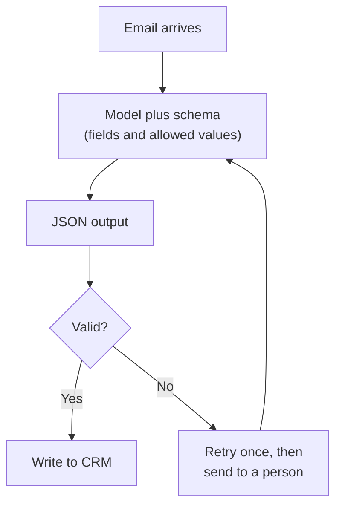

Once you build with the [API](/building/claude-code-and-the-api/), the model's answers go to your software rather than to a person reading a chat, and software cannot read friendly prose reliably. It needs the answer in a fixed shape, which is the same idea behind the tool calls described in [tool use](/agents/tool-use/).

**In one line:** structured outputs make a model return its answer in a fixed shape, such as JSON that follows a defined layout, instead of free-flowing text, so other software can read it without guessing.

## The jargon: concepts covered on this page

- **Structured output:** a model answer returned in a fixed, machine-readable shape
- **Schema:** a description of the fields, types and required parts of the output
- **JSON:** a text format for data, written as named fields and values
- **JSON mode:** a setting that makes output valid JSON without checking your fields
- **Constrained decoding:** forcing the model's output to follow a schema as it writes
- **Validation:** checking that output has the right fields and types
- **Enum:** a fixed list of allowed values for a field
- **Null:** the data value meaning "nothing here"
- **Extraction:** pulling clean fields out of messy text

## Why it matters

A model's natural output is prose. That is fine for a person, but awkward for software. If a program needs the company name, the stage and the amount raised from an email, it cannot reliably pick them out of a paragraph.

Structured outputs close that gap. You describe the shape you want, and the model fills it in. The result can go straight into a CRM, a database or the next step of a workflow.

They also make the model's work checkable. A field is either there or it is not, and a value is either one of the allowed options or it is not.

<mark>A structured output guarantees the shape of the answer, not the truth of it: a perfectly formed record can still contain wrong values.</mark>

## How it works

The shape you ask for is usually written as a **schema**: a plain description of the fields, what type each one is (text, number, true or false, a list), and which ones are required. The most common format is **JSON** (a text format for data, written as named fields and values), described by **JSON Schema**.

There are four ways to get structured answers. They run from weakest to strongest.

1. **Ask nicely in the prompt.** You write "reply only with JSON using these fields". It often works and sometimes does not: the model may add a friendly sentence before the JSON, rename a field or leave one out. Fine for experiments, risky for anything automatic.
2. **JSON mode.** Some providers offer a setting that forces the reply to be valid JSON. That stops broken punctuation, but it does not check that your fields are present or correctly named.
3. **Schema-constrained generation.** You give the provider your schema, and the output is forced to match it. The proper term is **constrained decoding**: while the model writes, the system blocks any next piece of text that would break the schema. Provider documentation describes this as guaranteeing valid JSON, the right field names and the right types.
4. **Output as a tool call.** You define a [tool](/agents/tool-use/) (an action the model can ask the surrounding software to carry out) whose inputs are the fields you want, and tell the model to "call" it. The tool call is already structured, so the inputs arrive in your shape. Some providers combine this with the constrained approach so the inputs are guaranteed to match.

Whichever you choose, check the result afterwards. Constrained generation has gaps: the provider's documentation notes that a refusal, or an answer cut off for being too long, may not match the schema. The check itself is called **validation**: software confirms that every required field exists and every value is the right type.



## In practice

Most major model providers offer some form of schema-constrained output, often called "structured outputs", and most also support the tool-call route. Developers usually write the schema with a helper library (Pydantic in Python and Zod in JavaScript are common examples) that also does the validation. The exact settings and the supported schema features differ by provider, and providers limit how complex a schema can be.

Structured outputs are the usual way to do **extraction**: pulling clean fields out of messy text, which is how [unstructured data](/data/structured-vs-unstructured-data/) such as emails, notes and PDFs becomes rows a database can hold (the difference is covered in Part 5).

Four habits make schemas work well:

- **Keep them small and clear.** A schema with six well-named fields beats one with sixty. Give each field a short plain description, because the model reads it.
- **Use fixed lists for categories.** An **enum** is a list of allowed values, such as `pre-seed`, `seed`, `series-a`, `unknown`. It stops the model inventing "Early Seed-ish".
- **Allow "not stated".** Make fields optional or allow `null` (the data word for "nothing here"). Otherwise a model forced to fill a field may guess.
- **Name things the way your CRM does.** The fewer translations later, the fewer mistakes.

## Worked example

Sample Ventures, the fictional fund, gets an introduction email: a partner at another fund introduces a founder of Acme Payments, a seed-stage payments startup. The operations lead wants it logged in the CRM without typing.

She defines a small schema. In plain terms: founder name, company, who made the introduction, what is being asked, and the funding stage from a fixed list.

```json
{
  "founder_name": "string",
  "company": "string",
  "introduced_by": "string or null",
  "ask": "string or null",
  "stage": "one of: pre-seed, seed, series-a, unknown"
}
```

The email is passed to the model together with the schema, and the model returns:

```json
{
  "founder_name": "Jane Example",
  "company": "Acme Payments",
  "introduced_by": "A. Partner",
  "ask": "30 minute call about their seed round",
  "stage": "seed"
}
```

Then the steps around it:

1. **Validate.** Software checks that all fields exist and that `stage` is one of the four allowed values.
2. **Check what it can.** The company name is looked up in the CRM. If a match exists, the note is attached to it rather than creating a duplicate (see [entity resolution](/data/entity-resolution/), the task of matching records that refer to the same thing, covered in Part 5).
3. **Write.** The fields go into the CRM as a new interaction.
4. **Handle failures.** If validation fails, the system retries once. If it fails again, the email goes to the operations lead's review pile.

Suppose the email never said who made the introduction. Because `introduced_by` allows `null`, the model can say so. If the field were required, it might pick a name from the signature block, and a wrong value would sit in the CRM looking perfectly tidy.

## Costs and limits

- **Shape is not truth.** The model can fill a perfect schema with wrong values. This is [hallucination](/start/hallucination-and-grounding/) in a tidy suit. Where a value matters, check it against a source, such as the CRM or the original text.
- **Forced answers invite guesses.** Required fields with no "unknown" option push the model to invent something. Allow `null` or an explicit "not stated".
- **Complex schemas cause trouble.** Deeply nested or very large schemas are more error-prone and may be rejected by the provider. Split a big extraction into two smaller ones.
- **Constrained output can still be incomplete.** A refusal, or a reply cut off at its length limit, may not match the schema. Always check for those cases.
- **The shape can cost a little.** The schema is sent with the request, so it adds to the input [tokens](/start/tokens-and-context-windows/). Constrained generation may also add a small delay the first time a new schema is used, according to some provider documentation.

The most common mistake is trusting the output because it parsed. Parsing proves the shape. Only checking proves the content.

## Often confused with

**Structured data vs structured outputs.** Structured data is data that already lives in an organised form, such as the rows and columns of a database. Structured outputs are a way of making a model produce data in that kind of form. One describes where data lives, the other describes how a model answers. You usually use structured outputs to turn unstructured data into structured data.

## Related

- [Tool use](/agents/tool-use/): defining the output as a tool call is one way to get structure
- [Structured vs unstructured data](/data/structured-vs-unstructured-data/): extraction turns the second into the first
- [Hallucination and grounding](/start/hallucination-and-grounding/): why a valid shape can still hold wrong values
- [Prompt engineering](/using-ai/prompt-engineering/): the weakest option, asking nicely, is a prompting technique

## Next up

Structured outputs help you build software around a model. If you would rather not write that software line by line, [Cursor and AI app builders](/building/cursor-and-app-builders/) covers the code editors and website builders that do much of it for you.
