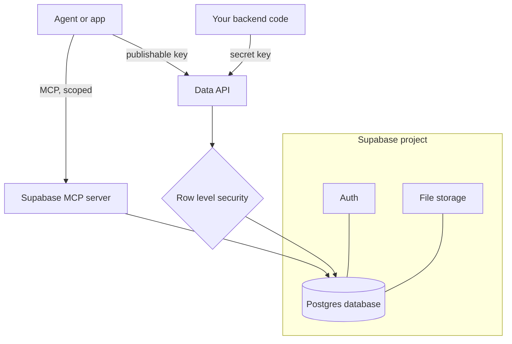

A hosting service such as [Vercel](/building/vercel/) can publish your pages and run short functions, but it has nowhere of its own to keep records. Supabase supplies that missing piece: a database you can use without running a server.

**In one line:** Supabase is a hosted database with a few useful extras attached, a convenient place to keep structured data that an agent can read and write, as long as it never becomes the only home of facts your main business system, such as a CRM, already owns.

*Snapshot, as of October 2026. Dashboard layouts, key names and free-plan rules change, so check Supabase's own documentation when something here does not match your screen.*

## Why it matters

Sooner or later an agent setup needs somewhere of its own to put things. A log of what the agent did. A table of sync times. A search index of meeting notes. You do not want to cram these into the CRM, and a spreadsheet gets messy fast.

Supabase gives you a real database without running a server. It is one example of "hosted Postgres" (see [databases and storage](/map/databases-and-storage/)). Its pitch is that every project is a full Postgres database, plus sign-in, file storage, ready-made APIs and more, all from one dashboard.

It is not a replacement for your CRM. The CRM stays the system of record for contacts and deals, and anything in Supabase that was copied from it is a copy. [Keeping data fresh](/data/keeping-data-fresh/), in Part 5, covers how those copies stay in step.

<mark>Use Supabase for data your agents create or need to search, and keep the CRM as the original for the facts it already owns.</mark>

## How it works

Supabase calls one database and its extras a **project**. Inside the project, data lives in **tables**, like spreadsheet tabs. Each line in a table is a **row**. You ask questions of a table in **SQL**, the standard language for databases, or you click around in the dashboard's Table Editor and SQL Editor.

According to Supabase's documentation, the main pieces are:

- **Database.** A full Postgres database, with REST and GraphQL APIs generated from your tables automatically.
- **Auth.** Sign-in by email, phone, social accounts and other methods.
- **Storage.** Files such as PDFs and images, served through its own API.
- **Edge functions.** Small pieces of TypeScript code that run on Supabase's servers. See [serverless functions](/building/serverless-functions/).
- **Vector support.** Store [embeddings](/data/embeddings/) (lists of numbers that capture what a piece of text means, so similar passages can be found; covered in Part 5) next to normal data and search by similarity. The database overview names the pgvector extension for this.
- **Realtime.** Live updates pushed to connected apps when data changes.



### Keys, and why one must stay secret

To talk to your project from code, you need the project URL and an **API key**, a password-like string that identifies the caller. See [APIs, OAuth and API keys](/agents/apis-oauth-and-api-keys/).

Supabase currently describes two kinds. The **publishable key** (starts with `sb_publishable_`) has low privileges and is designed to appear in browser and mobile code. The **secret key** (starts with `sb_secret_`) has elevated privileges and belongs only on servers you control. Older projects may show the legacy names `anon` and `service_role`, which map to publishable and secret. Supabase's documentation says it is deprecating the legacy keys by the end of 2026.

A leaked secret key exposes all of your project's data. Supabase says a secret key does not work from a browser, but treat that as a backstop and not a plan. Keep it in [environment variables or a secrets manager](/building/environment-variables-and-secrets/), never in a public repository, a chat message or a web page.

### Row level security

**Row level security (RLS)** is a Postgres feature where each table carries rules, called policies, about which rows each caller may see or change. Supabase describes it as automatically adding a filter to every query based on who is asking.

Per Supabase's documentation, once RLS is switched on for a table, nothing is reachable through the API with a publishable key until you write policies that allow it. That is a safe default. The secret key skips RLS entirely, which is why it is dangerous.

For agents this matters because an agent is just another caller. Giving it only what it needs is [least privilege](/running/least-privilege/), and RLS is one way to enforce it at the data layer. The wider topic is in [permissions and access control](/data/permissions-and-access-control/).

## Setting it up

1. Create an account at supabase.com and follow the dashboard's prompts to set up an organisation, which is the account-level home for your projects.
2. Create a new project, give it a clear name such as `your-project-name`, and set a strong database password that you store in a password manager.
3. Choose the region carefully. Supabase lists a London region and several EU regions, and says the region decides where your primary project data is stored. Pick London or an EU region for UK and EU personal data, and see [GDPR, data retention and DPAs](/running/gdpr-data-retention-and-dpas/). The documentation does not say you can move a project later, so treat the choice as permanent.
4. Open the SQL Editor and create a small test table, for example a table called `notes` with a text column. Supabase's quickstart uses the SQL Editor for this, with a prefilled template to start from.
5. Open the Table Editor, add a row by hand, and check it appears. That is your first proof that the database works.
6. Turn on row level security for the table, as Supabase's quickstart does. Then confirm that a publishable-key request now returns nothing until you add a policy.
7. Open the project's Connect dialog to find the project URL and the publishable key. Put them in a local `.env` file that is listed in `.gitignore`, never in committed code.
8. To let [Claude Code](/building/claude-code-in-depth/) work with the project, add Supabase's official MCP server. Supabase documents a hosted server at `https://mcp.supabase.com/mcp`. For a first try, scope it to one project and make it read-only:

```bash
claude mcp add --transport http supabase "https://mcp.supabase.com/mcp?project_ref=YOUR_PROJECT_REF&read_only=true"
```

Then run `/mcp` inside Claude Code to finish signing in. You should see the supabase server listed as connected. The `project_ref` and `read_only` options come from Supabase's MCP documentation. Check there for the exact current form of the address, and see [Claude Code in depth](/building/claude-code-in-depth/) and [MCP](/agents/mcp/) for how servers are added.

Supabase's documentation also adds that you should use a development project rather than production where you can. Its own example adds the server with `--scope project`, which stores it in a file you would commit to git. Leave that option off for a personal setup, so the file stays on your machine.

## Good habits

- **Start with a throwaway project.** Experiment where nothing matters, then build the real one.
- **Switch RLS on for every table** you create, even for internal tools.
- **Use the least powerful key that works.** Publishable key for anything that touches a browser, secret key only on a server.
- **Keep the MCP connection read-only and project-scoped** until you trust a specific task. Approve each tool call by hand in interactive sessions.
- **Treat stored text as untrusted.** Supabase's MCP guidance names [prompt injection](/running/prompt-injection/) as the main risk: instructions hidden in data an agent reads can steer it. Never expose the MCP server to other users.
- **Write down where each table's data came from.** Mark copies as copies, with a last-updated time.
- **Take your own export** now and then with the Supabase CLI (its command-line tool), as described below.

**On Windows:** Supabase's documentation installs the CLI with Scoop, a Windows package installer, using `scoop bucket add supabase https://github.com/supabase/scoop-bucket.git` and then `scoop install supabase`. Alternatively, add it to a single project with `npm install supabase --save-dev` and run it as `npx supabase`, which needs Node.js 20 or later. Running a full Supabase copy on your own computer also needs Docker Desktop. Check the CLI getting-started page for the current steps.

## When things go wrong

- **The API returns an empty list.** The most common cause is RLS being on with no policy. Add a policy that allows the access you intended, rather than turning RLS off.
- **The project is paused.** Free projects can be paused after low activity. See below. Open the dashboard, choose the project and select Resume project.
- **A key stopped working or is in the wrong place.** Check you are using the publishable key in client code and the secret key only on a server. If a secret key ever leaked, replace it in the dashboard's key settings (Supabase's API keys page explains how) and update every place that used it.
- **The agent wrote to the wrong project.** The MCP server was connected to the whole account. Reconnect with `project_ref` set and read-only on.
- **Connection errors from your own code.** Supabase's overview points to connection strings and its connection pooler, with direct, transaction and session modes. Follow the Connect dialog's suggestion for your type of tool.
- **Duplicate rows after repeated syncs.** Give each synced record a stable id from the source system and update by that id. See [entity resolution](/data/entity-resolution/), the Part 5 page on telling whether two records are the same thing.

## Costs and limits

- **Free plan, with rules.** Supabase's billing page limits free projects per person and sets small usage quotas. Paused projects do not count towards that limit.
- **Pausing.** Supabase says free projects with low activity over a 7-day period can be paused, with a warning email about a week earlier. Paused projects can be resumed from the dashboard within a window Supabase documents, and paid projects are not paused. An agent that runs rarely may hit this.
- **Backups.** Supabase says paid plans get automatic daily backups, with longer history on higher plans, and that point-in-time recovery is an optional add-on. Free projects get no automatic daily backups, and the docs tell you to export your data regularly using the Supabase CLI. Backups also do not include files held in Storage, only their metadata.
- **Cost grows with use.** Storage, compute, data leaving the service and function calls all count. Check the current pricing page before relying on a free plan for anything important.
- **It is a single vendor.** The data is standard Postgres, so you can export it and move, which keeps lock-in low. Features such as auth and storage are harder to move.

## Related

- [Databases and storage](/map/databases-and-storage/): where Supabase sits among the kinds of store
- [Keeping data fresh](/data/keeping-data-fresh/): how copies stay in step with the CRM
- [Environment variables and secrets](/building/environment-variables-and-secrets/): where keys should live
- [Least privilege](/running/least-privilege/): why agents get only the access they need
- [MCP](/agents/mcp/): the standard that lets Claude Code talk to Supabase

## The proper terms

- **Project:** one Supabase database plus its sign-in, storage and APIs
- **Table:** a named grid of data, like a spreadsheet tab
- **Row:** one record in a table
- **SQL:** the standard language for asking databases questions
- **Publishable key:** a low-privilege key that is safe in browsers
- **Secret key:** a high-privilege key for servers only
- **Row level security:** database rules deciding which rows each caller can touch
- **Policy:** one row level security rule attached to a table
- **Postgres:** a widely used open source relational database
- **pgvector:** a Postgres add-on for storing and searching embeddings

## Next up

With hosting and a database in place, the remaining question is what sets your code going when nobody is at the keyboard. [Triggers and scheduling](/building/triggers-and-scheduling/) covers the clocks, events and buttons that start a job.
