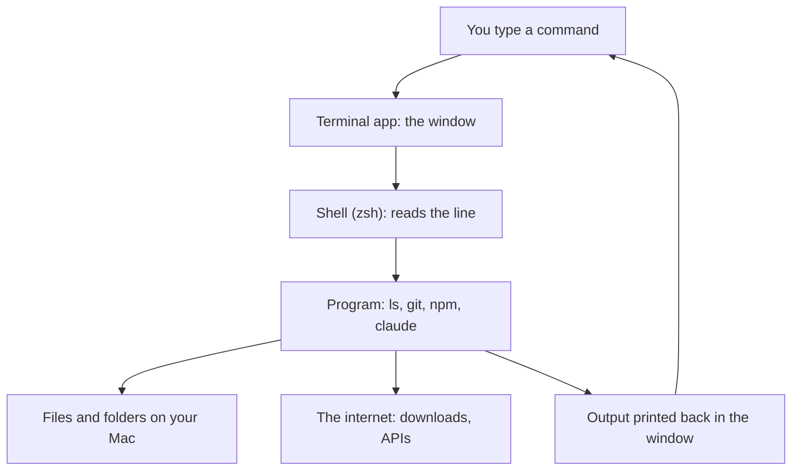

Claude Code, the agent that builds things in a folder for you (see [Claude Code and the API](/building/claude-code-and-the-api/)), runs in a terminal. So do most of the building tools in this part of the guide, which is why the terminal comes next.

**In one line:** the terminal is a text window where you type instructions to your computer instead of clicking, and most of the AI building tools in this guide are run from it.

## The jargon: concepts covered on this page

- **Terminal:** the macOS app that gives you a window for typed commands
- **Shell:** the program that reads your typed commands and runs them
- **zsh:** the default shell on modern Macs
- **PowerShell:** the usual shell on Windows
- **WSL:** Windows Subsystem for Linux, a way to run a Linux terminal inside Windows
- **Prompt:** the text shown when the shell is ready for input
- **Current directory:** the folder the shell is working in right now
- **Home folder:** your personal folder, written as `~`
- **Path:** the written address of a file or folder
- **Absolute path:** a path that starts from the top, working from anywhere
- **Relative path:** a path that starts from the current folder
- **Flag:** a small add-on to a command that changes its behaviour
- **Tab completion:** pressing Tab to finish a file or command name
- **Package manager:** a tool that installs and tracks other software
- **Homebrew:** a package manager for macOS command-line tools and apps
- **winget:** the package manager built into Windows
- **npm:** the package manager for JavaScript tools, bundled with Node.js
- **sudo:** a command prefix that runs something with administrator rights

## Why it matters

Many of the tools you will use to build agents, such as Claude Code, the GitHub and Vercel command-line tools, and package installers, have no buttons. You start them by typing a short line of text. If the window feels foreign, every setup guide feels like a wall.

The good news is that you need very little of it. A dozen commands, a few keyboard shortcuts and one habit (read before you paste) cover almost everything. This page covers those, as of October 2026, for a Mac, with short notes where Windows differs.

<mark>The terminal does exactly what you type, immediately, and usually without asking, so read every command before you run it.</mark>

## How it works

Four things are involved, and it helps to keep them apart:

- **Terminal** is the app on your Mac that gives you the text window. Apple describes it as an app for working with the macOS command line interface (CLI), meaning a way to control the computer with typed commands.
- **The shell** is the program running inside that window. It reads what you type, works out what you mean, and starts the right program. Apple's guide states that the default shell on a Mac is zsh.
- **Programs** are the tools the shell starts, such as `ls` (list files) or `git`.
- **Files and folders** are what most programs read and change.



To open Terminal, Apple's guide gives two ways: use Spotlight (the magnifying glass in the menu bar) and type Terminal, or open the Utilities folder inside Applications and double-click Terminal.

**On Windows:** the window app is Windows Terminal, which Microsoft describes as a host for shells such as PowerShell, Command Prompt and bash. It is the default on recent versions of Windows 11; on Windows 10 you may need to install it from the Microsoft Store. Search the Start menu for Terminal to open it. The shell inside is usually **PowerShell**.

### Folders and paths

The shell is always "standing" in one folder, called the **current directory** (directory is the older word for folder). Commands act on that folder unless you say otherwise.

A **path** is the written address of a file or folder. Apple's guide describes three shortcuts you will use all the time:

- `.` means the current folder.
- `..` means the folder one level up (the parent).
- `~` means your **home folder**, the one that holds Desktop, Documents and Downloads. So `~/Documents` is your Documents folder.

An **absolute path** starts from the top (or from `~`) and works from anywhere, such as `~/projects/sample-site`. A **relative path** starts from where you are now, such as `sample-site/notes.txt`. If a name contains spaces, Apple's guide says to put it in quotation marks, or put a backslash before each space.

**On Windows:** paths start with a drive letter and use backslashes between folders, such as `C:\Users\yourname\Documents`. In PowerShell, `.`, `..` and `~` work much as they do on a Mac. Quotation marks are the safe way to handle spaces.

## Setting it up

There is nothing to install. Terminal ships with macOS. These steps get you comfortable.

1. Open Terminal using Spotlight, as described above.
2. Look at the last line. You will see a short prompt, often ending in `%` (in PowerShell, something like `PS C:\Users\yourname>`), waiting for you to type. That is the shell saying "ready".
3. Type `pwd` and press Return. It prints the full path of the folder you are standing in, which at the start is usually your home folder.
4. Type `ls` and press Return. Apple's own guide uses this as its first example. It lists what is in the current folder.
5. Type `man ls` and press Return to see the manual page for a command. Press `q` to close it. Apple's guide gives this same method (with `man man`), and it works for most commands.
6. Try the practice session below in a throwaway folder, so nothing important is at risk.

**On Windows:** in PowerShell, `pwd`, `ls`, `cd`, `mkdir`, `cat`, `cp`, `mv` and `rm` all work as built-in shortcuts (Microsoft calls them aliases) for PowerShell's own commands, but their flags differ, so `cp -R` and `mkdir -p` may not behave as the table below says. Use `Get-Help` instead of `man`. If you want the Mac and Linux commands exactly as written, Microsoft's **WSL** (Windows Subsystem for Linux) gives you a Linux terminal inside Windows: run `wsl --install` in PowerShell opened with Run as administrator, then restart. Many building tools document their Windows steps for WSL.

### The commands that cover most of what you do

| Command | What it does |
| --- | --- |
| `pwd` | Prints the folder you are in |
| `ls` | Lists files and folders here |
| `cd folder-name` | Moves into a folder. `cd ..` goes up one level, `cd ~` goes home |
| `mkdir folder-name` | Makes a new folder. `mkdir -p a/b/c` also makes any missing folders on the way |
| `cat file-name` | Prints a file's contents in the window |
| `cp file-name new-name` | Copies a file. Add `-R` to copy a folder and everything in it |
| `mv old-name new-name` | Moves or renames a file or folder |
| `rm file-name` | Deletes a file, for good |

The `-R` and `-p` bits are called **flags** (or options): small add-ons that change how a command behaves. Apple's guide documents `cp -R` and `mv`, and the manual pages for `mkdir -p`, `cat` and `rm` match the table.

### A session you can expect to see

Here is an invented session. Lines starting with `%` are what you type. The other lines are the replies. Your folder names will differ.

```text
% pwd
/Users/yourname
% mkdir practice
% cd practice
% pwd
/Users/yourname/practice
% ls
% mkdir drafts
% ls
drafts
% cd drafts
% cd ..
% cp -R drafts drafts-backup
% ls
drafts          drafts-backup
% mv drafts-backup old-drafts
% cd ~
```

Notice that most commands print nothing when they work. Silence usually means success. You only get words back when there is something to say, which includes errors.

### Three shortcuts worth learning first

- **Tab completion.** Type the first few letters of a file or folder name and press the Tab key, and the shell finishes it for you (zsh's documentation describes Tab as triggering its completion system). It saves typing and prevents typos. If several names match, press Tab again to see the options.
- **Up arrow.** Apple's guide says the Up Arrow brings back the last command you typed, and pressing it again goes further back. Press Return to run it again, or edit it first.
- **Control and C together.** Apple's guide says Control-C sends a signal that makes most commands stop. Use it when something is running and you want out.

### Installing tools with a package manager

A **package manager** is a program that downloads and installs other programs for you, and keeps track of them. It replaces "find the website, download, drag to Applications" with one typed line.

Two matter for this guide:

- **Homebrew** installs command-line tools and apps on macOS (and Linux). Its site, brew.sh, gives a one-line installer to paste into Terminal, and says the script explains what it will do and then pauses before it does it. Copy that line from brew.sh itself, never from a copy on another page, because it changes over time. Once it is installed, you add tools with `brew install`, for example `brew install git`.
  **On Windows:** the built-in equivalent is **winget** (the Windows Package Manager). The official Git site, for example, gives `winget install --id Git.Git -e --source winget`.
- **npm** is the package manager for JavaScript tools. It comes bundled with Node.js, and its documentation recommends installing Node through a version manager such as nvm, because the plain installer can cause permission errors when you install tools globally. You can check what you have with `node -v` and `npm -v`. Several guide tools install this way, for example `npm i -g vercel`.

## Good habits

- **Read a command before you paste it.** Know what each part does. If you cannot explain the line to a friend, do not run it yet. Ask Claude to explain it first.
- **Only paste commands from official documentation.** A command from a random forum post or a stranger's page can do anything your account can do.
- **Be wary of `sudo`.** It means "run this as the administrator". The manual describes it as letting a permitted user run a command as the superuser. Do not use it unless the tool's official instructions tell you to, and you understand why. On Windows, the same caution applies to opening a terminal with Run as administrator.
- **Keep secrets out of commands.** The shell remembers what you type, and a key typed into a command line can be saved in your history, shown on screen, or captured in a screen share. Put secrets in settings or a protected file instead (see [environment variables and secrets](/building/environment-variables-and-secrets/)).
- **Check where you are.** Before any delete, copy or move, run `pwd` and `ls`. Most accidents happen in the wrong folder.
- **Practise in a throwaway folder.** Make one called `practice`, as in the session above, and experiment there.
- **Use version control for anything that matters.** Folders tracked with Git have a safety net that the terminal itself lacks. See [Git and GitHub](/building/git-and-github/).

## When things go wrong

- **"command not found".** Apple's guide says to check your spelling first. If the spelling is right, the tool is probably not installed yet, or you are following instructions for a different system.
- **"No such file or directory".** You are probably in the wrong folder, or the name is slightly different. Run `pwd` and `ls`, and use Tab completion to avoid typos. Remember that names with spaces need quotes.
- **"Permission denied".** Your account is not allowed to do that here. Do not reach for `sudo` as a reflex. Check you are in the right folder and read the tool's official guidance.
- **The window seems frozen.** The command may still be running. Wait a moment, then press Control-C to stop it.
- **A long wall of red text.** Do not panic. Read the last few lines first, because that is usually where the real reason is. Paste the last lines (with any secrets removed) into Claude and ask what they mean.
- **You deleted something.** `rm` has no bin and no undo. The manual page for `rm` describes removing files, with options to prompt before each deletion, and does not describe any way to get them back. If the folder was tracked by Git, you can usually restore it (see the Git page). Otherwise check your backups, such as Time Machine on a Mac, if you use them.

## Costs and limits

Terminal and zsh are free and already on your Mac. Homebrew and npm are free to use too.

The real cost is attention. The terminal gives no warning before many destructive actions, and it cannot undo them. The most expensive habit is pasting commands you have not read.

Linux users will find almost everything here works as written. On Windows the ideas are the same but the details differ, as the notes above show. Whatever your system, follow each tool's official instructions for it.

## Related

- [Git and GitHub](/building/git-and-github/): the safety net for your files, run from the terminal
- [Claude Code in depth](/building/claude-code-in-depth/): an AI tool you start and steer from the terminal
- [Environment variables and secrets](/building/environment-variables-and-secrets/): where keys belong instead of the command line
- [Permissions and access control](/data/permissions-and-access-control/): why `sudo` and wide permissions deserve caution

## Next up

Commands typed here change files at once, with no undo. [Git and GitHub](/building/git-and-github/) adds the safety net: a history you can go back through, and a backup online.
