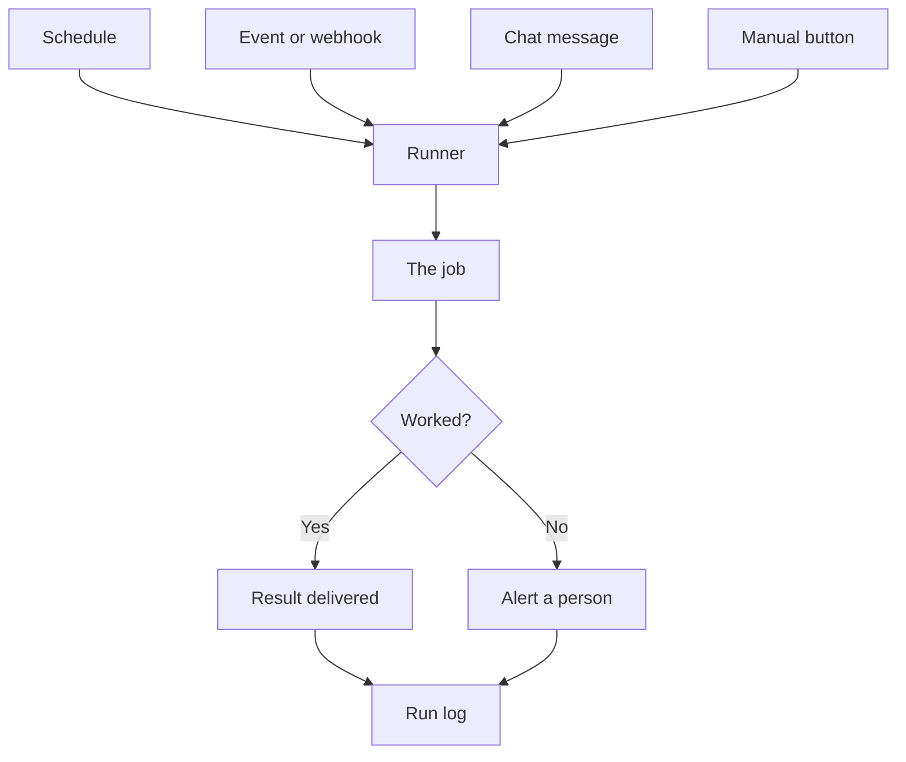

Code on a hosting platform, with its keys stored safely and a database such as [Supabase](/building/supabase/) to write to, still needs something to set it going. This page covers the triggers that start work without anyone typing, and the traps that come with running unattended.

**In one line:** a trigger is whatever starts a piece of work on its own, such as the clock reaching Monday 8am, a new email arriving, or someone pressing a button.

## Why it matters

A chat assistant waits for you to type. Most useful automation cannot wait for that. A weekly briefing has to appear before the team meeting, and a new introduction email should be logged whether or not anyone remembers.

Triggers are what let work start without a person. They are also where unattended jobs go wrong: a job that runs twice, runs at the wrong hour, or does not run at all and nobody notices.

<mark>Assume every triggered job will sometimes run twice or not at all, and build it so that both are harmless.</mark>

## How it works

Think of the alarm clock, the doorbell and the light switch. One goes off at a set time, one rings when something happens, and one waits for a person. Triggers fall into the same groups.

- **Schedule.** The clock starts the job: every Monday at 8am, or every hour. This is the most common trigger for reports and clean-up tasks.
- **Event.** Something happens in another system and starts the job: a new email arrives, a CRM record changes, a file lands in a folder.
- **Message.** Someone writes in a chat channel, or messages a bot, and that starts the job. It is an event, but one that a person caused on purpose.
- **Manual.** A person presses a button, runs a command or fills in a form. Handy for testing, and for jobs that should only run on request.

**Cron notation.** Schedules are often written in a compact format called cron (named after a long-standing scheduling tool on Unix computers). It has five fields, in this order: minute, hour, day of the month, month, day of the week. A star means "every".

So `0 8 * * 1` reads as: minute 0, hour 8, any day of the month, any month, day of the week 1. That is 8:00am every Monday (day 0 is Sunday in the standard, and many tools also accept 7 for Sunday). Many tools hide cron behind a friendly picker, but the same idea sits underneath.

**Polling or events.** There are two ways to find out that something changed.

- **Polling** means asking again and again: "anything new?" every five minutes. It is simple and works with almost any system, but it wastes effort and is always a little late.
- **Events** mean being told. The other system sends a message the moment something happens. The usual form is a **webhook**: a web address your job listens on, which the other system calls when there is news. It is faster and cheaper, but both sides must support it.

The runner is the thing that listens for triggers and starts jobs. It might be an automation tool, a [serverless function](/building/serverless-functions/) set to run on a timer, or a simple scheduler on a server.

## In practice

A trigger plus a series of steps is what people usually call an automation, or a workflow (see [chat, agent, workflow and automation](/start/chat-agent-workflow-automation/)). The trigger answers "when does it start?" and the steps answer "what does it do?". A model can be one of the steps, and in that case the whole thing is a scheduled or event-driven agent.

Most automation platforms offer all four trigger types as ready-made options. Cloud providers offer timers and event hooks for their serverless functions. Chat tools offer bots that react to messages.

**Traps to plan for.**

- **Time zones and clock changes.** A job set for "8am local time" can misbehave when clocks change. How a scheduler copes depends on the software. The manual page for the cron program on Debian says that for clock changes of under three hours, jobs set for a fixed time that fell in the skipped hour (spring) run soon after the change, and jobs in the repeated hour (autumn) are not run again. That special handling applies only to jobs with a fixed hour and minute, not to ones that use wildcards, and other schedulers may skip or repeat jobs instead. Pick a time that avoids the changeover hours, or schedule in UTC (the world's reference time, which has no clock changes), or use a scheduler that handles time zones explicitly. State the time zone in writing wherever the schedule is set.
- **Missed runs.** If the system is down at 8am Monday, many schedulers simply skip that run. Decide what you want: run late when the system returns, or skip. Either way, make the choice deliberately and check for it.
- **Overlap.** A job that takes ten minutes but is scheduled every five will start a second copy while the first is still going. Use a lock ("a run is already in progress, skip") or schedule less often.
- **Running twice.** Webhooks are often delivered more than once, and a person can click twice. Retries (see [rate limits, retries and failures](/running/rate-limits-retries-and-failures/)) also repeat work. The defence is **idempotency**: designing a step so that doing it twice gives the same result as doing it once. "Set this company's status to Active" is idempotent. "Send this email" is not, unless you first record that it was sent and check before sending.

**Unattended means extra care.** Nobody is watching a scheduled job. Give it limits (a maximum run time, a step limit for agents, a cap on how much it may spend), keep a log of every run (see [observability](/running/observability/), the Part 6 page on recording what unattended jobs did), and make it report failure to a person. Anything risky should still stop for approval (see [human-in-the-loop](/agents/human-in-the-loop/)).

## Worked example

Bramley's, the fictional two-person bakery with a shop and online orders, has two triggered jobs. Sam, the owner, set up both.

**The Monday order summary.** A schedule (`0 8 * * 1`, set to run in UTC) starts an agent that reads last week's online orders and the shop's sales sheet. It emails both people at the bakery a one-page summary: what sold, what ran out, and which regular customers have standing orders this week.

One Monday the online shop's system is unavailable at 8am. The agent's attempt fails, the runner retries twice, then gives up. It sends Sam a short message: "Monday summary failed: the order system did not respond. Nothing was sent." Sam reruns it by hand at 9am using the manual trigger. Because the summary only reads data and sends one email, and the job records "summary for week 40 sent", a second run that day would see the record and stay quiet.

**The order logger.** When a customer places an online order, the shop system calls a webhook. That starts a job that adds the order to the baking list for its collection day, and flags anything unusual, such as a custom cake, for Sam to check.

One day the shop system delivers the same event twice. The job first checks the baking list for that order number. It finds it and stops. The list has one entry, not two. That check is the idempotency.

## Costs and limits

- **Polling costs more as it gets faster.** Checking every minute uses ten times the requests of checking every ten minutes, and may hit [rate limits](/running/rate-limits-retries-and-failures/) (caps on how many requests a service accepts, covered in Part 6). Use events where the other system offers them.
- **Schedules do not know about reality.** A job that runs on a bank holiday or during an outage still runs. Add checks inside the job.
- **Silent failure is the worst case.** A scheduled job that stops working shows no error to anyone. Report on success too, or run a "did it run?" check.
- **Model-powered jobs cost money every run.** A scheduled agent that wakes up hourly and finds nothing to do still costs something. Make the first step a cheap check for "is there any work?".
- **Common mistakes.** Forgetting the time zone, no limit on retries, no lock against overlap, and treating "it ran once in testing" as proof.

## Often confused with

**Trigger vs workflow vs automation.** A trigger is only the starting signal. A workflow is the series of steps that follow. An automation is the two together: a trigger that runs a workflow without a person.

## Related

- [Chat, agent, workflow and automation](/start/chat-agent-workflow-automation/): a trigger plus steps is an automation
- [Serverless functions](/building/serverless-functions/): small pieces of code that a timer or event can start
- [Human-in-the-loop](/agents/human-in-the-loop/): approvals for risky actions in jobs nobody is watching
- [Observability](/running/observability/): the logs and alerts that show whether unattended jobs ran

## The proper terms

- **Trigger:** the signal that starts a job without a person typing
- **Schedule:** a clock-based trigger such as every Monday at 8am
- **Cron:** a compact five-field notation for schedules
- **Event:** something happening in another system that starts a job
- **Webhook:** a web address that another system calls to announce an event
- **Polling:** repeatedly asking a system whether anything is new
- **Idempotent:** safe to repeat, because doing it twice gives the same result as once
- **UTC:** the world reference time, with no daylight saving changes

## Next up

One trigger usually starts several steps across several apps. [Orchestration tools](/building/orchestration-tools/) are the software that strings those steps together and runs them in order.
