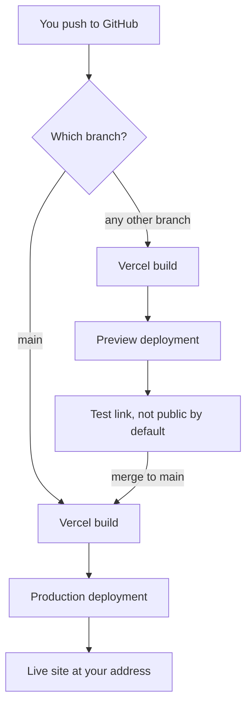

Your code now keeps its keys in [environment variables](/building/environment-variables-and-secrets/), and small parts of it can run as [serverless functions](/building/serverless-functions/). Vercel is one service that handles both for you, and it also does the step that turns a GitHub repository into a website people can visit.

**In one line:** Vercel is a hosting service that watches a GitHub repository, builds your site every time you push a change, and publishes it at a web address.

## The jargon: concepts covered on this page

- **Production branch:** the branch whose pushes become the live site
- **Production deployment:** a built version of the site, assigned to the live address
- **Framework preset:** Vercel's saved build settings for a framework such as Astro
- **Build command:** the command that turns your source files into a finished site
- **Build log:** the record of what happened while a deployment was built
- **Instant Rollback:** pointing the live domain back at an earlier deployment
- **Deployment Protection:** Vercel's controls over who can open your deployment addresses
- **Hobby plan:** Vercel's free tier for personal, non-commercial projects
- **DNS record:** an entry telling the internet which server a domain name points to
- **Maximum duration:** the longest time a function may run before it is stopped

## Why it matters

Writing a website is half the job. The other half is putting it somewhere the world can reach, and keeping it updated without copying files by hand. Vercel does that second half for you.

A common setup looks like this. A site is built with a tool such as Astro (which turns plain text pages into a website) and stored on GitHub. Vercel connects the two, so a push to the main branch becomes a live update within a minute or two.

<mark>On Vercel, the repository is the source of truth: whatever is pushed to the production branch is what the world sees, so check before you push.</mark>

It is also a typical first stop for small agent projects: a dashboard, a webhook receiver or a short function that calls a model. This page covers what it does well, and where it stops. For the wider category, see [app hosting](/map/app-hosting/).

## How it works

As of October 2026, Vercel's documentation describes it like this. You connect a Git repository (GitHub, GitLab or Bitbucket, and Azure DevOps through an extension). Vercel then deploys automatically on every branch push.

- **Production branch.** One branch, usually `main`, is the live one. Each time you merge or push to it, Vercel makes a **production deployment** (a built version put live).
- **Preview deployments.** Every other branch, and every pull request, gets its own temporary **preview** at its own web address. You test the change there before it touches the live site.
- **Build.** For each deployment, Vercel runs your project's build command, which for Astro turns your pages into finished files. Astro sites that are fully static need no special setup on Vercel.

The first deployment of any new project is always a production one, even if it comes from another branch. After that, the rules above apply.

### The parts of a project you will use

- **Project settings.** Each project has a Settings area in the dashboard: build settings, environment variables, domains, Git and deployment protection.
- **Environment variables.** The same idea as on your own computer: settings such as keys that live outside your code (see [environment variables and secrets](/building/environment-variables-and-secrets/)). Each can apply to Production, Preview, Development, or a mix.
- **Logs.** Each deployment has build logs showing what happened while it was being built.
- **Rollbacks.** You can point your live domain back at an earlier deployment in one click.
- **Custom domains.** You can use your own web address instead of the free generated one.

## Setting it up

You need a GitHub repository with your site in it first (see [Git and GitHub](/building/git-and-github/)).

1. **Sign up at vercel.com.** Connect your GitHub account when it offers that option, so Vercel can see your repositories.
2. **Start a new project.** In the dashboard, use the New Project button. Vercel lists the repositories it can see.
3. **Choose the repository** that holds your site. Grant Vercel access to only the repositories you need, if you are given the choice.
4. **Check the framework preset.** Vercel's documentation says it automatically detects the framework in many cases and sets the best settings. For an Astro site you should see Astro chosen. If nothing is detected it falls back to "Other", and you must enter the build command yourself.
5. **Add environment variables now** if your site needs any. Skip this step for a plain static site.
6. **Press Deploy.** Vercel builds the site.
7. **Read the build log once.** In the project, open Deployments, pick the deployment, and expand the Building section. A healthy log ends with the deployment marked Ready.
8. **Open the live address.** The project page shows the web address Vercel generated. Visit it and check your site.
9. **Push a small change** (fix a typo) and watch a new deployment appear. That proves the link between GitHub and Vercel works.

There is also a command-line route (`npm i -g vercel`, then `vercel login` and `vercel`), which Vercel's getting-started page describes. The dashboard route above is simpler for a site that already lives on GitHub.

**On Windows:** the same commands work in PowerShell once Node.js and npm are installed (see [terminal basics](/building/terminal-basics/)). If PowerShell refuses to run `vercel` with a message that running scripts is disabled, that is a Windows script-safety setting called the execution policy, not a Vercel problem. Running the command from Command Prompt is the simplest way round it; check Microsoft's current guidance before changing the policy itself.

## Good habits

- **Build locally before you push.** Vercel's own troubleshooting guide recommends building on your computer first, because it catches errors sooner. Your AI coding tool can run the project's build command for you.
- **Use branches and previews for risky changes.** Check the preview link, then merge.
- **Keep secrets out of the code.** Put them in the project's environment variables. Vercel says these are encrypted at rest but visible to anyone with access to the project, and it offers a Sensitive option that makes a value unreadable after it is saved (for Production and Preview). Use it for keys.
- **Never put a secret in code that runs in the browser.** Anything sent to the visitor's browser is public. Astro's documentation says only variables starting with `PUBLIC_` reach browser code, so never give a secret that prefix.
- **Remember changes to variables are not retroactive.** Vercel says changes only apply to new deployments, so redeploy after changing one.
- **Protect previews if they contain anything not meant for the public.** See below.
- **Keep the list of people with access short.** Anyone who can edit project settings can often read variables or redeploy code.

### Rolling back

If a bad change goes live, open the project overview and use Instant Rollback on the production deployment. Vercel's documentation describes the steps: pick the earlier deployment, check the summary, and confirm. On the free Hobby plan you can roll back to the previous deployment only.

Two catches, both from Vercel's documentation. A rollback does not change environment variables. And after a rollback, Vercel turns off automatic assignment of production domains, so new pushes will not go live until you use Undo Rollback and promote a deployment.

### Protecting previews and the live site

Vercel's feature for this is called **Deployment Protection**, found in a project's Settings. Its Vercel Authentication method limits access to people with a Vercel login who have the right access. Its Standard Protection scope covers everything except your production domains, and the All Deployments scope covers production too. Which methods you get depends on your plan, so check the page for your plan.

Know that a private GitHub repository does not make the site private. The site Vercel publishes is public unless you turn protection on.

## When things go wrong

- **The build fails.** Open the failed deployment and expand the Building section. Vercel says to scroll to the red "Error" lines, and warns that the last mention is often not the real cause, so read a few lines above it. Typical causes in a small static site: a file name or link that does not match exactly, a broken frontmatter block at the top of a page, or a missing package. Run the build command on your own computer to see the same error faster.
- **An environment variable is missing.** The build or a function fails with a "undefined" or "missing" message. Add the variable in Settings, choosing the right environments, then redeploy. A variable added to Production only will not exist in previews.
- **The deploy succeeded, but you see the old page.** First check the deployment is the production one and shows as Ready. Then check you have not left a rollback in place (see above). Then try a private browser window, because browsers and the network cache pages. Vercel's Astro documentation says static files are cached at the edge after the first request.
- **Content from a private repo appears publicly.** The repo is private, but the deployed site is public. Turn on Deployment Protection, or take out whatever should not be published, and revoke any key that appeared.
- **The domain will not verify.** Vercel's troubleshooting guide says to check the domain is added to the project and that your DNS record matches the one Vercel shows. A subdomain record is copied exactly as shown, including a trailing dot on the value. Ordinary DNS changes can take a while to spread, and changing nameservers can take up to a day or two.
- **A deployment is blocked on a private repo.** Vercel's documentation says commits to a private organisation repository only deploy if the author has access to the Vercel project, and that a Hobby team cannot deploy from a private repository owned by a GitHub organisation.

## Costs and limits

- **The Hobby plan is free, with limits.** Vercel's pages describe it as free and for personal, non-commercial use. Usage allowances are capped, and past a cap you may have to wait before a feature works again.
- **Commercial use needs a paid plan.** Vercel's fair use guidelines define commercial use broadly, as anything used for the financial gain of anyone involved, including a paid employee writing the code. A site that supports a business, including an internal tool for a firm, is likely to count. Read the guidelines and decide before you build something for work on Hobby. A personal learning site with no income is the kind of project Hobby is aimed at.
- **Function time limits are short.** Vercel runs your [serverless functions](/building/serverless-functions/), but it caps how long one can run, a few minutes on the free plan and longer on paid plans, and a function that runs out of time returns an error. There is also a size limit on what a function can send or receive.
- **Plans change the details.** Log retention, number of deployments per day, team features and rollback choices all differ by plan. Check the plans pages for current numbers.

### What Vercel is not for

- **Long-running agent loops.** An [agent loop](/agents/the-agent-loop/) that waits on many tools can outlast a function's time limit. Vercel has a separate workflow product for durable long jobs, but for a first project, a container or worker platform is simpler (see [app hosting](/map/app-hosting/)).
- **Databases.** Vercel hosts your code, not your data. When a project needs a database, you add one from a partner service, which Vercel can connect through its Marketplace. Your records live in that service, with its own account and rules (see [databases and storage](/map/databases-and-storage/)).
- **Anything private by default.** Treat every deployed page as public until you have turned protection on and tested it.

## Related

- [App hosting](/map/app-hosting/): where Vercel sits among other places to run code
- [Git and GitHub](/building/git-and-github/): the repository Vercel watches
- [Environment variables and secrets](/building/environment-variables-and-secrets/): how to keep keys out of your code
- [Serverless functions](/building/serverless-functions/): the short-lived code Vercel can run for you
- [Terminal basics](/building/terminal-basics/): the window for the command-line route

## Next up

Vercel runs your code but does not keep your data. [Supabase](/building/supabase/) adds a hosted database where an agent's records, logs and search index can live.
