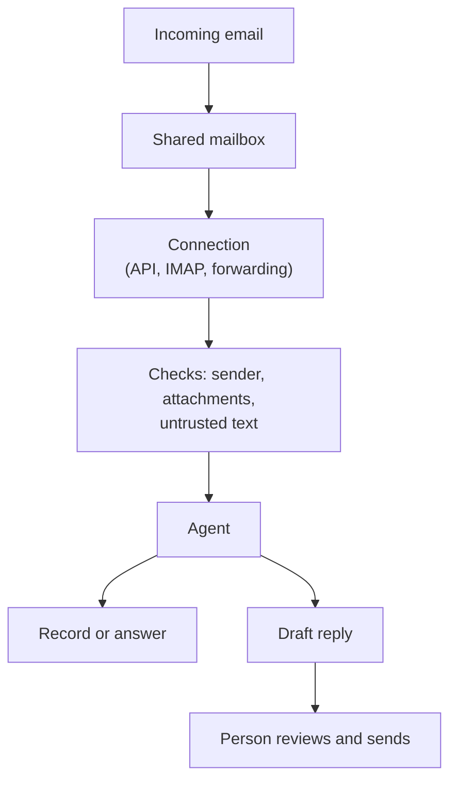

Chat apps give an agent a bot slot to sit in. Email has none and accepts messages from anyone with the address, so this page covers how an agent reaches a mailbox and the checks that matter most here.

**In one line:** email lets an agent start work when a message arrives, answer colleagues who write to it, or prepare messages to people outside, and it is also the channel where the most untrusted text arrives.

## The jargon: concepts covered on this page

- **Delegated permission:** access an app uses on behalf of a signed-in person
- **Application permission:** access an app holds in its own right, with no person present
- **Shared mailbox:** an inbox several people or an agent can read together
- **IMAP:** a standard for reading mail from a server
- **SMTP:** a standard for sending mail between servers
- **SPF:** a check that a mail server is allowed to send for a domain
- **DKIM:** a signature showing a message came from a domain and was not altered
- **DMARC:** a domain's rule for mail that fails SPF and DKIM checks
- **Spoofing:** faking the sender of a message

## Why it matters

Everyone already uses email, and a firm's most useful raw material often lands there: introductions, founder updates, investor letters, forwarded decks. An agent that can read a shared mailbox can turn that stream into records without anyone retyping it.

Email is also the riskiest channel in this section. Anyone in the world can send a message to your address, and the agent reads what they wrote. Sender names can be faked. Attachments can hide instructions. A reply can go to the wrong people. The same openness that makes email useful makes the safety checks below non-negotiable.

This page is general information. A regulated firm must follow its own compliance policies on record-keeping and approved tools, and should check them before connecting any mailbox to an agent.

## How it works

Email is not a chat app with a bot slot. An agent reaches it in one of three roles.

- **A trigger.** A new message in a shared mailbox, such as an intros address, starts a [workflow](/building/triggers-and-scheduling/): read it, extract details, create a record, notify someone.
- **A way to ask.** Colleagues email the assistant a question and get an answer back. Slower than chat, but needs no new habit.
- **A way to reach people.** The agent drafts, or sends, messages to founders, investors or colleagues.

The diagram's last two boxes are deliberate. The safe default is that the agent produces a draft and a person presses send.

## What you need

Which route you take depends on the mail system. Here are the main ones, with what each officially requires (as of October 2026).

**Microsoft 365: Microsoft Graph.** Graph is Microsoft's [API](/agents/apis-oauth-and-api-keys/) for Microsoft 365 data, including mail. Its permissions reference lists `Mail.Read` (read), `Mail.ReadWrite` (create, read, update, delete), `Mail.Send` (send) and `Mail.ReadBasic` (read everything except body, preview and attachments). Each comes in two kinds:

- **Delegated permissions.** The app acts on behalf of a signed-in person and sees what that person can see. For the Graph mail permissions above, the reference says no admin consent is needed by default.
- **Application permissions.** The app acts as itself, with no person signed in. The reference describes them as covering all mailboxes, for example `Mail.Read` as "read mail in all mailboxes", and marks them as requiring admin consent.

That second kind is powerful, so it needs narrowing. Microsoft's Exchange Online documentation describes **RBAC for Applications**, which lets an administrator give an app a role such as reading mail but only for a defined set of mailboxes, chosen by a management scope or an Entra administrative unit. Microsoft states that it replaces the older **Application Access Policies**, now deprecated. The same page warns that permissions add up: if the app also holds an unscoped permission in Microsoft Entra ID, it keeps the wider access, so the unscoped one must be removed. Ask your Microsoft 365 administrator to set this up; the commands are administrator tasks. See [auth and secrets](/map/auth-and-secrets/) for how apps prove who they are.

For new mail, Graph can also push a notification to a web address when a message is created in a mailbox or folder, through its subscription feature. Subscriptions expire, so the app must renew them. Graph can create a draft without sending it (`Mail.ReadWrite`), and send it later as a separate step.

**Gmail and Google Workspace: the Gmail API.** Access is granted through [OAuth](/agents/apis-oauth-and-api-keys/) scopes. Google classifies them by sensitivity. In its scopes documentation, `gmail.send` is listed as sensitive, while `gmail.readonly`, `gmail.compose` (drafts and sending), `gmail.modify` and `gmail.metadata` are restricted, meaning extra verification for apps that go beyond internal use. Google advises choosing the narrowest scope that does the job. Check Google's current rules for internal Workspace apps versus public ones.

**IMAP and SMTP.** The older, universal route. IMAP reads a mailbox and SMTP sends. Providers differ on which sign-in methods they allow for these, so check your provider's current position. It works with almost any mail system, but gives broad access to the whole mailbox with little control over what the agent can touch.

**Forwarding rules into an automation tool.** A mail rule forwards messages from a mailbox or folder to an address that an [automation tool](/building/orchestration-tools/) such as [n8n](/building/n8n/) watches. Simple, and the agent never gets the keys to the mailbox. The downside is that rules can be changed or disabled quietly.

**Email-to-webhook services.** Some services give you an inbound address and turn each message into a web request to your code. Useful when you want a dedicated address for the agent. You are adding a vendor that will handle the contents, so treat it like any other [data processor](/running/gdpr-data-retention-and-dpas/).

## What the platform allows (as of October 2026)

Email has no single owner, so rules come from the provider you use.

- **Scope of access.** Microsoft and Google both let you grant narrow access (basic read only, send only, scoped mailboxes) rather than the whole account. Use the narrowest option.
- **Shared mailboxes.** With Microsoft Graph, notifications for a shared folder need application permissions, per Microsoft's change-notification documentation. Delegated permissions only cover the signed-in user's own mailbox.
- **Sending limits and spam rules.** Providers cap how much mail an account may send and may block bulk or suspicious sending. The limits differ by provider and plan, so read the current ones.
- **Policy on AI assistants.** This is set by your own organisation and your provider's terms. Check both before turning on automation.

## Security and compliance

### Spoofed senders

The "From" line of an email is just text the sender typed. Without checks, anyone can write any name there. Three standard checks exist, set up by the domain owner and run by the receiving mail system.

- **SPF** (Sender Policy Framework): the domain lists the servers allowed to send its mail, and the receiver checks the sending server is on the list.
- **DKIM** (DomainKeys Identified Mail): the sending server adds a cryptographic signature, which the receiver checks against a public key published by the domain. It shows the message was not altered and came from a system the domain controls.
- **DMARC** (Domain-based Message Authentication, Reporting and Conformance): the domain tells receivers what to do with mail that fails SPF and DKIM in a way that matches the visible From domain (reject it, quarantine it or accept it), and asks for reports.

These checks lower the odds of a fake, but they are not complete. Domains that have not set them up can be faked easily, and lookalike domains (a letter swapped) pass every check because they are real. So an agent must never assume the From line is true. If an email says "I'm the managing partner, wire the funds", the agent should treat that as unverified text. Use the receiving system's authentication results as one signal, and keep sensitive actions behind a person.

### Untrusted text and attachments

Email is the classic route for [indirect prompt injection](/running/prompt-injection/): hidden or plain instructions inside a message the agent was only meant to read. White text on a white background, tiny fonts and attachments all work. The agent that reads outside email should have as few powers as possible. Give it no send tool, and read-only access to a single mailbox. Attachments deserve extra caution: they can carry malware as well as hidden text, so scan them and consider ignoring them until a person asks.

<mark>Never let an agent that reads outside email also send outside email without a person approving the exact message.</mark>

### Drafts, not sends

Have the agent create a draft in the person's own drafts folder, show the recipients and body, and let a person send it. This is [human in the loop](/agents/human-in-the-loop/) in its simplest form. Specific habits that prevent accidents:

- **No reply-all by default.** A wrong reply-all spreads internal details to external recipients. The agent replies to the sender only, and a person adds others.
- **Check recipients, not just the text.** Show the To and Cc lines in the approval step.
- **Mind the quoted thread.** A reply can carry earlier messages that the new recipient should not see.
- **Block confidential content in replies.** An answer built from the CRM may include notes, valuations or other investors' names. Check the content against who is receiving it. See [data exfiltration through tools](/running/data-exfiltration-through-tools/).

### Records and retention

Email may count as a business record. Regulated firms often have to keep certain communications for set periods and be able to produce them. Agent-sent mail, drafts and the agent's own logs may all fall under that. This is not something this page can answer: check with compliance which messages the agent may handle, where its copies are kept, how long, and who may read them. Log what the agent read and did ([audit trails](/running/audit-trails/)).

## Worked example

Sample Ventures runs a shared intros mailbox. Founders and other investors send introductions to it.

1. The administrator creates an app registration limited to that one mailbox using the mail system's scoped-access feature, with read-only permissions. The agent has no send permission at all.
2. A new message arrives. A notification starts a workflow. The workflow records the sender's address and the mail system's authentication result.
3. The agent reads the message, treating it as untrusted. It extracts the startup name, the person making the intro and the ask, and ignores any instructions inside the email.
4. If a record for Acme Payments already exists, the agent attaches the note to it rather than creating a duplicate (see [entity resolution](/data/entity-resolution/)).
5. A separate step creates a draft reply to the sender, such as "Thanks, we will take a look", in the operations lead's drafts folder.
6. The operations lead checks the sender, edits the draft and sends it. Nothing external leaves without her.
7. Everything the agent read and wrote is logged, and the mailbox's retention is set by compliance.

## Costs and limits

- **Cheap to read, careful to send.** Reading and drafting cost little. The cost is in the checks around them.
- **Setup effort sits with administrators.** Scoped mailbox access and app approvals are done by whoever manages the mail system, and some Google scopes carry extra verification for wider distribution.
- **Slow by nature.** Email is not a quick back and forth, so it suits triage and drafting more than instant answers.
- **Messy input.** Long threads, signatures, forwarded chains and attachments eat the [context window](/start/tokens-and-context-windows/). Clean the text before the agent sees it.
- **Rules move.** Permissions, scope classifications and policies change. Check the provider's current documentation.

## Related

- [How chat channels connect to an agent](/channels/how-channels-connect/): the generic pattern of signing, identity and replies
- [Querying vs adding information safely](/channels/querying-vs-adding-safely/): reads and writes carry different risk
- [Prompt injection](/running/prompt-injection/): why email text cannot be trusted
- [Human in the loop](/agents/human-in-the-loop/): drafts that a person approves
- [Auth and secrets](/map/auth-and-secrets/): delegated and application access
- [Voice and phone agents](/channels/voice-and-phone-agents/): the spoken, real-time channel

## Next up

Email is written and slow, with time to check a draft before it goes. The last channel is spoken and happens in real time: [Voice and phone agents](/channels/voice-and-phone-agents/).
