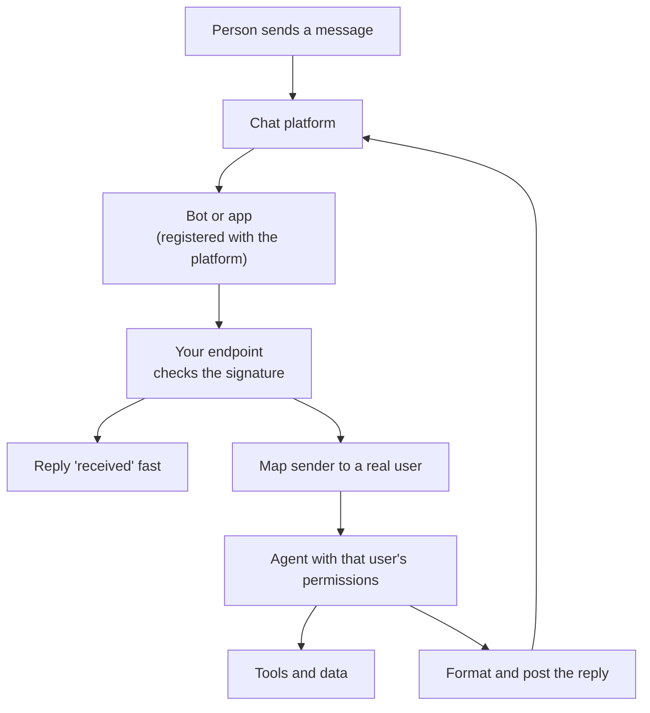

Before looking at any single app, it helps to see the parts every channel shares. This page walks through them once, so each platform page after it only has to explain what is different.

**In one line:** a chat channel connects to an agent through a small app or bot registered with the chat platform, which hands each new message to your code, waits for the agent's answer and posts it back.

## The jargon: concepts covered on this page

- **Channel bot:** software registered with a chat platform to receive and send messages
- **Long-lived connection:** a connection kept open so the platform can push events down it
- **Polling:** asking the platform repeatedly whether anything new has arrived
- **Acknowledgement:** a quick reply telling the platform an event was received
- **Request signature:** a code proving a request came from the platform unaltered
- **Replay attack:** resending a genuine recorded request to trigger it again
- **Identity mapping:** matching a chat user to a real person in your systems
- **Thread:** a linked run of messages that gives a conversation its context

## Why it matters

Most people will never open a new tool to talk to an agent. They will message it where they already talk: the team chat, a messaging app, an inbox. So the question for a small firm is not "can the agent answer?" but "how does a message in that app reach it, and who is allowed to send one?"

The connection has more moving parts than it looks. Each part is a place where a message can be lost, faked, shown to the wrong person or stored longer than you meant. Understanding the pieces once makes every platform page in this section easier to read.

This page is general. It describes how chat platforms tend to work, based on the developer documentation of Slack, Telegram, Meta's WhatsApp platform and Microsoft's Bot Framework. Specifics such as limits and approval steps belong to each platform's own page and change often (as of October 2026).

## How it works

Think of the chat platform as a post office and your agent as a clerk in a back room. The platform does not know what an agent is. You register a small app or bot with the platform, tell it where to deliver messages, and it posts each relevant one through the door.

Two things in that picture surprise newcomers. The platform wants a quick "received" before the agent has done anything, and the agent acts with the permissions of the person who asked, not with its own broad access. Both are covered below.

## The pieces

### The channel app or bot

Every platform has its own word: Slack has apps, Telegram has bots, Microsoft's Bot Framework has bots registered in a Microsoft account, and WhatsApp's business platform has apps linked to a business phone number. The idea is the same. It is a registered identity for your software, with credentials and a list of things it may see and do.

Registration is where the platform decides who can add the agent to a workspace, which messages it can see and what it may post. Some of that is set by an administrator, and some platforms add a review step for wider distribution. Each platform page lists what is needed.

### How messages arrive: webhook, socket or polling

There are three ways for your code to learn that a message exists.

- **Webhook.** The platform sends an HTTP request to a web address you give it each time something happens. A [webhook](/building/triggers-and-scheduling/) needs a public address that is always reachable. Slack, Telegram, Meta's WhatsApp platform and the Bot Framework all support this.
- **Long-lived connection (socket).** Your code opens a connection to the platform and keeps it open, and events flow down it. You need no public address. Slack offers this as Socket Mode, and its documentation presents it as an alternative to a public HTTP address.
- **Polling.** Your code asks "anything new?" on a schedule, or holds the question open until there is something. Telegram's `getUpdates` method works this way. Telegram's documentation says it and webhooks are mutually exclusive: while a webhook is set, `getUpdates` does not work. It also says undelivered updates are kept for no longer than 24 hours.

Polling is the simplest and slower. Webhooks and sockets are faster. The trade-off is the same one described in [keeping data fresh](/data/keeping-data-fresh/): how soon you hear about a change versus how much plumbing you maintain.

### Acknowledge fast, answer later

Agents are slow. A single answer can take many seconds or minutes, because the agent may call several tools in a loop. Chat platforms are impatient. Slack's documentation says an interaction must be acknowledged within 3 seconds, with a plain "received" response, and that follow-up messages can come afterwards. Meta's webhook documentation asks for a 200 response and says it retries failed deliveries for a while.

Platforms set deadlines because they cannot hold thousands of connections open waiting for slow apps, and because a missed answer looks like a failure to the person using the app. The pattern for agents is always the same:

1. Receive the event and check it is genuine.
2. Reply "received" straight away.
3. Hand the work to a background job or [workflow](/building/orchestration-tools/).
4. Post the real answer later, ideally with a short "working on it" message in between.

Retries cause a side effect. If your "received" is late, the platform may send the same event again, and the agent answers twice. Meta's documentation tells you to expect this and to deduplicate. Store an event ID and skip repeats. See [rate limits, retries and failures](/running/rate-limits-retries-and-failures/).

### Signing: is this message really from the platform?

A webhook address is public. Anyone who finds it can send it fake events saying "the partner asked you to export the contact list". So platforms sign their requests.

A **request signature** works like a wax seal. The platform and your app share a secret. For each request, the platform mixes the secret with the message body (and, in Slack's case, a timestamp) and produces a short code, sent in a header. Your code repeats the sum with its copy of the secret. If the codes match, the message came from the platform and was not altered on the way.

Slack documents this with a signing secret, an `X-Slack-Signature` header and a timestamp check that rejects requests more than five minutes old. Meta signs payloads with your app secret in an `X-Hub-Signature-256` header. Telegram lets you set a secret token that comes back in an `X-Telegram-Bot-Api-Secret-Token` header. Microsoft's Bot Framework uses a signed token in the `Authorization` header, which your bot checks for the right issuer, audience, expiry and signature.

The timestamp check blocks a **replay attack**, where someone records a genuine signed request and sends it again later. Keep the signing secret in [environment variables and secrets](/building/environment-variables-and-secrets/), never in the code. Many official libraries do the check for you once you give them the secret.

### Identity mapping: who is this, really?

The platform tells you a user ID, such as a Slack member ID or a Telegram user number. That is not your firm's idea of a person. **Identity mapping** is the step that turns "chat user X" into "this associate, with this role, in our systems".

Do it with an explicit list or a sign-in link, not by trusting a display name. Names can be copied, and display names are not proof of anything. The mapped identity then decides what the agent may read or write for that message, following [permissions and access control](/data/permissions-and-access-control/) and [least privilege](/running/least-privilege/). If the sender is not on the list, the agent should answer politely and do nothing else.

### The agent and its permissions

Run the agent with the asker's access, or less. An agent that uses one powerful service account for everyone will answer whatever it is asked, including questions the asker should not be allowed to see. This is the most common design error on this page.

### Reply formatting

Each platform renders text its own way: its own bold syntax, buttons, cards, length limits. Your reply step converts the agent's answer into whatever the channel accepts, and falls back to plain text. Keep answers short in chat and link to the source record for detail.

### Conversation threads and state

A chat thread gives the agent a natural unit of conversation. Store the thread ID with the conversation so follow-up questions arrive with context. The agent itself does not remember anything between calls, so what you store and replay is its [memory](/agents/memory/), and it takes space in the [context window](/start/tokens-and-context-windows/). Decide how long a thread's history lives before it is dropped.

## Risks that come with every channel

- **Group chats leak.** An answer posted to a channel is visible to everyone in it, including people who could not have asked the question themselves. Check who is in the room, or answer sensitive questions privately.
- **Bots may see more than you expect.** Some platforms deliver every message in a space to a bot, and others only the ones that mention it. Telegram's documentation, for example, says bots in groups run in privacy mode by default and see only commands, replies and mentions addressed to them, unless they are made group admins. Check what yours receives and collect no more than it needs.
- **Messages are untrusted text.** A pasted email or forwarded message in chat can carry hidden instructions. See [prompt injection](/running/prompt-injection/).
- **Logs and retention.** The platform keeps messages under its own rules, and your own logs keep them under yours. Record who asked what and what the agent did ([audit trails](/running/audit-trails/)), and decide retention with [GDPR, data retention and DPAs](/running/gdpr-data-retention-and-dpas/) in mind.
- **Failure.** Platforms retry, networks drop and agents time out. Plan for duplicates, silent drops and a clear "I could not do that" reply.

<mark>Treat the chat platform as a public doorway: verify every request, map every sender to a real person, and let the agent do only what that person could do.</mark>

## Patterns

There are four common ways to wire this up.

1. **A native app or built-in assistant from the platform.** The platform supplies the assistant and the plumbing, and you configure access and sources. Least code, least control over how it behaves and where data goes.
2. **A bot you host yourself.** You register the bot, run a small service that receives events, checks signatures, maps identities, calls the agent and posts replies. Most control, most to maintain and secure.
3. **An automation tool in the middle.** A tool such as [n8n](/building/n8n/) receives the event, runs the steps and calls the agent. It handles the webhook, retries and scheduling for you. See [orchestration tools](/building/orchestration-tools/). You still own the signature check, the identity mapping and the permissions.
4. **An MCP-based assistant that already has the channel as an integration.** Some assistants connect to chat apps through [MCP](/agents/mcp/) or built-in connectors, so the channel is a tool the assistant can use rather than a doorway into your agent. Good for an assistant that reads and posts in chat. It is a different shape from "colleagues message the agent in chat", so check which one you actually need.

## Choosing

- **Who should be able to reach it, and from where?** Start with the least technical colleague.
- **Do you need to add information or only ask?** Writing needs more care. See [querying vs adding safely](/channels/querying-vs-adding-safely/).
- **How much code can you maintain?** A bot you host is a small production service. An automation tool or built-in assistant shifts that work.
- **Where does the data go?** Check which vendors see the messages and the agent's answers.
- **Can you switch later?** If the channel is a thin layer over your agent, you can change platform without rebuilding the agent.

## Worked example

Sample Ventures wants associates to ask the agent about portfolio companies from the team chat.

1. The operations lead registers a bot with the chat platform and restricts it to one workspace. The platform page tells her which approvals she needs.
2. The bot's web address belongs to a small workflow in the firm's automation tool. The first step checks the request signature using a secret kept in the tool's credential store.
3. An associate types "what is the latest on Acme Payments?". The workflow replies "looking into it" within the deadline.
4. Step two looks up the sender in a short table of approved colleagues and finds the associate's role. Unknown senders get a polite refusal.
5. The agent runs with read-only access to what that associate may see, and builds the answer with sources.
6. The workflow posts the answer in the thread, in the platform's own formatting, and writes a log line: who, when, what was asked, what was read.
7. If the platform sends the same event twice, the stored event ID stops a second answer.

## Costs and limits

- **Cheap to start, costly to harden.** A basic bot is quick to make. Signing, identity mapping, logging and retries are what take the time.
- **A public address needs care.** Webhooks mean an internet-facing endpoint, so keep it small and keep secrets out of the code. A socket or polling avoids that, at the price of a process that must stay running.
- **Platform rules change.** Limits, approval steps and permissions are set by each platform and are revised often. Check the current developer documentation before building.
- **Waiting costs attention, not much money.** The agent's own usage drives cost (see [estimating cost per task](/running/estimating-cost-per-task/)), not the channel.
- **Compliance still applies.** This page is general information, not legal advice. A regulated firm should check its own record-keeping, retention and approved-tools rules with compliance before connecting any channel.

## Related

- [Interfaces](/map/interfaces/): the wider family of ways to reach an agent
- [Querying vs adding information safely](/channels/querying-vs-adding-safely/): reads and writes carry different risk
- [Slack](/channels/slack/): the platform details for a team chat app
- [Telegram](/channels/telegram/): the platform details for a simple bot
- [WhatsApp](/channels/whatsapp/): the platform details for the business API
- [Microsoft Teams](/channels/microsoft-teams/): the platform details for a Microsoft 365 firm
- [Voice and phone agents](/channels/voice-and-phone-agents/): the same pattern when the message is a phone call
- [Permissions and access control](/data/permissions-and-access-control/): what each person may see
- [Prompt injection](/running/prompt-injection/): why chat text is untrusted

## Next up

With the shared pattern in place, the platform pages show how each app fills it in, starting with the one many firms already have open all day. [Microsoft Teams](/channels/microsoft-teams/) comes first.
