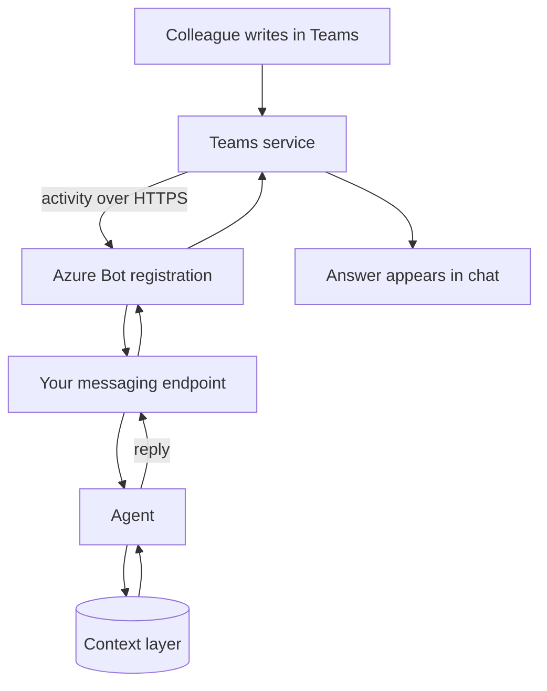

Every chat channel follows the same pattern: a registered bot, an address that receives messages, and a reply posted back (see [how chat channels connect](/channels/how-channels-connect/)). This page shows how Microsoft Teams fills that pattern in for a firm that runs on Microsoft 365.

**In one line:** a Teams bot is a small web service that Teams sends messages to, so colleagues can talk to your agent in the chat window they already have open.

## Why it matters

If a firm already lives in Microsoft 365, Teams is where questions get asked all day. An agent that answers there needs no new app, no new login and no training. People just message it like a colleague.

It also comes with the firm's existing controls: work sign-in, admin approval for apps, and the same retention and search tools that cover the rest of Teams. That makes it one of the easier channels to defend to a compliance team.

<mark>In Teams, the agent is just another app in your tenant, so your admins decide who gets it and your retention rules apply to what it says.</mark>

This page is general information as of October 2026. Microsoft renames and reshapes its developer products often, so check the linked Microsoft Learn pages before building. A regulated firm must also follow its own compliance policies. Nothing here is legal advice.

## How it works

Three terms first. A **tenant** is your organisation's own Microsoft 365 space. A **Teams app** is a package that adds something to Teams. A **bot** (Microsoft now often says **agent**) is the part of an app that can send and receive chat messages.

When someone writes to the bot, Teams does not hand the text to your laptop. It sends a small message called an **activity** over HTTPS to an address you registered, called the **messaging endpoint**. Your code receives the activity, runs the [agent loop](/concepts/agents/the-agent-loop/), and sends a reply back through Teams.

The endpoint has to be reachable from the internet, so it usually lives on a [serverless function](/concepts/running-things/serverless-functions/) or a small hosted app. Teams does not call a laptop behind a firewall.

### Where the bot can live

An app declares in its **manifest** (a settings file inside the app package) which places it works in. Microsoft documents three scopes:

- **Personal:** a one to one chat between a person and the bot.
- **Team:** channels inside a team.
- **Group chat:** a chat with several people.

By default, a bot in a channel or group chat only receives messages where someone @mentions it. It does not see the rest of the conversation. A bot can be set up to read every message in a conversation using **resource-specific consent (RSC)**, where the owner of the team or chat agrees at install time. That is a bigger privacy step and is worth avoiding unless you need it.

### Slow answers

Agents can take many seconds. Microsoft documents streaming for agents, with short "informative" updates such as "searching documents" followed by the answer arriving in pieces. As of October 2026 this works only in one to one chats, not in channels or group chats. For longer jobs, a common pattern is to reply "working on it" and send the result as a later message.

### Approval buttons

Teams can show an **Adaptive Card**, which is a message with a layout and buttons that the bot defines. It suits a [human in the loop](/concepts/agents/human-in-the-loop/) step: the card shows the exact note the agent wants to save, with Approve and Cancel buttons.

## What you need

- **A Microsoft 365 tenant** with Teams, and an admin willing to allow the app.
- **A bot registration.** Microsoft's documentation describes creating an Azure Bot resource, which gives the bot an identity and points Teams at your messaging endpoint. Microsoft's own pages use both "Azure Bot" and "Azure AI Bot Service" for it, so expect naming to drift.
- **A Microsoft Entra app identity.** Entra is Microsoft's sign-in and identity system. The bot has its own identity there, with an app ID and either a secret or a managed identity. See [auth and secrets](/map/auth-and-secrets/). Microsoft's page says new multi-tenant bot registrations are deprecated and recommends single-tenant or a user-assigned managed identity.
- **Credentials stored safely.** Any secret goes in [environment variables and secrets](/concepts/running-things/environment-variables-and-secrets/), never in the app package.
- **An app package.** A zip file with the manifest and icons. Microsoft's Developer Portal and Microsoft 365 Agents Toolkit (formerly Teams Toolkit) help create it.
- **A public HTTPS endpoint** to receive activities.
- **Someone who can code.** Pro-code routes need a developer. Low-code routes are described below.

### What Microsoft calls the building blocks

As of October 2026, Microsoft's docs describe these, and some are mid-rename:

- **Teams SDK:** the current SDK for building agents for Teams. Microsoft says it was formerly called the Teams AI library, and that version 1 of that library is deprecated. It is generally available for JavaScript and C#, with Python in developer preview.
- **Microsoft 365 Agents SDK:** a framework for agents that can appear in Teams, Copilot, websites and other places.
- **Bot Framework SDK:** the older toolkit that many existing bots use. Check its support status before starting anything new.
- **Microsoft Copilot Studio:** a low-code tool for building agents, which can be connected to Teams.

## What the platform allows (as of October 2026)

**Getting the app in.** Microsoft's publishing overview lists three routes:

- **Upload a custom app** (sometimes called sideloading). Meant for testing and small teams. No formal review, but an admin must allow it through app setup policies, and the org setting and team settings also apply.
- **Publish to your organisation.** The app is submitted and a Teams admin approves it. It then appears in the "Built for your org" area.
- **Publish to the Teams Store.** Needs Microsoft approval. Not relevant for an internal agent.

Admins can also use **app permission policies** to limit which users can use which apps.

**Message formats.** Bots can send rich text, pictures and Adaptive Cards. Users can send text and pictures to a bot. Microsoft states a message size limit of roughly 100 KB and advises staying under 80 KB. Microsoft's card reference lists limits on card version and number of buttons, and says Adaptive Cards in Teams cannot upload files.

**Rate limits.** Teams limits how fast a bot can post, per conversation and per app. If you go over, Teams returns an HTTP 429 error and your code should wait and retry. See [rate limits, retries and failures](/concepts/running-things/rate-limits-retries-and-failures/). A chatty agent that posts many progress messages can hit these limits, so send fewer, better messages.

**Private channels.** Microsoft's docs say agents cannot post messages or Adaptive Cards in private channel conversations.

**Government clouds.** Some options differ in GCC, GCC High, DoD and China-operated environments. Check the docs for your cloud.

**Policy on AI assistants.** No Teams rule was found that bans AI agents from internal apps. Your organisation's admin settings decide what is allowed. Store apps have extra rules, including a description of what data the agent uses.

## Security and compliance

**Who can message it.** Anyone who can find the app and has it available in Teams. Use app permission policies to limit it to named people or groups. In a one to one chat, the activity carries the sender's identity from Entra, so your code can check it against an allowed list. See [permissions and access control](/concepts/data/permissions-and-access-control/).

**Verifying the sender.** Requests to your endpoint should be checked as really coming from Teams. The exact mechanism is not covered here, but the Microsoft SDKs are built to handle it, so use them rather than writing your own checks. An endpoint that accepts unchecked calls lets anyone pretend to be Teams.

**Channels versus private chats.** A channel reply is seen by everyone in the channel, including any answer built from private data. Keep the agent to one to one chats until you have mapped who can see what. The agent should apply the asker's own access rights, not its own.

**Less is more with RSC.** Reading all messages in a channel means the agent ingests everything said there, including text from guests or others. That makes [prompt injection](/concepts/security/prompt-injection/) easier. Stay with @mention only unless you have a clear reason.

**Records.** Microsoft's Purview documentation says retention policies cover Teams chat and channel messages, including card content, and that the data is kept in hidden mailbox folders. Purview Audit records many Teams activities, and the default audit retention for standard audit is stated as 180 days. The retention page does not single out bot messages, and this guide has not verified how they are treated. Treat a bot's messages as chat messages and ask your Microsoft 365 admin and compliance lead to confirm how they are retained and searched for eDiscovery.

**Data movement.** For Copilot Studio agents, Microsoft warns that agent content and user chat content shared with Teams might flow outside your organisation's compliance and regional boundaries. Read that page before choosing the route.

## Worked example

Sample Ventures wants associates to ask the agent about companies in the pipeline from Teams. The operations lead works with the firm's IT provider.

1. **Registration.** The developer creates a single-tenant bot registration, an Entra identity and a Teams app package. The secret goes into the hosting platform's secret store.
2. **Admin approval.** The IT admin reviews the app and publishes it to the organisation, then uses an app permission policy so only the investment team can see it.
3. **A question.** An associate opens a one to one chat and writes "What's the latest on Acme Payments?". Teams sends the activity to the endpoint.
4. **The agent works.** The endpoint checks the sender against the allowed list, then the agent reads the context layer using the associate's own access. The chat shows a "searching" update while it works.
5. **Answer and approval.** The reply cites its sources. When the associate says "log this call note", the bot posts an Adaptive Card with the full note and Approve and Cancel buttons. Nothing is saved until she presses Approve.
6. **Records.** The operations lead asks compliance to confirm that the bot's messages are covered by the firm's Teams retention policy.

## Costs and limits

- **Hosting is the main cost.** The endpoint needs somewhere to run, which can be small if traffic is low.
- **No-code routes may need licences.** Microsoft 365 Copilot agents and Copilot Studio can depend on specific licences and tenant settings. Check with your Microsoft account contact.
- **Power Automate is simple but slower.** The Teams connector in Power Automate (Microsoft's automation tool) can post messages and cards, and can wait for a response to a card. Microsoft documents that its triggers for new messages poll every few minutes, and that messages are limited to around 28 KB. It suits notifications, less so live conversation.
- **Microsoft 365 Copilot agents.** Declarative agents are defined by configuration (instructions, knowledge, tools including MCP) and run inside Microsoft 365 Copilot. They are useful when the firm already pays for Copilot, but you give up control over the runtime.
- **Streaming is limited to one to one chats.** Channels get slower feedback.
- **Setup friction.** Entra, Azure and the Teams admin centre each have their own screens. Budget time for the first install.

## Related

- [How channels connect](/channels/how-channels-connect/): the general pattern behind every chat channel
- [Querying vs adding safely](/channels/querying-vs-adding-safely/): letting colleagues ask and add without opening risks
- [Human in the loop](/concepts/agents/human-in-the-loop/): approval cards before an agent acts
- [Auth and secrets](/map/auth-and-secrets/): Entra identities and where credentials live
- [Connecting business tools through MCP](/setup/connecting-business-tools-through-mcp/): how the agent reaches your data

## The proper terms

- **Tenant:** an organisation's own private space within Microsoft 365
- **Activity:** the message Teams sends to a bot for each event
- **Messaging endpoint:** the HTTPS address where Teams delivers a bot's activities
- **App manifest:** the settings file inside an app package
- **Sideloading:** installing an app directly without going through a catalogue
- **Resource-specific consent:** permission granted by a team or chat owner for one conversation
- **Adaptive Card:** a message with a set layout, inputs and buttons
- **Microsoft Entra:** Microsoft's identity and sign-in system
- **Microsoft Purview:** Microsoft's tools for retention, audit and eDiscovery
- **eDiscovery:** searching and exporting stored messages for legal or regulatory needs

## Next up

Slack follows the same pattern with different names and a much shorter clock for replies. [Slack](/channels/slack/) covers it.
