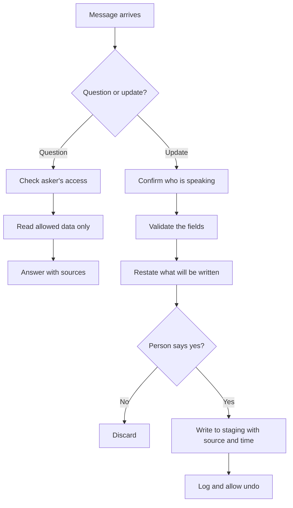

Whatever the channel, the same moment comes once a message arrives: the agent must work out whether it is being asked something or told to change something. This page sets out how to treat those two paths differently.

**In one line:** reading information and writing information are different risk levels, so an agent reached through a chat channel should be read-only by default and should only write after it knows who is asking, shows what it will change and gets a clear yes.

## The jargon: concepts covered on this page

- **Read-only access:** permission to view data but not to change it
- **Staging area:** a holding place where new data waits for review
- **Idempotency key:** a unique ID that makes repeating a request harmless
- **Superseded:** replaced by a newer version but kept in history
- **Red line:** a rule that is not bent, whatever the request

## Why it matters

A wrong answer to a question is annoying. A wrong write is worse, because it sits in your records and gets trusted later. A mistaken note on a company, a duplicated contact or an overwritten field can quietly spread into reports, summaries and other agents' answers.

Chat makes this sharper. Messages are typed fast, from a phone, in a busy group. People are casual, and the same casual sentence can be a question or an instruction. An agent that happily writes whatever it hears will, sooner or later, record something nobody meant.

There is also a security side. Anyone who can put text in front of the agent might try to steer it. Reading leaks at worst what that person was allowed to see. Writing can change what everyone else sees.

<mark>Make reading easy and writing deliberate: the more a request can change, the more checks it should pass.</mark>

## How it works

Treat questions and updates as two separate paths with different gates. The agent first works out which one the message is. Questions go down a short path with a permission check. Updates go down a longer path that ends with a person's yes and a record of what happened.

### Read-only by default

Start every channel with an agent that can only read. Add writing later, for specific record types, once the read side behaves. This is [least privilege](/running/least-privilege/) applied to the channel: if the agent has no write tool, no message can make it write.

### Separate paths, or separate agents

The cleanest design keeps the two paths apart. One agent, or one set of tools, handles questions and holds only read access. Another handles updates and holds only the narrow write tools, and it only runs after the confirmation step. This is the idea behind [subagents and multi-agent systems](/agents/subagents-and-multi-agent-systems/): split by power, not just by topic.

A simple way to split them in chat is an explicit marker. A message starting with "log:" or a slash command means update. Everything else is a question. Explicit markers cut down on guessing, and a model that guesses wrong about intent is a model that writes when it should read.

### Adding information safely

Each of these steps guards against a different kind of mistake.

1. **Confirm who is speaking.** Tie the chat user to a real colleague ([identity mapping](/channels/how-channels-connect/)). Only named people may add information, and perhaps only certain record types.
2. **Validate the fields.** Ask the model to turn the message into a fixed shape, such as company, date, note and type, using [structured outputs](/building/structured-outputs/). Then check the result in ordinary code: does the company exist, is the date sensible, is the length reasonable?
3. **Restate and ask.** Show the person what will be written, in plain words, and wait for a yes. This is [human in the loop](/agents/human-in-the-loop/). Show the actual values, not "shall I go ahead?".
4. **Write to a staging area first.** Put new entries in a draft status or a holding table, and promote them to the main records after a check. A draft that nobody reads again is still better than a wrong record that everyone trusts.
5. **Never overwrite.** Add a new note or a new version. Where a field must change, keep the old value in the history.
6. **Keep source and timestamp.** Store who said it, in which channel, when, and the original message. Later you can ask "where did this come from?" and get an answer.
7. **Avoid duplicates.** Chat platforms may deliver the same event twice, and people send the same message twice. Give each write an idempotency key (a unique ID for "this exact request") so the second attempt does nothing. See [triggers and scheduling](/building/triggers-and-scheduling/). Match the company to an existing record rather than creating a new one ([entity resolution](/data/entity-resolution/)).
8. **Make undo possible, and keep a trail.** Offer "undo that" for a short time, and record every write: who, what, when, from which message ([audit trails](/running/audit-trails/)).

### Limits on what a chat user can ask for

A chat user's request is bounded by their own access, not by what the agent can technically reach. Define, per person or role, which questions they may ask and which records they may add or change ([permissions and access control](/data/permissions-and-access-control/)). A new joiner might read pipeline notes but not LP details, and might add meeting notes but not change a deal stage.

### Preventing leaks through answers

An answer is a data flow. It must respect the asker's access, and also the audience. In a group chat, everyone present sees the answer. Either answer in the group only with what everyone there may see, or send the sensitive part privately. See [data exfiltration through tools](/running/data-exfiltration-through-tools/) for how information leaks out through the outputs an agent produces.

### Injection through what is added or retrieved

Text that arrives in a "log:" message, or text the agent pulls from a note, email or document, can contain instructions. If that text is later fed to another agent, it can steer it too. Treat all stored text as data, not orders, and keep write tools away from agents that read raw outside content. See [prompt injection](/running/prompt-injection/).

### Correcting wrong information

Mistakes happen, and they must be fixable. Provide a clear way to correct or retract an entry, and mark old versions as superseded rather than silently deleting them. Remember that copies exist elsewhere: search indexes, summaries and cached answers keep the old fact until they refresh. Plan how a correction reaches them ([keeping data fresh](/data/keeping-data-fresh/)).

## In practice

The checks look different at each level of risk.

| Question vs update: what to require | Question | Update |
| --- | --- | --- |
| Who is asking | Mapped to a known colleague | Mapped to a named colleague allowed to write |
| Access check | Answer only what that person may see | Check the person may add or change this record type |
| Confirmation | Not needed | Show the exact values, wait for a clear yes |
| Where it lands | Nothing is stored (apart from logs) | Staging or draft status first |
| Existing data | Untouched | Append a new version, never overwrite |
| Duplicates | Not a concern | Idempotency key and matching to existing records |
| Record kept | Log of who asked and what was read | Log with source, timestamp and original message |
| Undo | Not applicable | Offered for a short period and via history |
| Group chat | Answer only what the whole room may see | Confirm in a private message if values are sensitive |

Red lines worth writing down:

- No write without a named, permitted person and a visible yes.
- No overwrite or delete from chat.
- No write from content the agent merely read (an email, a document, a web page).
- No answer that contains more than the asker, and everyone in the room, may see.
- No agent that reads outside content and also holds both write and send powers.
- No new write tool before the read side has run well for a while.

## Worked example

Sample Ventures has an agent in its team chat. Two messages arrive in one afternoon.

**Message one:** a partner types "log: spoke to the Acme Payments founder today, wants to raise in March".

1. The "log:" marker routes it to the update path. The agent confirms the sender is a partner on the allowed list.
2. It extracts a structured entry: company Acme Payments, type call note, date today, detail "wants to raise in March". It matches Acme Payments to the one existing record rather than making a new one.
3. It replies in a private message: "I will add this note to Acme Payments, dated today: 'Spoke to the founder, wants to raise in March.' Add it?"
4. The partner replies "yes". The agent writes it to a draft-status note, with the partner as the source and the original message attached, and posts "Added. Reply 'undo' to remove it."
5. If the platform delivers the same message twice, the idempotency key stops a second note. If "March" was wrong, the partner corrects it. The agent adds a new version and marks the old one superseded, and the search index is refreshed.

**Message two:** an associate asks in the shared channel, "who has the highest conviction on Acme Payments?"

This is a question, so it needs no confirmation. It may still need a permission check. Conviction scores and who holds them may be limited to partners, and the room might include people who should not see them. The safe agent checks the asker's access first. If the associate may not see it, it says so politely. If the asker may see it but the room may not, it sends the answer privately instead of posting it in the group.

The two messages look similar and carry quite different risks. The first can change the record. The second can reveal something.

## Costs and limits

- **Safety adds friction.** Confirmations and staging slow down quick notes. Keep them for writes that matter, so people do not click yes without reading.
- **Intent detection is imperfect.** A model can mistake a question for an update. Explicit markers and a confirmation step make mistakes cheap.
- **Staging needs an owner.** A pile of unreviewed drafts helps nobody. Decide who promotes entries and how often.
- **Permissions take upkeep.** Role lists change as people join and leave. Review them regularly.
- **No design is airtight.** Even good controls reduce risk rather than remove it, which is why the write path is kept narrow and logged.

## Related

- [How chat channels connect to an agent](/channels/how-channels-connect/): the plumbing underneath every channel
- [Human in the loop](/agents/human-in-the-loop/): how and when a person approves
- [Permissions and access control](/data/permissions-and-access-control/): limiting what each person can ask for
- [Prompt injection](/running/prompt-injection/): why added and retrieved text is untrusted
- [Audit trails](/running/audit-trails/): recording who did what, and when

## Next up

This is the last elective, and the end of the guide: it has gone from what a model is to an agent people can safely reach from the apps they already use. [Start here](/start/start-here/) lays out the reading paths if you want to go round again by a different route, and when a term slips, the [glossary](/reference/glossary/) is the quickest place to return to.
