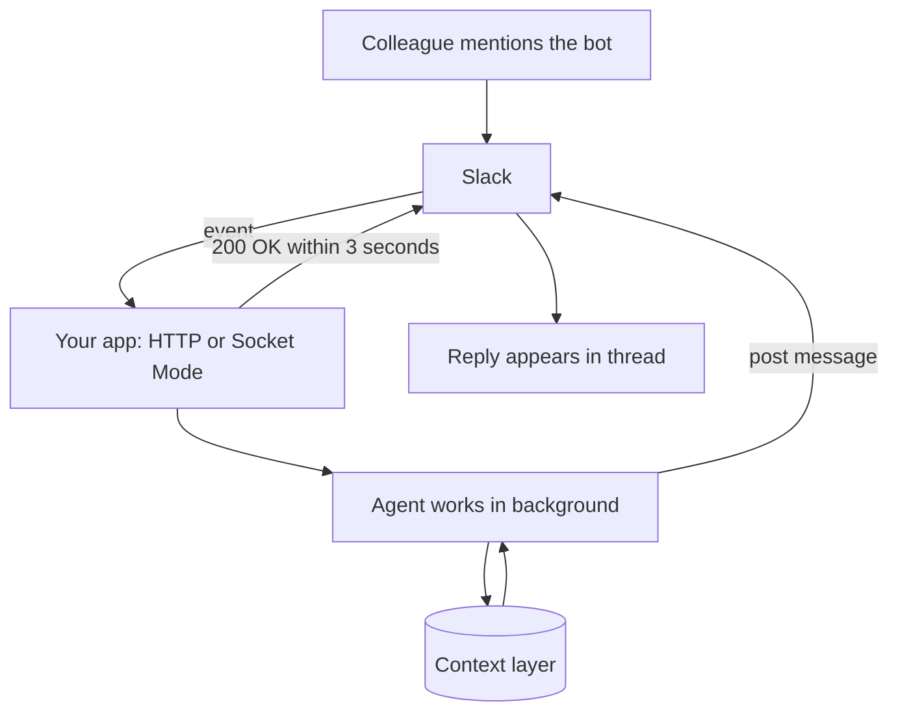

Slack is the other main team chat, built on the same pattern of a registered app, incoming events and posted replies. This page covers how Slack does it, what it allows and how to keep it safe.

**In one line:** a Slack app with a bot user lets colleagues message your agent in direct messages or channels, and Slack calls your code every time something happens.

## Why it matters

Many small firms and startups run on Slack. If the agent lives there, people can ask a question in a thread, get an answer where the discussion already is, and let others see it.

Slack is also friendly to builders. You can run an app on a laptop with no public web address, which makes a first experiment cheap. The trade-off is that Slack has clear rules about what apps may read and store, and those matter more once an agent is involved.

<mark>Slack gives your app only a three-second window to acknowledge each event, so an agent must say "received" at once and send its real answer later.</mark>

This page is general information as of October 2026. Slack's developer docs change often, so check them before building. A regulated firm must follow its own compliance policies. Nothing here is legal advice.

## How it works

A **Slack app** is the thing you register with Slack. It can have a **bot user**, which is a member-like account that appears in the workspace and posts messages. Your code runs somewhere else and talks to Slack through the Slack [API](/agents/apis-oauth-and-api-keys/).

When something happens that your app asked about (a message in a direct chat, an @mention), Slack sends an **event**. You choose how events arrive:

- **Events API (HTTP):** Slack sends an HTTP request to a public address you provide, called the request URL.
- **Socket Mode:** your app opens a websocket (a long-lived two-way connection) to Slack and receives events through it. Slack's docs say this needs no public HTTP address and suits developers behind a corporate firewall. They also say apps using Socket Mode are not currently allowed in the public Slack Marketplace, which does not matter for an internal app.

Whichever you pick, Slack's docs say your endpoint must reply with an HTTP 200 within 3 seconds, or Slack may retry. Slash commands and button clicks have the same three-second acknowledgement. So the pattern is: acknowledge immediately, do the slow agent work in the background, then post the answer with the Web API (or reply through the response URL Slack gives you for commands and buttons).

### Ways people reach the bot

- **Direct message** to the bot. Needs a subscription to direct-message events.
- **@mention in a channel.** Slack has an app mention event for this. Slack's docs say you only receive it if the app is in the conversation or is invited to join.
- **Slash commands** such as `/ask`. Good for a fixed entry point.
- **Threads.** The bot can reply in a thread so a long answer does not flood a channel.
- **Buttons.** Slack's **Block Kit** is its format for rich messages. A message can carry buttons, and a click sends your app an interaction payload that also needs a three-second acknowledgement. This is how you build an Approve and Cancel step for [human in the loop](/agents/human-in-the-loop/).

### Slack's own agent features

Slack's docs describe an "Agents" feature for AI apps, with a dedicated panel, app threads, suggested prompts, a status indicator (a "processing" state) and text streaming of replies. The docs state that developing and using some AI features requires a paid plan, and that developers can use a free sandbox through Slack's Developer Program. Method and feature names here are still changing, so read the current docs.

## What you need

- **A Slack workspace** where you can create or install an app. By default, Slack members can install apps without approval, but workspace owners can switch on approval so that admins review each app. This is available on all plans.
- **An app registered at Slack's developer site**, with the features you want switched on: a bot user, event subscriptions, and optionally slash commands and interactivity.
- **Scopes.** A **scope** is a permission the app asks for, such as reading messages in channels it is in or posting messages. Ask for the fewest you need, in line with [least privilege](/running/least-privilege/).
- **Tokens.** Slack's docs describe three kinds. A **bot token** (starts with `xoxb-`) acts as the bot. A **user token** (`xoxp-`) acts as a person and has the access that person has. An **app-level token** (`xapp-`) relates to the app as a whole, and is what Socket Mode uses. Slack says to treat all tokens as sensitive credentials and never commit or log them. Store them as [secrets](/building/environment-variables-and-secrets/).
- **A signing secret.** A value Slack gives your app so it can check that incoming requests really came from Slack.
- **A place to run the code.** A laptop for Socket Mode, or a hosted endpoint for the Events API. Slack's Bolt frameworks (for JavaScript, Python and Java) handle much of the plumbing.

For an agent, prefer a bot token. A user token lets the agent act as a person, which widens the damage if something goes wrong.

## What the platform allows (as of October 2026)

**Request checking.** Slack signs each request. Your code recomputes the signature using the signing secret and the raw request body, and rejects the request if it does not match or if the timestamp is more than five minutes old. Bolt does this automatically.

**Visibility.** Events depend on scopes and on membership. Your bot sees conversations it is in. If it is not invited to a channel, it does not receive that channel's events. Slack's docs say AI features inside Slack respect what each member can already access.

**Message rate.** Slack limits API calls per method, per workspace and per app. For posting messages, the docs give about one message per second per channel as a guide. If you are limited, Slack returns a 429 error with a header telling you how long to wait. See [rate limits, retries and failures](/running/rate-limits-retries-and-failures/).

**Reading history.** In May 2025 Slack cut the rate for reading channel history and thread replies for new commercially distributed apps that are not in the Marketplace, to one request a minute with a small page size. Slack's changelog says internal apps built by a customer for its own workspace are not affected. A firm building its own app counts as internal, but check the current docs.

**Slack MCP server.** Slack documents an [MCP](/agents/mcp/) server that lets AI apps search messages and files, send messages and read threads. Per the docs, only directory-published or internal apps may use it, authorisation is by OAuth, and workspace admins can approve and manage these integrations. Claude, Claude Code and Cursor are listed among supported clients. This is an alternative to writing your own bot when you only need an AI tool to read Slack.

**Policy on data and AI.** Slack's API terms forbid third-party apps offered to other organisations from using API data to train a large language model, bulk exporting message and file data (except under a separate agreement) and keeping persistent copies or long-term stores of other organisations' data. These terms are written for apps serving other customers. Whether and how they apply to a firm's own internal app, and to something like a context layer that stores summaries, is a question for the firm's counsel and Slack's current terms. This guide has not tested that edge.

Slack also states that its own AI features never use customer data to train large language models. That is a statement about Slack's features, not about your own agent, which has its own model provider and [data terms](/models/data-terms-at-a-glance/).

## Security and compliance

**Who can message it.** Anyone in the workspace who can see the bot can message it. If it is in a channel, everyone in that channel can trigger it. Check the Slack user ID of the sender against an allowed list in your code, and keep the agent in direct messages or a private channel first.

**Private versus shared spaces.** A bot's answer in a public channel is visible to everyone there. If the agent has access to confidential data, an answer built from it must only go where the asker is allowed to see it.

**Untrusted text.** Slack messages from guests, other apps or pasted content can contain hidden instructions. Treat message text as input, not orders. See [prompt injection](/running/prompt-injection/).

**Retention and export.** Slack documents workspace retention settings that cover messages, files, canvases and lists. On paid plans the default is to keep data for the workspace's lifetime, with custom periods available, and private channels and direct messages can have their own settings on paid plans. A bot's messages are ordinary messages in this record. Ask your Slack owner what export and legal-hold options your plan offers, and ask compliance whether Slack is approved for the kind of conversations you expect.

**What your agent stores.** If the agent copies Slack content into its own database, that data now lives under your own retention rules. See [GDPR, data retention and DPAs](/running/gdpr-data-retention-and-dpas/) and [audit trails](/running/audit-trails/).

## Worked example

Sample Ventures wants a bot, "Scout", that answers questions about portfolio companies and drafts CRM notes.

1. **Setup.** The developer creates a Slack app with a bot user and asks for a small set of scopes. The operations lead, who is a workspace owner, approves it.
2. **First run.** The developer runs it on a laptop in Socket Mode, which needs no public web address.
3. **A question.** An associate sends Scout a direct message: "Summarise the last two touchpoints with Acme Payments." Slack sends an event. The app replies 200 at once and the agent starts work.
4. **The answer.** The agent reads the context layer and posts a reply in the thread, with links to its sources.
5. **A write.** The associate says "save that as a note". Scout posts a message with the full note and Approve and Cancel buttons. A click sends another event, which the app acknowledges and then acts on.
6. **Moving on.** After a trial, the developer moves the app to a hosted endpoint using the Events API, so it keeps running when the laptop is closed. The operations lead asks compliance to confirm the retention setting for direct messages with the bot.

## Costs and limits

- **The app itself costs little to run.** You pay for hosting and for the model calls the agent makes.
- **Some Slack AI features need a paid plan.** Slack's docs say so for developing and using certain AI features.
- **Three-second windows force a design.** Every agent needs an acknowledge-then-answer pattern.
- **History access is tightly limited for distributed apps.** This pushes you to store only what you need, not to mirror a workspace.
- **Noise.** A bot that answers every message in a busy channel becomes unpopular. Use mentions, threads and a dedicated channel.
- **Tokens leak easily.** A token pasted into a message or a public repository gives away the bot's powers. Rotate and revoke quickly.

## Related

- [How channels connect](/channels/how-channels-connect/): the shared pattern across chat channels
- [Querying vs adding safely](/channels/querying-vs-adding-safely/): separating read access from write actions
- [Microsoft Teams](/channels/microsoft-teams/): the same idea for a Microsoft 365 firm
- [Human in the loop](/agents/human-in-the-loop/): approval buttons before writes
- [Least privilege](/running/least-privilege/): small scopes and narrow access

## The proper terms

- **Slack app:** a program registered with Slack that can read events and post messages
- **Bot user:** an account-like identity an app uses to post in Slack
- **Scope:** a named permission an app asks for
- **Bot token:** a secret string that lets an app act as its bot
- **Request URL:** the public address where Slack sends events
- **Socket Mode:** receiving Slack events over a websocket instead of a public address
- **Signing secret:** a value used to check that a request came from Slack
- **Block Kit:** Slack's format for rich messages with buttons and layouts
- **Slash command:** a typed shortcut such as /ask that triggers an app

## Next up

Teams and Slack serve people inside the firm. [WhatsApp](/channels/whatsapp/) is the usual route to people outside it, and it comes with far more rules.
