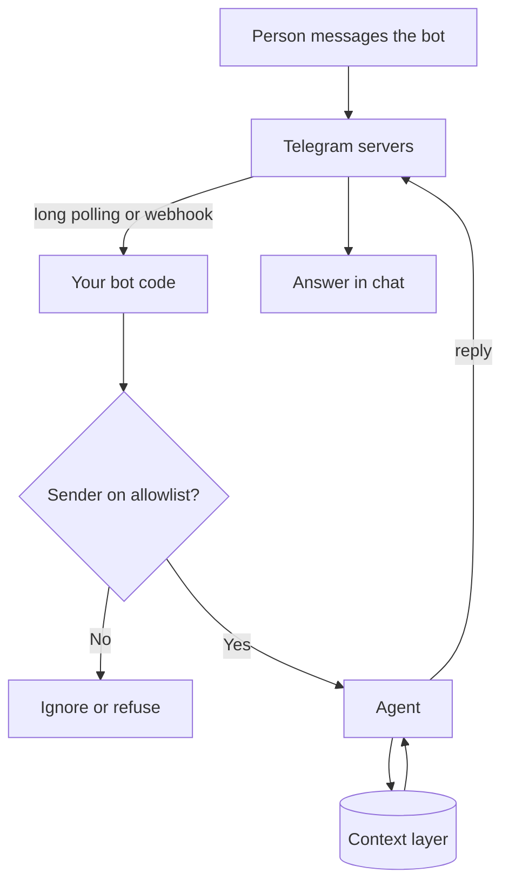

After WhatsApp's rules, Telegram is the lightest channel in this section of the guide. This page covers how its bots work and why a firm should still decide on purpose before using one for work.

**In one line:** a Telegram bot is an account run by code instead of a person, and it is the quickest way to put an agent behind a chat app.

## The jargon: concepts covered on this page

- **Bot token:** a secret string that lets code act as a Telegram bot
- **BotFather:** Telegram's official bot for creating and managing bots
- **Long polling:** repeatedly asking a server whether anything new has arrived
- **Privacy mode:** a setting limiting which group messages a bot can see
- **Inline keyboard:** buttons shown under a message that send a callback when pressed
- **Cloud chat:** a Telegram chat stored on Telegram's servers, not end-to-end encrypted by default
- **Secret chat:** a one to one Telegram chat with end-to-end encryption
- **Allowlist:** a short list of approved senders, with everyone else ignored

## Why it matters

Telegram is the easiest channel to start with. There is no company approval step, no app review and no admin console. You message a bot called BotFather, get a token, and your code can be chatting within an hour.

That is why it is popular for personal and hobby agents. It is also why a firm needs to pause before using it for work. The same lack of gatekeeping means nobody in your organisation controls who finds the bot, where messages are stored, or whether the conversation counts as an approved business record.

<mark>Telegram makes it easy to build a bot, and that ease is the reason a firm must decide on purpose whether it should be used for work at all.</mark>

This page is general information as of October 2026. Telegram's bot documentation changes, so check it before building. A regulated firm must follow its own compliance policies, and whether Telegram is allowed for business communication is a question for compliance. Nothing here is legal advice.

## How it works

A **bot** is a special Telegram account. You create it by chatting to **BotFather**, Telegram's own bot for making bots. You pick a name and a username (Telegram's docs say bot usernames must end in "bot"), and BotFather gives you a **bot token**, a long secret string that lets code act as the bot.

There are two ways for your code to receive messages. Telegram's Bot API docs describe them as mutually exclusive:

- **Long polling (`getUpdates`):** your code repeatedly asks Telegram "anything new?". Nothing needs to be reachable from outside, so it works on a laptop behind a firewall.
- **Webhook (`setWebhook`):** you give Telegram an HTTPS address and Telegram sends each new message there. The docs list the supported ports as 443, 80, 88 and 8443, and say you can set a **secret token** that Telegram repeats in a header on every call so you can tell the call is genuine.

Telegram says it keeps updates on its servers until your bot collects them, but not longer than 24 hours.

### Useful pieces for an agent

- **Commands.** Short `/keyword` instructions, such as `/start` and `/help`. Telegram suggests commands when someone types a slash.
- **Inline keyboards.** Buttons shown under a message. Pressing one sends your bot a callback, not a chat message. This is how you build an Approve and Cancel step for [human in the loop](/agents/human-in-the-loop/).
- **Typing indicator.** A bot can send a "typing" status, which the docs say lasts about five seconds. Resend it while a slow agent works.
- **Voice and files.** Voice messages arrive as a voice object with a file ID that your code can download. Your agent needs a speech-to-text model to understand them.

## What you need

- **A Telegram account** to talk to BotFather. No company paperwork is required.
- **A bot token.** Telegram says to treat it like a password and not share it. It can be revoked through BotFather if exposed. Keep it in an [environment variable or secret store](/building/environment-variables-and-secrets/), never in code.
- **A small program** that receives updates, checks the sender, calls the agent and replies. Libraries exist for most languages.
- **A place to run it.** A laptop or small server for long polling, or a public HTTPS endpoint for webhooks.
- **A list of allowed Telegram user IDs.** Every person has a numeric ID that arrives with each message. This list is part of your own code, not a Telegram setting.

## What the platform allows (as of October 2026)

**Who can start a conversation.** Telegram's docs say bots cannot initiate contact: a person has to message the bot first. Anyone who finds a public bot username can do that. The bot itself decides whether to respond.

**Groups and privacy mode.** Telegram says all bots added to groups run in privacy mode by default, so they see only explicit @mentions and replies to their own messages (and commands aimed at them). Telegram's docs say a bot that is made a group admin receives all messages. Bots also cannot see other bots' messages.

**Rate limits.** The FAQ advises avoiding more than about one message per second in a single chat, and about 20 messages per minute in a group. Going over can produce 429 errors. Broadcast limits are higher and have a paid option, which does not matter for an internal assistant.

**File sizes.** Via the standard Bot API, bots can download files up to 20 MB and send files up to 50 MB, according to the FAQ. Telegram offers a local Bot API server for larger files.

**Review.** There is no approval process for creating a bot. Telegram's own terms apply, so read them for your use.

**Policy on AI assistants.** No Telegram rule was found that stops a bot being powered by an AI model. Check the current bot terms and platform rules for your use.

## Security and compliance

**Who can message it.** Assume anyone. A bot's username can be found and messaged by any Telegram user. Without a check, a stranger could talk to your agent and, through it, to anything it can reach. The fix is an **allowlist**: your code compares each sender's numeric user ID against a short list and silently ignores everyone else. This is [least privilege](/running/least-privilege/) applied to chat. Do not rely on a hard-to-guess username as the lock.

**Webhook checks.** If you use a webhook, set the secret token and reject calls that lack the matching header. Otherwise anyone who learns your endpoint address can send fake updates.

**Encryption.** Telegram's FAQ says its cloud chats use server-client encryption and are not end-to-end encrypted by default, while secret chats have extra client-to-client encryption. Secret chats are one to one chats between two people. Telegram's docs do not describe bots as supporting secret chats, so assume a bot chat is a cloud chat. That means Telegram's servers hold the conversation, and the bot's code and host see it in plain text. Telegram's privacy policy also says bot developers receive the messages sent to their bots, along with public profile data.

**Confidential business content.** Because of the points above, think carefully before letting colleagues send investor, founder or deal information to a Telegram bot. This is a question for your compliance function, not something this page can settle.

**Records.** A firm may have duties to keep and search business communications, and policies about which apps are approved. Telegram does not give an organisation admin controls over a bot chat in the way Teams or Slack do, as far as the documentation shows. Ask compliance whether Telegram is on the approved list, how messages would be retained and how they could be produced if asked.

**Your own logs.** The bot's host will probably store messages in logs or a database. That is now your data, with your own retention duty. See [GDPR, data retention and DPAs](/running/gdpr-data-retention-and-dpas/) and [audit trails](/running/audit-trails/).

**Untrusted text.** Forwarded messages, links and documents can contain hidden instructions. See [prompt injection](/running/prompt-injection/).

## Worked example

An associate at Sample Ventures wants to try a personal research assistant, using only public information and no firm data. The firm has not approved Telegram for client or deal discussions.

1. **Create the bot.** She chats to BotFather, chooses a name, and receives a token. She stores it as a secret on her own hosting account.
2. **Allowlist.** Her code holds one number: her own Telegram user ID. Messages from anyone else are ignored.
3. **Receive.** She starts with long polling on her laptop. Later she moves to a webhook with a secret token.
4. **Ask.** She sends "What are the main competitors to Acme Payments?". The bot shows "typing" while the agent searches public sources and replies.
5. **Confirm.** If the agent wants to save a note to her personal notes file, the bot sends a message with Approve and Cancel buttons.
6. **The firm question.** If the team later wants this for real work, the operations lead takes it to compliance and weighs Teams or Slack, where the organisation has admin and retention controls, before moving any firm information onto it.

## Costs and limits

- **Free to build, cheap to run.** Telegram does not charge for ordinary bots. You pay for hosting and model calls.
- **Light on setup, light on controls.** There is no admin console for your organisation, no central user directory and no approval flow.
- **Slow replies need handling.** The typing status expires after about five seconds, so resend it, or send a "working on it" message.
- **Large files need care.** A 20 MB download limit on the standard API can block big decks or recordings.
- **Group chats get noisy.** Privacy mode helps, and an agent in a group could reveal private answers to everyone in it.
- **Account risk.** Whoever holds the token controls the bot. Revoke it if it leaks.

## Related

- [How channels connect](/channels/how-channels-connect/): the shared pattern behind every chat channel
- [Querying vs adding safely](/channels/querying-vs-adding-safely/): read-only questions versus actions that change data
- [Slack](/channels/slack/): a workspace tool with admin approval and retention controls
- [Microsoft Teams](/channels/microsoft-teams/): the Microsoft 365 route
- [Least privilege](/running/least-privilege/): why an allowlist beats an obscure username

## Next up

Every page so far starts from a chat app and lets you choose the model behind the bot. [xAI Grok and bots](/channels/xai-grok/) starts from the other end: one model provider and what it offers for chat channels.
