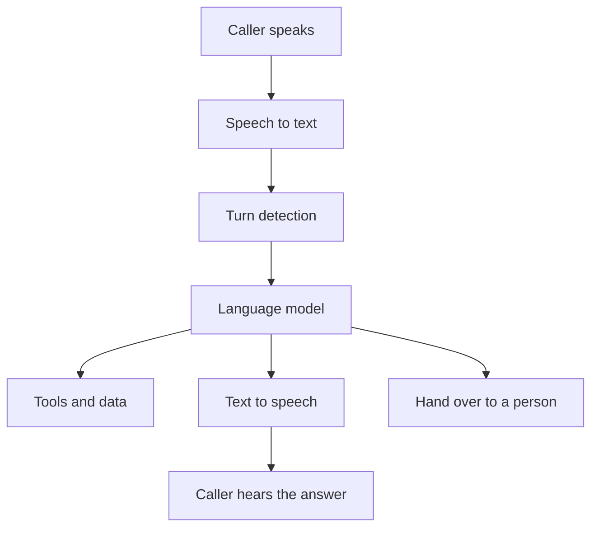

Email is written and slow: an agent can take minutes over a reply and a person can check the draft. A phone call is spoken and happens in real time, so this page covers how agents that talk work and what changes when nobody can pause the conversation to review it.

**In one line:** a voice agent turns speech into something a model can work with, lets the model think and use tools, then speaks the answer back, all fast enough to feel like a conversation, whether it lives in a phone line, a website or an app.

## The jargon: concepts covered on this page

- **Barge-in:** the caller talking over the agent, which should make it stop and listen
- **Latency:** the delay between someone finishing speaking and the agent starting to answer
- **SIP:** a standard way to set up and connect internet phone calls
- **Speech-to-speech model:** a model that listens to audio and replies in audio directly
- **Speech-to-text:** turning spoken words into written text, also called transcription
- **Telephony provider:** a company that supplies phone numbers and connects calls to software
- **Text-to-speech:** turning written text into a spoken voice
- **Turn detection:** working out when a speaker has finished and it is the other side's turn
- **Warm transfer:** handing a call to a person along with a short summary of what was said

## Why it matters

Plenty of people would rather talk than type. Someone driving, cooking, carrying a toddler or ordering a birthday cake often reaches for the phone, not a chat box. For a small business, a missed call can be a missed order, and an agent that answers out of hours can take the simple ones.

Voice is also the most personal channel in this section. People expect a voice to belong to a person, they say more than they would type, and a recording of their voice is sensitive data. A voice can also be copied. That mix makes voice agents useful and makes the rules on this page matter more than on any chat channel.

This page is general information, not legal advice. Products and rules change quickly, so treat every named service and rule here as a snapshot as of October 2026.

## How it works

There are three everyday forms of the same idea:

- **Voice mode in an assistant app.** You talk to Claude or ChatGPT instead of typing, and it talks back.
- **A voice assistant on a website or in an app.** A "talk to us" button that opens a spoken conversation.
- **A phone agent.** It answers calls to a real phone number, or makes calls, and talks to whoever is on the line.

Under the bonnet, the classic design is a relay of three steps, often called a pipeline (or a cascade):

1. **Speech-to-text.** A transcription model listens to the audio and writes down what was said.
2. **The model, with tools.** An ordinary language model reads the text, follows its [system prompt](/using-ai/system-prompts/) and can call [tools](/agents/tool-use/), such as checking a calendar or writing an order into a spreadsheet.
3. **Text-to-speech.** A voice model reads the answer aloud.

In car terms, the [model](/start/what-an-llm-is/) is still the engine. Voice adds a microphone and a loudspeaker to the dashboard, and the whole car has to react at conversation speed.

### The hard parts

The pipeline is easy to draw and hard to make pleasant. Four problems take most of the effort.

- **Speed (latency).** In conversation, a gap of more than a second or so starts to feel awkward. Every step adds delay: listening, transcribing, the model thinking, any tool call, then generating speech. Builders stream each step so the voice starts before the full answer is ready, and keep tool calls quick. A slow [reasoning model](/using-ai/reasoning-models/) is often the wrong engine here.
- **Turn-taking and interruptions.** The agent must guess when you have finished, not just paused to think. Guess too early and it cuts you off; too late and it feels sluggish. When the caller talks over it (barge-in), it should stop speaking, listen and drop the rest of its sentence.
- **Accents, names and noise.** Transcription is good but not perfect. Strong accents, background noise, poor phone lines, unusual names, postcodes and numbers are where mistakes creep in. An order for "fifteen" heard as "fifty" is a real risk, so important details should be read back.
- **Handing over to a person.** Some calls need a human: a complaint, a complex request, a distressed caller, or simply someone who asks. A good agent hands over cleanly, ideally as a warm transfer with a summary, or by taking details for a callback. A caller stuck in a loop with a bot they cannot escape is the classic failure.

### The newer approach: speech-to-speech

Some newer models skip the relay and handle audio directly: they listen to sound and reply with sound. OpenAI describes its Realtime API this way, as processing and generating audio through a single model rather than chaining speech-to-text and text-to-speech. ChatGPT's voice describes its live mode as able to listen and speak at the same time, which makes interruptions feel more natural (both as of October 2026).

The appeal is speed and tone: the model hears hesitation and emphasis that a transcript loses, and it can answer with more natural expression. The trade-off is less control. In a pipeline you can read and check the transcript, pick any model you like for each step, and log exactly what was said. Many production phone agents still use a pipeline for that reason, and both designs are in active use.

## Where it connects

A voice agent needs a way to reach people's ears. There are three main doorways.

- **Phone numbers, through a telephony provider.** A telephony provider rents you a phone number and connects each call to software. Twilio is a long-standing example; its ConversationRelay feature handles the speech-to-text and text-to-speech and streams the conversation as text to your own application, which picks the language model. Many voice platforms also accept calls over SIP, the standard that internet phone systems use to set up calls, so a business can route its existing number or office phone system to an agent.
- **Web widgets.** A button or small panel on a website that opens a spoken conversation in the browser. Several voice platforms offer one ready-made.
- **Apps.** Voice built into a mobile or desktop app, as in the Claude and ChatGPT apps, or into your own app through a developer kit.

The plumbing from [how chat channels connect](/channels/how-channels-connect/) still applies. Calls arrive as events, the agent acts with limited permissions, and everything is logged. The difference is the clock: there is no "received, answer later" in a live call. If the agent needs to do something slow, it says so, or promises a callback.

## Examples of the category (as of October 2026)

These are examples, not recommendations. Check each provider's current documentation before relying on a detail.

- **Voice mode in Claude.** Anthropic's help centre says voice mode is available on mobile, desktop and the web, on all plans, and is built to work best on a phone. It offers a hands-free mode and a push-to-talk mode for noisy places, can use web search and connected tools such as email and calendar, and saves a text transcript in your chat history. Voice conversations count towards normal usage limits.
- **Voice in ChatGPT.** OpenAI's help centre lists voice on web, mobile and desktop apps, with usage limits that vary by plan. It says live voice keeps a text transcript in chat history, and that audio clips are kept for a period and deleted when the chat is deleted, with some exceptions. Check the current help page for details.
- **Voice agent platforms.** Services such as Vapi, Retell and ElevenLabs Agents (which ElevenLabs also calls ElevenAgents) let you build an agent that answers or makes calls and talks on websites. Vapi describes a speech-to-text, language model and text-to-speech pipeline where you can choose the provider for each part. Retell documents both cold and warm transfers to a person. ElevenLabs documents a phone connection through Twilio or SIP, a web widget, and a tool to transfer a call to a phone number.
- **Speech-to-speech developer APIs.** OpenAI's Realtime API handles audio in a single model and supports SIP for connecting to phone networks.
- **Phone lines.** Telephony providers such as Twilio supply the numbers and connect calls to whichever agent you build.

Many voice platforms let you pick the language model underneath, so the choice of voice platform and the choice of model are often separate decisions.

## Rules and risks

### Tell callers they are talking to AI

Be upfront from the first words: "Hello, you're through to Bramley's automated assistant." It is honest, it sets expectations, and in some places it is a legal duty. The EU AI Act includes a transparency rule, applying from 2 August 2026, that AI systems talking directly with people must let them know they are dealing with AI unless it is already obvious. Other countries have their own rules, and in the US, regulators have treated AI-generated voices in automated calls under existing robocall law. If you serve customers in several countries, check the rules for each.

Making calls is stricter than answering them. Unsolicited marketing calls, automated or not, are regulated in the UK, the EU and elsewhere. Do not point an outbound calling agent at a contact list without advice.

### Recording, transcripts and data protection

A voice agent almost always produces a recording, a transcript or both, and these are personal data. Under UK and EU data protection law (UK GDPR and the EU GDPR), you generally need to tell callers you are recording or transcribing, why, how long you keep it and who else handles it, and you need a lawful reason to do it. That reason is not always consent, so check which applies to you.

Two further points. If voice is used to recognise who someone is (a voiceprint), it can count as biometric data, which gets extra protection. And the voice platform, the model provider and the telephony provider may all handle the call, so each is a data processor you need terms with. [GDPR, data retention and DPAs](/running/gdpr-data-retention-and-dpas/) in Part 6 covers this. A regulated firm should also check its own rules on recording and keeping calls.

### Voice cloning and impersonation fraud

Modern text-to-speech can copy a voice from a short sample. Criminals use cloned voices to pose as a boss, a relative or a customer. In the UK, National Trading Standards warned in early 2026 about scams that used cloned voices to fake people's consent to direct debits.

Two lessons follow. Never clone a real person's voice without their clear permission, and pick a voice that is plainly a brand voice. And never treat a voice as proof of who someone is.

### Never act on sensitive requests by voice alone

<mark>A voice on the phone is not proof of identity, so an agent should never change payment details, release personal information or move money because a caller asked.</mark>

This is the voice version of the spoofed sender in [email](/channels/email/). Callers can also try to talk an agent into things it should not do, which is [prompt injection](/running/prompt-injection/) by speech. Keep a phone agent's tools narrow: it may read opening hours and add an order to a list, but anything sensitive goes to a person, who checks through a separate channel they already trust. This is [human in the loop](/agents/human-in-the-loop/) and [least privilege](/running/least-privilege/) applied to a phone line.

## Worked example

Bramley's is a two-person bakery. Sam, the owner, misses calls while her hands are in dough, and many of them are simple cake orders for the next few days.

1. Sam picks a voice agent platform that connects to a phone number through a telephony provider. She points the shop's number at it during baking hours.
2. The agent opens with: "Hi, you're through to Bramley's automated assistant. Calls are recorded so we can get your order right. Would you like to place an order, or speak to Sam?"
3. Its [system prompt](/using-ai/system-prompts/) lists the standard cakes, sizes and how much notice each needs. Its only tools are reading that menu and the order calendar, and adding an order to a "to confirm" list.
4. A caller orders a lemon drizzle for Saturday. The agent reads back the cake, the day, the name and the phone number, then says Sam will text a confirmation.
5. Another caller wants a three-tier wedding cake with a custom design. That is outside the standard menu, so the agent does not quote or promise anything. It takes the caller's name, number, date and a short description and says Sam will call back.
6. Anyone who asks for a person, or sounds upset, is offered a callback or put through to Sam's phone if she has marked herself available.
7. The agent never takes card details by voice and never changes an existing order on a caller's word alone. Sam confirms changes herself by calling the number on the original order.
8. Sam checks the "to confirm" list and the callback list twice a day. Transcripts are kept for a short, fixed period, as stated in the shop's privacy notice.

Notice the shape: the agent handles the routine part, and anything custom, sensitive or unusual goes to a person.

## Costs and limits

- **Usually billed by the minute.** Voice platforms, telephony and models tend to charge for call time and usage, and several services can be stacked on one call. Long calls and hold music cost money. Check each provider's current pricing and [estimate the cost per task](/running/estimating-cost-per-task/).
- **Speed limits what the agent can do.** Slow tools and slow models make calls awkward. Keep lookups fast and push anything slow into a callback or a follow-up message.
- **Mishearing is normal.** Read back names, numbers, dates and amounts. Test with different accents, noisy rooms and bad lines before going live, and keep doing [evals](/running/evals/) on real calls.
- **Phone systems are fiddly.** Numbers, call routing, SIP and transfers have their own settings. Expect setup time, especially when connecting an existing business number.
- **Rules differ by country and change.** Disclosure, recording and calling rules vary. This page is a snapshot as of October 2026, not legal advice.

## Often confused with

- **Voice mode vs a phone agent.** Voice mode is you talking to your own assistant in an app. A phone agent talks to other people, often strangers, on your behalf, so it carries far more duty around disclosure, recording and safety.
- **Speech-to-text vs speech-to-speech.** Speech-to-text is one step in a pipeline that ends in text. A speech-to-speech model replaces the whole pipeline, hearing and speaking in one go.
- **Text-to-speech vs voice cloning.** Text-to-speech reads text in any voice. Voice cloning makes it sound like a specific real person, which needs that person's permission.

## Related

- [How chat channels connect to an agent](/channels/how-channels-connect/): the shared plumbing of events, identity and permissions
- [Email](/channels/email/): the written, slower channel and its spoofing risks
- [Multimodal models](/using-ai/multimodal-models/): models that handle more than text
- [Human in the loop](/agents/human-in-the-loop/): when a person must step in
- [GDPR, data retention and DPAs](/running/gdpr-data-retention-and-dpas/): recordings, transcripts and processors
- [Prompt injection](/running/prompt-injection/): why what callers say is untrusted input

## Next up

Whether a request is typed, emailed or spoken, the agent still has to decide whether it is only being asked something or told to change something. [Querying vs adding information safely](/channels/querying-vs-adding-safely/) sets out how to handle each.
