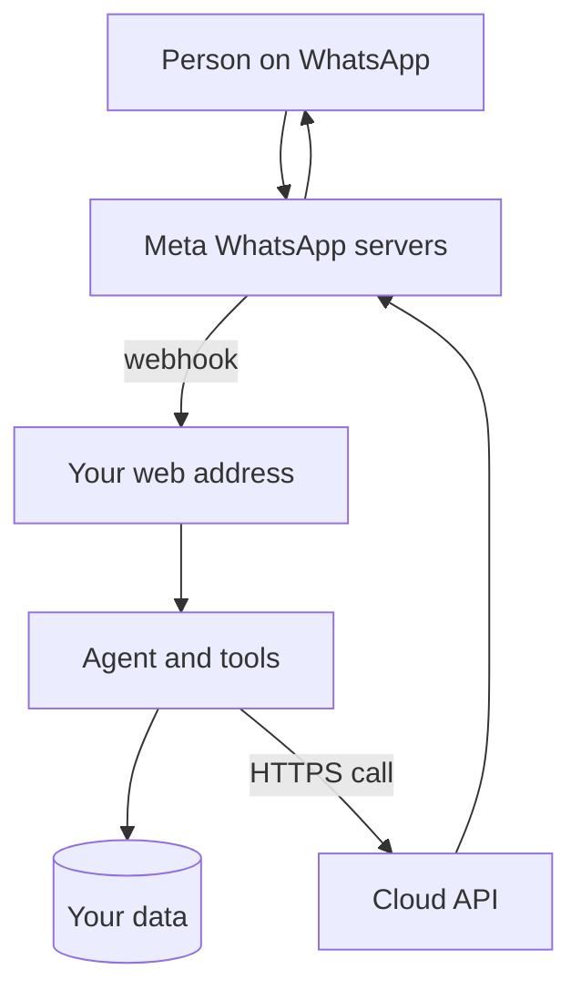

Teams and Slack reach colleagues, but founders, co-investors and advisers are more often on WhatsApp. This page covers the official route for an agent to reach them and the rules that come with it.

**In one line:** WhatsApp lets a business connect an agent through an official programming interface (the WhatsApp Business Platform), but it comes with a registered business number, message templates, opt-in rules and a policy on AI assistants that you must read before you build.

## The jargon: concepts covered on this page

- **WhatsApp Business Platform:** Meta's developer interfaces for connecting software to WhatsApp
- **Cloud API:** Meta-hosted interface for sending and receiving WhatsApp messages
- **Business portfolio:** Meta's container for a firm's business assets and WhatsApp accounts
- **Customer service window:** 24 hours after a user messages you, when free-form replies are allowed
- **Message template:** pre-approved message wording needed to start or restart a conversation
- **Opt-in:** a person's permission to be contacted by your business
- **Messaging limit:** cap on how many people you can start conversations with per day

## Why it matters

Almost everyone already has WhatsApp, including founders, co-investors and advisers who will never join your Slack or Teams. That makes it a natural way to reach people outside your firm. For a small VC firm it is more often the channel for external contacts than for the team itself.

It is also the channel with the most rules. Meta (the company behind WhatsApp) controls who can connect, how you may start conversations, and what kind of AI product you may offer. A regulated firm also has to think about where those conversations are recorded.

<mark>WhatsApp is open to a business assistant only through the official Business Platform, and the rules on templates, opt-in and AI products shape what you can build.</mark>

This page is general information, not legal advice. Your firm's compliance policies decide whether and how you may use any channel.

## How it works

There are two different things called "WhatsApp for business". The **WhatsApp Business app** is a phone app for a small business owner who replies by hand. The **WhatsApp Business Platform** is a set of programming interfaces for developers, and Meta's own documentation says it is aimed at "developers using our APIs". Only the Platform is a route for an agent.

The Platform's main interface is the **Cloud API**, which Meta hosts for you. You do not run any WhatsApp software yourself. Messages come to you and go out from you over the internet:

- **Incoming:** when a person messages your business number, Meta sends a [webhook](/channels/how-channels-connect/) (a small automatic message to a web address you control) containing the message and the sender's number.
- **Outgoing:** your code replies by making an HTTPS call (an ordinary secure web request) to Meta's Graph API.

Meta's documentation says it retries a failed webhook with decreasing frequency for up to seven days, so your code must cope with the same message arriving twice. It also lists mutual TLS (a way for both sides to prove who they are) as an option for securing the connection. See [how channels connect](/channels/how-channels-connect/) for the general pattern, and [serverless functions](/building/serverless-functions/) for a common place to host the receiving address.

## What you need

As of October 2026, Meta's documentation lists these building blocks:

- **A business portfolio.** This is Meta's container for your business assets, including your WhatsApp Business Account (WABA).
- **A WhatsApp Business Account** that holds your phone numbers and analytics.
- **A business phone number registered for the Cloud API.** Meta's phone number page says a number already in use with WhatsApp cannot be registered unless it is deleted from WhatsApp first. It must be owned by you and able to receive an SMS or voice call for verification. Mobile numbers are recommended, and a display name is required.
- **An app and an access token.** You create an app in Meta's developer dashboard. Access uses tokens (see [APIs, OAuth and API keys](/agents/apis-oauth-and-api-keys/)), and the token should be kept as a secret (see [environment variables and secrets](/building/environment-variables-and-secrets/)).
- **A public web address** for webhooks, and the webhook set up in the dashboard. Meta notes that some webhooks do not arrive while an app is in development mode.

Meta's documentation says business verification of a portfolio brings higher throughput and other features, and it is one route to a higher messaging limit. It is not confirmed here whether verification is needed before you can start, so check Meta's current steps.

Meta's step-by-step getting started page needs a login and was not available for this guide, so check it for the current click-by-click order and for whether any app review is required for your setup.

## What the platform allows (as of October 2026)

**The 24-hour customer service window.** When a person messages you, a 24-hour timer starts. Inside it you can reply with free-form messages (text, images, documents, interactive buttons and lists). If the person messages again, the timer resets to 24 hours.

**Templates outside the window.** To start a conversation, or to write after the window closes, you can only send an approved **message template**. Meta's policy says you may only initiate conversations with an approved template, and that Meta can review, approve, pause and reject templates. A conversational agent that wants to message someone first (for example a reminder) is therefore limited to template wording.

**Opt-in.** Meta's Business Messaging Policy says you may only contact people on WhatsApp if they have given you their number and you have received opt-in permission from them. Treat this as a hard requirement for any outbound message.

**Automation and escalation.** The same policy says you may use automation inside the 24-hour window, but you must also provide prompt, clear and direct ways to reach a person.

**Limits.** There are two kinds, described in Meta's documentation:

- **Messaging limits** cap how many different people you can message outside a customer service window in a moving 24 hours. They apply across the whole portfolio. New portfolios start at a low tier of 250 people, and Meta's documentation describes routes to higher tiers through business verification or good-quality template sending. Replies inside the window do not count against this.
- **Throughput and pair limits.** The Cloud API has a default rate of messages per second, and a separate limit on messages to the same person (roughly one message every six seconds, with short bursts allowed). Errors are returned if you go over.

**Groups and message types.** The platform supports text, media and interactive messages. Meta's documentation points to a separate Groups API for groups, which is not covered here, so check it if you want an agent in a group.

**Policy on AI products.** This changed in 2025 and 2026, so read the source text. The WhatsApp Business Solution Terms (last modified March 2026 on the page checked) define "AI Providers" as providers and developers of AI technologies, "including but not limited to large language models, generative artificial intelligence platforms, general-purpose artificial intelligence assistants, or similar technologies as determined by Meta in its sole discretion". They are "strictly prohibited" from using the Business Solution to make such technologies available "when such technologies are the primary (rather than incidental or ancillary) functionality being made available". The terms also say that technologies may be made available to users with phone numbers using a European Economic Area or Brazil country code.

In plain terms, the rule targets a business whose product is a general-purpose AI assistant delivered over WhatsApp. An assistant that exists to serve your own business purpose, with AI as the means, is a different case. The Business Messaging Policy page checked had no separate AI rule. Whether a particular assistant falls inside the prohibition is Meta's call, so treat this as a point to confirm with Meta's documentation and your own advisers, not something this page can settle.

The terms also restrict using Business Solution Data to train or improve AI models, with an exception for fine-tuning a model for your exclusive use. See [fine-tuning vs prompting vs RAG](/data/fine-tuning-vs-prompting-vs-rag/) for what fine-tuning means.

## Security and compliance

**Who can message the bot.** Anyone with your number can send a message. Your code decides what to do with it. The webhook includes the sender's WhatsApp number, so you can keep an allowlist of known numbers and ignore or give a limited answer to everyone else. A phone number is not strong proof of identity, so do not let it authorise sensitive actions on its own. See [permissions and access control](/data/permissions-and-access-control/) and [least privilege](/running/least-privilege/).

**Check the sender of the webhook too.** Meta's documentation mentions signature validation for webhooks and mutual TLS. Without a check, anyone who finds your web address could post fake messages to it.

**Messages are untrusted input.** Anything an external person sends can contain instructions aimed at your agent. See [prompt injection](/running/prompt-injection/) and [human in the loop](/agents/human-in-the-loop/).

**Encryption and storage.** Meta's documentation says every WhatsApp message "continues to be protected by Signal protocol encryption that secures messages before they leave the device", and that the platform uses industry standard encryption in transit and at rest over HTTPS with TLS. Your code receives each message as readable text, so your business and any vendor you route messages through can see it. The pages checked did not describe how long Meta keeps message content, and Meta's data processing terms say Meta acts on your instructions as processor for personal information in the Cloud API. Read the current terms and the data processing terms with your compliance lead, and see [GDPR, data retention and DPAs](/running/gdpr-data-retention-and-dpas/).

**Records.** Messages with founders or investors may count as business records. Many regulated firms have rules on which channels may be used and how messages are kept. Ask compliance whether WhatsApp is allowed, what must be archived, and whether your agent's logs satisfy that. See [audit trails](/running/audit-trails/).

**Unofficial routes.** Some open-source libraries make a program log in as a personal WhatsApp number, as if it were WhatsApp Web. They are not an official route. WhatsApp's Terms of Service, in the version checked, prohibit "bulk messaging, auto-messaging, auto-dialing, and the like", reverse engineering the service, creating accounts by automated means, and non-personal use unless authorised. No page checked describes exactly how WhatsApp enforces this, but accounts that behave like bots risk being blocked, and you would be depending on something the platform does not support and can break without notice.

## Worked example

Sample Ventures wants founders in its portfolio to send a quick update to an assistant, and wants partners to ask "what did Acme Payments last report?" while travelling.

The operations lead first asks compliance, who say WhatsApp is acceptable for founder updates but not for partner questions about internal data. So the team does only the first. They register a dedicated number in a business portfolio, set up a webhook, and write a small agent that takes a founder's message, checks the number against a list of known founders, and files the update as a draft note for an associate to approve. It replies inside the 24-hour window with "Thanks, received".

When a founder does not reply for two days, the agent cannot write freely. It sends an approved template ("Reminder: your monthly update is due") that the founder opted into when they joined. The partner questions stay in Teams, where the firm already controls access and records. This is the pattern in [querying vs adding information safely](/channels/querying-vs-adding-safely/).

## Costs and limits

Meta charges per message, and the charge depends on the message type. As of October 2026, Meta's pricing page says free-form messages sent inside a customer service window are not charged, template messages in the marketing category always are, and utility and authentication templates are free inside an open window and charged outside it. Rates change, so check the current rate card.

The real costs are time and approvals. Template review takes effort, messaging limits start low, and each rule needs someone to own it. Quality matters too: if recipients block or report your messages, your limits and standing can suffer. Remember that [rate limits and retries](/running/rate-limits-retries-and-failures/) apply to your own code as well.

## Related

- [How channels connect](/channels/how-channels-connect/): the general pattern behind every chat channel
- [Microsoft Teams](/channels/microsoft-teams/): often the more natural channel for staff
- [Slack](/channels/slack/): another staff channel with its own app rules
- [Email](/channels/email/): the lowest-friction option for outside contacts
- [Querying vs adding safely](/channels/querying-vs-adding-safely/): how to separate reading data from changing it

## Next up

Telegram sits at the opposite end, with almost no rules and a bot that can be running within the hour. [Telegram](/channels/telegram/) shows what that ease gives and what it costs.
