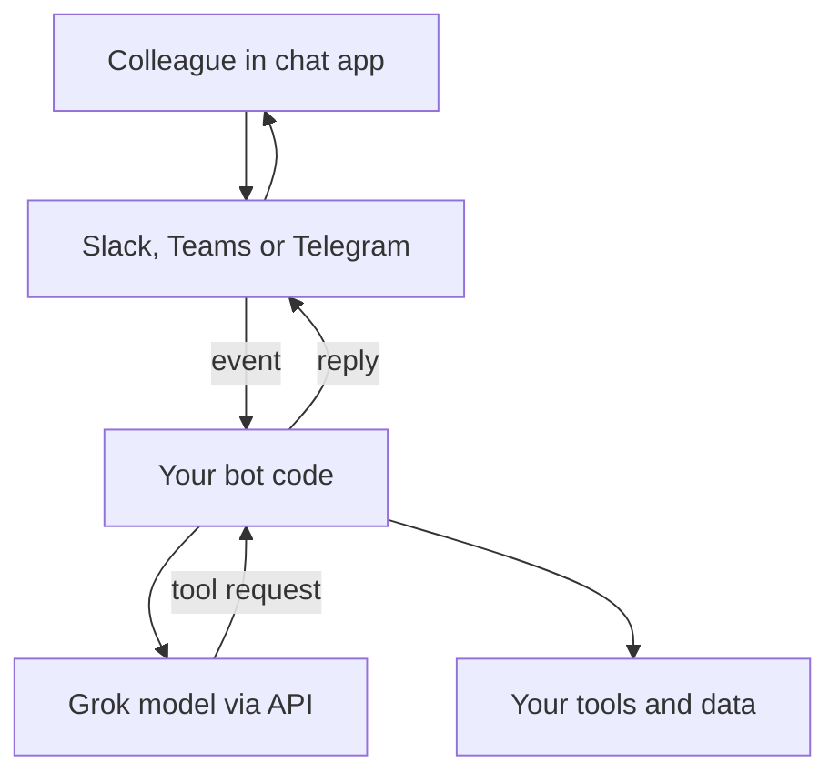

The channel pages so far start from a chat app and plug any model in behind it. This page starts from one model provider, xAI, and sorts out what "a Grok bot" can actually mean.

**In one line:** xAI offers no ready-made chat channel for your firm's data in the way Teams or Slack do, so the realistic routes are its own Grok Bot product or using a Grok model through the API behind a bot you build.

## The jargon: concepts covered on this page

- **Team Bot:** one shared bot that every teammate talks to in private chats
- **Routine:** a bot task that runs on a schedule or after an event
- **Function calling:** the model asks your code to run a named tool
- **Collections search:** searching documents you uploaded to the provider
- **Persistent cloud computer:** a remote machine a bot keeps between sessions

## Why it matters

"A Grok bot" can mean several different things, and mixing them up leads to wrong assumptions about data and control. There are four:

- **The consumer assistant** in the Grok app and inside X (the social network).
- **The API** that developers call to use Grok models in their own software.
- **A bot you build yourself** on that API and connect to Slack, Teams or Telegram.
- **Grok Bot**, a separate xAI product: a named assistant with its own cloud computer, used from a desktop app, a phone app and Slack.

This page covers the last three. It touches the first only to explain the risks of public posting channels. The channel is thin for messaging, so this page is short on purpose. Where xAI's pages say nothing, this page says so rather than guessing.

<mark>Grok has no official bridge to chat apps like Telegram or WhatsApp in the pages reviewed, so a Grok model reaches your colleagues through a bot you build or through Slack.</mark>

This page is general information, not legal advice. Your firm's compliance policies decide what is allowed.

## How it works

Think of the model as the brain and the channel as the mouth. xAI sells the brain through its API. Someone has to build the mouth: a small program that receives a message from a chat app, asks the model for an answer (possibly using tools), and posts the reply. See [how channels connect](/channels/how-channels-connect/) for the general pattern.

The API follows the same shape as other model providers. xAI's documentation says you can use the OpenAI client library by pointing it at xAI's address, and lists function calling, web search, X search, code execution, collections search (searching documents you upload) and remote [MCP](/agents/mcp/) tools. With function calling the model asks for a tool, your code runs it and sends back the result. See [tool use](/agents/tool-use/) and [the agent loop](/agents/the-agent-loop/). For the provider itself, see [xAI](/models/xai/).

## What you need

**For your own bot.** An xAI API account and key from xAI's console, kept as a secret (see [environment variables and secrets](/building/environment-variables-and-secrets/)), plus whatever the chat platform needs. Each platform page covers its own setup: [Slack](/channels/slack/), [Microsoft Teams](/channels/microsoft-teams/) and [Telegram](/channels/telegram/). You also need somewhere to host the code, for example a [serverless function](/building/serverless-functions/).

**For Grok Bot.** xAI's documentation says access comes with a paid Cursor plan or a SuperGrok subscription, and that people sign in with a Cursor account. It also says that training opt-out, retention and account deletion follow the applicable Cursor terms. The documentation does not explain how the two companies relate, so read both sets of terms.

**For Grok in Slack.** A separate xAI page for "Grok for Slack" says a workspace admin clicks Add to Slack, then provides an xAI API key, after which people mention @Grok in channels or direct messages.

## What the platform allows (as of October 2026)

**Grok on X.** X's help page says Grok is available on X on iOS, Android and web. The xAI site links an @grok account on X. No official page explains how mentioning that account in a post works, so this page does not describe it. X's page also says X shares public data and user interactions with xAI to train and fine-tune Grok, with an opt-out in privacy settings, and warns that Grok "may confidently provide factually incorrect information". Treat anything done on X as public-platform use, under X's terms.

**Official messaging integrations.** The xAI API overview, tools pages and Grok Bot mobile page checked for this guide mention no integration with Telegram, WhatsApp or Teams. They do describe Slack. Per xAI's changelog (late September 2026), Team Bots in Slack reply in threads, read channels they have joined, and post an approval card when a bot needs permission to act. The docs say a Team Bot answers only people who have linked their Slack account.

**What Grok Bot is.** xAI describes it as an agent with a persistent cloud computer (a browser, files and a terminal) that works for a named person or team. It can run scheduled "routines" and connect to services such as Gmail, Google Drive and MCP servers. The documents advise requiring approval for sending, purchasing, deleting or publishing, and warn that its automatic review is model-based, so it should "complement, not replace" least privilege. Another page warns that all of one person's bots share one cloud computer, so separate bots are not a security boundary.

**Third-party route.** xAI has a post about using Grok models in OpenClaw, a separate agent tool that connects to WhatsApp, Telegram, Slack, Discord and others. That is a different product from xAI's. If a colleague suggests it, apply the same checks as for any third-party software.

**API limits.** Rate limits and available models change often, so check xAI's console for current figures. See [rate limits, retries and failures](/running/rate-limits-retries-and-failures/).

## Security and compliance

**Business data terms.** xAI's enterprise terms say it will not use customer content to train models, and delete content within 30 days unless the order says otherwise, with a zero data retention option. The API security FAQ says requests are stored encrypted for 30 days for auditing by default, and that zero data retention switches off some features. Consumer, X and business terms differ, so confirm which apply. See [data terms at a glance](/models/data-terms-at-a-glance/) and [GDPR, data retention and DPAs](/running/gdpr-data-retention-and-dpas/).

**Public posting channels.** An agent that replies in public on a social platform can disclose information to anyone. Posts are also untrusted input: a stranger can write text that tries to steer the agent. Keep a public-facing agent away from firm data, and see [data exfiltration through tools](/running/data-exfiltration-through-tools/) and [prompt injection](/running/prompt-injection/).

**Search tools read untrusted content.** Web and X search bring in text from strangers. That text can carry instructions, so turn these tools on only when the task needs them.

**Who can message the bot, and records.** For a bot you build, the chat platform decides who can reach it, and your code should check the sender. Whether chat content must be archived is a question for compliance. See [least privilege](/running/least-privilege/) and [audit trails](/running/audit-trails/).

## Worked example

Sample Ventures wants associates to ask a research assistant about a company in Slack. The operations lead lists two options: Grok for Slack from xAI, or a small bot the team builds.

Compliance prefers the bot they build, because they can limit what it reads. The bot receives a Slack message, calls a Grok model through the API with one tool that looks up a note about Acme Payments, and replies in the thread. Web and X search stay off. Any request to change a record becomes a draft that an associate approves. The firm chose Grok for its own reasons, and the same design works with another provider. See [querying vs adding safely](/channels/querying-vs-adding-safely/).

## Costs and limits

With the API you pay for the tokens you use, so cost grows with long conversations and heavy tool use (see [how AI pricing works](/running/how-api-pricing-works/)). Grok Bot comes bundled with a subscription, and xAI's pages say usage resets weekly, so heavy use can hit a cap. Hosting your own bot adds small hosting costs and your own time to maintain it.

The main limit is thin channel support: no official Telegram, WhatsApp or Teams route, and Slack is the only chat app documented in the pages checked. Model and product names also change fast.

## Related

- [xAI](/models/xai/): the provider overview, models and company background
- [How channels connect](/channels/how-channels-connect/): the general bot pattern
- [Slack](/channels/slack/): the platform side of a Grok-powered Slack bot
- [Telegram](/channels/telegram/): a simple bot route for any model
- [Data terms at a glance](/models/data-terms-at-a-glance/): provider terms side by side

## Next up

Chat apps are not the only doorway. [Email](/channels/email/) is older, slower and open to anyone in the world, which makes it the channel that needs the most care.
