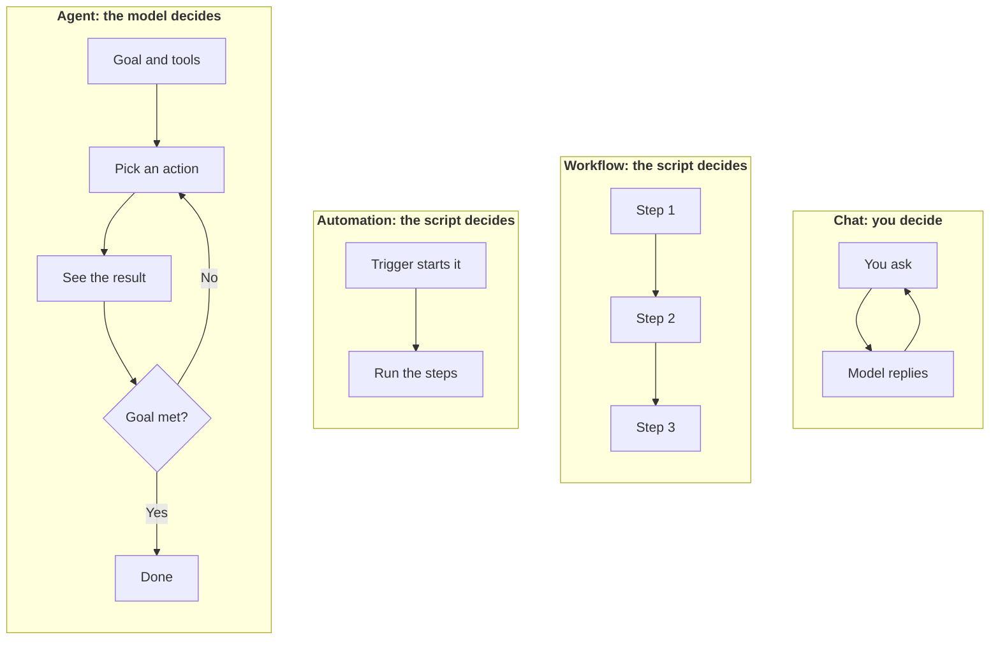

**In one line:** chat, workflow, automation and agent are four different ways of getting work done with AI, and what separates them is who decides the next step.

## Why it matters

People say "agent" for almost anything that uses AI. Vendors do it, articles do it, colleagues do it. When one word covers everything, you can't tell what a product actually does, what it could get wrong, or what it will cost to run.

The distinction also helps you choose. If the steps are the same every time, you don't need an agent: a fixed script is cheaper, faster and easier to check. If every case is different, a script breaks and a person gets stuck, which is where an agent helps.

<mark>The difference is not how clever the AI is. It is who decides the next step.</mark>

## How it works

Ask one question of any AI setup: when this step finishes, who or what chooses what happens next? There are four answers.

- **You, one message at a time (chat).** You type, the model replies, and you decide what to ask next. The model is the AI program that reads and writes text. In a chat it only talks: nothing happens in your other systems unless you carry its answer there yourself.
- **A fixed list of steps (workflow).** Someone writes the steps down in advance, like a recipe, and the system follows them in the same order every time. A step can use a model, for example to summarise an email, but the model doesn't choose what comes next. The script does. A workflow can also contain if/then rules, such as "if the company is already in the CRM, add a note", but a person wrote those rules in advance.
- **A trigger that starts the steps (automation).** A trigger is an event, such as a new email arriving or the clock reaching 9am, that starts something without a person pressing a button. An automation is a trigger joined to a workflow: when this happens, run those steps. The trigger decides when it starts, and the script still decides what happens.
- **The model itself (agent).** You give the model a goal and some tools. A [tool](/concepts/agents/tool-use/) is an action it is allowed to take, such as searching a database or sending a message. The model picks an action, looks at the result, picks the next action, and carries on until it judges the goal is met. Nobody wrote the route in advance.

Notice that chat and agent both loop (the [agent loop](/concepts/agents/the-agent-loop/) has its own page). The difference is who sits in the loop: in a chat it is you, in an agent it is the model.

A workflow with a model inside it is not an agent. What makes something an agent is that the model chooses the route, not that a model is involved somewhere.

These also combine. A common shape is an automation that starts a workflow, with one step in the middle where an agent deals with the messy part.

The words are used loosely, and there is no official line. Some people call a workflow with a model step an "agentic workflow", and some tools label a chat assistant with a few tools as an agent. Ignore the label and ask who decides the next step.

## In practice

The real tools fall into categories:

- **Chat:** chat assistants such as Claude, ChatGPT or Gemini.
- **Workflows and automations:** automation tools such as Zapier, Make, n8n or Power Automate. You usually build the steps as boxes and arrows, and add a trigger if you want it to run on its own.
- **Agents:** a model given tools, through an agent product or a framework (a toolkit for building agents). Coding assistants such as Claude Code are a well-known example.

In all four, the data (company records, emails, files) stays in the firm's own systems, such as the CRM and SharePoint. The AI reads from and writes to them, but it doesn't hold them.

How fresh the data is depends on the style. A plain chat only knows what you paste in or what it can look up. An automation runs each time something new arrives, so its records are as current as the last trigger. An agent looks things up at the moment it runs.

## Worked example

Sample Ventures, the fictional fund, gets introductions to new founders by email, often forwarded by someone in its network. The task is the same each time: get every introduction into the CRM (the shared database of companies, people and conversations) so none is missed, and let the team know.

### As a chat

An associate pastes an email into a chat assistant and asks: "Who is the founder, what does the company do, and who made the introduction?" The assistant answers. The associate checks it, opens the CRM, types in a new record by hand, and decides whether to tell a partner.

**Who decides the next step:** the associate, every time. It works for a one-off, but nothing happens if they forget.

### As a workflow

The team writes a script and the associate runs it on each introduction by hand:

1. Take the text of the email.
2. A model pulls out the founder, the company and the person who made the introduction.
3. Look up the company in the CRM.
4. Create a record if it is missing, or add a note if it exists.
5. Post a one-line summary in the team channel.

**Who decides the next step:** the script. The model fills in one step, but the route is fixed. If an email is unusual, the script still follows the same steps and may record it badly.

### As an automation

It is the same script, with a trigger added: "whenever an email lands in the shared introductions mailbox, run the workflow." Nobody presses a button, and new introductions appear in the CRM shortly after they arrive.

**Who decides the next step:** still the script. The trigger only decides when it starts. The weakness is the same too, and now nobody is watching each run, so a badly recorded introduction can sit unnoticed.

### As an agent

The goal is "keep track of new founder introductions". The tools are: read the mailbox, search the CRM, search the web, create or update CRM records, and message the team. The model starts with a new email and chooses what to do.

For one email, it searches the CRM and finds nothing. It then tries the founder's name and the company's website address, and spots that the company was logged six months ago under its old name. It adds a note to that record instead of creating a duplicate. A fixed lookup would have missed it.

For a forwarded chain with two founders, it creates two records and links them. For a vague email, it searches the web to identify the company, and if it is still unsure it asks a partner a question instead of guessing.

**Who decides the next step:** the model. Different emails take different routes, and nobody wrote those routes in advance.

### Putting them together

One sensible setup for Sample Ventures: an automation watches the mailbox, a workflow handles the tidy emails, and only the messy ones are passed to an agent.

## Costs and limits

Roughly, the more freedom the model has, the more flexible the system is and the less predictable it becomes.

- **Chat** is cheap to run, but it costs a person's time on every step.
- **Workflows and automations** are cheap and steady: the same steps each run means about the same cost each run, and they are easy to check. They break on cases nobody planned for, and an unattended automation can repeat the same mistake many times before anyone notices.
- **Agents** cost more, and the cost varies from run to run, because the model may take many steps and each step costs more as the work so far grows. They can also choose the wrong action or go round in circles, so they need limits on what their tools may do and a way for a person to check the work.

The most common mistake is using an agent where a workflow would do, or calling something an agent just because it uses a model.

## Related

- [Confusables](/start-here/confusables/): other pairs of terms that are easy to mix up
- [Tool use](/concepts/agents/tool-use/): how a model asks for actions to be carried out
- [The agent loop](/concepts/agents/the-agent-loop/): the cycle an agent repeats until the job is done
- [Glossary](/start-here/glossary/): every term in one line

## The proper terms

- **Agent:** a system where the model itself chooses each next step to reach a goal
- **Automation:** a trigger joined to a workflow, so it runs without anyone starting it
- **Chat:** a back-and-forth with a model where you decide each next step
- **Tool:** an action a model is allowed to take, such as searching a database or sending a message
- **Trigger:** an event, such as a new email arriving, that starts something automatically
- **Workflow:** a fixed list of steps that runs the same way every time
