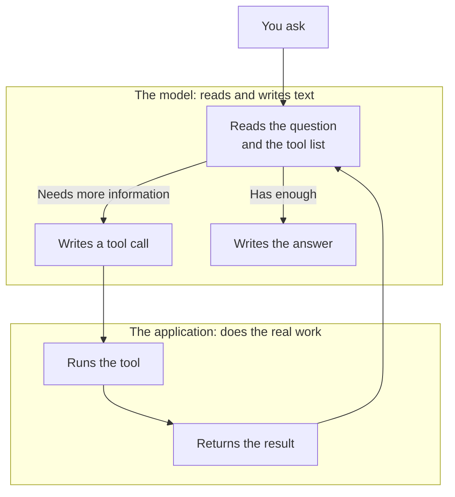

A model can only write text, but text in a fixed shape can be read by software as a request. Tools are the controls that let that request act on the world: the model asks, and the software around it does the work.

**In one line:** tool use is how a model asks for something to be done, such as searching a database, while the software around it does the actual work and hands back the result.

## Why it matters

On its own, a model does one thing: it reads text and writes text. It can't open your CRM, check today's date or send a message. Without tools, it can only answer from what it learned in training and what you paste into the conversation.

Tools are what turn a model from something that talks into something that can act. Every agent is built on this one mechanism.

It also shows you where the risks sit. The model never touches your systems directly. Everything it does goes through tools that someone chose to give it.

<mark>The model never runs a tool itself. It writes a request, and the software around it decides whether to carry it out.</mark>

## How it works

Picture a manager who can only communicate by written notes, and an assistant who does the legwork. The manager writes "please pull the file on Acme Payments". The assistant fetches it and puts it on the desk. The manager reads it and writes the next note. The manager never leaves the room.

Here the model is the manager, and the application around it is the assistant. It all happens in five steps:

1. **Describe the tools.** Before the model starts, the application tells it which tools exist. Each one has a name, a plain description of what it does, and the inputs it needs (the proper term is parameters). For example: "search_crm: finds a company by name. Needs: the company name."
2. **The model decides.** It reads the request and the tool descriptions, then either answers directly or writes a tool call: a structured request that names a tool and fills in its inputs.
3. **The application runs it.** The application checks the request, performs the real action and captures what came back.
4. **The result goes back.** The application adds the tool result to the conversation as text, and the model reads it.
5. **The model carries on.** It writes the answer, or makes another tool call.

The model picks a tool using only its description. A vague description leads to the wrong tool being chosen, so writing good descriptions is a real skill.

Tools come in two kinds. **Read tools** look things up, such as searching a CRM or opening a file. **Write tools** change something, such as creating a record or sending an email. Reading is low risk. Writing can be hard to undo, so it deserves tighter limits.

Developers often call this **function calling**. It is the same thing.

## In practice

Tools come from three places:

- **Built in.** Chat assistants ship with a few, such as web search, reading uploaded files and running code.
- **Connected.** You link the assistant to your business systems, such as a CRM or file storage. A widely used standard for this is called [MCP](/concepts/agents/mcp/).
- **Custom.** A developer writes a small function, for example "look up a company in the CRM", and describes it to the model.

The data stays in the systems the tools connect to. The tool fetches it at the moment it is asked, so the answer is as fresh as the system itself.

A tool acts with whatever access it was given. A tool connected with broad access can do broad things, so it is worth giving each one only what it needs.

## Worked example

Sample Ventures, the fictional fund, has an assistant with three tools: search the CRM, read a company's notes, and search the web. An associate asks: "When did we last speak to Acme Payments, and what did we discuss?"

1. The application sends the question to the model, along with the three tool descriptions.
2. The model replies with a tool call: `search_crm`, with the company name "Acme Payments".
3. The application runs the search against the CRM and sends back the company record, including the date of the last contact.
4. The model makes a second tool call, asking to read the notes on that record.
5. The application sends back the notes from the last meeting.
6. The model writes its answer: the date of the last call, what was discussed, and a note that this comes from the CRM only.

The associate sees one answer. Steps 2 to 5 happen in between.

Notice what is missing: there is no tool that edits a record. The assistant can look but not change anything, and that was a deliberate choice.

## Costs and limits

- **More tools cost more.** Every tool description is sent with each request, so a long list takes up space and costs more. It also makes a wrong choice more likely.
- **The model can get it wrong.** It may pick the wrong tool or fill in an input badly, such as misspelling a company name. Results need checking, especially before anything is changed.
- **Results take up room.** A tool result becomes part of the conversation, and a very long one (a whole file, say) crowds out everything else in the [context window](/concepts/how-models-work/tokens-and-context-windows/).
- **Results can carry instructions.** The model reads tool results as text, and text can contain hidden instructions, for example on a web page or in an email. This is called prompt injection, and it is one of the main security risks with tools.
- **Write tools need limits.** A person should approve actions that are hard to undo, such as sending an email to an investor.

The most common mistake is handing a model every tool "just in case". Give it the ones the job needs.

## Often confused with

**Tool vs API.** An API is a way for one piece of software to talk to another. A tool is the wrapper that lets a model use it: a name, a description and a way to run the call. Many tools sit on top of an API.

**Tool use vs MCP.** Tool use is the general mechanism. MCP is one standard way of packaging tools so that many different assistants can use the same ones.

## Related

- [Chat vs agent vs workflow vs automation](/concepts/agents/chat-agent-workflow-automation/): an agent is a model that picks its own tools
- [The agent loop](/concepts/agents/the-agent-loop/): what happens when the model keeps using tools until the job is done
- [MCP](/concepts/agents/mcp/): a standard way to connect tools to many assistants
- [Structured outputs](/concepts/talking-to-models/structured-outputs/): getting tool inputs and answers in a fixed shape
- [Least privilege](/concepts/security/least-privilege/): limiting what each tool can touch

## The proper terms

- **Function calling:** another name for tool use, common in developer documentation
- **Parameters:** the inputs a tool needs, such as a company name
- **Read tool / write tool:** a tool that only looks things up, or one that changes something
- **Tool:** an action a model is allowed to request
- **Tool call:** the model's structured request to use a tool
- **Tool result:** what the tool sends back, added to the conversation as text
- **Tool use:** the way a model requests actions and the software around it carries them out

## Next up

One tool call answers one question, but real jobs need several, each depending on the last. [The agent loop](/concepts/agents/the-agent-loop/) shows how a model keeps going, step by step, until the job is done.
