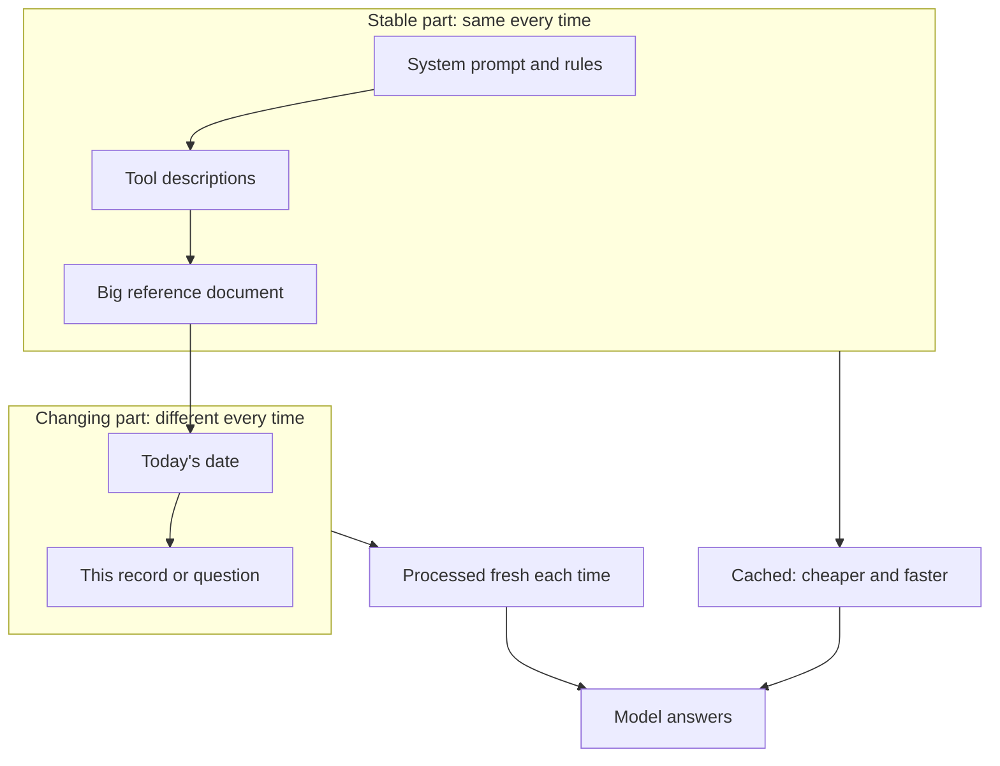

The rate per token is set by the provider, but how many full-price tokens you pay for is partly up to you. This page covers the two main discounts: reusing a repeated start of a prompt, and sending work that can wait in bulk.

**In one line:** prompt caching makes repeated text at the start of your requests cheaper and faster, and batch processing makes non-urgent work cheaper by accepting the results later.

## Why it matters

Many AI jobs repeat themselves. An agent sends the same long instructions with every request. A tagging job sends the same rules with a thousand different notes. Each time, you pay again for the model to read text it has already read.

Separately, many jobs are not urgent. Nobody is waiting for overnight tagging of old records. Providers will charge less if you let them run the work when it suits them.

<mark>Both discounts change only what you pay and how fast you get an answer, never the answer itself.</mark>

## How it works

**Prompt caching.** Before a model can respond, it processes your whole prompt. With caching, the provider keeps the processed form of the beginning of a prompt for a short time. If your next request starts with exactly the same text, it reuses that work. You are charged a lower rate for the reused part, and the response usually starts sooner.

The key word is **prefix**: the beginning of the prompt. The match has to be exact, from the first character. If one early word changes, everything after it counts as new and the saving is lost.

This shapes how you should lay a prompt out. Put the material that stays the same first: the [system prompt](/concepts/talking-to-models/system-prompts/), the rules, the tool descriptions, a big reference document. Put the material that changes last: today's date, the specific question, the record being processed. This is one part of [context engineering](/concepts/talking-to-models/context-engineering/).

A few more facts apply to nearly every provider:

- **Caches expire.** They last minutes, sometimes up to an hour or so, and many providers refresh the timer each time the cache is used. A gap between requests longer than the lifetime means the next request pays full price again.
- **There is a minimum length.** Short prompts are not cached.
- **It is not memory.** The cached text is not stored as knowledge or carried between conversations. It is a short-lived speed and cost shortcut for text you send again anyway.
- **It can suit agents well.** In an [agent loop](/concepts/agents/the-agent-loop/) every step resends the growing record of earlier steps. Because each step starts with the same beginning plus a little more, caching makes the long record much cheaper.

**Batch processing.** Instead of sending a request and waiting for the answer, you submit a large set of requests as one job. The provider works through them when capacity allows and returns the results later. In return, you get a discount, commonly around half price.

Batches suit work like re-tagging old records, summarising a backlog, or running an [evaluation](/concepts/agents/evals/) over many test cases. They do not suit anything where a person is waiting, such as a chat or a live alert.

## In practice

The two can be combined, and the discounts stack. A batch of 2,000 requests with the same long instructions can benefit from both. Cache hits in batches are best effort, not guaranteed, because requests are processed in no fixed order.

How you turn each on depends on the provider. Some require you to mark which part of the prompt to cache. Others cache automatically when the beginning matches. Always check the provider's own documentation for the model and product you use.

When you design a workflow, ask two questions of each step:

1. Does it send a long, repeated beginning? If yes, order the prompt for caching.
2. Could it wait? If yes, consider a batch.

**Snapshot, as of October 2026.** This paragraph describes things that change. The official documentation of three providers was read on 2 October 2026.

- **Anthropic:** caching is switched on by the developer by marking the cacheable part of the prompt. The minimum cacheable length depends on the model and ranged from 512 to 4,096 tokens. The default lifetime is 5 minutes, refreshed free each time the cache is read, with a 1 hour option. Writing to the cache costs more than normal input (1.25 times for 5 minutes, 2 times for 1 hour), and reading costs a fraction (0.1 times for most models, less for some). Its batch service gives a 50% discount, most batches finished in under an hour, a batch expires after 24 hours, and results stay available for 29 days. Each request in a batch succeeds or fails individually, and failed, cancelled or expired requests are not charged.
- **OpenAI:** caching is on by default for supported models. For its newest models the minimum was 1,024 tokens, entries lasted about 30 minutes after the last use, cached input cost 0.1 times the normal rate on most models, and writes cost 1.25 times the normal rate (older models had no write fee). Its pricing page listed a 50% batch discount.
- **Google (Gemini API):** caching happens automatically on current models, with minimums such as 4,096 tokens on some. Explicit caching is also offered, with a separate hourly storage charge per million tokens cached. Its pricing page listed a 50% batch discount.

Specific figures and model names change often. Check the current documentation before relying on any of them.

## Worked example

Sample Ventures, the fictional fund, has 2,000 old CRM notes that were never tagged by sector or stage. An associate wants them tagged overnight.

Each request has two parts. The first is a long, stable set of instructions: the list of allowed tags, the definitions, and ten worked examples. The second is one short note.

1. **Order the prompt.** The instructions go first, identical in every request. The note goes last.
2. **Submit it as a batch.** The associate submits all 2,000 requests as one job and goes home.
3. **Wait.** The results arrive later, possibly within an hour and certainly within the provider's stated window. Nobody needs them before morning.
4. **Check per item.** The next day a script reads the results. Most requests succeeded. A few failed, so the script resubmits just those. It also spot-checks a sample of tags with a person.

The saving, using clearly invented numbers. Assume the instructions are 3,000 tokens, each note is 300 tokens and each answer is 30 tokens. Assume a mid-tier price of $1 per million input tokens and $5 per million output tokens, and a cache read price of a tenth of normal input.

| Approach | Input cost | Output cost | Total |
| --- | --- | --- | --- |
| Plain requests | 6.6M tokens, $6.60 | 60k tokens, $0.30 | $6.90 |
| Caching only (all reads hit) | $0.60 for the cached part, $0.60 for the notes | $0.30 | $1.50 |
| Batch only | $3.30 | $0.15 | $3.45 |
| Batch and caching (all reads hit) | $0.60 | $0.15 | $0.75 |

The cache figures ignore the one-off cost of writing the cache, which is small. The point is the shape: the repeated instructions are most of the input, so caching shrinks that part, and the batch halves what remains. The real saving depends on how many cache reads actually hit.

## Costs and limits

- **Caching needs a stable beginning.** A timestamp, a username or a reordered list near the top breaks the match on every request. This is the most common reason caching saves nothing.
- **Caches expire.** If requests arrive too far apart, you pay the write cost again without much benefit.
- **Writing to a cache can cost extra.** On some providers the first request costs more than normal, so caching pays off only if the text is reused.
- **Short prompts miss out.** Below the minimum length nothing is cached, and usually no error says so.
- **Batch results are not instant.** Do not use a batch for anything interactive. Build the workflow so it can wait, and tell the people who depend on it.
- **Batches have partial failures.** Some items fail while others succeed. Handle errors per item and retry only the failures (see [rate limits, retries and failures](/concepts/running-things/rate-limits-retries-and-failures/)).
- **Batch work still needs checking.** A cheap answer is as likely to be wrong as an expensive one. Sample the results.
- **Neither discount improves quality.** They change cost and speed only.

## Often confused with

**Prompt caching vs memory.** Caching is a temporary cost shortcut: the provider reuses work on text you send again. [Memory](/concepts/agents/memory/) is information an agent deliberately saves and brings back later, possibly weeks afterwards, to change what it knows.

**Prompt caching vs the context window.** The [context window](/concepts/how-models-work/tokens-and-context-windows/) is the limit on how much text fits in one request. Caching does not enlarge it. It only makes repeated text inside the window cheaper.

## Related

- [How AI pricing works](/concepts/cost/how-ai-pricing-works/): where these discounts sit on the bill
- [Context engineering](/concepts/talking-to-models/context-engineering/): ordering what goes into the prompt, including for caching
- [The agent loop](/concepts/agents/the-agent-loop/): the growing record that caching makes cheaper
- [Rate limits, retries and failures](/concepts/running-things/rate-limits-retries-and-failures/): handling items that fail in a batch

## The proper terms

- **Prompt caching:** reusing the processed start of a prompt to cut cost and delay
- **Prefix:** the beginning of a prompt, which must match exactly to be reused
- **Cache hit:** a request that reuses cached material
- **Cache write:** storing the processed start of a prompt for later reuse
- **Time to live (TTL):** how long a cache entry lasts before it expires
- **Batch processing:** submitting many non-urgent requests together for a lower price

## Next up

Caching and batching make the same model cheaper. The other big lever is using a cheaper model for the jobs that do not need a strong one, which is [model routing](/concepts/cost/model-routing/).
