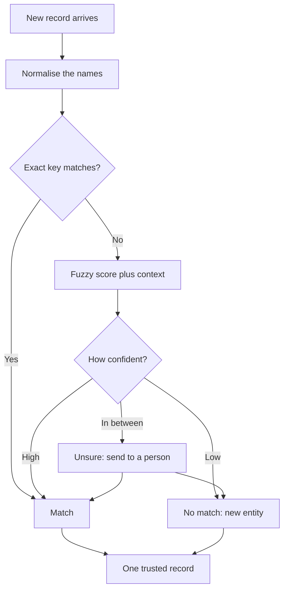

**In one line:** entity resolution is deciding which records, names and addresses refer to the same real-world company or person, so each one ends up with a single trusted record.

## Why it matters

The same company shows up under many names. "Acme Payments Ltd", "Acme Pay" and a website domain such as acmepayments.example can all be the same business. Two email addresses can belong to one person who changed jobs.

Software does not see that on its own. To a database, each spelling is a different thing, so you end up with duplicates.

Duplicates cause real damage for an agent. One record says the company is at seed stage and another says it has passed. Notes and meetings get split across records, so a search for "everything we know about Acme" returns half the history. The agent then answers confidently from whichever record it happened to find first.

<mark>Two records for one company mean two versions of the truth, and an agent will happily answer from the wrong one.</mark>

## How it works

The companies and people your data describes are called **entities**. A record is one row or page that mentions an entity. Entity resolution (also called deduplication, or "dedupe") is the work of grouping records that describe the same entity.

Methods run from cheap and certain to expensive and fuzzy. Good systems try them in this order:

1. **Exact keys.** Some fields are close to unique: a company's website domain, a person's email address, a registered company number. If two records share one, they almost certainly match.
2. **Normalising.** Clean the text first so trivial differences disappear: lower case, strip "Ltd", "Limited" and "Inc", remove punctuation and "www". Then compare. "Acme Payments Ltd" and "acme payments" now look the same.
3. **Fuzzy matching.** Score how similar two strings are, so typos and abbreviations still match. "Acme Paymnts" scores high against "Acme Payments". Similarity alone is risky, because "Acme Payments" and "Acme Payroll" also score high.
4. **Context.** Compare other facts. Same city, same founder, same sector and same domain make a match likelier. A different country or a different founder makes it less likely.
5. **Human review.** When the evidence is mixed, a person decides.

Each comparison ends in one of three outcomes: match, no match, or unsure. The unsure pile is the important one, because that is where mistakes are made.

There are two ways to act on a match. **Merging** combines the records into one and keeps the best fields. It is tidy but hard to undo. **Linking** keeps both records and adds a pointer saying "these are the same". It is safer to reverse, and you keep the original evidence.

## In practice

Most CRMs have a built-in duplicate finder and a merge tool. Databases and data tools offer matching functions and fuzzy-match libraries. Dedicated tools exist for large-scale matching, and an agent can call any of them as a [tool](/concepts/agents/tool-use/).

A [language model](/concepts/how-models-work/what-an-llm-is/) is useful for the middle of the process. It can read two messy records and say "these look like the same company, because the domain and founder agree, but the registered countries differ". That is a good suggestion for a person to review.

It is a poor place for silent decisions. A model can be wrong with full confidence (see [hallucination and grounding](/concepts/how-models-work/hallucination-and-grounding/)), and a wrong merge corrupts data that others rely on. Let models propose, and let rules or people decide.

Matching is not a one-off clean-up. New records arrive every day, so the check should run when data comes in. It also connects to [keeping data fresh](/concepts/data/keeping-data-fresh/): a merge in one system has to reach the copies elsewhere.

The goal is one trusted record per entity, often called a **golden record** or canonical record. Other systems hold an ID that points to it, so everyone agrees which Acme they mean. This is a central job of a [context layer](/concepts/data/what-a-context-layer-is/), and a [knowledge graph](/concepts/data/knowledge-graphs/) depends on it, because a graph with two nodes for one company gives wrong answers about its connections.

## Worked example

An associate at Sample Ventures, the fictional fund, forwards three introduction emails into the CRM over a fortnight:

- Email 1 mentions "Acme Pay" and a founder's address ending in @acmepayments.example.
- Email 2 mentions "Acme Payments Ltd" and links to the website acmepayments.example.
- Email 3 mentions "Acme" with a signature from a different founder at a new address, @acme-pay.example.

What happens:

1. The CRM already holds a record for "Acme Payments", with the domain acmepayments.example.
2. Email 1 matches on the domain. This is an exact key, so it is linked to the existing record automatically.
3. Email 2 matches on the domain too. After normalising, the names also agree. Linked.
4. Email 3 is harder. The name "Acme" is vague, and the domain is new. The fuzzy score against "Acme Payments" is moderate, and both mention payments.
5. The agent does not merge. It flags the record as unsure and writes a note: "Possible match: new domain, name similar, no shared people. Please confirm."
6. A partner checks and finds that the founder has launched a second venture with a similar name. The answer is no match. A new record is created.

Had the agent merged silently, the CRM would now hold the wrong founder and the wrong domain on Acme Payments, and nobody would know why.

## Costs and limits

- **Two failure modes.** A **false merge** joins two different entities. A **missed match** leaves one entity split in two.
- **False merges are usually worse.** They mix up facts, are hard to untangle and can leak one company's details into another's record. Missed matches are annoying but visible and fixable. So set the bar for automatic merging high.
- **Tuning is a trade-off.** A stricter threshold means fewer false merges and more work for reviewers. A looser one does the reverse.
- **Common names break it.** Short, generic or reused names ("Atlas", "Apex") produce endless near-matches.
- **Real-world change.** Companies rename, merge and rebrand. People change employer and email. Old keys stop working.
- **Review takes time.** Human review does not scale to thousands of unsure cases, so spend it where the data matters most.

The most common mistake is matching on name alone. Prefer exact keys, and use names only as supporting evidence.

## Often confused with

**Entity resolution vs search.** Search finds records that look like your query. Entity resolution decides which existing records are the same thing, so you do not have to search for every spelling.

**Merging vs linking.** Merging combines records into one. Linking keeps both and records that they match. Linking is easier to reverse.

## Related

- [What a context layer is](/concepts/data/what-a-context-layer-is/): one trusted record per entity is part of its foundation
- [Knowledge graphs](/concepts/data/knowledge-graphs/): a graph only works if each entity appears once
- [Keeping data fresh](/concepts/data/keeping-data-fresh/): merges and changes have to reach every copy
- [Human in the loop](/concepts/agents/human-in-the-loop/): unsure matches are a good place for a person to decide

## The proper terms

- **Deduplication:** finding and removing duplicate records for the same entity
- **Entity:** a real-world thing your data describes, such as a company or person
- **Entity resolution:** deciding which records refer to the same real-world entity
- **False merge:** wrongly joining records that describe different entities
- **Fuzzy matching:** matching text that is similar but not identical, such as typos
- **Golden record:** the single trusted record kept for an entity
- **Missed match:** failing to join records that describe the same entity
- **Normalisation:** cleaning text into a standard form before comparing
