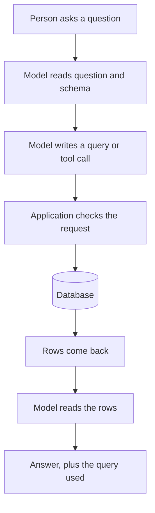

Getting through the door is only half of it. The model also has to turn a plain question into something the database can run. This page covers the main ways that happens and the guard rails each one needs.

**In one line:** a model cannot reach a database itself, so the software around it sends the query and returns the rows, and how much freedom the model gets over that query decides how useful and how safe the setup is.

## Why it matters

Most of a firm's facts sit in databases: companies, people, notes, interactions. If an assistant can only talk, it can't answer "how many seed-stage companies did we log last month?". Someone has to connect the model to the data.

There are several ways to do that, and they differ a lot in risk. A model with free rein over a database can return the wrong numbers without any sign that they are wrong, or in the worst case change or delete records.

<mark>Put the limits in the database account and the tools, never only in the prompt.</mark> A prompt is a request. A database permission is a rule.

## How it works

A [model](/concepts/how-models-work/what-an-llm-is/) reads and writes text. It has no network connection to your database and no login. So the application around it does the real work, using the [tool use](/concepts/agents/tool-use/) mechanism: the model writes a request, the application runs it, and the result goes back as text.

The model also needs to know what it is querying. The **schema** is the description of the database: table names, column names and what each one means. A column called `stage` could hold "seed" or "Seed" or "S". A short plain-English note about each table and column, with a few example values, makes a large difference to the quality of the queries.

There are four common patterns.

**(a) Text-to-SQL.** SQL is the standard language for asking a relational database questions. In text-to-SQL, the model writes the SQL itself from the question and the schema, and the application runs it. It is the most flexible pattern, because any question can be asked. It is also the riskiest, because the model decides exactly what is run.

**(b) Fixed tools with set inputs.** The developer writes the queries in advance and wraps each one as a tool, such as "get company by name" or "count companies added in a date range". The model only chooses the tool and fills in the inputs. It is less flexible but much easier to check and control.

**(c) Through an API or a connector standard.** Many systems, such as a CRM, offer an API (a defined way for software to ask for data, see [APIs, OAuth and API keys](/concepts/data/apis-oauth-and-api-keys/)). The model uses a tool that calls it. A connector standard such as [MCP](/concepts/agents/mcp/) packages these tools so many assistants can reuse them. Here the vendor's rules about what can be read and changed do the limiting.

**(d) Search and retrieval.** For text such as notes and documents, the system finds the relevant passages and gives them to the model. This is covered in [RAG and chunking](/concepts/data/rag-and-chunking/). It suits "what did we say about the team?" better than "how many?".

## In practice

Most real setups mix patterns. Fixed tools handle the questions asked every week. Retrieval handles the document questions. Text-to-SQL, if used at all, sits behind extra guard rails.

If you do allow model-written SQL, these habits matter:

- **Read-only first.** Connect with an account that can only read. Give it write access later, and only for narrow, named actions.
- **Limit what it can see.** Give the account access to only the tables and columns it needs. Hide anything sensitive. See [permissions and access control](/concepts/data/permissions-and-access-control/).
- **Cap the results.** Set a row limit and a time limit, so a careless query can't pull a whole table or slow the system down.
- **Validate before running.** Check that the query is a single read statement and touches only allowed tables.
- **Never let a model run arbitrary writes.** Changes should go through fixed tools, ideally with a person approving them (see [human in the loop](/concepts/agents/human-in-the-loop/)).
- **Enforce limits in the database account, not the prompt.** "Please don't delete anything" can be ignored or talked around. A read-only login can't.

A database account with the least access needed is an old security idea, called least privilege. It matters more here because the thing writing the queries can be wrong, or can be tricked by text it reads.

## Worked example

Someone at Sample Ventures, the fictional fund, asks: "How many seed-stage companies did we log in September?"

**Safe tool pattern.** The assistant has a tool called `count_companies`, with inputs `stage` and a date range. It runs one prepared query against a read-only account.

1. The model chooses `count_companies` with stage "seed", from 1 September to 30 September.
2. The application checks the dates are valid and that the stage is one of the allowed values, then runs the stored query.
3. The database returns a single number, say 14.
4. The model answers: "14 seed-stage companies were logged in September, counted by the date each record was created." It names the rule so a person can see what "logged" meant.

**Free-form SQL pattern.** The model reads the schema and writes its own query. Suppose the table has both `created_at` (when the record was made) and `first_contact_date` (when the team first spoke to the company). The model picks `created_at`, but a bulk import last week gave 200 old records a recent `created_at`.

The query runs without any error and returns a clean, believable number that is wrong. Nothing in the answer signals the problem.

That is the main danger of text-to-SQL: a wrong query returns plausible rows. The defence is to show the query alongside the answer, state the definition used, and have someone who knows the data check anything important. Fixed tools reduce the problem by putting the definition of "logged" in one reviewed place.

## Costs and limits

- **Free-form queries can be silently wrong.** The model may pick the wrong column, forget a filter, or double count after joining two tables. There is no error message for a wrong answer.
- **Schemas need explaining.** Cryptic column names and unwritten rules ("ignore rows marked test") are invisible to the model unless you tell it.
- **Fixed tools cover only what you built.** A new kind of question needs a new tool. That is slower, but each tool is checked once and reused.
- **Large schemas crowd the context.** Sending every table description uses up space in the [context window](/concepts/how-models-work/tokens-and-context-windows/) and can confuse the model. Send only the relevant parts.
- **Tricked queries.** Text from notes or emails can contain instructions aimed at the model. Read-only, narrow access limits the damage.
- **Slow or heavy queries.** A badly formed query can strain a busy database. Use time limits, and where possible query a copy.

The most common mistake is giving the assistant a powerful login "to make it easy". Start with the smallest access that answers the questions you have today.

## Related

- [Tool use](/concepts/agents/tool-use/): the mechanism every pattern here relies on
- [Permissions and access control](/concepts/data/permissions-and-access-control/): how to limit what the database account can see and do
- [MCP](/concepts/agents/mcp/): a standard way to package database and API tools
- [RAG and chunking](/concepts/data/rag-and-chunking/): the pattern for text rather than rows

## The proper terms

- **Least privilege:** giving an account only the access it needs and nothing more
- **Read-only access:** a login that can look at data but not change it
- **Row limit:** a cap on how many rows a query may return
- **Schema:** the description of a database's tables and columns
- **SQL:** the standard language for querying relational databases
- **Text-to-SQL:** a model writing a SQL query from a plain-language question

## Next up

Queries suit tidy rows, but much of what a firm knows sits in documents too large to paste in whole. [RAG and chunking](/concepts/data/rag-and-chunking/) explains how an assistant finds the right passages.
