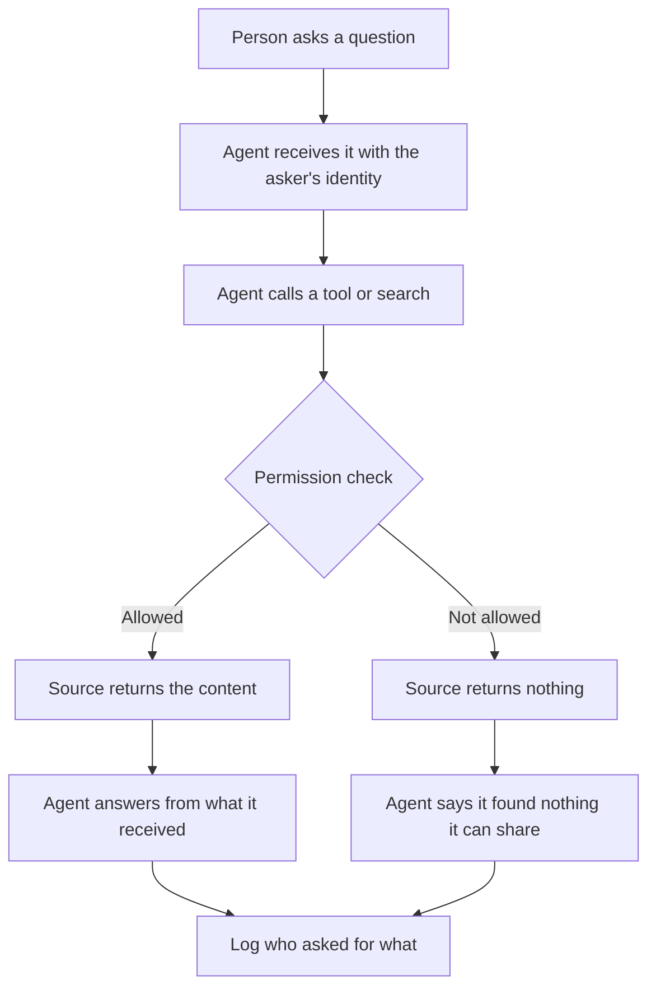

**In one line:** permissions and access control decide who can see and do what, and for an agent they must be enforced by the systems holding the data, not left to the agent's good behaviour.

## Why it matters

People in a firm do not all see the same things. Some folders are restricted to partners, some records hold sensitive notes, and some actions, such as sending an email, are limited to a few people.

An agent can break those boundaries without anyone intending it. It is helpful by design, and it can search everything it has access to. If it can open a restricted file, it may quote from it to anyone who asks, including someone who could never have opened that file themselves.

<mark>An agent must never reveal something the person asking could not have opened themselves.</mark>

## How it works

Two questions sit under every access decision. **Authentication** asks who you are. **Authorisation** asks what you may do. Permissions are the rules that answer the second question, and **access control** is the system that enforces them.

An agent acts under some identity, and that identity decides what it can reach. There are two common choices:

- **The user's own identity (delegated).** The agent carries the asker's permissions, usually through [OAuth](/concepts/data/apis-oauth-and-api-keys/). It can reach what that person can reach, and no more.
- **A shared service account.** The agent uses one identity of its own for everyone. This is simpler to set up. It is also usually much broader, because it has to cover what anyone might ask.

With a shared account, the agent can see everything the account can see, so something else has to stop it showing the wrong person the wrong thing. That is easy to forget and hard to get right.

**Enforce rules where the data lives.** A line in a [system prompt](/concepts/talking-to-models/system-prompts/) such as "do not share partner-only files" is a request, not a lock. A model can be tricked, can misjudge, or can simply be asked in a clever way. Real protection comes from the source systems and the tools: the file store refuses to open the file, or the tool never returns it. Use the prompt as a second layer, not the first.

Search adds a particular wrinkle. In [retrieval](/concepts/data/rag-and-chunking/), documents are cut into pieces called chunks and stored in an index. If that index forgets who was allowed to see the original document, the restriction is lost. The fix is for every chunk to **inherit its document's permissions**, and for the search to filter results by the asker's permissions before anything reaches the model.

The check happens at the source, before the content reaches the model. Content the model never received cannot leak.

Other principles worth knowing:

- **Read versus write.** Looking is lower risk than changing. Give agents read access first, and add write access only where needed. Actions that are hard to undo should need approval from a person (see [human in the loop](/concepts/agents/human-in-the-loop/)).
- **Least privilege.** Give each identity the minimum access that does its job. See [least privilege](/concepts/security/least-privilege/).
- **Logging.** Record who asked, what the agent fetched and what it did. When something goes wrong, the log is how you find out what happened.

## In practice

Most business systems already have permissions: folder and site sharing in a file store, roles in a CRM, row-level rules in a database. The cleanest design reuses them, so the agent inherits the rules the firm already maintains rather than a second set that can fall out of step.

Questions to ask of any agent setup:

- Does it act as the user or as a shared account?
- If shared, what stops it showing something restricted to the wrong person?
- Does search filter by the asker's permissions, or does it search everything and hope the model holds back?
- Can it write, and who approves that?
- Is there a log?

Permissions change over time. When someone leaves a project or a folder is restricted, copies and indexes must follow, which links to [keeping data fresh](/concepts/data/keeping-data-fresh/).

## Worked example

Sample Ventures, the fictional fund, keeps investor-relations material, such as draft updates and investor feedback notes, in a SharePoint folder restricted to partners. A shared agent searches the file store for the whole team.

An associate and a partner each ask: "Summarise the feedback investors gave on our last update."

**Setup A: the agent uses a shared service account and relies on the prompt.**

1. The service account can open the restricted folder, so the search returns the feedback notes for both people.
2. The prompt says "only share restricted material with partners", but the agent does not reliably know who is asking.
3. The associate gets a summary of confidential investor feedback. This is the failure to avoid.

**Setup B: the agent acts with each person's own permissions.**

1. The partner asks. The search runs as the partner, the folder opens, and the agent writes the summary, naming the source files.
2. The associate asks. The search runs as the associate, the folder returns nothing, and the agent says "I couldn't find investor feedback that I can share with you. It may be in a restricted folder."
3. Both requests are logged with the asker's name and the files touched.

Setup B has a smaller blast radius if anything goes wrong, because the agent can never do more than the person could.

## Costs and limits

- **Per-user access costs more to build.** Passing each person's identity through, and filtering search by permissions, is more work than one shared account.
- **Indexes can leak.** If chunks lose their document's permissions, search can surface restricted text. This is among the most common real mistakes.
- **Permissions drift.** A file is restricted after being indexed, and the copy still shows it. Refresh matters.
- **Summaries can leak too.** A summary or saved note built from restricted material carries it into a place with wider access. Treat derived content with the same care.
- **Refusal messages can leak.** Saying "there is a restricted file called Q3 investor complaints" reveals something. Keep refusals plain.
- **Logs hold sensitive text.** Protect the logs as well.
- **Prompts are not locks.** The model can be talked round, including by instructions hidden inside documents it reads.

The most common mistake is giving the agent a broad account for convenience and then relying on instructions to keep it in line.

## Often confused with

**Permissions vs authentication.** Authentication proves who you are. Permissions decide what that identity may do. Signing in successfully does not mean you may open everything.

**Permissions vs safety instructions.** A prompt telling a model to behave is guidance. A permission is a rule the system enforces whatever the model does.

## Related

- [APIs, OAuth and API keys](/concepts/data/apis-oauth-and-api-keys/): how an agent gets an identity in the first place
- [RAG and chunking](/concepts/data/rag-and-chunking/): chunks must carry their document's permissions
- [System prompts](/concepts/talking-to-models/system-prompts/): useful for guidance, not for enforcement
- [Human in the loop](/concepts/agents/human-in-the-loop/): approvals for actions that are risky or hard to undo
- [Least privilege](/concepts/security/least-privilege/): the principle for deciding what to grant

## The proper terms

- **Access control:** the system that enforces who may see and do what
- **Audit log:** a record of who asked for what and what happened
- **Authorisation:** deciding what an identified person or program may do
- **Least privilege:** giving an identity only the access its job needs
- **Permission:** a rule allowing a specific person or program to do something
- **Service account:** a shared identity used by software rather than a person
