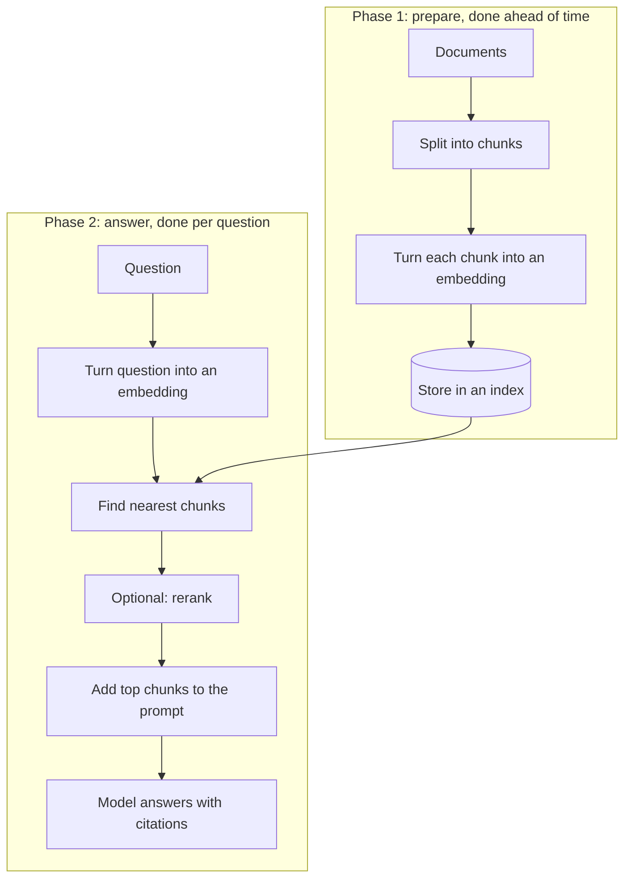

**In one line:** RAG (retrieval-augmented generation) means fetching the passages most relevant to a question first, putting them in front of the model, and letting it answer from them, and chunking is how the documents get cut into pieces so the right part can be found.

## Why it matters

A model can only read what fits in its [context window](/concepts/how-models-work/tokens-and-context-windows/), and a data room or shared drive holds far more than that. Pasting everything in is slow, costs more, and buries the useful parts.

It also doesn't know your private documents. Asked about them without help, it may guess. RAG is the standard answer to both problems: find the few relevant passages, and answer from those.

It is one of the main forms of [grounding](/concepts/how-models-work/hallucination-and-grounding/). The answer can point back to the passage it used, so a person can check it.

<mark>RAG does not make a model know your documents. It finds the right paragraphs at the moment of the question and hands them over.</mark>

## How it works

Think of a research assistant with a huge filing room. Before answering, they walk to the right shelves, pull out the few relevant pages and read those. They don't memorise the room.

RAG has two phases. The first happens ahead of time. The second happens every time someone asks a question.

**Phase 1: preparing.**

1. **Split.** Each document is cut into **chunks**, short pieces of text. This is chunking.
2. **Embed.** Each chunk is turned into an [embedding](/concepts/how-models-work/embeddings/): a list of numbers that captures what the text is about, so chunks with similar meaning end up with similar numbers.
3. **Store.** The embeddings go into an **index** (often a vector database or a database with a vector feature), along with the original text and details such as the file name and page.

**Phase 2: answering.**

1. **Embed the question** in the same way.
2. **Find the nearest chunks.** The system looks for chunks whose numbers sit closest to the question's. This is called similarity search.
3. **Rerank (optional).** A second, more careful model re-orders the top results so the best come first.
4. **Add to the prompt.** The top chunks are pasted into the model's context, with their sources.
5. **Answer with citations.** The model is told to answer from these chunks, say which one each fact came from, and say so if the answer isn't there.

**How chunks are cut.** There are three common approaches, and they are often combined:

- **By size.** Cut every so many words or [tokens](/concepts/how-models-work/tokens-and-context-windows/). Simple, but it can slice a sentence or table in half.
- **By structure.** Cut at headings, sections or paragraphs, so each chunk is a natural unit.
- **With overlap.** Let neighbouring chunks share a few sentences, so an idea on a boundary isn't lost.

**Keyword, meaning, or both.** Keyword search finds exact words, which is good for names, codes and defined terms. Meaning search (the embedding approach above) finds text that says the same thing in different words, such as "revenue" for "turnover". Many systems run both and merge the results, which is called hybrid search.

## In practice

The pieces come from different places. The documents sit in file storage such as SharePoint. A script or a managed service splits and embeds them. The index lives in a vector database (examples are Pinecone or the pgvector extension for Postgres) or in a search engine that supports both keyword and vector search.

Good setups store useful details with each chunk: the file name, the page or section, the date, and who may see it. The citation in the answer is built from these.

The index is a copy of the documents, so it needs updating when files change. A common approach is to re-process only the files that changed. See [keeping data fresh](/concepts/data/keeping-data-fresh/).

## Worked example

An associate at Sample Ventures, the fictional fund, is reviewing the data room for Acme Payments, a seed-stage payments startup. It holds a pitch deck, financial accounts, a cap table and some contracts, all as PDFs.

**Preparing.** The operations lead sets up an index of the data room. Each PDF is split by heading, with a little overlap. Each chunk is embedded and stored with its file name, page and a note of who may see it.

**Asking.** The associate asks: "What is Acme Payments' customer churn, and how does it compare with what the deck claims?"

1. The question is embedded and compared with the chunks. The system also runs a keyword search for "churn".
2. The top results are merged and reranked. The best are a table in the accounts, a paragraph in the management commentary and a slide in the deck.
3. The system checks that the associate is allowed to see each file, then adds the chunks to the prompt.
4. The model answers: "The accounts show monthly churn of 3.1% (accounts, page 12). The deck says under 2% (slide 9). The two differ, and the deck doesn't say how churn is measured."
5. The associate opens both pages to confirm.

Notice the model didn't read all the PDFs. It read about six chunks, and it said where each came from.

## Costs and limits

- **Retrieval can miss.** If the right chunk isn't in the top results, the model never sees it. It may then answer from weaker chunks, or say "not found" even though the answer exists.
- **Chunks lose context.** A chunk saying "the figure rose 20%" may not say which figure. Adding the document title and section heading to each chunk helps.
- **Chunk size is a trade-off.** Too small and each piece lacks the surrounding context. Too large and it carries noise, matches less precisely and uses up more of the context window. There is no single best size: it depends on the documents and the questions, so test with real ones.
- **The index goes stale.** Edited or deleted files can linger in the index and produce answers from old versions.
- **Permissions must follow each chunk.** If the index mixes documents from different access levels, a person can be shown text from a file they could never open. Check access when searching, not just when indexing. See [permissions and access control](/concepts/data/permissions-and-access-control/).
- **The model can still misread.** It may blend two chunks, or state more than the source says. Citations make this checkable, not impossible.
- **Tables and scans are hard.** Tables in PDFs and scanned pages often come out as jumbled text, which weakens everything downstream.
- **Counting questions suit databases.** "How many companies?" is better answered by a query than by retrieval. See [how LLMs talk to databases](/concepts/data/how-llms-talk-to-databases/).

The most common mistake is building the index once and never testing it. Keep a short list of real questions with known answers and check that retrieval finds the right chunks. This is a form of [evals](/concepts/agents/evals/).

## Often confused with

**RAG vs fine-tuning vs prompting.** All three change how a model responds, but they change different things.

| | What it changes | Use it when | Weak at |
| --- | --- | --- | --- |
| Prompting | The instructions and examples in the request | You want a different task, format or tone, or have a small amount of material to paste in | Large collections that won't fit in the context window |
| RAG | The facts the model sees at question time | The answer lives in many documents, changes often, or needs citations | Changing the model's style or skills |
| Fine-tuning | The model itself, through extra training | You need a consistent style, format or specialist behaviour across many requests | Keeping facts current, or showing sources |

A short way to remember it: prompting tells the model what to do, RAG gives it what to read, and fine-tuning changes how it behaves. Start with prompting, add RAG when the knowledge is too big or changes, and consider fine-tuning only when the first two can't get the behaviour you need. They also combine well.

## Related

- [Hallucination and grounding](/concepts/how-models-work/hallucination-and-grounding/): RAG is a way of grounding answers in real sources
- [Embeddings](/concepts/how-models-work/embeddings/): the numbers that make meaning search possible
- [Keeping data fresh](/concepts/data/keeping-data-fresh/): how the index stays in step with the documents
- [Context engineering](/concepts/talking-to-models/context-engineering/): deciding what reaches the model, of which retrieval is one part

## The proper terms

- **Chunk:** a short piece of a document, stored and retrieved on its own
- **Chunking:** splitting documents into pieces so retrieval can find the right part
- **Fine-tuning:** training a model further to change its behaviour or style
- **Hybrid search:** combining keyword search and meaning search, then merging results
- **Index:** the searchable store of chunks and their embeddings
- **RAG:** fetching relevant passages first, then having a model answer from them
- **Reranking:** re-ordering retrieved results with a more careful model so the best come first
- **Similarity search:** finding the stored items whose embeddings are closest to the question's
