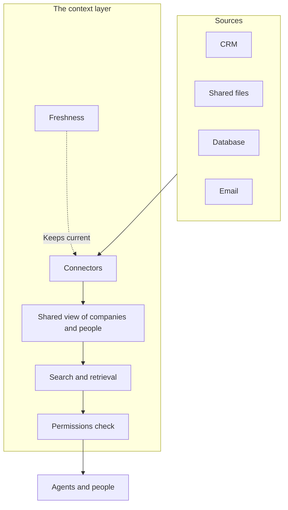

**In one line:** a context layer is the set of connected, permissioned and reasonably fresh sources, plus the logic that gathers the right information from them for each question, sitting between your raw systems and the agents or people who ask.

## Why it matters

Most of what a firm knows is scattered. Company details sit in a CRM (customer relationship management system), documents sit in shared file storage, numbers sit in a database, and half the story sits in email. No single place holds the full picture.

An [agent](/concepts/agents/chat-agent-workflow-automation/) is only as good as what it can see. If it can't reach your systems, it guesses, or you paste material in by hand. If it can reach everything with no limits, it can leak things to people who shouldn't see them.

A context layer solves both problems. It gives agents one controlled way to ask questions of your information.

<mark>A context layer is not a product you buy. It is the job of getting the right, permitted, current information in front of a model, done once and reused by every agent.</mark>

## How it works

Think of a good research assistant who knows where everything is kept. You ask a question, and they know which cabinets to open, which ones you are allowed into, and which files are out of date. They hand you a short, relevant pack. The context layer plays that role for software.

It has five parts:

- **Connectors.** Each source (CRM, files, database, email) gets a connection that can read from it. The usual way agents use these is through [tools](/concepts/agents/tool-use/), and a standard called [MCP](/concepts/agents/mcp/) is one common way to package them.
- **A shared view of the main entities.** The same company may appear as "Acme Payments" in the CRM and "Acme Payments Ltd" in a file name. The layer links these records so they count as one company. This is called [entity resolution](/concepts/data/entity-resolution/).
- **Search and retrieval.** Structured facts are fetched by [querying a database](/concepts/data/how-llms-talk-to-databases/). Documents are found by searching their text and meaning, which is called [retrieval](/concepts/data/rag-and-chunking/).
- **Permissions.** The layer fetches only what the person asking is allowed to see. See [permissions and access control](/concepts/data/permissions-and-access-control/).
- **Freshness.** Each source is read live or copied on a schedule, so answers reflect current data. See [keeping data fresh](/concepts/data/keeping-data-fresh/).

The order matters. Permissions are checked before anything reaches the model, not after.

## In practice

The layer is an idea and an architecture, not one product. You can build it from many kinds of parts: tools that read the CRM, a search index over the file storage, a database for the facts you want to keep tidy, and an automation tool that moves data on a schedule.

It can start very small. A first version might be just a few read-only tools: one that looks up a company in the CRM, one that searches the shared files, and one that lists recent notes. That already beats pasting by hand.

It grows when a real question needs more. Add a source when someone keeps asking for it, not because it might be useful one day.

The data mostly stays in the original systems. The layer fetches it when asked, or keeps a copy that is refreshed on a schedule. Either way, the CRM stays the source of truth.

This is also the practical side of [context engineering](/concepts/talking-to-models/context-engineering/): the layer is where the selecting and assembling actually happens.

## Worked example

Someone at Sample Ventures, the fictional fund, asks an agent: "What is our history with Acme Payments?"

**Without a context layer,** the agent has nothing to read. It either answers from general knowledge (and may invent a funding round it has never seen) or asks the associate to paste in notes. The associate then spends ten minutes collecting emails, CRM notes and a deck, and the answer is only as complete as what they remembered to find.

**With a context layer,** the steps look like this:

1. The agent calls a company lookup. The layer matches "Acme Payments" to one company, even though the files call it "Acme Payments Ltd".
2. It fetches the CRM record: stage, first contact date and the list of interactions.
3. It searches the shared files for documents linked to that company, such as the pitch deck and a meeting memo.
4. The permissions check removes a folder the associate can't open, such as a partners-only file.
5. The agent writes a short timeline with the source named beside each fact, and says what it could not see.

The associate gets a grounded answer in under a minute, and can open each source to check it.

## Costs and limits

- **It takes effort to build and look after.** Connections break when a system changes, and someone has to notice and fix them.
- **It can't fix bad data.** If the CRM is half empty or out of date, the layer passes that on, confidently.
- **Permissions are the hard part.** Getting "who can see what" right across several systems takes care, and a mistake can expose confidential material.
- **It is easy to over-build.** Large, grand designs often stall. A few useful read-only tools beat a perfect plan that never ships.
- **Copies drift.** If you copy data into a separate store, that copy can go stale unless something refreshes it.

The most common mistake is starting with the architecture instead of a question people actually ask. Start with two or three real questions, connect only the sources they need, and expand from there.

## Often confused with

**Context layer vs data warehouse.** A data warehouse stores cleaned-up historical data, mainly for reports and analysis. A context layer is about serving the right information to agents and people for a question, and may use a warehouse as one source.

**Context layer vs RAG.** [RAG](/concepts/data/rag-and-chunking/) (retrieval-augmented generation) is a technique for finding relevant passages in documents. It is one component inside a context layer, which also covers structured data, permissions and freshness.

**Context layer vs knowledge base.** A knowledge base is usually a curated collection of articles written for people to read. A context layer reaches into live systems and is built for software to query.

## Related

- [Context engineering](/concepts/talking-to-models/context-engineering/): the practice of choosing what the model sees, which the layer makes possible
- [Structured vs unstructured data](/concepts/data/structured-vs-unstructured-data/): the two kinds of material the layer has to handle
- [Permissions and access control](/concepts/data/permissions-and-access-control/): how the layer decides what each person may see
- [MCP](/concepts/agents/mcp/): a common standard for connecting agents to sources

## The proper terms

- **Connector:** a connection that lets software read from, or write to, a source system
- **Context layer:** connected, permissioned sources plus logic that assembles information per question
- **Entity:** a real-world thing in your data, such as a company or a person
- **Source of truth:** the system whose record wins when copies disagree
