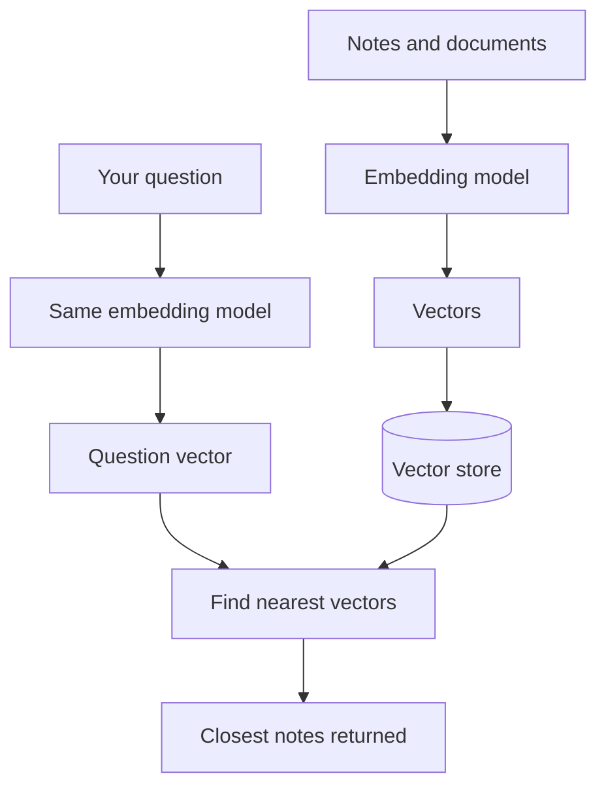

Chat models read and write text, but some jobs need something different: a way to measure how close two pieces of text are in meaning. Embeddings do that, and they sit underneath most search inside AI systems.

**In one line:** an embedding turns a piece of text (or an image) into a long list of numbers, so that pieces with similar meaning end up close together and can be found by distance.

## Why it matters

Ordinary search matches words. Search for "fraud" and you find notes that contain the word "fraud". A note that says "chargebacks are hurting margins" is about the same worry, but it never uses that word, so keyword search misses it.

People think in meaning, not exact words. Embeddings are the trick that lets software search by meaning instead.

<mark>An embedding lets software ask "what is this about?" instead of "which words does this contain?"</mark>

They sit underneath semantic search, recommendations, grouping similar items, and [retrieval-augmented generation](/concepts/data/rag-and-chunking/) (RAG), where an assistant looks up relevant passages before answering.

## How it works

Picture a huge map where every idea has a spot. "Invoice" and "bill" sit side by side. "Chargeback" and "fraud" are in the same neighbourhood. "Football" is a long way off. To find notes about a topic, you find the spot for your question and look at what is nearby.

An embedding is the address of a piece of text on that map. The real map is not flat like paper. It has hundreds or thousands of dimensions (directions to measure in), which is why the address is a long list of numbers. The proper term for that list is a **vector**. You cannot picture it, but the idea of "near" and "far" works the same.

Three things to know:

- **A separate model makes embeddings.** An embedding model is a different kind of model from the chat model that writes answers. It reads text and outputs the vector, nothing else. (For how chat models work, see [what an LLM is](/concepts/how-models-work/what-an-llm-is/).)
- **Closeness is a score.** To compare two vectors, software calculates a similarity score. A common method, cosine similarity, measures how much two vectors point the same way. A higher score means closer in meaning.
- **The question is embedded too.** To search, you turn the question into a vector with the same model, then ask the store for the closest vectors.

The first half, embedding and storing, happens ahead of time. The second half happens each time someone searches.

## In practice

Embeddings are stored in a **vector database**, which is built to find the nearest vectors quickly among millions. Some are dedicated products. Others are ordinary databases with a vector feature added, such as the pgvector extension for PostgreSQL. See [types of databases](/concepts/data/types-of-databases/) for how these fit with the rest.

Long documents are usually split into smaller pieces (chunks) before embedding, because one vector for a whole 50-page file blurs everything together. How you split matters a lot, and it is covered in [RAG and chunking](/concepts/data/rag-and-chunking/).

Many systems combine two searches: embeddings for meaning and keyword search for exact terms. This is often called hybrid search.

Embeddings are also used to group similar items together (clustering), to suggest related items, and to spot near-duplicates.

## Worked example

Sample Ventures, the fictional fund, has two years of meeting notes in its CRM and in shared files. An associate wants to find every founder who raised the same worry.

1. Ahead of time, the team splits the notes into short pieces and runs each through an embedding model. The vectors are stored in a database with a vector feature, alongside a link back to the original note.
2. The associate asks: "Which founders were worried about fraud?"
3. The question is turned into a vector using the same embedding model.
4. The database returns the closest vectors. Near the top is a note on Acme Payments: "Chargebacks are hurting margins, mainly from card-not-present orders."
5. The note never says "fraud", but chargebacks are a fraud-related cost, so it sits close to the question on the map.
6. The assistant shows the associate the top notes with their sources, and she reads them to decide which really fit.

A keyword search for "fraud" would have missed that note.

## Costs and limits

- **Embedding is cheap, but not free.** Relative to chat, creating embeddings costs little. A large archive still adds up, and so does storing the vectors.
- **Poor at exact matches.** Names, codes, invoice numbers and amounts are weak spots. "Acme Payments" and "Acme Payroll" can look close in meaning. Combine with keyword search for anything that must match exactly.
- **Vectors from different models cannot be mixed.** Each embedding model has its own map. Vectors from two models cannot be compared, even if they look alike.
- **Changing model means re-embedding everything.** If you switch to a better embedding model, every stored piece must be processed again.
- **Quality depends on how text was split.** Chunks that cut a thought in half, or hold three unrelated topics, give poor results.
- **Similarity is not truth.** "Close in meaning" means related, not correct. A confidently written wrong note will match just as well as a right one.
- **The nearest result may not be a good one.** Search always returns something. Check how close the top results really are.

The most common mistake is trusting the top result without reading it. Treat embedding search as a smart way to find candidates, not as an answer.

## Often confused with

**Embeddings vs keyword search.** Keyword search matches the exact words you typed. Embedding search matches meaning. Each finds things the other misses.

**Embeddings vs the chat model.** The embedding model only turns text into numbers. It does not answer questions or write anything.

## Related

- [What an LLM is](/concepts/how-models-work/what-an-llm-is/): the chat model is a different kind of model from an embedding model
- [RAG and chunking](/concepts/data/rag-and-chunking/): embeddings find the passages, chunking decides what a passage is
- [Types of databases](/concepts/data/types-of-databases/): where vectors are stored

## The proper terms

- **Chunk:** a smaller piece of a document, embedded on its own
- **Cosine similarity:** a score for how closely two vectors point the same way
- **Embedding:** a list of numbers that represents the meaning of a piece of content
- **Embedding model:** a model that turns content into embeddings, separate from a chat model
- **Semantic search:** finding items by meaning instead of exact words
- **Vector:** an ordered list of numbers, here the address of an embedding
- **Vector database:** a database built to find the nearest vectors quickly

## Next up

Embeddings help find the right material, but hard questions also need careful working out. [Reasoning models](/concepts/how-models-work/reasoning-models/) covers models trained to think through a problem before they answer.
