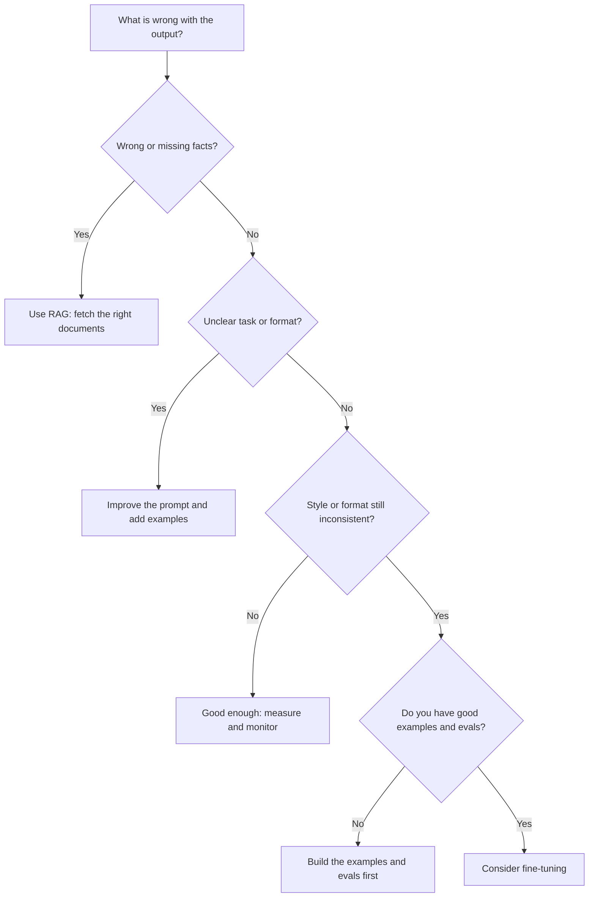

With RAG known, there are three ways to give a model knowledge or change how it responds: change the prompt, change what it reads, or change the model itself. This page is about choosing between them.

**In one line:** prompting changes what you ask, RAG changes what the model reads, and fine-tuning changes the model itself, so the sensible order is to try them in that order and fine-tune only when the first two cannot fix the problem.

## Why it matters

When an assistant gives a poor answer, it is tempting to reach for the most powerful-sounding fix: "let's train it on our data". That is usually the slowest, most expensive and least flexible option.

Most problems are cheaper to fix earlier on the ladder. A clearer instruction, a few examples, or the right document in front of the model solves a large share of them in an afternoon.

Fine-tuning does have a real place. Knowing what it is good at, and what it cannot do, stops you spending weeks training a model to fix a problem it was never able to fix.

For a side-by-side comparison table of the three approaches, see [RAG and chunking](/concepts/data/rag-and-chunking/). This page is about the choosing.

<mark>Fine-tuning changes how a model behaves, not what it reliably knows, so use it for style and format and use retrieval for facts.</mark>

## How it works

**What fine-tuning is.** A model is first trained on a huge amount of text (see [pre-training and post-training](/concepts/how-models-work/pre-training-and-post-training/)). Fine-tuning is a second, much smaller round of training on your own examples. Each example shows an input and the output you want, and the model's internal numbers (its [parameters](/concepts/how-models-work/parameters-and-temperature/)) are nudged so it produces outputs more like those.

There are two broad ways to do it:

- **Full fine-tuning** updates all of the model's parameters. It needs a lot of computing power and produces a complete new copy of the model.
- **Lightweight methods** update only a small add-on layer and leave the original model frozen. The best known is **LoRA** (low-rank adaptation). The small add-on is called an **adapter**, it is cheap to train and store, and you can keep several adapters for different jobs on top of one base model. Documentation for LoRA reports results comparable to full fine-tuning for many tasks.

**What it is good for:**

- A consistent style, tone or output format, applied every time without a long reminder.
- Specialised behaviour that is hard to describe but easy to show, such as sorting messages into your own categories.
- Shorter prompts. Once the behaviour is built in, you no longer need long instructions and many examples in every request, which can cut cost and delay at high volume.
- Letting a smaller, cheaper model do one narrow job well.

**What it is bad at:**

- **Adding or updating facts.** Training does not turn the model into a reliable filing cabinet. It may absorb some facts, blur others and invent the rest. Facts that change would need retraining.
- **Showing sources.** A fine-tuned model cannot say which document a claim came from. RAG can.
- **Fast changes.** Editing a document takes seconds. Retraining takes planning, data and testing.

**What you need before you start:**

- **Good example data.** Hundreds or more of correct, consistent input and output pairs. Mistakes and inconsistencies in the examples are copied faithfully.
- **A way to measure.** Without [evals](/concepts/agents/evals/) (repeatable tests that score a model's answers, covered in chapter 5), you cannot tell whether the fine-tuned model is better than a well-prompted base model. Measure before and after.
- **Upkeep.** A fine-tune is tied to the base model it was trained on. When that model is retired or replaced, the work usually has to be redone.

**Privacy.** Your training examples have to go somewhere: to the provider that runs the training, or to your own training setup. Check what the provider does with the data (retention, whether it is used for anything else) before you upload anything sensitive. See [GDPR, data retention and DPAs](/concepts/security/gdpr-data-retention-and-dpas/).

**The ladder.** Climb one rung at a time, and test after each:

1. **A better prompt.** Clear instructions, the audience, the format you want.
2. **Examples in the prompt.** Show two or three good outputs (often called few-shot prompting).
3. **RAG.** If the model lacks facts, fetch the relevant ones at question time.
4. **Fine-tuning.** Only if behaviour is still wrong, volume is high, or a smaller model must do the job.

## In practice

Major model providers publish guidance that follows the same order: build tests first, improve the prompt, and fine-tune only if that is not enough. One provider's guide lists the cases where fine-tuning helps as shorter prompts, lower cost and delay, and training a smaller model for a specific task.

Availability varies. Some providers offer fine-tuning of some of their models through their platform, some do not offer it for their main models at all, and open-weight models can be fine-tuned on your own or rented hardware. Check the provider's current documentation, since this changes often.

Fine-tuning is also not the only way to change behaviour. [Skills and instruction files](/concepts/agents/skills-and-instruction-files/) and [system prompts](/concepts/talking-to-models/system-prompts/) shape behaviour without any training, and they are much easier to edit.

## Worked example

Sample Ventures, the fictional fund, wants every intro email logged in the CRM in a consistent way: a one-line summary, who introduced whom, the startup name and a suggested next step. An associate drafts the first attempt, and the outputs vary in length and wording.

1. **Better prompt.** The associate writes exact instructions: "One line summary, then the introducer, then the startup, then one next step." Format improves, but a few outputs still drift.
2. **Examples in the prompt.** She adds three real-looking examples (invented ones for Acme Payments and others). Consistency is now good. She checks 30 past emails against what a person would have logged, and 28 match.
3. **RAG.** The model sometimes misses that Acme Payments is already in the CRM. Rather than training anything, the team lets it look up the company first. That fixes it.
4. **Fine-tuning?** Not needed. The prompt is a little long, but the volume is a few dozen emails a week, so the saving would be tiny.

Two years later the fund logs thousands of emails a month across several teams, and a small, cheap model is wanted for the job. Now the shorter prompts and lower cost could pay off. The team gathers a few hundred reviewed emails and the matching correct logs, trains a lightweight adapter on a small model, and runs it against the same 30 test emails and a larger set. Only if it scores at least as well as the prompted version does it go live.

## Costs and limits

- **Time and effort.** Collecting and checking examples is most of the work, more than the training itself.
- **Upfront cost against running cost.** Training costs something, and may save money later at high volume. At low volume it rarely does.
- **Data quality.** A fine-tune learns your mistakes as well as your good examples.
- **Lock-in.** A fine-tuned model is tied to its base. A new base model usually means retraining and retesting.
- **Hard to inspect.** If a prompt misbehaves, you read it and fix it. If a fine-tuned model misbehaves, you retrain.
- **Common mistake.** Fine-tuning to teach the model your company's facts. Use retrieval for that.

## Often confused with

**Fine-tuning vs pre-training.** Pre-training builds a model from scratch on a vast amount of text and costs a fortune. Fine-tuning starts from a finished model and adjusts it with a comparatively small set of examples.

**Fine-tuning vs memory.** [Memory](/concepts/agents/memory/) in an assistant means saving notes and facts that are read back into later conversations. The model itself does not change. Fine-tuning changes the model, and does not remember individual conversations.

## Related

- [RAG and chunking](/concepts/data/rag-and-chunking/): the comparison table, and how retrieval supplies facts
- [Prompt engineering](/concepts/talking-to-models/prompt-engineering/): the first rung of the ladder
- [Evals](/concepts/agents/evals/): how to tell whether any of these changes helped
- [Pre-training and post-training](/concepts/how-models-work/pre-training-and-post-training/): where the original training ends and fine-tuning begins

## The proper terms

- **Adapter:** a small trained add-on layer that changes a frozen model's behaviour
- **Few-shot prompting:** putting a few worked examples in the prompt to show the pattern
- **Fine-tuning:** training an existing model further on your own examples
- **Full fine-tuning:** updating all of a model's parameters during further training
- **LoRA:** a lightweight fine-tuning method that trains small adapters instead of the whole model
- **Training data:** the example inputs and desired outputs used to fine-tune a model

## Next up

Retrieval finds passages, but some questions are about how people and companies connect rather than what a document says. [Knowledge graphs](/concepts/data/knowledge-graphs/) are built for those.
