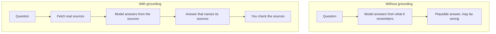

**In one line:** hallucination is when a model states something false with confidence, and grounding is giving it real source material to answer from, so its answers can be checked.

## Why it matters

This is the biggest trust problem with AI. A made-up figure, date or citation reads just as smoothly as a correct one, so you can't spot it by tone.

For work built on company and people data, the stakes are practical. A wrong number about a company, repeated into a note or an email, can travel a long way before anyone checks.

<mark>A model sounds equally sure when it is right and when it is wrong. Confidence is not evidence.</mark>

## How it works

A [language model](/concepts/how-models-work/what-an-llm-is/) writes the text that best fits the pattern so far. It does not look facts up and then report them. When it has seen a fact often, the pattern points to the right answer. When it hasn't, or when the question needs information it was never given, the pattern still produces something that sounds right.

That is a hallucination. Typical examples are an invented source, a wrong date, a person who doesn't exist, or a figure for a company the model has no data on.

It happens most when the model is asked about things that are rare, very recent, or private to you, and when the question assumes the answer exists. It is much less of a problem for well-known general knowledge.

Providers have reduced it a lot, but nobody has removed it, and it is not safe to assume it will disappear. Treat it as a standing property of the technology.

**Grounding** is the main defence. Instead of relying on what the model remembers, you put real sources in front of it and tell it to answer from them. There are four parts:

1. **Fetch the sources.** Paste them in, or let a [tool](/concepts/agents/tool-use/) search your records or the web.
2. **Answer from them only.** Tell the model to use just those sources.
3. **Show where each fact came from.** Ask for the source name or a short quote.
4. **Allow "not found".** Tell it to say so when the sources don't contain the answer.

## In practice

Grounding comes in several forms. The simplest is pasting the document into the conversation. More automated setups use search tools or retrieval, which finds the relevant passages in a large collection and sends only those. Retrieval gets its own page.

Good setups also ask for quotes or links, so a person can check the claim in seconds. Some add a second pass, where another step checks each claim against the source.

The sources stay in your own systems, such as the CRM and file storage. How current the answer is depends on how current those systems are, which is a strength compared with a model's frozen training.

For anything important, a person still checks. Grounding makes checking possible and fast. It does not replace it.

## Worked example

Someone at Sample Ventures, the fictional fund, asks: "What was Acme Payments' revenue last year?"

**Without grounding,** a plain assistant has no data on this company. It may produce a confident figure, such as "around £1.2m", that is invented.

**With grounding,** an agent searches the CRM and the data room files. It finds the accounts and answers: "£1.4m, according to the 2025 accounts (file: Acme-accounts-2025, page 3)." A person can open the file and confirm in a few seconds.

If the agent finds nothing, the right answer is "I couldn't find revenue figures for Acme Payments in the CRM or the data room." That is a useful answer. Models give it far more often when they have been told it is allowed.

## Costs and limits

- **Grounding costs more.** Fetching sources and sending them to the model uses extra time and [tokens](/concepts/how-models-work/tokens-and-context-windows/).
- **The model can still misread a source.** It may summarise badly, mix up two documents, or cite the wrong page.
- **The sources can be wrong.** An outdated or incorrect record gives a confident, grounded, wrong answer.
- **It can fetch the wrong thing.** If the search returns the wrong document, the answer follows it.
- **Asking "are you sure?" is not a check.** The model may just as confidently repeat or reverse its answer.

The most common mistake is trusting an answer because it reads well. Check the source, especially for numbers, names and anything that will be sent to someone else.

## Often confused with

**Hallucination vs a simple mistake.** A mistake can happen in any software. A hallucination is specific to models: invented content that fits the pattern of a good answer.

**Grounding vs fine-tuning.** Fine-tuning changes the model itself by training it further. Grounding leaves the model alone and gives it facts at the moment of the question, which is easier to update and to check.

## Related

- [What an LLM is](/concepts/how-models-work/what-an-llm-is/): why models predict text instead of looking facts up
- [Tool use](/concepts/agents/tool-use/): how a model fetches real sources
- [Tokens and context windows](/concepts/how-models-work/tokens-and-context-windows/): grounding only works for what fits in the window
- [Context engineering](/concepts/talking-to-models/context-engineering/): choosing which sources reach the model

## The proper terms

- **Citation:** a pointer from a claim back to the source it came from
- **Grounding:** giving a model real source material to answer from
- **Hallucination:** a confident statement from a model that is false or invented
- **Retrieval:** fetching the relevant passages from a larger collection
