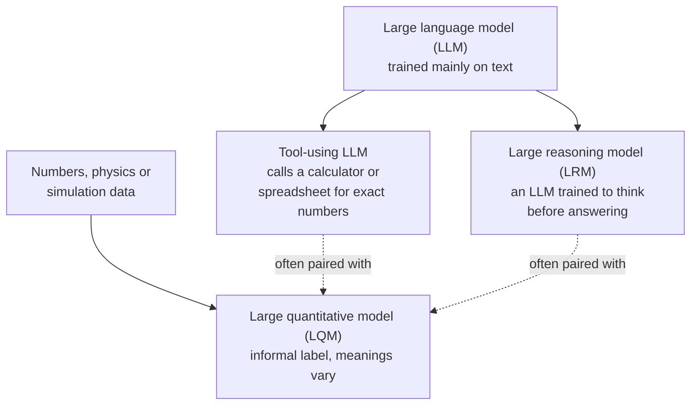

Reasoning models have a label of their own, LRM, and it sits beside others such as LLM and LQM. This page sorts out what each one means, and why the more useful question is what a model is built to do.

**In one line:** LLM, LRM and LQM are informal labels for models built around text, step-by-step reasoning, and numbers or simulation, and the useful question is always what a model is built to do and how you can check it.

## Why it matters

New labels appear constantly, and some are science, some are marketing. Without a way to sort them, it is easy to buy, or ask for, the wrong thing. "We need a quantitative model" can mean three very different things depending on who is speaking.

For a small firm, the practical point is simple. Most number work (portfolio maths, forecasts, cap tables) does not need a special kind of AI. It needs a reliable calculation, and a language model can be given a way to run one.

<mark>The labels are informal and overlap, so ask what a model is built to do and how you will check its answer, not which acronym it carries.</mark>

## How it works

These three labels do not form a clean official taxonomy. They describe different things: LLM is about what the model is made of, LRM is about how it works through problems, and LQM is a looser label about what data it is built around.

**LLM (large language model).** A model trained on huge amounts of text to predict the next piece of text. It reads and writes language, and can be made to do much else. See [what an LLM is](/concepts/how-models-work/what-an-llm-is/).

**LRM (large reasoning model).** A language model that has also been trained, and is run, to work through a problem step by step before answering. It is still a language model underneath. The label marks a change in behaviour, not a separate species. See [reasoning models](/concepts/how-models-work/reasoning-models/).

**LQM (large quantitative model).** The least settled term. It is used for models built around numbers, physics or simulation data rather than text. Different people mean different things by it (see the snapshot below). There is no standard definition and no standards body behind it.

The dotted lines matter. In real systems these things are combined: a language model or reasoning model handles the conversation and the planning, and calls a quantitative tool for the part that needs exact numbers.

**Snapshot, as of October 2026.** This paragraph describes how the term is used now, and it may change. The best-known user of "large quantitative models" is SandboxAQ, a company that describes them as AI trained on physics, chemistry, biology and maths to model real-world systems, using data generated from physical principles and lab data. Its examples are drug discovery, materials and chemistry. In 2026 it announced two such models for its marketplace launch on a major cloud platform, one for catalyst and materials discovery and one for drug discovery. Its chief executive has described the approach as complementary to language models, and has said these models use neural networks and knowledge graphs rather than the transformer design behind most language models.

Others use the same words more loosely. A revenue-software vendor uses "large quantitative models" for models built on structured sales and CRM data that produce forecasts and deal risk scores. A research-and-explainer site and an IT news article describe LQMs generally as models for numerical, structured data used for forecasting, risk and simulation. These descriptions do not agree on what makes a model an LQM, how large it must be, or how it is built. Treat the term as partly vendor branding until an agreed definition appears.

## In practice

When you see one of these labels, translate it into plain questions:

- **What was it trained on?** Text, lab data, simulation output, or your own structured records?
- **What does it output?** Words, a number, a ranked list, a forecast?
- **How would I check it?** Against a source document, a recalculation, a known result, or a held-back test?

Language models and reasoning models are available from many providers as ordinary assistants. Quantitative models of the specialised kind are usually sold for a specific field, such as chemistry or revenue forecasting, and are used by specialists.

For everyday quantitative work, the usual pattern is a language model that uses [tool use](/concepts/agents/tool-use/) to call something exact: a spreadsheet, a script, a database query, or a financial library. The model decides what to calculate and explains the result. The tool does the arithmetic.

## Worked example

Sample Ventures, the fictional fund, has three jobs on one Monday.

1. **Summarise a call with the Acme Payments founders.** This is language work. A normal language model is the right fit, working from the transcript. A person skims the summary against the notes.
2. **Work through a tricky cap-table scenario.** The question is what happens to each shareholder's stake if Acme Payments raises a new round with a different set of terms. The reasoning is multi-step, so a [reasoning model](/concepts/how-models-work/reasoning-models/) helps to set it up. The arithmetic should still be done by a spreadsheet or script that the model calls, so that the numbers are exact and a person can inspect the formulas.
3. **Run the quarterly portfolio return calculation.** This is a defined calculation on known data. The fund uses its spreadsheet or a small script, with the same method every quarter. A language model may help write or explain the script, but it should not be the thing producing the figures.

None of these needed a special quantitative model. If the fund later wanted physics-based simulation, it would be a different conversation, and a specialist would be involved.

## Costs and limits

- **The labels do not guarantee quality.** "Quantitative" in a product name does not mean the numbers are right. Ask how it is tested.
- **Language models are weak at exact arithmetic on their own.** They can slip on long calculations, so give them a tool for anything that must be exact.
- **Specialised models cost more to adopt.** They often need specialist data, integration and expertise, and they suit narrow, high-value problems.
- **Reasoning costs more than plain answering.** See [reasoning models](/concepts/how-models-work/reasoning-models/).
- **Terms drift.** Today's marketing term may be gone or redefined in a year, so keep your own thinking tied to what the model does.

The most common mistake is reaching for a new kind of model when a spreadsheet would do.

## Often confused with

These are the usual mix-ups, in a form you can quote.

| | LLM | LRM | LQM |
| --- | --- | --- | --- |
| Stands for | Large language model | Large reasoning model | Large quantitative model |
| Built around | Text | Text, plus extended step-by-step thinking | Numbers, physics or simulation data (meaning varies) |
| Typical output | Words, code, summaries | Worked-through answers to multi-step problems | Predictions, forecasts or scores |
| Status of the term | Widely used | Widely used, informal | Informal, partly vendor branding |
| Good for | Drafting, summarising, answering | Maths, code, planning, puzzles | Narrow scientific or numeric prediction |
| Check it by | Comparing to sources | Checking the answer and the working | Testing against known results or recalculating |

Remember that an LRM is a kind of LLM, so the labels overlap. An LQM is not a kind of LLM by definition, though some products combine the two.

## Related

- [What an LLM is](/concepts/how-models-work/what-an-llm-is/): the base idea the other two labels build on
- [Reasoning models](/concepts/how-models-work/reasoning-models/): the full story behind the LRM label
- [Tool use](/concepts/agents/tool-use/): how a language model calls a spreadsheet or script for exact numbers
- [Benchmarks](/concepts/how-models-work/benchmarks/): how claims about a model's ability are tested

## The proper terms

- **LLM:** large language model, trained on text to predict and generate language
- **LRM:** large reasoning model, a language model trained to think step by step first
- **LQM:** large quantitative model, an informal label for models built around numbers or simulation
- **Quantitative model:** any model that produces numeric predictions from data or equations
- **Simulation:** a computer model of a real system, used to predict how it behaves

## Next up

These labels describe what a model is built around. Another way to sort models is by the kinds of material they can take in, and [multimodal models](/concepts/how-models-work/multimodal-models/) covers the ones that handle images, audio and documents as well as text.
