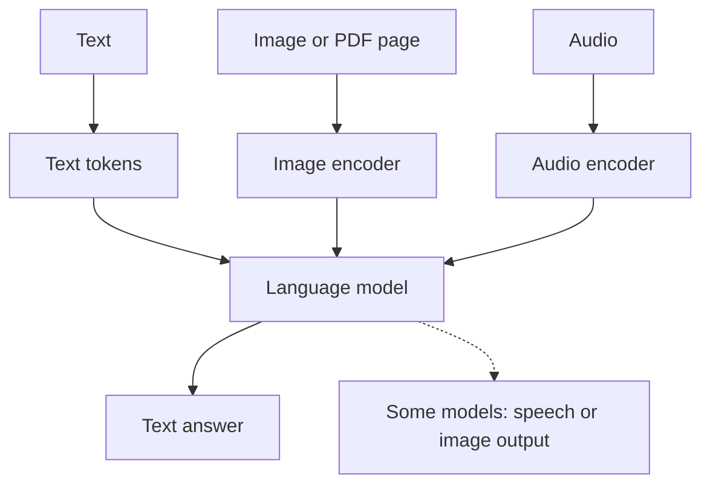

Models are usually described as working on text, but much real material arrives as charts, scans and recordings. This page explains how some models take those in as well, and where they slip.

**In one line:** a multimodal model can take in, and sometimes produce, more than one kind of material (a modality), such as text, images, audio or video, instead of text alone.

## Why it matters

Much business information is not plain text. Pitch decks are full of charts. Contracts arrive as scans. Calls are audio. Screenshots show what an error message said.

A text-only model cannot see any of that. A multimodal model can, so you can hand it the material as it exists rather than retyping it. For a context layer (the organised store of company data that agents draw on, covered in chapter 4), this decides whether a pile of PDFs, slides and recordings is usable at all.

<mark>A multimodal model reads an image the way it reads text, by prediction, so it can misread a chart or a number and still sound sure.</mark>

## How it works

A **modality** is a kind of material: text, images, audio, video. A **multimodal model** handles more than one.

A language model works on [tokens](/concepts/how-models-work/tokens-and-context-windows/), small pieces of text turned into numbers. To handle an image, the image must also become numbers the model can read. A component called an **encoder** does this. It cuts an image into small patches and turns each patch into a list of numbers that captures its content, much like the [embeddings](/concepts/how-models-work/embeddings/) used to represent meaning in text. Audio is cut into short slices and encoded in a similar way.

The model then reads those image or audio pieces alongside your text, in the same [context window](/concepts/how-models-work/tokens-and-context-windows/). From its point of view, the picture becomes more input to think about.

**Input and output are separate.** Many models accept images and reply only in text. Some also produce images or speech, but that is a different ability, often handled by separate components. When you read about a model being "multimodal", check which modalities go in and which come out.

**Documents.** A PDF is often handled in two ways at once: the text is extracted, and each page is also turned into an image so the model can see charts and layout. Documentation for at least one major provider describes exactly this approach.

## In practice

Chat assistants and APIs from the major providers accept image uploads and PDFs. Some accept audio or video. Speech-to-text and text-to-speech can also be separate tools placed around a text model, which looks multimodal from outside but works differently.

Common uses for a firm like a VC fund:

- Reading a pitch deck PDF that has charts and tables
- Transcribing and summarising a call recording
- Describing what is in a screenshot
- Extracting a table from a scanned page

Plain text extraction does not always need a multimodal model. Ordinary **OCR** (optical character recognition, software that turns a picture of text into text) and standard transcription tools are often cheaper, faster and more predictable for that single job. Use the multimodal model when you need understanding of layout, charts or context, not just the words.

## Worked example

An associate at Sample Ventures, the fictional fund, receives a pitch deck from Acme Payments. Slide 7 has a bar chart of monthly revenue. She wants the figures for her notes.

1. **Upload the deck** to an assistant that accepts PDFs and ask: "Read the revenue chart on slide 7 and list the monthly values. Say if any value is hard to read."
2. **The model replies** with six monthly figures, for example 41, 44, 52, 58, 63 and 71 (thousands).
3. **She checks.** The chart has no value labels, so the model has estimated bar heights. She asks for the founders' underlying spreadsheet in the data room.
4. **She compares** the spreadsheet to the model's figures. Five match closely. One month is 61, not 63: a small misread of a bar.
5. **She records** the spreadsheet numbers, notes the chart-derived ones as estimates, and does not paste the model's figures into the investment memo.

The model saved time finding the data. The check against the source caught the error.

## Costs and limits

- **Misreading.** Small text, dense charts, unlabelled bars and handwriting are common weak spots. Provider documentation warns that results can be wrong on low quality, rotated or very small images.
- **Invented detail.** A model can describe something that is not there (see [hallucination and grounding](/concepts/how-models-work/hallucination-and-grounding/)). Charts without labels invite estimates presented as facts.
- **Uses lots of tokens.** An image is usually split into patches, and larger images cost more tokens. A PDF page can cost a lot because it counts as text and as an image. Cost and window space rise quickly with long decks (see [how AI pricing works](/concepts/cost/how-ai-pricing-works/)).
- **Privacy.** Whatever you upload is sent to the provider. Check data terms before uploading confidential documents (see [GDPR, data retention and DPAs](/concepts/security/gdpr-data-retention-and-dpas/)).
- **Hidden instructions.** Text inside an image or document can try to steer the model (see [prompt injection](/concepts/security/prompt-injection/)).
- **Not always the best tool.** For plain text from a clean scan, OCR may be more accurate and cheaper. Compare on a few real documents.
- **Support varies.** Which modalities work, in which formats and at which sizes, differs by model and changes often. Check the provider's current documentation.

## Often confused with

**Multimodal vs multi-model.** A multimodal model handles several kinds of material. A multi-model setup uses several different models, perhaps one to transcribe and one to summarise.

**Input vs output modality.** Accepting images does not mean being able to draw them.

## Related

- [Tokens and context windows](/concepts/how-models-work/tokens-and-context-windows/): images and audio are turned into tokens and use window space
- [Embeddings](/concepts/how-models-work/embeddings/): the number lists that represent the meaning of text and images
- [Hallucination and grounding](/concepts/how-models-work/hallucination-and-grounding/): why chart readings must be checked
- [Structured vs unstructured data](/concepts/data/structured-vs-unstructured-data/): why decks and scans are hard for a context layer

## The proper terms

- **Multimodal model:** a model that handles more than one kind of material, such as text and images
- **Modality:** a kind of material, such as text, images, audio or video
- **Encoder:** a component that turns an image or audio into numbers a model can read
- **Input modality:** a kind of material a model can take in
- **Output modality:** a kind of material a model can produce
- **OCR:** software that turns a picture of text into editable text
- **Transcription:** turning speech in audio into written text

## Next up

Whatever a model can read, someone has to run it. [Open vs closed weights](/concepts/how-models-work/open-vs-closed-weights/) looks at who holds the model itself, and what that means for control, cost and privacy.
