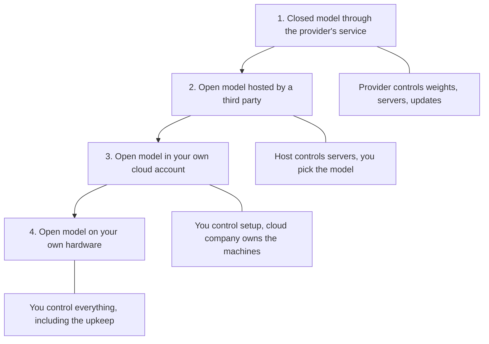

**In one line:** a closed-weight model can only be used through its provider's service, while an open-weight model publishes its learned numbers so anyone can download and run it, under a licence that sets the rules.

## Why it matters

When you pick a model, you are also picking who holds it. With a closed model, your text travels to the provider, is processed on their machines, and comes back. With an open model, you can bring the model to your text instead.

That choice affects privacy, cost, control and workload. It also affects what happens if a provider changes a price, retires a model or alters its behaviour. Both routes are legitimate: they trade convenience against control.

The weights are the learned numbers inside a model (see [what an LLM is](/concepts/how-models-work/what-an-llm-is/)). They are, in effect, the model itself: whoever holds the weights can run it.

<mark>Open weights tell you who can run the model, not who can see your data: privacy depends on where the model runs and what the host's terms say.</mark>

## How it works

**Closed weights.** The provider keeps the weights private. You send a request over the internet and get an answer back. You never see or hold the model. The provider handles hardware, updates and safety measures, and sets the price and terms.

**Open weights.** The provider publishes the weights, usually on a public download site. Anyone can fetch them and run the model on their own hardware or rent hardware to do so. The model is then used through a program that loads the weights and does the prediction work (see [inference](/concepts/how-models-work/inference/)).

**The licence still matters.** "Open" does not mean "no rules". Some open-weight models use permissive licences with few conditions. Others use custom licences that can limit commercial use above a certain company size, require you to credit the model's maker or follow naming rules for anything you build on it, or ban certain uses. Read the licence before building a product on it.

**Open weights is not the same as open source.** In software, "open source" has a settled meaning: you can see the code, change it and share it. For AI, the Open Source Initiative (the body that maintains the open source definition) published an Open Source AI Definition. It asks for more than the weights: sufficiently detailed information about the training data, the complete code used to train and run the system, and the parameters, all made available so people can use, study, modify and share the system. Many "open" models release only the weights, sometimes with a technical report. Because of that, many people use the more precise term **open weights**. The wording is still debated, so expect it to be used loosely.

**A spectrum, not a switch.** There are four common ways to use a model, from least to most control:

Going down the list, you gain control and take on work. Option 2 is often overlooked: you get an open model without running anything, but the host's terms and practices then decide what happens to your data.

## In practice

Closed-weight models are offered by the large AI companies through chat apps and APIs. Open-weight models are published on sites such as Hugging Face, and are run with tools such as Ollama or vLLM, or rented by the call from hosting companies.

For a small firm, the realistic choices are usually option 1 (simple, with good capability) or option 2 or 3 (more control over where data goes). Option 4 needs hardware and someone to look after it, which is rarely worth it at small scale unless the data truly cannot leave the building.

Open weights also allow **fine-tuning**: training the model a little more on your own examples (see [fine-tuning vs prompting vs RAG](/concepts/how-models-work/fine-tuning-vs-prompting-vs-rag/)). Closed providers sometimes offer fine-tuning too, but on their terms.

**Snapshot, as of October 2026.** This paragraph names examples and will date. Several major developers publish open-weight models, including Meta (Llama, released under a custom community licence) and OpenAI (gpt-oss). OpenAI describes its gpt-oss models as open-weight, released under the Apache 2.0 licence, downloadable from Hugging Face and able to run locally, with a smaller one aimed at hardware with about 16GB of memory. Licences differ widely between families, so check the current one. The gap between the best open and best closed models has narrowed at times and widened at others, so test current models on your own task rather than relying on general claims.

## Worked example

Sample Ventures, the fictional fund, wants an assistant to summarise documents from Acme Payments' data room. Some of those documents are confidential. The operations lead lists questions before choosing anything:

1. **Where is the data processed?** Which country, which company, which machines?
2. **What do the data terms say?** Is our input used to train models? Is it kept, and for how long? Who can read it?
3. **What is the retention period, and can it be set to zero?** Can we delete things on request?
4. **Who is the processor?** If a third party handles personal data for us, a data processing agreement is needed (see [GDPR, data retention and DPAs](/concepts/security/gdpr-data-retention-and-dpas/)).
5. **Who can sign in and see logs?** What access controls exist?

She then compares options. A closed model with strong business data terms may be safer than an open model on a cheap host with vague terms. An open model run in the fund's own cloud account keeps documents inside an environment the fund already trusts, but then the fund must look after updates and security.

Her conclusion: "open weights" is not a privacy answer on its own. A downloaded model on a laptop is private. The same model reached through an unknown hosting website is not.

## Costs and limits

- **Operational burden.** Running a model yourself means hardware, updates, monitoring and security patches. Someone has to own it.
- **Cost shape.** Closed models charge per use. Self-hosting has a fixed cost for machines that is often only worthwhile at high, steady volume. At low volume, pay-per-use is usually cheaper.
- **Possible capability gap.** The very best closed models have often led open ones on hard tasks, though the gap changes over time and depends on the task. Test, do not assume.
- **Licence reading.** Terms vary and can restrict commercial use or require credit. Have someone read them before building a product.
- **No surprise changes, but no free upgrades.** An open model you hold does not change under you, and cannot be withdrawn by a price change. It also does not improve on its own.
- **Security is yours.** You must control who can reach the model and what it can connect to. Hosting the model yourself does not remove risks such as [prompt injection](/concepts/security/prompt-injection/).
- **Common mistake.** Assuming "open" means "free", "private" or "safe".

## Often confused with

**Open source vs open weights.** Open source, strictly, means the whole system can be inspected, changed and shared, including the training code and data information. Open weights means only the trained numbers are available.

**Free vs open.** A model can be free to use and closed (a free chat tier), or open and not free to host (the hardware costs money). Open describes access to the weights, not the price.

## Related

- [What an LLM is](/concepts/how-models-work/what-an-llm-is/): explains what the weights are
- [Quantisation](/concepts/how-models-work/quantisation/): how open models are shrunk to fit on smaller hardware
- [Inference](/concepts/how-models-work/inference/): what running a model involves, wherever it runs
- [Permissions and access control](/concepts/data/permissions-and-access-control/): who can reach the data once a model is connected
- [Open-model hosting](/map/open-model-hosting/): who runs an open model for you

## The proper terms

- **Weights:** the learned numbers that make up a model
- **Closed-weight model:** a model usable only through its provider's service
- **Open-weight model:** a model whose weights are published for anyone to download and run
- **Open source AI:** a system released with weights, training code and data information under open terms
- **Licence:** the legal terms that set what you may do with a model
- **Self-hosting:** running a model on infrastructure you control
- **Hosted open model:** an open model run for you by a third party
