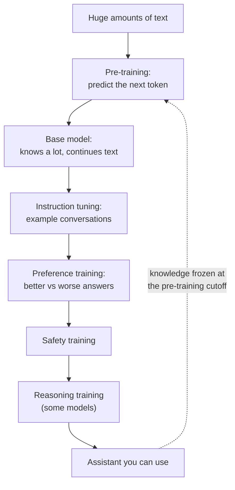

**In one line:** pre-training is where a model learns language and general knowledge by predicting text, and post-training is where that raw model is shaped into a helpful, safer assistant.

## Why it matters

Many puzzling things about assistants make sense once you know there are two training phases. The first one decides what the model knows, and when its knowledge stops. The second one decides how it behaves: its tone, what it refuses, and how eager it is to agree with you.

It also explains why one underlying model can turn up as several different products. A lab can pre-train once, then post-train several versions for chat, for coding, or for careful reasoning.

<mark>Pre-training decides what a model knows. Post-training decides how it behaves, and neither one makes it check its facts.</mark>

## How it works

Think of a person who has read a vast library but never had a job. They know a lot, but they have never been taught how to help a customer. Pre-training is the reading. Post-training is the on-the-job coaching.

**Pre-training.** The model is shown enormous amounts of text and trained to guess the next [token](/concepts/how-models-work/tokens-and-context-windows/) (a small chunk of text, often a word or part of one). It guesses, checks against the real text, and adjusts its internal numbers ([parameters](/concepts/how-models-work/parameters-and-temperature/)). Repeated across a huge amount of text, this teaches grammar, facts, writing styles and some skill at reasoning through patterns.

The result is a **base model**. It is good at continuing text, but it is not an assistant. Ask it a question and it may answer, or it may continue with more questions, as if your message were the start of a quiz.

**Post-training.** This is a set of further steps that shape the base model. The exact recipe differs by lab and is mostly not published, but the common ingredients are:

- **Instruction tuning.** The model is trained on example conversations: a request, then a good reply. This teaches it to follow instructions and answer in a useful format.
- **Preference training.** People (or sometimes other AI models) compare pairs of answers and say which is better. The model is then trained towards the answers that win. When humans give the judgements, this is called RLHF (reinforcement learning from human feedback).
- **Safety training.** The model is trained to decline some requests and handle sensitive topics carefully.
- **Reasoning training.** For [reasoning models](/concepts/how-models-work/reasoning-models/), the model also practises on problems with checkable answers, such as maths or code, and is rewarded when it gets them right.

The original published RLHF recipe, from OpenAI's InstructGPT research, followed this pattern: example answers from human labellers, then a model trained on human rankings of outputs, then further training towards the preferred answers. A notable result was that people preferred a much smaller post-trained model to a far larger base model.

## In practice

You mostly meet the end of the pipeline. Providers release models with names and sizes, and you pick one for the job. You rarely see a base model, because it is awkward to use directly.

Pre-training is what sets the **knowledge cutoff**: the point after which the model has seen almost nothing. Anything newer has to arrive some other way, such as a web search [tool](/concepts/agents/tool-use/) or documents you supply (see [hallucination and grounding](/concepts/how-models-work/hallucination-and-grounding/)).

Post-training is what you notice day to day: the polite tone, the refusals, the habit of writing a tidy summary. Different providers' models feel different largely because their post-training differs.

## Worked example

Someone at Sample Ventures, the fictional fund, asks the assistant to explain a convertible note, and it gives a clear, accurate answer. Later an associate asks: "What did the market say about seed payments startups last month?" The assistant replies that it has no reliable information on recent events.

Both behaviours trace back to training. Convertible notes appear in a great many articles and textbooks, so pre-training taught the model about them well. Last month is after the knowledge cutoff, so it was never in the text. The fix is to give the assistant a search tool or the relevant articles.

Another day, the operations lead asks it to draft a message that would mislead an investor, and it declines. That refusal comes from safety training, not from pre-training. The same lead notices that when she pushes back on a good suggestion, the assistant sometimes gives way too quickly. That is a known side effect of preference training, covered below.

## Costs and limits

- **Pre-training is enormously expensive.** It needs vast data, specialised computers running for weeks or months, and large teams. That is why only a small number of labs do it, and nearly everyone else builds on their models.
- **Post-training is cheaper but still a big job.** It needs careful data and many rounds of testing.
- **Knowledge is frozen.** You cannot teach a model last week's news by chatting to it. Use tools and retrieval for anything recent or private.
- **Post-training can bake in habits.** When people tend to prefer agreeable answers, training towards their preferences can push a model to flatter or agree. Published research on sycophancy (telling people what they want to hear) found this pattern across several assistants, and linked it in part to human preference judgements.
- **Safety training is imperfect.** It reduces some harms, but it can also make a model refuse harmless requests, and determined people can sometimes get round it.
- **Neither phase guarantees truth.** A well-trained model can still [hallucinate](/concepts/how-models-work/hallucination-and-grounding/).

A common mistake is assuming a model "learns" from your chat. Normally it does not change at all between conversations. What you type sits in the [context window](/concepts/how-models-work/tokens-and-context-windows/) for that session only.

## Often confused with

**Post-training vs fine-tuning.** Fine-tuning means training an existing model a bit more on your own examples. Labs also do this as part of post-training, so the two overlap. In everyday talk, "post-training" is the lab's shaping of the general assistant, and "fine-tuning" is a customer adapting a model for a narrow job. See [fine-tuning vs prompting vs RAG](/concepts/how-models-work/fine-tuning-vs-prompting-vs-rag/).

**Pre-training vs training from scratch.** In practice they mean nearly the same thing: starting with random numbers and learning from a huge pile of text. Building on an existing model is the opposite, and it is what almost every company does.

## Related

- [What an LLM is](/concepts/how-models-work/what-an-llm-is/): the next-token predictor that pre-training produces
- [Reasoning models](/concepts/how-models-work/reasoning-models/): post-training that rewards step-by-step problem solving
- [Fine-tuning vs prompting vs RAG](/concepts/how-models-work/fine-tuning-vs-prompting-vs-rag/): the ways you can adapt a finished model
- [Hallucination and grounding](/concepts/how-models-work/hallucination-and-grounding/): why training alone does not keep answers true

## The proper terms

- **Pre-training:** the first phase, learning language and knowledge by predicting the next token
- **Base model:** a pre-trained model that continues text but does not reliably follow instructions
- **Post-training:** the later steps that turn a base model into a useful assistant
- **Instruction tuning:** training on example requests and good replies so the model follows instructions
- **Preference training:** training a model towards answers that people or AI judges rate as better
- **RLHF:** reinforcement learning from human feedback, a common form of preference training
- **Safety training:** post-training that teaches a model what to decline and how to handle risk
- **Knowledge cutoff:** the date after which the model has seen almost no training text
- **Sycophancy:** a model's tendency to agree with or flatter the user
