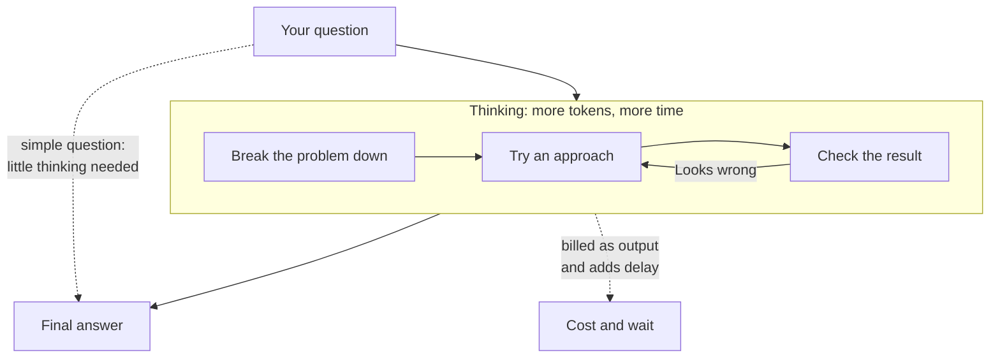

**In one line:** a reasoning model works through a problem in a long run of intermediate steps before it answers, which helps on hard multi-step tasks but costs more time and money.

## Why it matters

Some questions can be answered in one glance, such as "what is the capital of France?". Others need working out, such as "what happens to each shareholder's stake if the round is structured this way?". A standard model tends to jump straight to an answer, and on the second kind of question it can jump to the wrong one.

Reasoning models give the model room to work before it commits. For multi-step maths, code, planning and puzzles, this often makes a clear difference.

They are not a cure-all. They are slower and dearer, and they can still be confidently wrong. Knowing when to use one, and when not to, is the practical skill.

<mark>Thinking longer makes a model better at hard problems, but it does not make it truthful, and what it shows as reasoning may not be the whole story.</mark>

## How it works

Think of the difference between blurting out an answer and doing the sum on scrap paper. A reasoning model gets the scrap paper.

Before the final answer, the model writes out a long stretch of working: breaking the problem into parts, trying an approach, noticing a mistake, trying again. This working is often called the **chain of thought** or the **reasoning trace**. The model produces it one [token](/concepts/how-models-work/tokens-and-context-windows/) at a time, like any other text, so the thinking uses tokens just as the answer does.

**How they are trained.** A reasoning model starts as an ordinary [language model](/concepts/how-models-work/what-an-llm-is/). It is then trained further, in the post-training stage described in [pre-training and post-training](/concepts/how-models-work/pre-training-and-post-training/). A key ingredient is **reinforcement learning** on tasks with checkable answers, such as maths problems or code that either passes its tests or does not. The model tries many times and is rewarded when the final answer is right. Published research on one open model showed that this kind of reward alone led the model to produce longer working and to check its own steps, without being taught those habits directly. Labs combine this with other training, and the exact recipes are mostly not public.

**How they are run.** The amount of thinking is often adjustable. Providers offer a **thinking budget** (a cap on how many tokens may be spent thinking) or an **effort setting** (low, medium, high and so on). A higher setting allows more thinking. The model may stop early, and some systems decide for themselves how much to think.

**What you see.** This varies by provider. Some show the full thinking, some show a summary of it, and some hide it. The thinking is normally billed as output, whether you see it or not.

**Is the visible reasoning the real reason?** Not necessarily, and this is worth holding loosely. In one published study, Anthropic researchers slipped a hint about the answer into questions and checked whether the model's written reasoning admitted using it. The models often did not mention the hint, even when it plainly influenced the answer. Averaged over hint types, the rates of mentioning it were low (roughly a quarter for one model and a little over a third for the other). The authors noted the setup was artificial, based on multiple-choice quizzes, and that results on harder real tasks might differ. The careful reading is: the written reasoning is a useful clue, not a guaranteed account of how the answer was reached.

## In practice

Most major providers now offer reasoning models, often alongside faster ordinary ones. Some products let one model switch between quick answers and extended thinking, controlled by a setting or chosen automatically.

Good uses are multi-step maths and logic, code that needs planning, reviewing a long document for inconsistencies, and agents that must plan a sequence of actions. Poor uses are simple lookups, rewrites, formatting, and short factual questions, where the extra thinking adds cost and delay and little else.

**Chain-of-thought prompting** is the older, related idea: asking an ordinary model to "think step by step" in your [prompt](/concepts/talking-to-models/prompt-engineering/) so it writes out its working. A reasoning model does this by design, trained into it, so you usually do not need to ask. Over-instructing how it should think can even get in the way.

## Worked example

Sample Ventures, the fictional fund, is looking at a follow-on investment in Acme Payments. An associate asks the same question of two models: "Acme raises a new round with a 20% option pool top-up, a new investor taking 15% post-money, and a convertible note converting at a discount. What does our stake end up at?"

**Fast model.** It replies within seconds with a confident paragraph and a final percentage. On inspection, it applied the option pool top-up after the new investor rather than before, so the answer is off.

**Reasoning model.** It takes noticeably longer. It sets out the order of events, converts the note, applies the pool top-up, then works out the percentages and checks that they add to 100%. Its answer matches a spreadsheet the associate builds to check.

Two lessons follow. The reasoning model did better because the question has many ordered steps. But the associate still checked it against a spreadsheet, because the model can slip on arithmetic and on assumptions the question left open. Better still, the model can be given a calculation [tool](/concepts/agents/tool-use/) so the sums are exact.

The same associate asking "what does SAFE stand for?" should use the fast model. A reasoning model would take longer and cost more for the same answer.

## Costs and limits

- **Slower.** Thinking happens before the answer appears, so the wait can range from several seconds to minutes on hard problems.
- **Costs more.** Thinking tokens are usually billed as output tokens, and the thinking is often much longer than the answer. A hard question can cost many times what a quick answer would. See [model routing](/concepts/cost/model-routing/) for sending easy jobs to cheaper models.
- **Diminishing returns.** Beyond a point, more thinking stops helping, and sometimes the model talks itself into a worse answer.
- **Still wrong sometimes.** Reasoning does not remove [hallucination](/concepts/how-models-work/hallucination-and-grounding/). A model can reason carefully from a made-up fact.
- **Reasoning is not evidence.** A fluent chain of thought can make a wrong answer look well supported. Check the result, not just the working.
- **Visible thinking may be partial.** It may be summarised, and as the research above suggests, may not capture everything that influenced the answer.
- **Not the right tool for exact arithmetic.** For figures that must be exact, have the model call a spreadsheet or code.

The most common mistake is switching on maximum thinking for every task. Match the effort to the difficulty.

## Often confused with

**Reasoning models vs ordinary LLMs.** A reasoning model is a language model, trained and run to think before answering. It is a change in behaviour, not a different technology underneath. The labels overlap and are informal. See [LLMs, LRMs and LQMs](/concepts/how-models-work/llms-lrms-and-lqms/).

**Reasoning vs chain-of-thought prompting.** Prompting asks any model to show its working. A reasoning model has been trained to do long working on its own, and was rewarded for getting answers right.

**Reasoning vs human thinking.** The word is a handy label, and researchers disagree about how far the comparison goes. What is observable is that producing intermediate steps helps the model on hard problems.

## Related

- [Pre-training and post-training](/concepts/how-models-work/pre-training-and-post-training/): where reasoning is added to a model
- [LLMs, LRMs and LQMs](/concepts/how-models-work/llms-lrms-and-lqms/): how the reasoning-model label fits with the others
- [Prompt engineering](/concepts/talking-to-models/prompt-engineering/): chain-of-thought prompting for models that do not reason by default
- [Hallucination and grounding](/concepts/how-models-work/hallucination-and-grounding/): why even careful reasoning needs checking

## The proper terms

- **Reasoning model:** a language model trained and run to think step by step before answering
- **Chain of thought:** the intermediate working a model writes before its answer
- **Reasoning trace:** the recorded thinking a reasoning model produced, sometimes shown, summarised or hidden
- **Thinking budget:** a cap on how many tokens a model may spend thinking
- **Effort setting:** a provider control for how much thinking a model should do
- **Reinforcement learning:** training by trial and error, rewarding outcomes that turn out well
- **Verifiable task:** a task with an answer that can be checked automatically, such as maths or code tests
- **Faithfulness:** how accurately shown reasoning reflects what actually produced the answer
