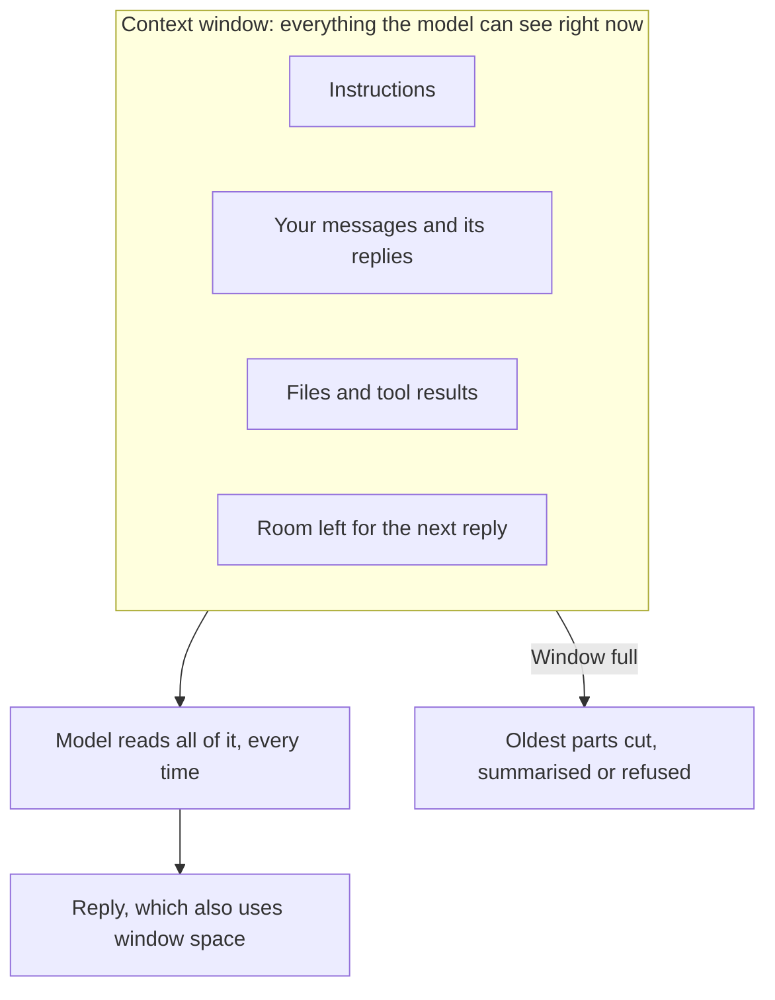

**In one line:** a token is the small piece of text a model reads and writes, and the context window is the limit on how many tokens it can handle at once.

## Why it matters

These two ideas explain a lot of things that otherwise seem arbitrary. They explain why a model "forgets" the start of a long conversation, why pasting in a big document can fail, and why long sessions cost more than short ones.

They also decide what you can ask an agent to do in one go. Anything the model needs has to fit in the window.

<mark>A model can only use what is inside its context window. If it isn't there, the model can't see it.</mark>

## How it works

**Tokens.** A model doesn't read letters or whole words. Text is first chopped into pieces called tokens. A common word is often one token, a long or unusual word is split into several, and punctuation counts too.

In English, a token is roughly three-quarters of a word. Other languages, code and numbers usually need more tokens for the same amount of meaning. Providers use their own chopping rules, so the same text can be a slightly different number of tokens from one model to another.

**The context window.** This is everything the model can see at one moment: the instructions it was given, your messages, its own earlier replies, any files you attached and any [tool](/concepts/agents/tool-use/) results. It is measured in tokens, and the model's reply uses up space in the same window.

Think of a desk. The model can only work with what is on the desk, and the desk is a fixed size. Nothing off the desk exists as far as the model is concerned.

When the window fills up, something has to give. Depending on the app, the oldest parts are dropped, they are replaced with a short summary, or the request is refused. This is the real reason a model seems to "forget" early details.

Window sizes differ between models and have grown a lot over time. Check the provider's current figures when it matters, because they change.

## In practice

Most apps hide token counting from you, but you feel it when a long conversation slows down, a file is rejected as too large, or a plan has a usage limit.

Bigger windows help, but they are not a cure-all. Models can be less reliable with details buried in the middle of a very long input, and every extra token costs money.

Because of this, good setups send the model only what it needs. Rather than pasting a whole archive, they fetch the few relevant passages first. That technique is called retrieval, and it gets its own page. Another habit is to summarise the key points, then continue in a fresh conversation.

The window holds a copy of the information, not the original. The real data stays in your systems, and a tool fetches it into the window when needed.

## Worked example

An associate at Sample Ventures, the fictional fund, pastes a 60-page data room document into a chat assistant, which runs to tens of thousands of tokens. They then ask ten questions in a row.

Each time they ask, the whole conversation so far is read again: the document, every earlier question and every earlier answer. By question ten the window is close to full, the early answers start to get trimmed, and the model begins to lose track of details from page 4.

A better approach: ask once for a structured summary of the key terms, check it, and start a fresh conversation with just that summary. The window has plenty of room, the answers are quicker and cheaper, and nothing important has been squeezed out.

## Costs and limits

- **You usually pay per token.** Most providers charge separately for tokens going in and tokens coming out. Actual prices belong on the cost pages, because they change.
- **Long conversations cost more each turn.** The whole record is sent again every time, so a conversation twice as long costs more than twice as much to finish. Caching can reduce this (it gets its own page).
- **Agents use a lot of window.** Every round of an [agent loop](/concepts/agents/the-agent-loop/) adds more to the record.
- **A big window is not perfect recall.** More room does not guarantee the model uses every detail well.
- **Different models count differently.** A token count from one provider won't match another's exactly.

The most common mistake is pasting everything in "just in case". Put in what the question needs. Choosing well is a skill of its own, called [context engineering](/concepts/talking-to-models/context-engineering/).

## Often confused with

**Token vs word.** A token is a piece of text the model works in. A word may be one token or several, so token counts are always a bit higher than word counts.

**Context window vs memory.** The window is what the model can see right now. Memory features, which save notes between conversations, are a separate thing: they work by putting saved notes back into the window next time.

## Related

- [What an LLM is](/concepts/how-models-work/what-an-llm-is/): the model that reads and writes the tokens
- [The agent loop](/concepts/agents/the-agent-loop/): why agent runs fill the window quickly
- [Hallucination and grounding](/concepts/how-models-work/hallucination-and-grounding/): what happens when the model can't see the facts it needs
- [Context engineering](/concepts/talking-to-models/context-engineering/): choosing what goes into the window

## The proper terms

- **Context window (or context length):** the maximum number of tokens a model can handle at once
- **Input tokens / output tokens:** the tokens you send in, and the tokens the model writes back
- **Retrieval:** fetching only the relevant passages into the window
- **Token:** a small piece of text, roughly three-quarters of an English word
